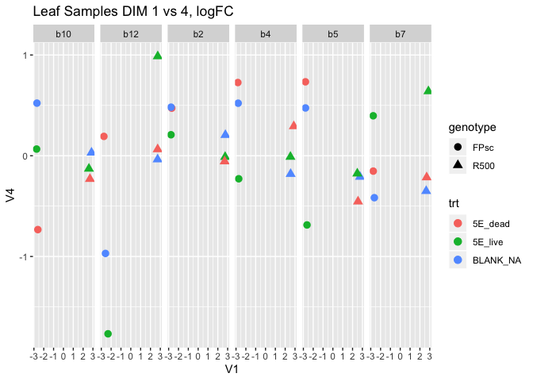
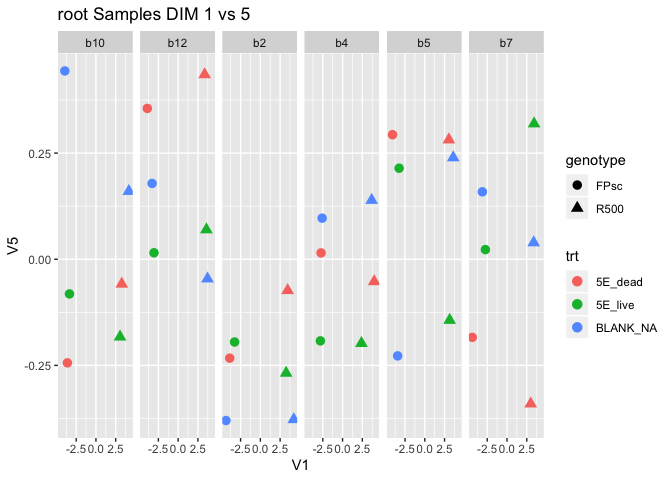

# purpose: Raw count files to DEGs
# History
* For reorganization, create this script from scratch. (092518)
* Use only FULLtoptag (all gene list) (021219)
* Adding interaction term (only live:genotype) to interaction model (021319)
* Try quasi-likelihood (QL) F-Test (see edgeRUsersGuide2018 section 2.10.3)
* Adding test method description (NB or QLF) to DEG csv files (070919)

```r
knitr::opts_chunk$set(echo = TRUE,error=TRUE)
```

```r
library(edgeR)
```

```
## Loading required package: limma
```

```r
library(tidyverse)
```

```
## ── Attaching packages ─────────────────────────────── tidyverse 1.2.1 ──
```

```
## ✔ ggplot2 3.2.1       ✔ purrr   0.3.2  
## ✔ tibble  2.1.3       ✔ dplyr   0.8.0.1
## ✔ tidyr   0.8.3       ✔ stringr 1.4.0  
## ✔ readr   1.3.1       ✔ forcats 0.4.0
```

```
## Warning: package 'ggplot2' was built under R version 3.5.2
```

```
## Warning: package 'tibble' was built under R version 3.5.2
```

```
## Warning: package 'tidyr' was built under R version 3.5.2
```

```
## Warning: package 'purrr' was built under R version 3.5.2
```

```
## Warning: package 'dplyr' was built under R version 3.5.2
```

```
## Warning: package 'stringr' was built under R version 3.5.2
```

```
## Warning: package 'forcats' was built under R version 3.5.2
```

```
## ── Conflicts ────────────────────────────────── tidyverse_conflicts() ──
## ✖ dplyr::filter() masks stats::filter()
## ✖ dplyr::lag()    masks stats::lag()
```

```r
library(readr)
library(readxl)
```

```
## Warning: package 'readxl' was built under R version 3.5.2
```

```r
# home directry should be root of this repository (not location of this script)
```
# For Mapping reads with Kalisoga see "Map and normalize.Rmd" in "./v3.0annotation/20170617-samples/scripts" 
# load reads mapped to v3.0 Brassica genome

```r
getwd()
```

```
## [1] "/Volumes/data_work/Data8/NGS_related/Brassica_microbiome/Brapa_microbes_rebuilt1/v3.0annotation/20170617-samples/scripts"
```

```r
counts <- readr::read_csv(file.path("..","input","20170617_V3.0_raw_counts.csv.gz"))
```

```
## Parsed with column specification:
## cols(
##   .default = col_double(),
##   target_id = col_character()
## )
```

```
## See spec(...) for full column specifications.
```

```r
counts # make sure this is v3.0 annotation (look target_id column)
```

```
## # A tibble: 46,250 x 73
##    target_id wyo_leaf_FPsc_0… wyo_leaf_FPsc_0… wyo_leaf_FPsc_0…
##    <chr>                <dbl>            <dbl>            <dbl>
##  1 BraA01g0…             5                2                  4 
##  2 BraA01g0…           101.              78.1              117.
##  3 BraA01g0…             5.02             6.06               7 
##  4 BraA01g0…           231.             301.               424.
##  5 BraA01g0…             8               13                 10 
##  6 BraA01g0…             8                0                  9 
##  7 BraA01g0…            65               87.5              106 
##  8 BraA01g0…           340              320                430 
##  9 BraA01g0…           151.              98.4              157.
## 10 BraA01g0…           137.              63.3              158.
## # … with 46,240 more rows, and 69 more variables:
## #   wyo_leaf_FPsc_04_141 <dbl>, wyo_leaf_FPsc_04_170 <dbl>,
## #   wyo_leaf_FPsc_04_174 <dbl>, wyo_leaf_FPsc_05_178 <dbl>,
## #   wyo_leaf_FPsc_05_181 <dbl>, wyo_leaf_FPsc_05_218 <dbl>,
## #   wyo_leaf_FPsc_07_272 <dbl>, wyo_leaf_FPsc_07_292 <dbl>,
## #   wyo_leaf_FPsc_07_296 <dbl>, wyo_leaf_FPsc_10_399 <dbl>,
## #   wyo_leaf_FPsc_10_428 <dbl>, wyo_leaf_FPsc_10_435 <dbl>,
## #   wyo_leaf_FPsc_12_508 <dbl>, wyo_leaf_FPsc_12_517 <dbl>,
## #   wyo_leaf_FPsc_12_523 <dbl>, wyo_leaf_R500_02_055 <dbl>,
## #   wyo_leaf_R500_02_059 <dbl>, wyo_leaf_R500_02_082 <dbl>,
## #   wyo_leaf_R500_04_153 <dbl>, wyo_leaf_R500_04_154 <dbl>,
## #   wyo_leaf_R500_04_162 <dbl>, wyo_leaf_R500_05_179 <dbl>,
## #   wyo_leaf_R500_05_202 <dbl>, wyo_leaf_R500_05_213 <dbl>,
## #   wyo_leaf_R500_07_266 <dbl>, wyo_leaf_R500_07_269 <dbl>,
## #   wyo_leaf_R500_07_278 <dbl>, wyo_leaf_R500_10_406 <dbl>,
## #   wyo_leaf_R500_10_424 <dbl>, wyo_leaf_R500_10_432 <dbl>,
## #   wyo_leaf_R500_12_485 <dbl>, wyo_leaf_R500_12_504 <dbl>,
## #   wyo_leaf_R500_12_513 <dbl>, wyo_root_FPsc_02_052 <dbl>,
## #   wyo_root_FPsc_02_064 <dbl>, wyo_root_FPsc_02_065 <dbl>,
## #   wyo_root_FPsc_04_141 <dbl>, wyo_root_FPsc_04_170 <dbl>,
## #   wyo_root_FPsc_04_174 <dbl>, wyo_root_FPsc_05_178 <dbl>,
## #   wyo_root_FPsc_05_181 <dbl>, wyo_root_FPsc_05_218 <dbl>,
## #   wyo_root_FPsc_07_272 <dbl>, wyo_root_FPsc_07_292 <dbl>,
## #   wyo_root_FPsc_07_296 <dbl>, wyo_root_FPsc_10_399 <dbl>,
## #   wyo_root_FPsc_10_428 <dbl>, wyo_root_FPsc_10_435 <dbl>,
## #   wyo_root_FPsc_12_508 <dbl>, wyo_root_FPsc_12_517 <dbl>,
## #   wyo_root_FPsc_12_523 <dbl>, wyo_root_R500_02_055 <dbl>,
## #   wyo_root_R500_02_059 <dbl>, wyo_root_R500_02_082 <dbl>,
## #   wyo_root_R500_04_153 <dbl>, wyo_root_R500_04_154 <dbl>,
## #   wyo_root_R500_04_162 <dbl>, wyo_root_R500_05_179 <dbl>,
## #   wyo_root_R500_05_202 <dbl>, wyo_root_R500_05_213 <dbl>,
## #   wyo_root_R500_07_266 <dbl>, wyo_root_R500_07_269 <dbl>,
## #   wyo_root_R500_07_278 <dbl>, wyo_root_R500_10_406 <dbl>,
## #   wyo_root_R500_10_424 <dbl>, wyo_root_R500_10_432 <dbl>,
## #   wyo_root_R500_12_485 <dbl>, wyo_root_R500_12_504 <dbl>,
## #   wyo_root_R500_12_513 <dbl>
```
## make sample description data frame (copied from "Map and normalized.Rmd")

```r
sample.description <- tibble(sample=colnames(counts)[-1]) %>%
  separate(sample,
           c("location","tissue","genotype","block","pot"),
           remove=FALSE,
           convert=TRUE) 
head(sample.description) 
```

```
## # A tibble: 6 x 6
##   sample               location tissue genotype block   pot
##   <chr>                <chr>    <chr>  <chr>    <int> <int>
## 1 wyo_leaf_FPsc_02_052 wyo      leaf   FPsc         2    52
## 2 wyo_leaf_FPsc_02_064 wyo      leaf   FPsc         2    64
## 3 wyo_leaf_FPsc_02_065 wyo      leaf   FPsc         2    65
## 4 wyo_leaf_FPsc_04_141 wyo      leaf   FPsc         4   141
## 5 wyo_leaf_FPsc_04_170 wyo      leaf   FPsc         4   170
## 6 wyo_leaf_FPsc_04_174 wyo      leaf   FPsc         4   174
```

```r
## get additional metadata
sample.info<-readxl::read_excel(file.path("..","input","wy001_RNAseq.xlsx"),sheet = 1)
head(sample.info)
```

```
## # A tibble: 6 x 10
##     pot bench   col   row block data_type soil  genotype autoclave
##   <dbl> <dbl> <dbl> <dbl> <dbl> <chr>     <chr> <chr>    <chr>    
## 1    48     1     1     2     2 RNAseq    5E    FPsc     dead     
## 2    50     1     2     5     2 RNAseq    5E    R500     dead     
## 3    52     1     2     3     2 RNAseq    5E    FPsc     live     
## 4    53     1     2     2     2 RNAseq    BLANK FPsc     NA       
## 5    55     1     3     5     2 RNAseq    5E    R500     live     
## 6    59     1     3     1     2 RNAseq    5E    R500     dead     
## # … with 1 more variable: time_point <chr>
```

```r
##combine
sample.description <- left_join(sample.description, sample.info)
```

```
## Joining, by = c("genotype", "block", "pot")
```

```r
sample.description <- sample.description %>% 
  mutate(group=paste(tissue,genotype,soil,autoclave,sep="_")) %>%
  unite(trt,c(soil,autoclave),sep="_") # add trt (092718)

head(sample.description)
```

```
## # A tibble: 6 x 13
##   sample location tissue genotype block   pot bench   col   row data_type
##   <chr>  <chr>    <chr>  <chr>    <dbl> <dbl> <dbl> <dbl> <dbl> <chr>    
## 1 wyo_l… wyo      leaf   FPsc         2    52     1     2     3 RNAseq   
## 2 wyo_l… wyo      leaf   FPsc         2    64     1     4     1 RNAseq   
## 3 wyo_l… wyo      leaf   FPsc         2    65     1     5     5 RNAseq   
## 4 wyo_l… wyo      leaf   FPsc         4   141     1     2     2 RNAseq   
## 5 wyo_l… wyo      leaf   FPsc         4   170     1     4     6 RNAseq   
## 6 wyo_l… wyo      leaf   FPsc         4   174     1     5     6 RNAseq   
## # … with 3 more variables: trt <chr>, time_point <chr>, group <chr>
```

```r
# block has to be treated as descrite.
sample.description<-sample.description %>% mutate(block=str_c("b", as.integer(block))) ## get additional metadata. (Oct 14, 2019) Block effects have to be character, not integer!!!!

write_csv(sample.description,path="../output/Br.mbio.e1.sample.description.csv")
sample.description %>% summarize(n_distinct(group))
```

```
## # A tibble: 1 x 1
##   `n_distinct(group)`
##                 <int>
## 1                  12
```
## summarize counts

```r
pl.orig <- counts[,-1] %>% colSums() %>% tibble(sample=names(.),count=.) %>%
  ggplot(aes(x=sample,y=count)) + 
  geom_col() +
  theme(axis.text.x  = element_text(angle=90, vjust=0.5,size = 7)) 
pl.orig
```

<!-- -->
## load to edgeR, normalize

```r
#confirm that everthing is in the right order
all(colnames(counts)[-1]==sample.description$sample)
```

```
## [1] TRUE
```

```r
dge <- DGEList(counts[,-1],
               group=sample.description$group,
               samples=sample.description,
               genes=counts$target_id)
```
# 

```r
dge <- calcNormFactors(dge)
barplot(dge$samples$lib.size)
```

<!-- -->

```r
ggplot(dge$samples,aes(x=sample,y=norm.factors,fill=tissue)) + geom_col() + 
  theme(axis.text.x  = element_text(angle=90, vjust=0.5,size = 7)) 
```

<!-- -->

```r
ggplot(dge$samples,aes(x=sample,y=norm.factors,fill=genotype)) + geom_col() + 
  theme(axis.text.x  = element_text(angle=90, vjust=0.5,size = 7)) 
```

<!-- -->

```r
ggplot(dge$samples,aes(x=sample,y=norm.factors,fill=as.factor(block))) + geom_col() +
  theme(axis.text.x  = element_text(angle=90, vjust=0.5,size = 7)) 
```

<!-- -->


Looks like we should normalize separately for root and leaf
# do separately for leaf and root values

```r
counts.leaf <- counts %>% select(target_id, contains("leaf"))
counts.root <- counts %>% select(target_id, contains("root"))
sample.description.leaf <- sample.description %>% filter(tissue=="leaf")
sample.description.root <- sample.description %>% filter(tissue=="root")
```

# Leaf

```r
#confirm that everthing is in the right order
all(colnames(counts.leaf)[-1]==sample.description.leaf$sample)
```

```
## [1] TRUE
```

```r
dge.leaf <- DGEList(counts.leaf[,-1],
                    group=sample.description.leaf$group,
                    samples=sample.description.leaf,
                    genes=counts.leaf$target_id)
# dge.leaf <- calcNormFactors(dge.leaf)
# # remove genes with low expression level
# dge.leaf<-dge.leaf[rowSums(cpm(dge.leaf)>1) >= 6,,keep.lib.sizes=FALSE]
# Kazu's new way:  keep > normalize (012319)
# Prevent repeated normalization
ifelse(all(dge.leaf$samples$norm.factors==1),"Normalization has not yet done","Normalization has been done already.") # 
```

```
## [1] "Normalization has not yet done"
```

```r
dge.leaf$samples$norm.factors<-1 # No matter which case, non-normalize libraries.
# remove genes with low expression level
dge.leaf<-dge.leaf[rowSums(cpm(dge.leaf)>1) >= 6,,keep.lib.sizes=FALSE]
# normalize
dge.leaf <- calcNormFactors(dge.leaf)
```

# Root

```r
#confirm that everthing is in the right order
all(colnames(counts.root)[-1]==sample.description.root$sample)
```

```
## [1] TRUE
```

```r
dge.root <- DGEList(counts.root[,-1],
                    group=sample.description.root$group,
                    samples=sample.description.root,
                    genes=counts.root$target_id)
# dge.root <- calcNormFactors(dge.root)
# # remove genes with low expression level
# dge.root<-dge.root[rowSums(cpm(dge.root)>1) >= 6,,keep.lib.sizes=FALSE]
# Kazu's new way:  keep > normalize (012319)
# Prevent repeated normalization
ifelse(all(dge.root$samples$norm.factors==1),"Normalization has not yet done","Normalization has been done already.") # 
```

```
## [1] "Normalization has not yet done"
```

```r
dge.root$samples$norm.factors<-1 # No matter which case, non-normalize libraries.
# remove genes with low expression level
dge.root<-dge.root[rowSums(cpm(dge.root)>1) >= 6,,keep.lib.sizes=FALSE]
# normalize
dge.root <- calcNormFactors(dge.root)
```
# save edgeR objects

```r
save(dge.leaf,dge.root,sample.description.leaf,sample.description.root,file=file.path("..","output","edgeR_dge_objects.e1.v3.0anno.RData")) # Question: dge has sample info. Do I need to ssave sample.descritipon.leaf or .root? (092718)
```
# leaf MDS plot bcv

```r
# leaf
mds.leaf <- plotMDS(dge.leaf,method = "bcv",labels=dge.leaf$samples$group,gene.selection = "pairwise",dim.plot = c(1,2),ndim=5)
```

<!-- -->

```r
mds.leaf.pl <- as_tibble(mds.leaf$cmdscale.out) %>% 
  bind_cols(data.frame(sample=row.names(mds.leaf$cmdscale.out)),.) %>%
  inner_join(dge.leaf$samples)
```

```
## Warning: `as_tibble.matrix()` requires a matrix with column names or a `.name_repair` argument. Using compatibility `.name_repair`.
## This warning is displayed once per session.
```

```
## Joining, by = "sample"
```

```
## Warning: Column `sample` joining factor and character vector, coercing into
## character vector
```

```r
p<-mds.leaf.pl %>% ggplot(aes(x=V1,y=V2, shape=genotype, color=trt,label=genotype)) + geom_point(size=3) + ggtitle("Leaf Samples DIM 1 vs 2 bcv")+ facet_grid(.~block) + theme_gray()
ggsave(p,filename="../output/leaf.mds.bcv.1and2.png",width=6,height=8)
mds.leaf.pl %>% ggplot(aes(x=V1,y=V2, shape=genotype, color=trt,label=genotype)) + geom_point(size=3) + ggtitle("Leaf Samples DIM 1 vs 2 bcv")+ facet_grid(.~block)
```

<!-- -->

```r
mds.leaf.pl %>% ggplot(aes(x=V2,y=V3, shape=genotype, color=trt,label=genotype)) + geom_point(size=3) + ggtitle("Leaf Samples DIM 2 vs 3 bcv")+ facet_grid(.~block)
```

<!-- -->

```r
mds.leaf.pl %>% ggplot(aes(x=V1,y=V3, shape=genotype, color=trt,label=genotype)) + geom_point(size=3) + ggtitle("Leaf Samples DIM 1 vs 3 bcv")+ facet_grid(.~block)
```

<!-- -->

```r
mds.leaf.pl %>% ggplot(aes(x=V1,y=V4, shape=genotype, color=trt,label=genotype)) + geom_point(size=3) + ggtitle("Leaf Samples DIM 1 vs 4 bcv")+ facet_grid(.~block)
```

<!-- -->

```r
mds.leaf.pl %>% ggplot(aes(x=V1,y=V5, shape=genotype, color=trt,label=genotype)) + geom_point(size=3) + ggtitle("Leaf Samples DIM 1 vs 5")+ facet_grid(.~block)
```

<!-- -->

# leaf MDS logFC

```r
mds.leaf.logFC <- plotMDS(dge.leaf,method = "logFC",labels=dge.leaf$samples$group,gene.selection = "pairwise",dim.plot = c(1,2),ndim=5) # changed ndim=3 into 5
```

<!-- -->

```r
mds.leaf.pl.logFC <- as_tibble(mds.leaf.logFC$cmdscale.out) %>% 
  bind_cols(data.frame(sample=row.names(mds.leaf.logFC$cmdscale.out)),.) %>%
  inner_join(dge.leaf$samples)
```

```
## Joining, by = "sample"
```

```
## Warning: Column `sample` joining factor and character vector, coercing into
## character vector
```

```r
# adding block info
mds.leaf.pl.logFC %>% ggplot(aes(x=V1,y=V2, shape=genotype, color=trt,label=genotype)) + geom_point(size=3) + ggtitle("Leaf Samples DIM 1 vs 2, logFC") + facet_grid(.~block)
```

<!-- -->

```r
mds.leaf.pl.logFC %>% ggplot(aes(x=V1,y=V3, shape=genotype, color=trt,label=genotype)) + geom_point(size=3) + ggtitle("Leaf Samples DIM 1 vs 3, logFC")+ facet_grid(.~block)
```

<!-- -->

```r
mds.leaf.pl.logFC %>% ggplot(aes(x=V1,y=V4, shape=genotype, color=trt,label=genotype)) + geom_point(size=3) + ggtitle("Leaf Samples DIM 1 vs 4, logFC")+ facet_grid(.~block)
```

<!-- -->

```r
mds.leaf.pl.logFC %>% ggplot(aes(x=V1,y=V5, shape=genotype, color=trt,label=genotype)) + geom_point(size=3) + ggtitle("Leaf Samples DIM 1 vs 5, logFC")+ facet_grid(.~block)
```

<!-- -->

# root MDS plot bcv

```r
# root
mds.root <- plotMDS(dge.root,method = "bcv",labels=dge.root$samples$group,gene.selection = "pairwise",dim.plot = c(1,2),ndim=5)
```

<!-- -->

```r
mds.root.pl <- as_tibble(mds.root$cmdscale.out) %>% 
  bind_cols(data.frame(sample=row.names(mds.root$cmdscale.out)),.) %>%
  inner_join(dge.root$samples)
```

```
## Joining, by = "sample"
```

```
## Warning: Column `sample` joining factor and character vector, coercing into
## character vector
```

```r
mds.root.pl %>% ggplot(aes(x=V1,y=V2, shape=genotype, color=trt,label=genotype)) + geom_point(size=3) + ggtitle("root Samples DIM 1 vs 2 bcv")+ facet_grid(.~block)
```

<!-- -->

```r
mds.root.pl %>% ggplot(aes(x=V2,y=V3, shape=genotype, color=trt,label=genotype)) + geom_point(size=3) + ggtitle("root Samples DIM 2 vs 3 bcv")+ facet_grid(.~block)
```

<!-- -->

```r
mds.root.pl %>% ggplot(aes(x=V1,y=V3, shape=genotype, color=trt,label=genotype)) + geom_point(size=3) + ggtitle("root Samples DIM 1 vs 3 bcv")+ facet_grid(.~block)
```

<!-- -->

```r
mds.root.pl %>% ggplot(aes(x=V1,y=V4, shape=genotype, color=trt,label=genotype)) + geom_point(size=3) + ggtitle("root Samples DIM 1 vs 4 bcv")+ facet_grid(.~block)
```

<!-- -->

```r
mds.root.pl %>% ggplot(aes(x=V1,y=V5, shape=genotype, color=trt,label=genotype)) + geom_point(size=3) + ggtitle("root Samples DIM 1 vs 5")+ facet_grid(.~block)
```

<!-- -->

# root MDS logFC

```r
mds.root.logFC <- plotMDS(dge.root,method = "logFC",labels=dge.root$samples$group,gene.selection = "pairwise",dim.plot = c(1,2),ndim=5) # changed ndim=3 into 5
```

<!-- -->

```r
mds.root.pl.logFC <- as_tibble(mds.root.logFC$cmdscale.out) %>% 
  bind_cols(data.frame(sample=row.names(mds.root.logFC$cmdscale.out)),.) %>%
  inner_join(dge.root$samples)
```

```
## Joining, by = "sample"
```

```
## Warning: Column `sample` joining factor and character vector, coercing into
## character vector
```

```r
# adding block info
mds.root.pl.logFC %>% ggplot(aes(x=V1,y=V2, shape=genotype, color=trt,label=genotype)) + geom_point(size=3) + ggtitle("root Samples DIM 1 vs 2, logFC") + facet_grid(.~block)
```

<!-- -->

```r
mds.root.pl.logFC %>% ggplot(aes(x=V1,y=V3, shape=genotype, color=trt,label=genotype)) + geom_point(size=3) + ggtitle("root Samples DIM 1 vs 3, logFC")+ facet_grid(.~block)
```

<!-- -->

```r
mds.root.pl.logFC %>% ggplot(aes(x=V1,y=V4, shape=genotype, color=trt,label=genotype)) + geom_point(size=3) + ggtitle("root Samples DIM 1 vs 4, logFC")+ facet_grid(.~block)
```

<!-- -->

```r
mds.root.pl.logFC %>% ggplot(aes(x=V1,y=V5, shape=genotype, color=trt,label=genotype)) + geom_point(size=3) + ggtitle("root Samples DIM 1 vs 5, logFC")+ facet_grid(.~block)
```

<!-- -->


# DEGs

# Additive model, rD.rFPsc, Negative biomial (NB) method (old method)

```r
# relevel trt and genotype to "5E_dead" and "FPsc"
dge.root$samples<-dge.root$samples %>% mutate(trt=fct_relevel(trt,"5E_dead")) #%>% str() 
dge.root$samples<-dge.root$samples %>% mutate(genotype=fct_relevel(genotype,"FPsc")) #%>% str() 
dge.leaf$samples<-dge.leaf$samples %>% mutate(trt=fct_relevel(trt,"5E_dead")) #%>% str() 
dge.leaf$samples<-dge.leaf$samples %>% mutate(genotype=fct_relevel(genotype,"FPsc")) #%>% str() 
## dge
root.design.add <- with(dge.root$samples, model.matrix(~ genotype + trt + block))
leaf.design.add <- with(dge.leaf$samples, model.matrix(~ genotype + trt + block))
# estimateDisp
root.dge.add <- estimateDisp(dge.root,design = root.design.add)
leaf.dge.add <- estimateDisp(dge.leaf,design = leaf.design.add)
## fit linear model
root.fit.add <- glmFit(root.dge.add,root.design.add)
leaf.fit.add <- glmFit(leaf.dge.add,leaf.design.add)
# get DEGs, trt effects (coef=c("trt5E_live"))
root.trt5E_live.lrt <- glmLRT(root.fit.add,coef = c("trt5E_live"))
leaf.trt5E_live.lrt <- glmLRT(leaf.fit.add,coef = c("trt5E_live"))
topTags(root.trt5E_live.lrt);topTags(leaf.trt5E_live.lrt)
```

```
## Coefficient:  trt5E_live 
##                  genes      logFC   logCPM       LR       PValue
## 16385 BraA04g007480.3C -0.7617650 7.435544 36.52410 1.507900e-09
## 16003 BraA04g003660.3C -1.3529771 1.818358 36.12078 1.854590e-09
## 16001 BraA04g003640.3C -1.3679246 2.493481 33.99703 5.519630e-09
## 415   BraA01g004150.3C -0.5942938 5.313524 29.09896 6.877392e-08
## 32812 BraA08g008240.3C  1.1853315 2.575446 28.45595 9.585491e-08
## 24005 BraA06g008450.3C -0.8475648 5.652018 28.16419 1.114475e-07
## 22103 BraA05g032080.3C -0.6328285 6.873171 28.13045 1.134077e-07
## 33602 BraA08g016140.3C -0.6093017 5.600628 25.11975 5.387812e-07
## 20062 BraA05g011670.3C -1.0938062 7.148749 23.78888 1.075019e-06
## 33604 BraA08g016160.3C -0.6720448 5.134979 23.02193 1.601640e-06
##                FDR
## 16385 2.585947e-05
## 16003 2.585947e-05
## 16001 5.130864e-05
## 415   4.518001e-04
## 32812 4.518001e-04
## 24005 4.518001e-04
## 22103 4.518001e-04
## 33602 1.878124e-03
## 20062 3.331007e-03
## 33604 4.466494e-03
```

```
## Coefficient:  trt5E_live 
##                  genes      logFC   logCPM       LR       PValue
## 41354 BraA09g057880.3C -1.6393403 1.261530 42.63569 6.594496e-11
## 3309  BraA01g033090.3C  1.7791815 1.279730 32.28920 1.328499e-08
## 863   BraA01g008630.3C  0.8838183 1.643319 30.88422 2.738896e-08
## 31193 BraA07g035340.3C  1.2446248 0.727109 30.86063 2.772399e-08
## 10293 BraA03g012090.3C  0.5356274 3.278675 30.85033 2.787149e-08
## 35316 BraA08g033280.3C  1.4170589 1.690177 29.40972 5.858299e-08
## 5694  BraA02g011960.3C  0.8247207 3.813674 28.56502 9.060438e-08
## 16699 BraA04g010620.3C  0.8778153 5.149487 28.52190 9.264451e-08
## 31323 BraA07g036640.3C -1.8943932 3.554630 28.01582 1.203279e-07
## 36771 BraA09g012050.3C -0.7349818 3.754267 27.82394 1.328718e-07
##                FDR
## 41354 1.662472e-06
## 3309  1.405280e-04
## 863   1.405280e-04
## 31193 1.405280e-04
## 10293 1.405280e-04
## 35316 2.461462e-04
## 5694  2.919460e-04
## 16699 2.919460e-04
## 31323 3.349697e-04
## 36771 3.349697e-04
```

```r
# all
root.trt5E_live.DEGs.add.all <- topTags(root.trt5E_live.lrt,n = Inf,p.value = 1)$table
leaf.trt5E_live.DEGs.add.all <- topTags(leaf.trt5E_live.lrt,n = Inf,p.value = 1)$table 
# get DEGs, genotype effects (coef = c("genotypeR500"))
root.genotype.lrt <- glmLRT(root.fit.add,coef = c("genotypeR500"))
leaf.genotype.lrt <- glmLRT(leaf.fit.add,coef = c("genotypeR500"))
topTags(root.genotype.lrt);topTags(leaf.genotype.lrt)
```

```
## Coefficient:  genotypeR500 
##                  genes     logFC   logCPM       LR PValue FDR
## 29089 BraA07g014300.3C  13.35487 7.501682 3033.535      0   0
## 16420 BraA04g007830.3C  13.00537 6.241104 1898.742      0   0
## 8514  BraA02g040160.3C -12.98416 6.768123 2268.430      0   0
## 37039 BraA09g014730.3C -12.77125 6.546051 4650.415      0   0
## 10835 BraA03g017510.3C -12.58992 7.567322 4521.851      0   0
## 32523 BraA08g005350.3C  11.97847 6.434267 5440.638      0   0
## 20099 BraA05g012040.3C  11.81877 7.077000 3950.094      0   0
## 32453 BraA08g004650.3C -11.71535 5.495662 4067.555      0   0
## 31851 BraA07g041920.3C -11.70680 5.489206 3474.369      0   0
## 1417  BraA01g014170.3C -11.70063 6.176466 3601.051      0   0
```

```
## Coefficient:  genotypeR500 
##                  genes     logFC   logCPM       LR PValue FDR
## 32812 BraA08g008240.3C  12.37820 6.500248 2951.858      0   0
## 998   BraA01g009980.3C  12.11931 5.276691 4238.515      0   0
## 2818  BraA01g028180.3C -12.09390 6.395948 3401.302      0   0
## 7267  BraA02g027690.3C  12.08050 6.993373 2094.383      0   0
## 6771  BraA02g022730.3C  11.84831 6.280788 1565.339      0   0
## 7293  BraA02g027950.3C  11.77618 4.937093 2110.426      0   0
## 26290 BraA06g031300.3C  11.61843 4.780829 2713.223      0   0
## 7555  BraA02g030570.3C  11.56103 5.281254 3057.593      0   0
## 6166  BraA02g016680.3C  11.46475 4.631137 2254.517      0   0
## 37039 BraA09g014730.3C -11.43397 5.987111 4485.575      0   0
```

```r
# all
root.genotype.DEGs.add.all <- topTags(root.genotype.lrt,n = Inf,p.value = 1)$table
leaf.genotype.DEGs.add.all <- topTags(leaf.genotype.lrt,n = Inf,p.value = 1)$table
# add annotiona with full name objects (all)
root.genotype.DEGs.add.all.rD.rFPsc.v3.0anno <- left_join(root.genotype.DEGs.add.all,Br.v3.0anno.At.BLAST.highscore,by=c(genes="name")) %>%  select(1:6, AGI, At_symbol, At_short_description, perc_ID)
leaf.genotype.DEGs.add.all.rD.rFPsc.v3.0anno <- left_join(leaf.genotype.DEGs.add.all,Br.v3.0anno.At.BLAST.highscore,by=c(genes="name")) %>% select(1:6, AGI, At_symbol, At_short_description, perc_ID)
root.trt5E_live.DEGs.add.all.rD.rFPsc.v3.0anno <- left_join(root.trt5E_live.DEGs.add.all,Br.v3.0anno.At.BLAST.highscore,by=c(genes="name")) %>%  select(1:6, AGI, At_symbol, At_short_description, perc_ID)
leaf.trt5E_live.DEGs.add.all.rD.rFPsc.v3.0anno <- left_join(leaf.trt5E_live.DEGs.add.all,Br.v3.0anno.At.BLAST.highscore,by=c(genes="name")) %>% select(1:6, AGI, At_symbol, At_short_description, perc_ID)
# write csv (all)
## genotype
write.csv(root.genotype.DEGs.add.all.rD.rFPsc.v3.0anno,file=file.path("..","output","FULLtoptag","root.genotypeR500.DEGs.add.rD.rFPsc.NB.v3.0anno.csv"))
write.csv(leaf.genotype.DEGs.add.all.rD.rFPsc.v3.0anno,file=file.path("..","output","FULLtoptag","leaf.genotypeR500.DEGs.add.rD.rFPsc.NB.v3.0anno.csv"))
## trt
write.csv(root.trt5E_live.DEGs.add.all.rD.rFPsc.v3.0anno,file=file.path("..","output","FULLtoptag","root.trt5E_live.DEGs.add.rD.rFPsc.NB.v3.0anno.csv"))
write.csv(leaf.trt5E_live.DEGs.add.all.rD.rFPsc.v3.0anno,file=file.path("..","output","FULLtoptag","leaf.trt5E_live.DEGs.add.rD.rFPsc.NB.v3.0anno.csv"))
```
# cleanup working directory


# Additive model, rB.rFPsc

```r
# relevel trt and genotype to "BLANK_NA" and "FPsc"
dge.root$samples<-dge.root$samples %>% mutate(trt=fct_relevel(trt,"BLANK_NA")) #%>% str() 
dge.root$samples<-dge.root$samples %>% mutate(genotype=fct_relevel(genotype,"FPsc")) #%>% str() 
dge.leaf$samples<-dge.leaf$samples %>% mutate(trt=fct_relevel(trt,"BLANK_NA")) #%>% str() 
dge.leaf$samples<-dge.leaf$samples %>% mutate(genotype=fct_relevel(genotype,"FPsc")) #%>% str() 
## dge
root.design.add <- with(dge.root$samples, model.matrix(~ genotype + trt + block))
leaf.design.add <- with(dge.leaf$samples, model.matrix(~ genotype + trt + block))
# estimateDisp
root.dge.add <- estimateDisp(dge.root,design = root.design.add)
leaf.dge.add <- estimateDisp(dge.leaf,design = leaf.design.add)
## fit linear model
root.fit.add <- glmFit(root.dge.add,root.design.add)
leaf.fit.add <- glmFit(leaf.dge.add,leaf.design.add)
# get DEGs, trt effects (coef=c("trt5E_live"))
root.trt5E_live.lrt <- glmLRT(root.fit.add,coef = c("trt5E_live"))
leaf.trt5E_live.lrt <- glmLRT(leaf.fit.add,coef = c("trt5E_live"))
topTags(root.trt5E_live.lrt);topTags(leaf.trt5E_live.lrt)
```

```
## Coefficient:  trt5E_live 
##                  genes      logFC    logCPM       LR       PValue
## 39678 BraA09g041120.3C -1.2923270 2.7866110 45.75391 1.340815e-11
## 16385 BraA04g007480.3C -0.8443561 7.4355439 44.85470 2.122114e-11
## 34749 BraA08g027610.3C  2.1252288 1.6869218 41.87324 9.738656e-11
## 24005 BraA06g008450.3C -1.0250276 5.6520175 40.88998 1.610444e-10
## 39400 BraA09g038340.3C  0.7685672 4.0075875 39.49909 3.282130e-10
## 22103 BraA05g032080.3C -0.7254184 6.8731706 36.92125 1.229982e-09
## 14236 BraA03g051520.3C  1.1075641 1.6629289 36.34853 1.650038e-09
## 14028 BraA03g049440.3C  1.0861519 3.1628756 34.10624 5.218363e-09
## 20753 BraA05g018580.3C  0.7210876 6.0290970 32.47151 1.209530e-08
## 34497 BraA08g025090.3C  1.4077157 0.7136627 31.98211 1.555989e-08
##                FDR
## 39678 2.958970e-07
## 16385 2.958970e-07
## 34749 9.052730e-07
## 24005 1.122761e-06
## 39400 1.830575e-06
## 22103 5.716750e-06
## 14236 6.573514e-06
## 14028 1.819056e-05
## 20753 3.747797e-05
## 34497 4.339186e-05
```

```
## Coefficient:  trt5E_live 
##                  genes      logFC     logCPM       LR       PValue
## 30308 BraA07g026490.3C  0.6113960  3.3095849 30.03619 4.240584e-08
## 25719 BraA06g025590.3C  1.5109054 -0.1577291 23.88961 1.020209e-06
## 25799 BraA06g026390.3C  0.5820654  3.0668853 22.96706 1.648007e-06
## 12542 BraA03g034580.3C  0.6118082  2.7314286 22.06390 2.637231e-06
## 37972 BraA09g024060.3C  0.8471898  2.8216431 21.77987 3.057913e-06
## 31323 BraA07g036640.3C -1.6871294  3.5546304 21.75849 3.092184e-06
## 29086 BraA07g014270.3C -1.6119541  2.9937216 21.50751 3.524466e-06
## 41354 BraA09g057880.3C -1.1821440  1.2615302 21.17001 4.202910e-06
## 35239 BraA08g032510.3C -1.2855384  0.1694839 21.05125 4.471618e-06
## 37304 BraA09g017380.3C  0.8272651  2.2045015 20.74867 5.236799e-06
##               FDR
## 30308 0.001069051
## 25719 0.012525499
## 25799 0.012525499
## 12542 0.012525499
## 37972 0.012525499
## 31323 0.012525499
## 29086 0.012525499
## 41354 0.012525499
## 35239 0.012525499
## 37304 0.012996736
```

```r
# all
root.trt5E_live.DEGs.add.all <- topTags(root.trt5E_live.lrt,n = Inf,p.value = 1)$table
leaf.trt5E_live.DEGs.add.all <- topTags(leaf.trt5E_live.lrt,n = Inf,p.value = 1)$table

# get DEGs, trt effects (coef=c("trt5E_dead"))
root.trt5E_dead.lrt <- glmLRT(root.fit.add,coef = c("trt5E_dead"))
leaf.trt5E_dead.lrt <- glmLRT(leaf.fit.add,coef = c("trt5E_dead"))
topTags(root.trt5E_dead.lrt);topTags(leaf.trt5E_dead.lrt)
```

```
## Coefficient:  trt5E_dead 
##                  genes      logFC      logCPM       LR       PValue
## 44685 BraA10g024710.3C  1.3770856  2.28016608 29.87479 4.608655e-08
## 33712 BraA08g017240.3C  1.9131381  1.62199740 24.70421 6.683784e-07
## 1099  BraA01g010990.3C  1.7254544  1.52616717 24.04141 9.428581e-07
## 39823 BraA09g042570.3C  0.9386081  2.67195135 22.54164 2.056378e-06
## 42013 BraA09g064470.3C  1.6033853  0.05661226 20.70751 5.350581e-06
## 11304 BraA03g022200.3C  1.4584508  2.15512237 20.43290 6.175883e-06
## 11625 BraA03g025410.3C  1.4358119  0.46871860 20.35871 6.420036e-06
## 5308  BraA02g008100.3C  1.1980869  2.80243909 20.17129 7.080759e-06
## 37543 BraA09g019770.3C  1.5283737  2.36110770 19.78531 8.664613e-06
## 27539 BraA06g043790.3C -4.6981322 -0.50733713 18.56474 1.642301e-05
##               FDR
## 44685 0.001285216
## 33712 0.008764495
## 1099  0.008764495
## 39823 0.014336554
## 42013 0.024682642
## 11304 0.024682642
## 11625 0.024682642
## 5308  0.024682642
## 37543 0.026847784
## 27539 0.040782034
```

```
## Coefficient:  trt5E_dead 
##                  genes      logFC     logCPM       LR       PValue
## 21514 BraA05g026190.3C -0.6347494  2.6483791 18.56094 1.645583e-05
## 45582 BraA10g033680.3C  1.7188599  5.9791621 18.13274 2.060289e-05
## 26694 BraA06g035340.3C -0.9833492  0.5743925 17.81987 2.428344e-05
## 45699 BraAnng001050.3C -1.6268889 -0.2678079 17.33039 3.141234e-05
## 5410  BraA02g009120.3C  2.9574293  2.8769350 15.77149 7.147149e-05
## 34494 BraA08g025060.3C  0.8140866  1.1570549 14.76884 1.215271e-04
## 4249  BraA01g042490.3C  1.5355720  5.2264306 14.53862 1.373156e-04
## 14151 BraA03g050670.3C -2.5892986 -0.4146753 14.09952 1.733881e-04
## 26999 BraA06g038390.3C -0.9723638  0.1840589 14.06008 1.770623e-04
## 13137 BraA03g040530.3C -0.4518797  2.7103376 14.05885 1.771780e-04
##             FDR
## 21514 0.1979763
## 45582 0.1979763
## 26694 0.1979763
## 45699 0.1979763
## 5410  0.3603592
## 34494 0.4321695
## 4249  0.4321695
## 14151 0.4321695
## 26999 0.4321695
## 13137 0.4321695
```

```r
## all
root.trt5E_dead.DEGs.add.all <- topTags(root.trt5E_dead.lrt,n = Inf,p.value = 1)$table
leaf.trt5E_dead.DEGs.add.all <- topTags(leaf.trt5E_dead.lrt,n = Inf,p.value = 1)$table
# get DEGs, genotype effects (coef = c("genotypeR500"))
root.genotype.lrt <- glmLRT(root.fit.add,coef = c("genotypeR500"))
leaf.genotype.lrt <- glmLRT(leaf.fit.add,coef = c("genotypeR500"))
topTags(root.genotype.lrt);topTags(leaf.genotype.lrt)
```

```
## Coefficient:  genotypeR500 
##                  genes     logFC   logCPM       LR PValue FDR
## 29089 BraA07g014300.3C  13.35487 7.501682 3033.535      0   0
## 16420 BraA04g007830.3C  13.00537 6.241104 1898.742      0   0
## 8514  BraA02g040160.3C -12.98416 6.768123 2268.430      0   0
## 37039 BraA09g014730.3C -12.77125 6.546051 4650.415      0   0
## 10835 BraA03g017510.3C -12.58992 7.567322 4521.851      0   0
## 32523 BraA08g005350.3C  11.97847 6.434267 5440.638      0   0
## 20099 BraA05g012040.3C  11.81877 7.077000 3950.094      0   0
## 32453 BraA08g004650.3C -11.71535 5.495662 4067.555      0   0
## 31851 BraA07g041920.3C -11.70680 5.489206 3474.369      0   0
## 1417  BraA01g014170.3C -11.70063 6.176466 3601.051      0   0
```

```
## Coefficient:  genotypeR500 
##                  genes     logFC   logCPM       LR PValue FDR
## 32812 BraA08g008240.3C  12.37820 6.500248 2951.858      0   0
## 998   BraA01g009980.3C  12.11931 5.276691 4238.515      0   0
## 2818  BraA01g028180.3C -12.09390 6.395948 3401.302      0   0
## 7267  BraA02g027690.3C  12.08050 6.993373 2094.383      0   0
## 6771  BraA02g022730.3C  11.84831 6.280788 1565.339      0   0
## 7293  BraA02g027950.3C  11.77618 4.937093 2110.426      0   0
## 26290 BraA06g031300.3C  11.61843 4.780829 2713.223      0   0
## 7555  BraA02g030570.3C  11.56103 5.281254 3057.593      0   0
## 6166  BraA02g016680.3C  11.46475 4.631137 2254.517      0   0
## 37039 BraA09g014730.3C -11.43397 5.987111 4485.575      0   0
```

```r
## all
root.genotype.DEGs.add.all <- topTags(root.genotype.lrt,n = Inf,p.value = 1)$table
leaf.genotype.DEGs.add.all <- topTags(leaf.genotype.lrt,n = Inf,p.value = 1)$table

# add annotiona with full name objects (all)
root.genotype.DEGs.add.all.rB.rFPsc.v3.0anno <- left_join(root.genotype.DEGs.add.all,Br.v3.0anno.At.BLAST.highscore,by=c(genes="name")) %>%  select(1:6, AGI, At_symbol, At_short_description, perc_ID)
leaf.genotype.DEGs.add.all.rB.rFPsc.v3.0anno <- left_join(leaf.genotype.DEGs.add.all,Br.v3.0anno.At.BLAST.highscore,by=c(genes="name")) %>% select(1:6, AGI, At_symbol, At_short_description, perc_ID)
root.trt5E_live.DEGs.add.all.rB.rFPsc.v3.0anno <- left_join(root.trt5E_live.DEGs.add.all,Br.v3.0anno.At.BLAST.highscore,by=c(genes="name")) %>%  select(1:6, AGI, At_symbol, At_short_description, perc_ID)
leaf.trt5E_live.DEGs.add.all.rB.rFPsc.v3.0anno <- left_join(leaf.trt5E_live.DEGs.add.all,Br.v3.0anno.At.BLAST.highscore,by=c(genes="name")) %>% select(1:6, AGI, At_symbol, At_short_description, perc_ID)
root.trt5E_dead.DEGs.add.all.rB.rFPsc.v3.0anno <- left_join(root.trt5E_dead.DEGs.add.all,Br.v3.0anno.At.BLAST.highscore,by=c(genes="name")) %>%  select(1:6, AGI, At_symbol, At_short_description, perc_ID)
leaf.trt5E_dead.DEGs.add.all.rB.rFPsc.v3.0anno <- left_join(leaf.trt5E_dead.DEGs.add.all,Br.v3.0anno.At.BLAST.highscore,by=c(genes="name")) %>% select(1:6, AGI, At_symbol, At_short_description, perc_ID)
# write csv (all)
## genotype
write.csv(root.genotype.DEGs.add.all.rB.rFPsc.v3.0anno,file=file.path("..","output","FULLtoptag","root.genotypeR500.DEGs.add.rB.rFPsc.NB.v3.0anno.csv"))
write.csv(leaf.genotype.DEGs.add.all.rB.rFPsc.v3.0anno,file=file.path("..","output","FULLtoptag","leaf.genotypeR500.DEGs.add.rB.rFPsc.NB.v3.0anno.csv"))
## trt5E_live
write.csv(root.trt5E_live.DEGs.add.all.rB.rFPsc.v3.0anno,file=file.path("..","output","FULLtoptag","root.trt5E_live.DEGs.add.rB.rFPsc.NB.v3.0anno.csv"))
write.csv(leaf.trt5E_live.DEGs.add.all.rB.rFPsc.v3.0anno,file=file.path("..","output","FULLtoptag","leaf.trt5E_live.DEGs.add.rB.rFPsc.NB.v3.0anno.csv"))
## trt5E_dead
write.csv(root.trt5E_dead.DEGs.add.all.rB.rFPsc.v3.0anno,file=file.path("..","output","FULLtoptag","root.trt5E_dead.DEGs.add.rB.rFPsc.NB.v3.0anno.csv"))
write.csv(leaf.trt5E_dead.DEGs.add.all.rB.rFPsc.v3.0anno,file=file.path("..","output","FULLtoptag","leaf.trt5E_dead.DEGs.add.rB.rFPsc.NB.v3.0anno.csv"))
```
# clean working directory

# Additive model, rD.rR500

```r
# relevel trt and genotype to "5E_dead" and "R500"
dge.root$samples<-dge.root$samples %>% mutate(trt=fct_relevel(trt,"5E_dead")) #%>% str() 
dge.root$samples<-dge.root$samples %>% mutate(genotype=fct_relevel(genotype,"R500")) #%>% str() 
dge.leaf$samples<-dge.leaf$samples %>% mutate(trt=fct_relevel(trt,"5E_dead")) #%>% str() 
dge.leaf$samples<-dge.leaf$samples %>% mutate(genotype=fct_relevel(genotype,"R500")) #%>% str() 
## dge
root.design.add <- with(dge.root$samples, model.matrix(~ genotype + trt + block))
leaf.design.add <- with(dge.leaf$samples, model.matrix(~ genotype + trt + block))
# estimateDisp
root.dge.add <- estimateDisp(dge.root,design = root.design.add)
leaf.dge.add <- estimateDisp(dge.leaf,design = leaf.design.add)
## fit linear model
root.fit.add <- glmFit(root.dge.add,root.design.add)
leaf.fit.add <- glmFit(leaf.dge.add,leaf.design.add)
# get DEGs, trt effects (coef=c("trt5E_live"))
root.trt5E_live.lrt <- glmLRT(root.fit.add,coef = c("trt5E_live"))
leaf.trt5E_live.lrt <- glmLRT(leaf.fit.add,coef = c("trt5E_live"))
topTags(root.trt5E_live.lrt);topTags(leaf.trt5E_live.lrt)
```

```
## Coefficient:  trt5E_live 
##                  genes      logFC   logCPM       LR       PValue
## 16385 BraA04g007480.3C -0.7617650 7.435544 36.52410 1.507899e-09
## 16003 BraA04g003660.3C -1.3529771 1.818358 36.12078 1.854590e-09
## 16001 BraA04g003640.3C -1.3679246 2.493481 33.99703 5.519630e-09
## 415   BraA01g004150.3C -0.5942938 5.313524 29.09896 6.877392e-08
## 32812 BraA08g008240.3C  1.1853315 2.575446 28.45595 9.585491e-08
## 24005 BraA06g008450.3C -0.8475648 5.652018 28.16419 1.114475e-07
## 22103 BraA05g032080.3C -0.6328285 6.873171 28.13045 1.134077e-07
## 33602 BraA08g016140.3C -0.6093017 5.600628 25.11975 5.387812e-07
## 20062 BraA05g011670.3C -1.0938062 7.148749 23.78888 1.075019e-06
## 33604 BraA08g016160.3C -0.6720448 5.134979 23.02193 1.601640e-06
##                FDR
## 16385 2.585947e-05
## 16003 2.585947e-05
## 16001 5.130864e-05
## 415   4.518001e-04
## 32812 4.518001e-04
## 24005 4.518001e-04
## 22103 4.518001e-04
## 33602 1.878124e-03
## 20062 3.331007e-03
## 33604 4.466494e-03
```

```
## Coefficient:  trt5E_live 
##                  genes      logFC   logCPM       LR       PValue
## 41354 BraA09g057880.3C -1.6393403 1.261530 42.63569 6.594496e-11
## 3309  BraA01g033090.3C  1.7791815 1.279730 32.28920 1.328499e-08
## 863   BraA01g008630.3C  0.8838183 1.643319 30.88422 2.738896e-08
## 31193 BraA07g035340.3C  1.2446248 0.727109 30.86063 2.772399e-08
## 10293 BraA03g012090.3C  0.5356274 3.278675 30.85033 2.787149e-08
## 35316 BraA08g033280.3C  1.4170589 1.690177 29.40972 5.858299e-08
## 5694  BraA02g011960.3C  0.8247207 3.813674 28.56502 9.060438e-08
## 16699 BraA04g010620.3C  0.8778153 5.149487 28.52190 9.264451e-08
## 31323 BraA07g036640.3C -1.8943932 3.554630 28.01582 1.203279e-07
## 36771 BraA09g012050.3C -0.7349818 3.754267 27.82394 1.328718e-07
##                FDR
## 41354 1.662472e-06
## 3309  1.405280e-04
## 863   1.405280e-04
## 31193 1.405280e-04
## 10293 1.405280e-04
## 35316 2.461462e-04
## 5694  2.919460e-04
## 16699 2.919460e-04
## 31323 3.349697e-04
## 36771 3.349697e-04
```

```r
## all
root.trt5E_live.DEGs.add.all <- topTags(root.trt5E_live.lrt,n = Inf,p.value = 1)$table
leaf.trt5E_live.DEGs.add.all <- topTags(leaf.trt5E_live.lrt,n = Inf,p.value = 1)$table
# get DEGs, genotype effects (coef = c("genotypeFPsc"))
root.genotype.lrt <- glmLRT(root.fit.add,coef = c("genotypeFPsc"))
leaf.genotype.lrt <- glmLRT(leaf.fit.add,coef = c("genotypeFPsc"))
topTags(root.genotype.lrt);topTags(leaf.genotype.lrt)
```

```
## Coefficient:  genotypeFPsc 
##                  genes     logFC   logCPM       LR PValue FDR
## 29089 BraA07g014300.3C -13.35487 7.501682 3033.535      0   0
## 16420 BraA04g007830.3C -13.00537 6.241104 1898.742      0   0
## 8514  BraA02g040160.3C  12.98416 6.768123 2268.430      0   0
## 37039 BraA09g014730.3C  12.77125 6.546051 4650.415      0   0
## 10835 BraA03g017510.3C  12.58992 7.567322 4521.851      0   0
## 32523 BraA08g005350.3C -11.97847 6.434267 5440.638      0   0
## 20099 BraA05g012040.3C -11.81877 7.077000 3950.094      0   0
## 32453 BraA08g004650.3C  11.71535 5.495662 4067.555      0   0
## 31851 BraA07g041920.3C  11.70680 5.489206 3474.369      0   0
## 1417  BraA01g014170.3C  11.70063 6.176466 3601.051      0   0
```

```
## Coefficient:  genotypeFPsc 
##                  genes     logFC   logCPM       LR PValue FDR
## 32812 BraA08g008240.3C -12.37820 6.500248 2951.858      0   0
## 998   BraA01g009980.3C -12.11931 5.276691 4238.515      0   0
## 2818  BraA01g028180.3C  12.09390 6.395948 3401.302      0   0
## 7267  BraA02g027690.3C -12.08050 6.993373 2094.383      0   0
## 6771  BraA02g022730.3C -11.84831 6.280788 1565.339      0   0
## 7293  BraA02g027950.3C -11.77618 4.937093 2110.426      0   0
## 26290 BraA06g031300.3C -11.61843 4.780829 2713.223      0   0
## 7555  BraA02g030570.3C -11.56103 5.281254 3057.593      0   0
## 6166  BraA02g016680.3C -11.46475 4.631137 2254.517      0   0
## 37039 BraA09g014730.3C  11.43397 5.987111 4485.575      0   0
```

```r
## all
root.genotype.DEGs.add.all <- topTags(root.genotype.lrt,n = Inf,p.value = 1)$table
leaf.genotype.DEGs.add.all <- topTags(leaf.genotype.lrt,n = Inf,p.value = 1)$table
# add annotiona with full name objects (all)
root.genotype.DEGs.add.all.rD.rR500.v3.0anno <- left_join(root.genotype.DEGs.add.all,Br.v3.0anno.At.BLAST.highscore,by=c(genes="name")) %>%  select(1:6, AGI, At_symbol, At_short_description, perc_ID)
leaf.genotype.DEGs.add.all.rD.rR500.v3.0anno <- left_join(leaf.genotype.DEGs.add.all,Br.v3.0anno.At.BLAST.highscore,by=c(genes="name")) %>% select(1:6, AGI, At_symbol, At_short_description, perc_ID)
root.trt5E_live.DEGs.add.all.rD.rR500.v3.0anno <- left_join(root.trt5E_live.DEGs.add.all,Br.v3.0anno.At.BLAST.highscore,by=c(genes="name")) %>%  select(1:6, AGI, At_symbol, At_short_description, perc_ID)
leaf.trt5E_live.DEGs.add.all.rD.rR500.v3.0anno <- left_join(leaf.trt5E_live.DEGs.add.all,Br.v3.0anno.At.BLAST.highscore,by=c(genes="name")) %>% select(1:6, AGI, At_symbol, At_short_description, perc_ID)

# write csv (all)
## genotype
write.csv(root.genotype.DEGs.add.all.rD.rR500.v3.0anno,file=file.path("..","output","FULLtoptag","root.genotypeFPsc.DEGs.add.rD.rR500.NB.v3.0anno.csv"))
write.csv(leaf.genotype.DEGs.add.all.rD.rR500.v3.0anno,file=file.path("..","output","FULLtoptag","leaf.genotypeFPsc.DEGs.add.rD.rR500.NB.v3.0anno.csv"))
## trt
write.csv(root.trt5E_live.DEGs.add.all.rD.rR500.v3.0anno,file=file.path("..","output","FULLtoptag","root.trt5E_live.DEGs.add.rD.rR500.NB.v3.0anno.csv"))
write.csv(leaf.trt5E_live.DEGs.add.all.rD.rR500.v3.0anno,file=file.path("..","output","FULLtoptag","leaf.trt5E_live.DEGs.add.rD.rR500.NB.v3.0anno.csv"))
```
# clean working directory

# Additive model, rB.rR500

```r
# relevel trt and genotype to "BLANK_NA" and "R500"
dge.root$samples<-dge.root$samples %>% mutate(trt=fct_relevel(trt,"BLANK_NA")) #%>% str() 
dge.root$samples<-dge.root$samples %>% mutate(genotype=fct_relevel(genotype,"R500")) #%>% str() 
dge.leaf$samples<-dge.leaf$samples %>% mutate(trt=fct_relevel(trt,"BLANK_NA")) #%>% str() 
dge.leaf$samples<-dge.leaf$samples %>% mutate(genotype=fct_relevel(genotype,"R500")) #%>% str() 
## dge
root.design.add <- with(dge.root$samples, model.matrix(~ genotype + trt + block))
leaf.design.add <- with(dge.leaf$samples, model.matrix(~ genotype + trt + block))
# estimateDisp
root.dge.add <- estimateDisp(dge.root,design = root.design.add)
leaf.dge.add <- estimateDisp(dge.leaf,design = leaf.design.add)
## fit linear model
root.fit.add <- glmFit(root.dge.add,root.design.add)
leaf.fit.add <- glmFit(leaf.dge.add,leaf.design.add)
# get DEGs, trt effects (coef=c("trt5E_live"))
root.trt5E_live.lrt <- glmLRT(root.fit.add,coef = c("trt5E_live"))
leaf.trt5E_live.lrt <- glmLRT(leaf.fit.add,coef = c("trt5E_live"))
topTags(root.trt5E_live.lrt);topTags(leaf.trt5E_live.lrt)
```

```
## Coefficient:  trt5E_live 
##                  genes      logFC    logCPM       LR       PValue
## 39678 BraA09g041120.3C -1.2923270 2.7866110 45.75391 1.340815e-11
## 16385 BraA04g007480.3C -0.8443561 7.4355439 44.85470 2.122113e-11
## 34749 BraA08g027610.3C  2.1252288 1.6869218 41.87324 9.738656e-11
## 24005 BraA06g008450.3C -1.0250276 5.6520175 40.88998 1.610444e-10
## 39400 BraA09g038340.3C  0.7685672 4.0075875 39.49909 3.282130e-10
## 22103 BraA05g032080.3C -0.7254184 6.8731706 36.92125 1.229982e-09
## 14236 BraA03g051520.3C  1.1075641 1.6629289 36.34853 1.650038e-09
## 14028 BraA03g049440.3C  1.0861519 3.1628756 34.10624 5.218363e-09
## 20753 BraA05g018580.3C  0.7210876 6.0290970 32.47151 1.209530e-08
## 34497 BraA08g025090.3C  1.4077157 0.7136627 31.98211 1.555989e-08
##                FDR
## 39678 2.958969e-07
## 16385 2.958969e-07
## 34749 9.052730e-07
## 24005 1.122761e-06
## 39400 1.830575e-06
## 22103 5.716750e-06
## 14236 6.573514e-06
## 14028 1.819056e-05
## 20753 3.747797e-05
## 34497 4.339186e-05
```

```
## Coefficient:  trt5E_live 
##                  genes      logFC     logCPM       LR       PValue
## 30308 BraA07g026490.3C  0.6113960  3.3095849 30.03619 4.240584e-08
## 25719 BraA06g025590.3C  1.5109054 -0.1577291 23.88961 1.020209e-06
## 25799 BraA06g026390.3C  0.5820654  3.0668853 22.96706 1.648007e-06
## 12542 BraA03g034580.3C  0.6118082  2.7314286 22.06390 2.637231e-06
## 37972 BraA09g024060.3C  0.8471898  2.8216431 21.77987 3.057913e-06
## 31323 BraA07g036640.3C -1.6871294  3.5546304 21.75849 3.092184e-06
## 29086 BraA07g014270.3C -1.6119541  2.9937216 21.50751 3.524466e-06
## 41354 BraA09g057880.3C -1.1821440  1.2615302 21.17001 4.202910e-06
## 35239 BraA08g032510.3C -1.2855384  0.1694839 21.05125 4.471618e-06
## 37304 BraA09g017380.3C  0.8272651  2.2045015 20.74867 5.236799e-06
##               FDR
## 30308 0.001069051
## 25719 0.012525499
## 25799 0.012525499
## 12542 0.012525499
## 37972 0.012525499
## 31323 0.012525499
## 29086 0.012525499
## 41354 0.012525499
## 35239 0.012525499
## 37304 0.012996736
```

```r
## all
root.trt5E_live.DEGs.add.all <- topTags(root.trt5E_live.lrt,n = Inf,p.value = 1)$table
leaf.trt5E_live.DEGs.add.all <- topTags(leaf.trt5E_live.lrt,n = Inf,p.value = 1)$table

# get DEGs, trt effects (coef=c("trt5E_dead"))
root.trt5E_dead.lrt <- glmLRT(root.fit.add,coef = c("trt5E_dead"))
leaf.trt5E_dead.lrt <- glmLRT(leaf.fit.add,coef = c("trt5E_dead"))
topTags(root.trt5E_live.lrt);topTags(leaf.trt5E_live.lrt)
```

```
## Coefficient:  trt5E_live 
##                  genes      logFC    logCPM       LR       PValue
## 39678 BraA09g041120.3C -1.2923270 2.7866110 45.75391 1.340815e-11
## 16385 BraA04g007480.3C -0.8443561 7.4355439 44.85470 2.122113e-11
## 34749 BraA08g027610.3C  2.1252288 1.6869218 41.87324 9.738656e-11
## 24005 BraA06g008450.3C -1.0250276 5.6520175 40.88998 1.610444e-10
## 39400 BraA09g038340.3C  0.7685672 4.0075875 39.49909 3.282130e-10
## 22103 BraA05g032080.3C -0.7254184 6.8731706 36.92125 1.229982e-09
## 14236 BraA03g051520.3C  1.1075641 1.6629289 36.34853 1.650038e-09
## 14028 BraA03g049440.3C  1.0861519 3.1628756 34.10624 5.218363e-09
## 20753 BraA05g018580.3C  0.7210876 6.0290970 32.47151 1.209530e-08
## 34497 BraA08g025090.3C  1.4077157 0.7136627 31.98211 1.555989e-08
##                FDR
## 39678 2.958969e-07
## 16385 2.958969e-07
## 34749 9.052730e-07
## 24005 1.122761e-06
## 39400 1.830575e-06
## 22103 5.716750e-06
## 14236 6.573514e-06
## 14028 1.819056e-05
## 20753 3.747797e-05
## 34497 4.339186e-05
```

```
## Coefficient:  trt5E_live 
##                  genes      logFC     logCPM       LR       PValue
## 30308 BraA07g026490.3C  0.6113960  3.3095849 30.03619 4.240584e-08
## 25719 BraA06g025590.3C  1.5109054 -0.1577291 23.88961 1.020209e-06
## 25799 BraA06g026390.3C  0.5820654  3.0668853 22.96706 1.648007e-06
## 12542 BraA03g034580.3C  0.6118082  2.7314286 22.06390 2.637231e-06
## 37972 BraA09g024060.3C  0.8471898  2.8216431 21.77987 3.057913e-06
## 31323 BraA07g036640.3C -1.6871294  3.5546304 21.75849 3.092184e-06
## 29086 BraA07g014270.3C -1.6119541  2.9937216 21.50751 3.524466e-06
## 41354 BraA09g057880.3C -1.1821440  1.2615302 21.17001 4.202910e-06
## 35239 BraA08g032510.3C -1.2855384  0.1694839 21.05125 4.471618e-06
## 37304 BraA09g017380.3C  0.8272651  2.2045015 20.74867 5.236799e-06
##               FDR
## 30308 0.001069051
## 25719 0.012525499
## 25799 0.012525499
## 12542 0.012525499
## 37972 0.012525499
## 31323 0.012525499
## 29086 0.012525499
## 41354 0.012525499
## 35239 0.012525499
## 37304 0.012996736
```

```r
## all
root.trt5E_dead.DEGs.add.all <- topTags(root.trt5E_dead.lrt,n = Inf,p.value = 1)$table
leaf.trt5E_dead.DEGs.add.all <- topTags(leaf.trt5E_dead.lrt,n = Inf,p.value = 1)$table
# get DEGs, genotype effects (coef = c("genotypeFPsc"))
root.genotype.lrt <- glmLRT(root.fit.add,coef = c("genotypeFPsc"))
leaf.genotype.lrt <- glmLRT(leaf.fit.add,coef = c("genotypeFPsc"))
topTags(root.genotype.lrt);topTags(leaf.genotype.lrt)
```

```
## Coefficient:  genotypeFPsc 
##                  genes     logFC   logCPM       LR PValue FDR
## 29089 BraA07g014300.3C -13.35487 7.501682 3033.535      0   0
## 16420 BraA04g007830.3C -13.00537 6.241104 1898.742      0   0
## 8514  BraA02g040160.3C  12.98416 6.768123 2268.430      0   0
## 37039 BraA09g014730.3C  12.77125 6.546051 4650.415      0   0
## 10835 BraA03g017510.3C  12.58992 7.567322 4521.851      0   0
## 32523 BraA08g005350.3C -11.97847 6.434267 5440.638      0   0
## 20099 BraA05g012040.3C -11.81877 7.077000 3950.094      0   0
## 32453 BraA08g004650.3C  11.71535 5.495662 4067.555      0   0
## 31851 BraA07g041920.3C  11.70680 5.489206 3474.369      0   0
## 1417  BraA01g014170.3C  11.70063 6.176466 3601.051      0   0
```

```
## Coefficient:  genotypeFPsc 
##                  genes     logFC   logCPM       LR PValue FDR
## 32812 BraA08g008240.3C -12.37820 6.500248 2951.858      0   0
## 998   BraA01g009980.3C -12.11931 5.276691 4238.515      0   0
## 2818  BraA01g028180.3C  12.09390 6.395948 3401.302      0   0
## 7267  BraA02g027690.3C -12.08050 6.993373 2094.383      0   0
## 6771  BraA02g022730.3C -11.84831 6.280788 1565.339      0   0
## 7293  BraA02g027950.3C -11.77618 4.937093 2110.426      0   0
## 26290 BraA06g031300.3C -11.61843 4.780829 2713.223      0   0
## 7555  BraA02g030570.3C -11.56103 5.281254 3057.593      0   0
## 6166  BraA02g016680.3C -11.46475 4.631137 2254.517      0   0
## 37039 BraA09g014730.3C  11.43397 5.987111 4485.575      0   0
```

```r
## all
root.genotype.DEGs.add.all <- topTags(root.genotype.lrt,n = Inf,p.value = 1)$table
leaf.genotype.DEGs.add.all <- topTags(leaf.genotype.lrt,n = Inf,p.value = 1)$table

# add annotiona with full name objects (all)
root.genotype.DEGs.add.all.rB.rR500.v3.0anno <- left_join(root.genotype.DEGs.add.all,Br.v3.0anno.At.BLAST.highscore,by=c(genes="name")) %>%  select(1:6, AGI, At_symbol, At_short_description, perc_ID)
leaf.genotype.DEGs.add.all.rB.rR500.v3.0anno <- left_join(leaf.genotype.DEGs.add.all,Br.v3.0anno.At.BLAST.highscore,by=c(genes="name")) %>% select(1:6, AGI, At_symbol, At_short_description, perc_ID)
##
root.trt5E_live.DEGs.add.all.rB.rR500.v3.0anno <- left_join(root.trt5E_live.DEGs.add.all,Br.v3.0anno.At.BLAST.highscore,by=c(genes="name")) %>%  select(1:6, AGI, At_symbol, At_short_description, perc_ID)
leaf.trt5E_live.DEGs.add.all.rB.rR500.v3.0anno <- left_join(leaf.trt5E_live.DEGs.add.all,Br.v3.0anno.At.BLAST.highscore,by=c(genes="name")) %>% select(1:6, AGI, At_symbol, At_short_description, perc_ID)
##
root.trt5E_dead.DEGs.add.all.rB.rR500.v3.0anno <- left_join(root.trt5E_dead.DEGs.add.all,Br.v3.0anno.At.BLAST.highscore,by=c(genes="name")) %>%  select(1:6, AGI, At_symbol, At_short_description, perc_ID)
leaf.trt5E_dead.DEGs.add.all.rB.rR500.v3.0anno <- left_join(leaf.trt5E_dead.DEGs.add.all,Br.v3.0anno.At.BLAST.highscore,by=c(genes="name")) %>% select(1:6, AGI, At_symbol, At_short_description, perc_ID)

# write csv (all)
## genotype
write.csv(root.genotype.DEGs.add.all.rB.rR500.v3.0anno,file=file.path("..","output","FULLtoptag","root.genotypeFPsc.DEGs.add.rB.rR500.NB.v3.0anno.csv"))
write.csv(leaf.genotype.DEGs.add.all.rB.rR500.v3.0anno,file=file.path("..","output","FULLtoptag","leaf.genotypeFPsc.DEGs.add.rB.rR500.NB.v3.0anno.csv"))
## trt5E_live
write.csv(root.trt5E_live.DEGs.add.all.rB.rR500.v3.0anno,file=file.path("..","output","FULLtoptag","root.trt5E_live.DEGs.add.rB.rR500.NB.v3.0anno.csv"))
write.csv(leaf.trt5E_live.DEGs.add.all.rB.rR500.v3.0anno,file=file.path("..","output","FULLtoptag","leaf.trt5E_live.DEGs.add.rB.rR500.NB.v3.0anno.csv"))
## trt5E_dead
write.csv(root.trt5E_dead.DEGs.add.all.rB.rR500.v3.0anno,file=file.path("..","output","FULLtoptag","root.trt5E_dead.DEGs.add.rB.rR500.NB.v3.0anno.csv"))
write.csv(leaf.trt5E_dead.DEGs.add.all.rB.rR500.v3.0anno,file=file.path("..","output","FULLtoptag","leaf.trt5E_dead.DEGs.add.rB.rR500.NB.v3.0anno.csv"))
```
# Interaction model
# clean working directory

# Interaction model, rD.rFPsc

```r
# relevel trt and genotype to "5E_dead" and "FPsc"
dge.root$samples<-dge.root$samples %>% mutate(trt=fct_relevel(trt,"5E_dead")) #%>% str() 
dge.root$samples<-dge.root$samples %>% mutate(genotype=fct_relevel(genotype,"FPsc")) #%>% str() 
dge.leaf$samples<-dge.leaf$samples %>% mutate(trt=fct_relevel(trt,"5E_dead")) #%>% str() 
dge.leaf$samples<-dge.leaf$samples %>% mutate(genotype=fct_relevel(genotype,"FPsc")) #%>% str() 
## dge
root.design.int <- with(dge.root$samples, model.matrix(~ genotype*trt + block))
leaf.design.int <- with(dge.leaf$samples, model.matrix(~ genotype*trt + block))
# estimateDisp
root.dge.int <- estimateDisp(dge.root,design = root.design.int)
leaf.dge.int <- estimateDisp(dge.leaf,design = leaf.design.int)
## fit linear model
root.fit.int <- glmFit(root.dge.int,root.design.int)
leaf.fit.int <- glmFit(leaf.dge.int,leaf.design.int)
# get DEGs, trt effects (coef=c("trt5E_live","genotypeR500:trt5E_live"))
root.trt5E_live.lrt <- glmLRT(root.fit.int,coef = c("trt5E_live","genotypeR500:trt5E_live")) # all coeff containing "trt"
leaf.trt5E_live.lrt <- glmLRT(leaf.fit.int,coef = c("trt5E_live","genotypeR500:trt5E_live")) # all coeff containing "trt"
topTags(root.trt5E_live.lrt);topTags(leaf.trt5E_live.lrt)
```

```
## Coefficient:  trt5E_live genotypeR500:trt5E_live 
##                  genes logFC.trt5E_live logFC.genotypeR500.trt5E_live
## 24005 BraA06g008450.3C       -0.5663891                    -0.5911328
## 20062 BraA05g011670.3C       -1.7242486                     1.1785648
## 16385 BraA04g007480.3C       -0.9332596                     0.3309682
## 16003 BraA04g003660.3C       -1.2401507                    -0.2919263
## 16001 BraA04g003640.3C       -1.3031645                    -0.1890253
## 28516 BraA07g008570.3C       -0.1039517                     2.2911037
## 415   BraA01g004150.3C       -0.4724946                    -0.2487776
## 22103 BraA05g032080.3C       -0.7631549                     0.2534019
## 4251  BraA01g042510.3C        0.2500954                     1.2793909
## 36466 BraA09g009000.3C       -2.6901036                     1.8241635
##         logCPM       LR       PValue          FDR
## 24005 5.652011 40.12567 1.935630e-09 2.269354e-05
## 20062 7.148740 40.12395 1.937294e-09 2.269354e-05
## 16385 7.435540 39.66147 2.441303e-09 2.269354e-05
## 16003 1.818302 35.68598 1.781921e-08 1.242311e-04
## 16001 2.493462 33.26767 5.970580e-08 3.330031e-04
## 28516 1.227689 32.88333 7.235630e-08 3.363000e-04
## 415   5.313494 30.64592 2.214743e-07 8.823219e-04
## 22103 6.873167 29.94823 3.139234e-07 1.094298e-03
## 4251  4.012008 29.69019 3.571545e-07 1.106663e-03
## 36466 0.847395 29.24591 4.459961e-07 1.243749e-03
```

```
## Coefficient:  trt5E_live genotypeR500:trt5E_live 
##                  genes logFC.trt5E_live logFC.genotypeR500.trt5E_live
## 11192 BraA03g021080.3C       0.04974014                    -2.1084838
## 42573 BraA10g003590.3C      -0.14539599                    -2.6929085
## 23737 BraA06g005770.3C      -0.51544135                    -1.7865768
## 17497 BraA04g018600.3C       0.28256990                     1.0467507
## 40348 BraA09g047820.3C      -0.47366132                    -2.0074245
## 41354 BraA09g057880.3C      -0.59189114                    -1.0870578
## 15041 BraA03g059570.3C      -0.11648318                     1.9674003
## 3487  BraA01g034870.3C      -0.54750955                    -3.4750175
## 36771 BraA09g012050.3C      -0.39287314                    -0.6639926
## 22405 BraA05g035100.3C       0.05864337                     1.6114161
##         logCPM       LR       PValue          FDR
## 11192 4.330003 62.98452 2.104195e-14 5.304675e-10
## 42573 2.987577 55.19827 1.032399e-12 1.301338e-08
## 23737 7.947299 52.74312 3.523523e-12 2.960934e-08
## 17497 4.246822 47.69633 4.394137e-11 2.769405e-07
## 40348 3.988134 44.72703 1.939317e-10 9.778036e-07
## 41354 1.262278 42.76709 5.167082e-10 2.171035e-06
## 15041 2.686324 41.50181 9.727390e-10 3.273791e-06
## 3487  3.524497 41.37023 1.038887e-09 3.273791e-06
## 36771 3.754217 39.96866 2.093711e-09 5.864718e-06
## 22405 3.265456 39.56123 2.566771e-09 6.470830e-06
```

```r
## all
root.trt5E_live.DEGs.int.all <- topTags(root.trt5E_live.lrt,n = Inf,p.value = 1)$table
leaf.trt5E_live.DEGs.int.all <- topTags(leaf.trt5E_live.lrt,n = Inf,p.value = 1)$table
# get DEGs, genotype effects (coef = c("genotypeR500","genotypeR500:trtBLANK_NA","genotypeR500:trt5E_live"))
root.genotype.lrt <- glmLRT(root.fit.int,coef = c("genotypeR500","genotypeR500:trtBLANK_NA","genotypeR500:trt5E_live"))
leaf.genotype.lrt <- glmLRT(leaf.fit.int,coef = c("genotypeR500","genotypeR500:trtBLANK_NA","genotypeR500:trt5E_live"))
topTags(root.genotype.lrt);topTags(leaf.genotype.lrt)
```

```
## Coefficient:  genotypeR500 genotypeR500:trtBLANK_NA genotypeR500:trt5E_live 
##                  genes logFC.genotypeR500 logFC.genotypeR500.trtBLANK_NA
## 37039 BraA09g014730.3C          -13.30204                     1.26525817
## 29089 BraA07g014300.3C           13.22048                     1.08095706
## 16420 BraA04g007830.3C           13.20756                    -0.26988320
## 32523 BraA08g005350.3C           13.15856                    -1.76153357
## 20099 BraA05g012040.3C           12.51761                    -0.44302779
## 8514  BraA02g040160.3C          -12.29470                    -1.23395360
## 31851 BraA07g041920.3C          -12.27730                     0.08351069
## 32453 BraA08g004650.3C          -12.18258                    -0.14675168
## 26788 BraA06g036280.3C           12.02066                    -1.21682108
## 41391 BraA09g058250.3C          -11.95773                    -0.14017491
##       logFC.genotypeR500.trt5E_live   logCPM       LR PValue FDR
## 37039                   -0.03028256 6.546062 4660.632      0   0
## 29089                   -0.39652847 7.501672 3049.658      0   0
## 16420                   -0.36667173 6.241081 1909.579      0   0
## 32523                   -1.23551611 6.434250 5443.442      0   0
## 20099                   -1.31058174 7.076996 3967.430      0   0
## 8514                    -1.20043227 6.768117 2283.666      0   0
## 31851                    1.22746469 5.489219 3483.002      0   0
## 32453                    1.14792279 5.495695 4072.378      0   0
## 26788                   -1.68042947 5.328560 3120.302      0   0
## 41391                    1.99391414 5.208683 2568.521      0   0
```

```
## Coefficient:  genotypeR500 genotypeR500:trtBLANK_NA genotypeR500:trt5E_live 
##                  genes logFC.genotypeR500 logFC.genotypeR500.trtBLANK_NA
## 13459 BraA03g043750.3C           13.30893                    -2.22395364
## 37039 BraA09g014730.3C          -12.76136                     1.75453968
## 32812 BraA08g008240.3C           12.31303                    -0.19353808
## 998   BraA01g009980.3C           12.20539                    -0.07580339
## 1417  BraA01g014170.3C          -12.05748                     1.17926866
## 22348 BraA05g034530.3C           11.89878                    -1.26456433
## 7293  BraA02g027950.3C           11.82271                    -0.14956234
## 6771  BraA02g022730.3C           11.73255                     1.35722115
## 26290 BraA06g031300.3C           11.59382                     0.04723957
## 7267  BraA02g027690.3C           11.56004                     0.81432648
##       logFC.genotypeR500.trt5E_live   logCPM       LR PValue FDR
## 13459                  -3.310292170 6.337072 1627.508      0   0
## 37039                   1.590239093 5.986944 4558.667      0   0
## 32812                   0.653088279 6.500357 2984.132      0   0
## 998                    -0.184406316 5.276935 4301.019      0   0
## 1417                    1.387821586 5.127305 4411.752      0   0
## 22348                  -1.987195110 5.036213 2982.807      0   0
## 7293                    0.009227078 4.937395 2128.107      0   0
## 6771                   -0.434425355 6.280935 1579.339      0   0
## 26290                   0.024539475 4.781175 2739.732      0   0
## 7267                    0.735124307 6.993481 2107.257      0   0
```

```r
## all
root.genotype.DEGs.int.all <- topTags(root.genotype.lrt,n = Inf,p.value = 1)$table 
leaf.genotype.DEGs.int.all <- topTags(leaf.genotype.lrt,n = Inf,p.value = 1)$table
# get DEGs, genotype:treatment (live) effects
root.trt5E_live.genotypeR500.lrt <- glmLRT(root.fit.int,coef = "genotypeR500:trt5E_live")
leaf.trt5E_live.genotypeR500.lrt <- glmLRT(leaf.fit.int,coef = "genotypeR500:trt5E_live")
topTags(root.trt5E_live.genotypeR500.lrt);topTags(leaf.trt5E_live.genotypeR500.lrt)
```

```
## Coefficient:  genotypeR500:trt5E_live 
##                  genes     logFC    logCPM       LR       PValue
## 3282  BraA01g032820.3C -3.250476 1.3882189 24.94981 5.884228e-07
## 42214 BraA09g066480.3C -3.610070 3.6046688 21.83727 2.967796e-06
## 16703 BraA04g010660.3C -2.976105 0.4282317 21.45901 3.614731e-06
## 24826 BraA06g016660.3C  2.326718 0.9216090 20.42373 6.205547e-06
## 22052 BraA05g031570.3C  0.964382 3.9139962 19.99051 7.782750e-06
## 9111  BraA03g000270.3C  1.845224 1.8785885 19.11379 1.231516e-05
## 44943 BraA10g027290.3C  1.208474 3.3951915 18.46531 1.730250e-05
## 29387 BraA07g017280.3C  1.793603 2.5400365 17.90894 2.317296e-05
## 43564 BraA10g013500.3C  1.806524 1.5923682 17.79825 2.456095e-05
## 6608  BraA02g021100.3C  2.671841 1.1115701 17.29234 3.204762e-05
##              FDR
## 3282  0.01640935
## 42214 0.03360133
## 16703 0.03360133
## 24826 0.04326352
## 22052 0.04340751
## 9111  0.05723881
## 44943 0.06893067
## 29387 0.07610347
## 43564 0.07610347
## 6608  0.08626525
```

```
## Coefficient:  genotypeR500:trt5E_live 
##                  genes     logFC    logCPM       LR       PValue
## 11192 BraA03g021080.3C -2.108484 4.3300034 32.03399 1.514983e-08
## 45004 BraA10g027900.3C -3.183869 2.9825835 29.88573 4.582729e-08
## 42573 BraA10g003590.3C -2.692908 2.9875766 28.81529 7.962018e-08
## 15041 BraA03g059570.3C  1.967400 2.6863240 28.05197 1.181006e-07
## 43880 BraA10g016660.3C -1.700680 5.6264656 23.90366 1.012789e-06
## 44972 BraA10g027580.3C -2.522019 0.2732719 18.99597 1.309946e-05
## 3487  BraA01g034870.3C -3.475017 3.5244966 18.29109 1.895921e-05
## 28986 BraA07g013270.3C  3.033502 0.5665424 18.06374 2.136308e-05
## 10486 BraA03g014020.3C  2.082173 3.3153825 17.96931 2.244948e-05
## 21001 BraA05g021060.3C -2.814350 1.2939643 17.63681 2.673630e-05
##                FDR
## 11192 0.0003819273
## 45004 0.0005776530
## 42573 0.0006690749
## 15041 0.0007443288
## 43880 0.0051064838
## 44972 0.0550395664
## 3487  0.0593347892
## 28986 0.0593347892
## 10486 0.0593347892
## 21001 0.0593347892
```

```r
## all
root.trt5E_live.genotypeR500.DEGs.int.all <- topTags(root.trt5E_live.genotypeR500.lrt,n = Inf,p.value = 1)$table 
leaf.trt5E_live.genotypeR500.DEGs.int.all <- topTags(leaf.trt5E_live.genotypeR500.lrt,n = Inf,p.value = 1)$table
# add annotiona with full name objects (all)
## genotype
root.genotypeR500_trt5E_live.genotypeR500_trtBLANK_NA.genotypeR500.DEGs.int.all.rD.rFPsc.v3.0anno <- left_join(root.genotype.DEGs.int.all,Br.v3.0anno.At.BLAST.highscore,by=c(genes="name")) %>%  select(1:8, AGI, At_symbol, At_short_description, perc_ID)
leaf.genotypeR500_trt5E_live.genotypeR500_trtBLANK_NA.genotypeR500.DEGs.int.all.rD.rFPsc.v3.0anno <- left_join(leaf.genotype.DEGs.int.all,Br.v3.0anno.At.BLAST.highscore,by=c(genes="name")) %>% select(1:8, AGI, At_symbol, At_short_description, perc_ID)
# trt5E_live
root.trt5E_live.genotypeR500_trt5E_live.DEGs.int.all.rD.rFPsc.v3.0anno <- left_join(root.trt5E_live.DEGs.int.all,Br.v3.0anno.At.BLAST.highscore,by=c(genes="name")) %>%  select(1:7, AGI, At_symbol, At_short_description, perc_ID)
leaf.trt5E_live.genotypeR500_trt5E_live.DEGs.int.all.rD.rFPsc.v3.0anno <- left_join(leaf.trt5E_live.DEGs.int.all,Br.v3.0anno.At.BLAST.highscore,by=c(genes="name")) %>% select(1:7, AGI, At_symbol, At_short_description, perc_ID)
# genotypeR500:trt5E_live
root.trt5E_live.genotypeR500.DEGs.int.all.rD.rFPsc.v3.0anno <- left_join(root.trt5E_live.genotypeR500.DEGs.int.all,Br.v3.0anno.At.BLAST.highscore,by=c(genes="name")) %>%  select(1:6, AGI, At_symbol, At_short_description, perc_ID)
leaf.trt5E_live.genotypeR500.DEGs.int.all.rD.rFPsc.v3.0anno <- left_join(leaf.trt5E_live.genotypeR500.DEGs.int.all,Br.v3.0anno.At.BLAST.highscore,by=c(genes="name")) %>% select(1:6, AGI, At_symbol, At_short_description, perc_ID)
# write csv (naming: "tissue"."coef1"_"coef2"_"coef3"."DEGs"."model"."reference for soil (D,dead;L,live)"."reference for genotype"."annotation version") if there are triple coefs (all)
## genotype
write.csv(root.genotypeR500_trt5E_live.genotypeR500_trtBLANK_NA.genotypeR500.DEGs.int.all.rD.rFPsc.v3.0anno,file=file.path("..","output","FULLtoptag","root.genotypeR500_trt5E_live.genotypeR500_trtBLANK_NA.genotypeR500.DEGs.int.rD.rFPsc.NB.v3.0anno.csv"))
write.csv(leaf.genotypeR500_trt5E_live.genotypeR500_trtBLANK_NA.genotypeR500.DEGs.int.all.rD.rFPsc.v3.0anno,file=file.path("..","output","FULLtoptag","leaf.genotypeR500_trt5E_live.genotypeR500_trtBLANK_NA.genotypeR500.DEGs.int.rD.rFPsc.NB.v3.0anno.csv"))
## trt5E_live
write.csv(root.trt5E_live.genotypeR500_trt5E_live.DEGs.int.all.rD.rFPsc.v3.0anno,file=file.path("..","output","FULLtoptag","root.trt5E_live.genotypeR500_trt5E_live.DEGs.int.rD.rFPsc.NB.v3.0anno.csv"))
write.csv(leaf.trt5E_live.genotypeR500_trt5E_live.DEGs.int.all.rD.rFPsc.v3.0anno,file=file.path("..","output","FULLtoptag","leaf.trt5E_live.genotypeR500_trt5E_live.DEGs.int.rD.rFPsc.NB.v3.0anno.csv"))
```
# clean working directory

# Interaction model, rB.rFPsc

```r
# relevel trt and genotype to "BLANK_NA" and "FPsc"
dge.root$samples<-dge.root$samples %>% mutate(trt=fct_relevel(trt,"BLANK_NA")) #%>% str() 
dge.root$samples<-dge.root$samples %>% mutate(genotype=fct_relevel(genotype,"FPsc")) #%>% str() 
dge.leaf$samples<-dge.leaf$samples %>% mutate(trt=fct_relevel(trt,"BLANK_NA")) #%>% str() 
dge.leaf$samples<-dge.leaf$samples %>% mutate(genotype=fct_relevel(genotype,"FPsc")) #%>% str() 
## dge
root.design.int <- with(dge.root$samples, model.matrix(~ genotype*trt + block))
leaf.design.int <- with(dge.leaf$samples, model.matrix(~ genotype*trt + block))
# estimateDisp
root.dge.int <- estimateDisp(dge.root,design = root.design.int)
leaf.dge.int <- estimateDisp(dge.leaf,design = leaf.design.int)
## fit linear model
root.fit.int <- glmFit(root.dge.int,root.design.int)
leaf.fit.int <- glmFit(leaf.dge.int,leaf.design.int)
# get DEGs, trt effects (coef=c("trt5E_live","genotypeR500:trt5E_live"))
root.trt5E_live.lrt <- glmLRT(root.fit.int,coef = c("trt5E_live","genotypeR500:trt5E_live")) # all coeff containing "trt5E_live"
leaf.trt5E_live.lrt <- glmLRT(leaf.fit.int,coef = c("trt5E_live","genotypeR500:trt5E_live")) # all coeff containing "trt5E_live"
topTags(root.trt5E_live.lrt);topTags(leaf.trt5E_live.lrt)
```

```
## Coefficient:  trt5E_live genotypeR500:trt5E_live 
##                  genes logFC.trt5E_live logFC.genotypeR500.trt5E_live
## 24005 BraA06g008450.3C       -0.5936098                    -0.8694266
## 39678 BraA09g041120.3C       -1.0352815                    -0.5379283
## 16385 BraA04g007480.3C       -1.0405412                     0.3820401
## 20062 BraA05g011670.3C       -1.7393215                     1.0669140
## 34749 BraA08g027610.3C        2.3204798                    -0.3352866
## 29259 BraA07g016000.3C        1.2858738                    -0.7539683
## 14028 BraA03g049440.3C        1.5404557                    -0.6606093
## 22103 BraA05g032080.3C       -0.9055933                     0.3559415
## 39400 BraA09g038340.3C        0.6669125                     0.2036856
## 770   BraA01g007700.3C        2.8931924                    -1.8076730
##         logCPM       LR       PValue          FDR
## 24005 5.652011 59.95464 9.572278e-14 2.669421e-09
## 39678 2.786589 50.35094 1.165287e-11 1.624819e-07
## 16385 7.435540 48.75763 2.584728e-11 2.402677e-07
## 20062 7.148740 43.25064 4.057344e-10 2.828679e-06
## 34749 1.687056 42.32023 6.460702e-10 3.370736e-06
## 29259 4.685830 42.08907 7.252273e-10 3.370736e-06
## 14028 3.162875 39.98759 2.073984e-09 7.000886e-06
## 22103 6.873167 39.86079 2.209729e-09 7.000886e-06
## 39400 4.007644 39.74744 2.338586e-09 7.000886e-06
## 770   1.591256 39.60561 2.510448e-09 7.000886e-06
```

```
## Coefficient:  trt5E_live genotypeR500:trt5E_live 
##                  genes logFC.trt5E_live logFC.genotypeR500.trt5E_live
## 39322 BraA09g037560.3C     -0.005194368                    -1.4736384
## 42573 BraA10g003590.3C      0.228910245                    -2.3871146
## 30308 BraA07g026490.3C      0.765867959                    -0.2753521
## 20753 BraA05g018580.3C     -0.004192573                    -2.0094458
## 32164 BraA08g001760.3C      3.875979137                    -3.9776974
## 32631 BraA08g006430.3C     -0.086943583                    -0.5494899
## 18807 BraA04g031700.3C      0.077021983                    -1.8425298
## 32998 BraA08g010100.3C     -0.129011284                    -0.7186863
## 31670 BraA07g040110.3C     -0.160889901                    -0.7815357
## 46155 BraAnng005730.3C      0.174361218                     5.1569380
##         logCPM       LR       PValue          FDR
## 39322 3.148793 47.86199 4.044836e-11 1.019703e-06
## 42573 2.987577 32.13345 1.052715e-07 6.961536e-04
## 30308 3.309720 31.87060 1.200569e-07 6.961536e-04
## 20753 3.223979 31.73611 1.284075e-07 6.961536e-04
## 32164 1.987252 31.59100 1.380709e-07 6.961536e-04
## 32631 5.222999 29.99675 3.063999e-07 1.164269e-03
## 18807 2.315840 29.88950 3.232797e-07 1.164269e-03
## 32998 7.363233 27.52121 1.056443e-06 2.554731e-03
## 31670 5.244755 27.46920 1.084274e-06 2.554731e-03
## 46155 3.929395 27.18297 1.251105e-06 2.554731e-03
```

```r
## all
root.trt5E_live.DEGs.int.all <- topTags(root.trt5E_live.lrt,n = Inf,p.value = 1)$table
leaf.trt5E_live.DEGs.int.all <- topTags(leaf.trt5E_live.lrt,n = Inf,p.value = 1)$table
# get DEGs, trt effects (coef=c("trt5E_dead","genotypeR500:trt5E_dead"))
root.trt5E_dead.lrt <- glmLRT(root.fit.int,coef = c("trt5E_dead","genotypeR500:trt5E_dead")) # all coeff containing "trt5E_dead"
leaf.trt5E_dead.lrt <- glmLRT(leaf.fit.int,coef = c("trt5E_dead","genotypeR500:trt5E_dead")) # all coeff containing "trt5E_dead"
topTags(root.trt5E_dead.lrt);topTags(leaf.trt5E_dead.lrt)
```

```
## Coefficient:  trt5E_dead genotypeR500:trt5E_dead 
##                  genes logFC.trt5E_dead logFC.genotypeR500.trt5E_dead
## 14207 BraA03g051230.3C         2.048026                   -2.13527439
## 33712 BraA08g017240.3C         2.262365                   -1.47691921
## 770   BraA01g007700.3C         2.535576                   -1.69301625
## 44685 BraA10g024710.3C         1.409725                   -0.06682141
## 29259 BraA07g016000.3C         1.117003                   -0.98793275
## 8543  BraA02g040450.3C         2.119253                   -1.48613750
## 3399  BraA01g033990.3C         1.163778                   -1.34770927
## 5123  BraA02g006250.3C         1.888948                   -2.29224964
## 34728 BraA08g027400.3C         1.681140                   -2.23723813
## 11625 BraA03g025410.3C         2.055320                   -1.14195808
##          logCPM       LR       PValue          FDR
## 14207 6.6820150 37.85377 6.027807e-09 9.662766e-05
## 33712 1.6222449 37.57483 6.929943e-09 9.662766e-05
## 770   1.5912556 28.55524 6.299540e-07 4.487363e-03
## 44685 2.2800907 28.51222 6.436494e-07 4.487363e-03
## 29259 4.6858296 27.19439 1.243977e-06 6.938155e-03
## 8543  3.3898544 25.69907 2.627352e-06 1.112305e-02
## 3399  2.8725343 25.57748 2.792030e-06 1.112305e-02
## 5123  4.4811512 24.70546 4.317953e-06 1.500474e-02
## 34728 2.8615431 24.47616 4.842496e-06 1.500474e-02
## 11625 0.4687758 23.79052 6.822667e-06 1.787815e-02
```

```
## Coefficient:  trt5E_dead genotypeR500:trt5E_dead 
##                  genes logFC.trt5E_dead logFC.genotypeR500.trt5E_dead
## 46155 BraAnng005730.3C       0.17609534                     5.2229589
## 11192 BraA03g021080.3C       0.12564996                     1.1884471
## 7     BraA01g000070.3C       0.22119111                    -1.5449749
## 40239 BraA09g046730.3C       0.37233365                    -1.4395172
## 35211 BraA08g032230.3C      -0.30166358                     1.0276452
## 45582 BraA10g033680.3C       1.55091482                     0.2696660
## 29092 BraA07g014330.3C       2.08532232                    -0.6823702
## 43447 BraA10g012330.3C       0.21787033                    -1.3046927
## 36221 BraA09g006550.3C       0.34755399                    -1.5711268
## 21514 BraA05g026190.3C       0.07252791                    -0.7125577
##         logCPM       LR       PValue        FDR
## 46155 3.929395 28.10582 7.886756e-07 0.01670512
## 11192 4.330003 27.06778 1.325277e-06 0.01670512
## 7     2.446067 23.97991 6.206234e-06 0.05215306
## 40239 5.489958 21.52087 2.122279e-05 0.13375663
## 35211 4.731004 20.78637 3.064053e-05 0.15448958
## 45582 5.979083 20.26864 3.969371e-05 0.16677975
## 29092 3.136041 19.65086 5.405925e-05 0.17565180
## 43447 3.352676 19.37713 6.198815e-05 0.17565180
## 36221 3.722613 19.35405 6.270790e-05 0.17565180
## 21514 2.649296 18.85723 8.039030e-05 0.19400986
```

```r
## all
root.trt5E_dead.DEGs.int.all <- topTags(root.trt5E_dead.lrt,n = Inf,p.value = 1)$table
leaf.trt5E_dead.DEGs.int.all <- topTags(leaf.trt5E_dead.lrt,n = Inf,p.value = 1)$table

# get DEGs, genotype effects (coef = c("genotypeR500","genotypeR500:trt5E_dead","genotypeR500:trt5E_live"))?
root.genotype.lrt <- glmLRT(root.fit.int,coef = c("genotypeR500","genotypeR500:trt5E_dead","genotypeR500:trt5E_live"))
leaf.genotype.lrt <- glmLRT(leaf.fit.int,coef = c("genotypeR500","genotypeR500:trt5E_dead","genotypeR500:trt5E_live"))
topTags(root.genotype.lrt);topTags(leaf.genotype.lrt)
```

```
## Coefficient:  genotypeR500 genotypeR500:trt5E_dead genotypeR500:trt5E_live 
##                  genes logFC.genotypeR500 logFC.genotypeR500.trt5E_dead
## 10835 BraA03g017510.3C          -14.42860                    2.48606768
## 29089 BraA07g014300.3C           14.30144                   -1.08095706
## 8514  BraA02g040160.3C          -13.52865                    1.23395360
## 1417  BraA01g014170.3C          -12.99887                    1.31851917
## 16420 BraA04g007830.3C           12.93768                    0.26988320
## 3713  BraA01g037130.3C           12.61044                   -2.17160709
## 16234 BraA04g005970.3C          -12.49255                    4.17537573
## 32453 BraA08g004650.3C          -12.32933                    0.14675168
## 14081 BraA03g049970.3C          -12.27211                    1.43362529
## 31851 BraA07g041920.3C          -12.19379                   -0.08351069
##       logFC.genotypeR500.trt5E_live   logCPM       LR PValue FDR
## 10835                    2.10288593 7.567325 4545.844      0   0
## 29089                   -1.47748554 7.501672 3049.658      0   0
## 8514                     0.03352133 6.768117 2283.666      0   0
## 1417                     1.97254772 6.176482 3614.396      0   0
## 16420                   -0.09678853 6.241081 1909.579      0   0
## 3713                    -2.97971676 5.813764 2180.704      0   0
## 16234                    4.11959298 5.826918 2453.528      0   0
## 32453                    1.29467447 5.495695 4072.378      0   0
## 14081                    0.29761157 5.355479 2515.177      0   0
## 31851                    1.14395400 5.489219 3483.002      0   0
```

```
## Coefficient:  genotypeR500 genotypeR500:trt5E_dead genotypeR500:trt5E_live 
##                  genes logFC.genotypeR500 logFC.genotypeR500.trt5E_dead
## 6771  BraA02g022730.3C           13.08977                   -1.35722115
## 7267  BraA02g027690.3C           12.37437                   -0.81432648
## 2818  BraA01g028180.3C          -12.13005                    0.78160428
## 998   BraA01g009980.3C           12.12959                    0.07580339
## 32812 BraA08g008240.3C           12.11950                    0.19353808
## 7555  BraA02g030570.3C           12.03259                   -1.20762994
## 8813  BraA02g043150.3C           11.80378                   -2.08985826
## 14848 BraA03g057640.3C          -11.70040                    1.13941928
## 7293  BraA02g027950.3C           11.67315                    0.14956234
## 26290 BraA06g031300.3C           11.64106                   -0.04723957
##       logFC.genotypeR500.trt5E_live   logCPM       LR PValue FDR
## 6771                    -1.79164650 6.280935 1579.339      0   0
## 7267                    -0.07920217 6.993481 2107.257      0   0
## 2818                    -1.17306296 6.395825 3447.213      0   0
## 998                     -0.10860292 5.276935 4301.019      0   0
## 32812                    0.84662636 6.500357 2984.132      0   0
## 7555                     0.16376000 5.281524 3093.491      0   0
## 8813                    -2.79185936 4.839374 2162.329      0   0
## 14848                    0.73137144 6.965457 2672.830      0   0
## 7293                     0.15878942 4.937395 2128.107      0   0
## 26290                   -0.02270010 4.781175 2739.732      0   0
```

```r
## all
root.genotype.DEGs.int.all <- topTags(root.genotype.lrt,n = Inf,p.value = 1)$table
leaf.genotype.DEGs.int.all <- topTags(leaf.genotype.lrt,n = Inf,p.value = 1)$table
# get DEGs, genotype:treatment (live) effects
root.trt5E_live.genotypeR500.lrt <- glmLRT(root.fit.int,coef = "genotypeR500:trt5E_live")
leaf.trt5E_live.genotypeR500.lrt <- glmLRT(leaf.fit.int,coef = "genotypeR500:trt5E_live")
topTags(root.trt5E_live.genotypeR500.lrt);topTags(leaf.trt5E_live.genotypeR500.lrt)
```

```
## Coefficient:  genotypeR500:trt5E_live 
##                  genes     logFC    logCPM       LR       PValue
## 16703 BraA04g010660.3C -3.415419 0.4282317 25.18219 5.216166e-07
## 14207 BraA03g051230.3C -1.986435 6.6820150 19.86600 8.306453e-06
## 233   BraA01g002330.3C  1.570352 1.9350499 19.26766 1.136146e-05
## 1893  BraA01g018930.3C -1.912367 2.8910780 16.64752 4.500900e-05
## 10202 BraA03g011180.3C -3.709204 4.0887520 16.22663 5.619870e-05
## 16234 BraA04g005970.3C  4.119593 5.8269184 16.17977 5.760602e-05
## 42214 BraA09g066480.3C -2.975849 3.6046688 15.99046 6.366261e-05
## 11800 BraA03g027160.3C -4.685273 4.9346639 15.89204 6.706022e-05
## 45122 BraA10g029080.3C  2.806516 0.3414909 15.40489 8.676366e-05
## 10981 BraA03g018970.3C  3.119808 0.7998229 15.38748 8.756669e-05
##              FDR
## 16703 0.01454632
## 14207 0.10561235
## 233   0.10561235
## 1893  0.20899717
## 10202 0.20899717
## 16234 0.20899717
## 42214 0.20899717
## 11800 0.20899717
## 45122 0.20899717
## 10981 0.20899717
```

```
## Coefficient:  genotypeR500:trt5E_live 
##                  genes     logFC   logCPM       LR       PValue
## 32164 BraA08g001760.3C -3.977697 1.987252 27.09377 1.938216e-07
## 39322 BraA09g037560.3C -1.473638 3.148793 22.65076 1.942838e-06
## 42573 BraA10g003590.3C -2.387115 2.987577 22.38387 2.232411e-06
## 9472  BraA03g003880.3C -2.677739 3.397112 21.48555 3.565055e-06
## 40834 BraA09g052680.3C  4.431617 2.621191 20.12381 7.258723e-06
## 46155 BraAnng005730.3C  5.156938 3.929395 20.05312 7.532067e-06
## 40244 BraA09g046780.3C -1.936743 7.675142 18.33895 1.848886e-05
## 20753 BraA05g018580.3C -2.009446 3.223979 17.99597 2.213733e-05
## 3487  BraA01g034870.3C -3.459179 3.524497 17.80514 2.447212e-05
## 14871 BraA03g057870.3C  4.505584 3.511171 17.63474 2.676549e-05
##               FDR
## 32164 0.004886241
## 39322 0.018759691
## 42573 0.018759691
## 9472  0.022468759
## 40834 0.031647235
## 46155 0.031647235
## 40244 0.063317266
## 20753 0.063317266
## 3487  0.063317266
## 14871 0.063317266
```

```r
## all
root.trt5E_live.genotypeR500.DEGs.int.all <- topTags(root.trt5E_live.genotypeR500.lrt,n = Inf,p.value = 1)$table 
leaf.trt5E_live.genotypeR500.DEGs.int.all <- topTags(leaf.trt5E_live.genotypeR500.lrt,n = Inf,p.value = 1)$table


# add annotiona with full name objects (all)
## genotype
root.genotypeR500_trt5E_live.genotypeR500_trt5E_dead.genotypeR500.DEGs.int.all.rB.rFPsc.v3.0anno <- left_join(root.genotype.DEGs.int.all,Br.v3.0anno.At.BLAST.highscore,by=c(genes="name")) %>%  select(1:8, AGI, At_symbol, At_short_description, perc_ID)
leaf.genotypeR500_trt5E_live.genotypeR500_trt5E_dead.genotypeR500.DEGs.int.all.rB.rFPsc.v3.0anno <- left_join(leaf.genotype.DEGs.int.all,Br.v3.0anno.At.BLAST.highscore,by=c(genes="name")) %>% select(1:8, AGI, At_symbol, At_short_description, perc_ID)
# trt5E_live
root.trt5E_live.genotypeR500_trt5E_live.DEGs.int.all.rB.rFPsc.v3.0anno <- left_join(root.trt5E_live.DEGs.int.all,Br.v3.0anno.At.BLAST.highscore,by=c(genes="name")) %>%  select(1:7, AGI, At_symbol, At_short_description, perc_ID)
leaf.trt5E_live.genotypeR500_trt5E_live.DEGs.int.all.rB.rFPsc.v3.0anno <- left_join(leaf.trt5E_live.DEGs.int.all,Br.v3.0anno.At.BLAST.highscore,by=c(genes="name")) %>% select(1:7, AGI, At_symbol, At_short_description, perc_ID)
# trt5E_dead
root.trt5E_dead.genotypeR500_trt5E_dead.DEGs.int.all.rB.rFPsc.v3.0anno <- left_join(root.trt5E_dead.DEGs.int.all,Br.v3.0anno.At.BLAST.highscore,by=c(genes="name")) %>%  select(1:7, AGI, At_symbol, At_short_description, perc_ID)
leaf.trt5E_dead.genotypeR500_trt5E_dead.DEGs.int.all.rB.rFPsc.v3.0anno <- left_join(leaf.trt5E_dead.DEGs.int.all,Br.v3.0anno.At.BLAST.highscore,by=c(genes="name")) %>% select(1:7, AGI, At_symbol, At_short_description, perc_ID)
# genotypeR500:trt5E_live
root.trt5E_live.genotypeR500.DEGs.int.all.rB.rFPsc.v3.0anno <- left_join(root.trt5E_live.genotypeR500.DEGs.int.all,Br.v3.0anno.At.BLAST.highscore,by=c(genes="name")) %>%  select(1:6, AGI, At_symbol, At_short_description, perc_ID)
leaf.trt5E_live.genotypeR500.DEGs.int.all.rB.rFPsc.v3.0anno <- left_join(leaf.trt5E_live.genotypeR500.DEGs.int.all,Br.v3.0anno.At.BLAST.highscore,by=c(genes="name")) %>% select(1:6, AGI, At_symbol, At_short_description, perc_ID)

# write csv (naming: "tissue"."coef1"_"coef2"_"coef3","DEGs","model","reference for soil (B, blank;D,dead;L,live)","reference for genotype","annotation version") (all)
## genotype
write.csv(root.genotypeR500_trt5E_live.genotypeR500_trt5E_dead.genotypeR500.DEGs.int.all.rB.rFPsc.v3.0anno,file=file.path("..","output","FULLtoptag","root.genotypeR500_trt5E_live.genotypeR500_trt5E_dead.genotypeR500.DEGs.int.rB.rFPsc.NB.v3.0anno.csv"))
write.csv(leaf.genotypeR500_trt5E_live.genotypeR500_trt5E_dead.genotypeR500.DEGs.int.all.rB.rFPsc.v3.0anno,file=file.path("..","output","FULLtoptag","leaf.genotypeR500_trt5E_live.genotypeR500_trt5E_dead.genotypeR500.DEGs.int.rB.rFPsc.NB.v3.0anno.csv"))
## trt (5E_live)
write.csv(root.trt5E_live.genotypeR500_trt5E_live.DEGs.int.all.rB.rFPsc.v3.0anno,file=file.path("..","output","FULLtoptag","root.trt5E_live.genotypeR500_trt5E_live.DEGs.int.rB.rFPsc.NB.v3.0anno.csv"))
write.csv(leaf.trt5E_live.genotypeR500_trt5E_live.DEGs.int.all.rB.rFPsc.v3.0anno,file=file.path("..","output","FULLtoptag","leaf.trt5E_live.genotypeR500_trt5E_live.DEGs.int.rB.rFPsc.NB.v3.0anno.csv"))
## trt (5E_dead)
write.csv(root.trt5E_dead.genotypeR500_trt5E_dead.DEGs.int.all.rB.rFPsc.v3.0anno,file=file.path("..","output","FULLtoptag","root.trt5E_dead.genotypeR500_trt5E_dead.DEGs.int.rB.rFPsc.NB.v3.0anno.csv"))
write.csv(leaf.trt5E_dead.genotypeR500_trt5E_dead.DEGs.int.all.rB.rFPsc.v3.0anno,file=file.path("..","output","FULLtoptag","leaf.trt5E_dead.genotypeR500_trt5E_dead.DEGs.int.rB.rFPsc.NB.v3.0anno.csv"))
## genotypeR500:trt5E_live
write.csv(root.trt5E_live.genotypeR500.DEGs.int.all.rB.rFPsc.v3.0anno,file=file.path("..","output","FULLtoptag","root.trt5E_live.genotypeR500.DEGs.int.rB.rFPsc.NB.v3.0anno.csv"))
write.csv(leaf.trt5E_live.genotypeR500.DEGs.int.all.rB.rFPsc.v3.0anno,file=file.path("..","output","FULLtoptag","leaf.trt5E_live.genotypeR500.DEGs.int.rB.rFPsc.NB.v3.0anno.csv"))
```

# clean working directory


# Interaction model, rD.rR500

```r
# relevel trt and genotype to "5E_dead" and "R500"
dge.root$samples<-dge.root$samples %>% mutate(trt=fct_relevel(trt,"5E_dead")) #%>% str() 
dge.root$samples<-dge.root$samples %>% mutate(genotype=fct_relevel(genotype,"R500")) #%>% str() 
dge.leaf$samples<-dge.leaf$samples %>% mutate(trt=fct_relevel(trt,"5E_dead")) #%>% str() 
dge.leaf$samples<-dge.leaf$samples %>% mutate(genotype=fct_relevel(genotype,"R500")) #%>% str() 
## dge
root.design.int <- with(dge.root$samples, model.matrix(~ genotype*trt + block))
leaf.design.int <- with(dge.leaf$samples, model.matrix(~ genotype*trt + block))
# estimateDisp
root.dge.int <- estimateDisp(dge.root,design = root.design.int)
leaf.dge.int <- estimateDisp(dge.leaf,design = leaf.design.int)
## fit linear model
root.fit.int <- glmFit(root.dge.int,root.design.int)
leaf.fit.int <- glmFit(leaf.dge.int,leaf.design.int)
# get DEGs, trt effects (coef=c("trt5E_live","genotypeFPsc:trt5E_live"))
root.trt5E_live.lrt <- glmLRT(root.fit.int,coef = c("trt5E_live","genotypeFPsc:trt5E_live")) # all coeff containing "trt"
leaf.trt5E_live.lrt <- glmLRT(leaf.fit.int,coef = c("trt5E_live","genotypeFPsc:trt5E_live")) # all coeff containing "trt"
topTags(root.trt5E_live.lrt);topTags(leaf.trt5E_live.lrt)
```

```
## Coefficient:  trt5E_live genotypeFPsc:trt5E_live 
##                  genes logFC.trt5E_live logFC.genotypeFPsc.trt5E_live
## 24005 BraA06g008450.3C       -1.1575219                     0.5911328
## 20062 BraA05g011670.3C       -0.5456838                    -1.1785648
## 16385 BraA04g007480.3C       -0.6022915                    -0.3309682
## 16003 BraA04g003660.3C       -1.5320770                     0.2919263
## 16001 BraA04g003640.3C       -1.4921899                     0.1890253
## 28516 BraA07g008570.3C        2.1871520                    -2.2911037
## 415   BraA01g004150.3C       -0.7212723                     0.2487776
## 22103 BraA05g032080.3C       -0.5097530                    -0.2534019
## 4251  BraA01g042510.3C        1.5294864                    -1.2793909
## 36466 BraA09g009000.3C       -0.8659401                    -1.8241635
##         logCPM       LR       PValue          FDR
## 24005 5.652011 40.12567 1.935630e-09 2.269354e-05
## 20062 7.148740 40.12395 1.937294e-09 2.269354e-05
## 16385 7.435540 39.66147 2.441303e-09 2.269354e-05
## 16003 1.818302 35.68598 1.781921e-08 1.242311e-04
## 16001 2.493462 33.26767 5.970580e-08 3.330031e-04
## 28516 1.227689 32.88333 7.235630e-08 3.363000e-04
## 415   5.313494 30.64592 2.214743e-07 8.823219e-04
## 22103 6.873167 29.94823 3.139234e-07 1.094298e-03
## 4251  4.012008 29.69019 3.571545e-07 1.106663e-03
## 36466 0.847395 29.24591 4.459961e-07 1.243749e-03
```

```
## Coefficient:  trt5E_live genotypeFPsc:trt5E_live 
##                  genes logFC.trt5E_live logFC.genotypeFPsc.trt5E_live
## 11192 BraA03g021080.3C        -2.058744                     2.1084838
## 42573 BraA10g003590.3C        -2.838304                     2.6929085
## 23737 BraA06g005770.3C        -2.302018                     1.7865768
## 17497 BraA04g018600.3C         1.329321                    -1.0467507
## 40348 BraA09g047820.3C        -2.481086                     2.0074245
## 41354 BraA09g057880.3C        -1.678949                     1.0870578
## 15041 BraA03g059570.3C         1.850917                    -1.9674003
## 3487  BraA01g034870.3C        -4.022527                     3.4750175
## 36771 BraA09g012050.3C        -1.056866                     0.6639926
## 22405 BraA05g035100.3C         1.670059                    -1.6114161
##         logCPM       LR       PValue          FDR
## 11192 4.330003 62.98452 2.104195e-14 5.304675e-10
## 42573 2.987577 55.19827 1.032399e-12 1.301338e-08
## 23737 7.947299 52.74312 3.523523e-12 2.960934e-08
## 17497 4.246822 47.69633 4.394137e-11 2.769405e-07
## 40348 3.988134 44.72703 1.939317e-10 9.778036e-07
## 41354 1.262278 42.76709 5.167082e-10 2.171035e-06
## 15041 2.686324 41.50181 9.727390e-10 3.273791e-06
## 3487  3.524497 41.37023 1.038887e-09 3.273791e-06
## 36771 3.754217 39.96866 2.093711e-09 5.864718e-06
## 22405 3.265456 39.56123 2.566771e-09 6.470830e-06
```

```r
## all
root.trt5E_live.DEGs.int.all <- topTags(root.trt5E_live.lrt,n = Inf,p.value = 1)$table
leaf.trt5E_live.DEGs.int.all <- topTags(leaf.trt5E_live.lrt,n = Inf,p.value = 1)$table
# get DEGs, genotype effects (coef = c("genotypeR500","genotypeR500:trtBLANK_NA","genotypeR500:trt5E_live"))
root.genotype.lrt <- glmLRT(root.fit.int,coef = c("genotypeFPsc","genotypeFPsc:trtBLANK_NA","genotypeFPsc:trt5E_live"))
leaf.genotype.lrt <- glmLRT(leaf.fit.int,coef = c("genotypeFPsc","genotypeFPsc:trtBLANK_NA","genotypeFPsc:trt5E_live"))
topTags(root.genotype.lrt);topTags(leaf.genotype.lrt)
```

```
## Coefficient:  genotypeFPsc genotypeFPsc:trtBLANK_NA genotypeFPsc:trt5E_live 
##                  genes logFC.genotypeFPsc logFC.genotypeFPsc.trtBLANK_NA
## 37039 BraA09g014730.3C           13.30204                    -1.26525817
## 29089 BraA07g014300.3C          -13.22048                    -1.08095706
## 16420 BraA04g007830.3C          -13.20756                     0.26988320
## 32523 BraA08g005350.3C          -13.15856                     1.76153357
## 20099 BraA05g012040.3C          -12.51761                     0.44302779
## 8514  BraA02g040160.3C           12.29470                     1.23395360
## 31851 BraA07g041920.3C           12.27730                    -0.08351069
## 32453 BraA08g004650.3C           12.18258                     0.14675168
## 26788 BraA06g036280.3C          -12.02066                     1.21682108
## 41391 BraA09g058250.3C           11.95773                     0.14017491
##       logFC.genotypeFPsc.trt5E_live   logCPM       LR PValue FDR
## 37039                    0.03028256 6.546062 4660.632      0   0
## 29089                    0.39652847 7.501672 3049.658      0   0
## 16420                    0.36667173 6.241081 1909.579      0   0
## 32523                    1.23551611 6.434250 5443.442      0   0
## 20099                    1.31058174 7.076996 3967.430      0   0
## 8514                     1.20043227 6.768117 2283.666      0   0
## 31851                   -1.22746469 5.489219 3483.002      0   0
## 32453                   -1.14792279 5.495695 4072.378      0   0
## 26788                    1.68042947 5.328560 3120.302      0   0
## 41391                   -1.99391414 5.208683 2568.521      0   0
```

```
## Coefficient:  genotypeFPsc genotypeFPsc:trtBLANK_NA genotypeFPsc:trt5E_live 
##                  genes logFC.genotypeFPsc logFC.genotypeFPsc.trtBLANK_NA
## 13459 BraA03g043750.3C          -13.30893                     2.22395364
## 37039 BraA09g014730.3C           12.76136                    -1.75453968
## 32812 BraA08g008240.3C          -12.31303                     0.19353808
## 998   BraA01g009980.3C          -12.20539                     0.07580339
## 1417  BraA01g014170.3C           12.05748                    -1.17926866
## 22348 BraA05g034530.3C          -11.89878                     1.26456433
## 7293  BraA02g027950.3C          -11.82271                     0.14956234
## 6771  BraA02g022730.3C          -11.73255                    -1.35722115
## 26290 BraA06g031300.3C          -11.59382                    -0.04723957
## 7267  BraA02g027690.3C          -11.56004                    -0.81432648
##       logFC.genotypeFPsc.trt5E_live   logCPM       LR PValue FDR
## 13459                   3.310292170 6.337072 1627.508      0   0
## 37039                  -1.590239093 5.986944 4558.667      0   0
## 32812                  -0.653088279 6.500357 2984.132      0   0
## 998                     0.184406316 5.276935 4301.019      0   0
## 1417                   -1.387821586 5.127305 4411.752      0   0
## 22348                   1.987195110 5.036213 2982.807      0   0
## 7293                   -0.009227078 4.937395 2128.107      0   0
## 6771                    0.434425355 6.280935 1579.339      0   0
## 26290                  -0.024539475 4.781175 2739.732      0   0
## 7267                   -0.735124307 6.993481 2107.257      0   0
```

```r
## all
root.genotype.DEGs.int.all <- topTags(root.genotype.lrt,n = Inf,p.value = 1)$table
leaf.genotype.DEGs.int.all <- topTags(leaf.genotype.lrt,n = Inf,p.value = 1)$table 
# get DEGs, genotype:treatment (live) effects
root.trt5E_live.genotypeFPsc.lrt <- glmLRT(root.fit.int,coef = "genotypeFPsc:trt5E_live")
leaf.trt5E_live.genotypeFPsc.lrt <- glmLRT(leaf.fit.int,coef = "genotypeFPsc:trt5E_live")
topTags(root.trt5E_live.genotypeFPsc.lrt);topTags(leaf.trt5E_live.genotypeFPsc.lrt)
```

```
## Coefficient:  genotypeFPsc:trt5E_live 
##                  genes     logFC    logCPM       LR       PValue
## 3282  BraA01g032820.3C  3.250476 1.3882189 24.94981 5.884228e-07
## 42214 BraA09g066480.3C  3.610070 3.6046688 21.83727 2.967796e-06
## 16703 BraA04g010660.3C  2.976105 0.4282317 21.45901 3.614731e-06
## 24826 BraA06g016660.3C -2.326718 0.9216090 20.42373 6.205547e-06
## 22052 BraA05g031570.3C -0.964382 3.9139962 19.99051 7.782750e-06
## 9111  BraA03g000270.3C -1.845224 1.8785885 19.11379 1.231516e-05
## 44943 BraA10g027290.3C -1.208474 3.3951915 18.46531 1.730250e-05
## 29387 BraA07g017280.3C -1.793603 2.5400365 17.90894 2.317296e-05
## 43564 BraA10g013500.3C -1.806524 1.5923682 17.79825 2.456095e-05
## 6608  BraA02g021100.3C -2.671841 1.1115701 17.29234 3.204762e-05
##              FDR
## 3282  0.01640935
## 42214 0.03360133
## 16703 0.03360133
## 24826 0.04326352
## 22052 0.04340751
## 9111  0.05723881
## 44943 0.06893067
## 29387 0.07610347
## 43564 0.07610347
## 6608  0.08626525
```

```
## Coefficient:  genotypeFPsc:trt5E_live 
##                  genes     logFC    logCPM       LR       PValue
## 11192 BraA03g021080.3C  2.108484 4.3300034 32.03399 1.514983e-08
## 45004 BraA10g027900.3C  3.183869 2.9825835 29.88573 4.582729e-08
## 42573 BraA10g003590.3C  2.692908 2.9875766 28.81529 7.962018e-08
## 15041 BraA03g059570.3C -1.967400 2.6863240 28.05197 1.181006e-07
## 43880 BraA10g016660.3C  1.700680 5.6264656 23.90366 1.012789e-06
## 44972 BraA10g027580.3C  2.522019 0.2732719 18.99597 1.309946e-05
## 3487  BraA01g034870.3C  3.475017 3.5244966 18.29109 1.895921e-05
## 28986 BraA07g013270.3C -3.033502 0.5665424 18.06374 2.136308e-05
## 10486 BraA03g014020.3C -2.082173 3.3153825 17.96931 2.244948e-05
## 21001 BraA05g021060.3C  2.814350 1.2939643 17.63681 2.673630e-05
##                FDR
## 11192 0.0003819273
## 45004 0.0005776530
## 42573 0.0006690749
## 15041 0.0007443288
## 43880 0.0051064838
## 44972 0.0550395664
## 3487  0.0593347892
## 28986 0.0593347892
## 10486 0.0593347892
## 21001 0.0593347892
```

```r
## all
root.trt5E_live.genotypeFPsc.DEGs.int.all <- topTags(root.trt5E_live.genotypeFPsc.lrt,n = Inf,p.value = 1)$table 
leaf.trt5E_live.genotypeFPsc.DEGs.int.all <- topTags(leaf.trt5E_live.genotypeFPsc.lrt,n = Inf,p.value = 1)$table

# add annotiona with full name objects (all)
## genotype
root.genotypeFPsc_trt5E_live.genotypeFPsc_trtBLANK_NA.genotypeFPsc.DEGs.int.all.rD.rR500.v3.0anno <- left_join(root.genotype.DEGs.int.all,Br.v3.0anno.At.BLAST.highscore,by=c(genes="name")) %>% dplyr::select(1:8, AGI, At_symbol, At_short_description, perc_ID)
leaf.genotypeFPsc_trt5E_live.genotypeFPsc_trtBLANK_NA.genotypeFPsc.DEGs.int.all.rD.rR500.v3.0anno <- left_join(leaf.genotype.DEGs.int.all,Br.v3.0anno.At.BLAST.highscore,by=c(genes="name")) %>% dplyr::select(1:8, AGI, At_symbol, At_short_description, perc_ID)
# trt5E_live
root.trt5E_live.genotypeFPsc_trt5E_live.DEGs.int.all.rD.rR500.v3.0anno <- left_join(root.trt5E_live.DEGs.int.all,Br.v3.0anno.At.BLAST.highscore,by=c(genes="name")) %>% dplyr::select(1:7, AGI, At_symbol, At_short_description, perc_ID)
leaf.trt5E_live.genotypeFPsc_trt5E_live.DEGs.int.all.rD.rR500.v3.0anno <- left_join(leaf.trt5E_live.DEGs.int.all,Br.v3.0anno.At.BLAST.highscore,by=c(genes="name")) %>% dplyr::select(1:7, AGI, At_symbol, At_short_description, perc_ID)

# genotypeFPsc:trt5E_live
root.trt5E_live.genotypeFPsc.DEGs.int.all.rD.rFPsc.v3.0anno <- left_join(root.trt5E_live.genotypeFPsc.DEGs.int.all,Br.v3.0anno.At.BLAST.highscore,by=c(genes="name")) %>%  select(1:6, AGI, At_symbol, At_short_description, perc_ID)
leaf.trt5E_live.genotypeFPsc.DEGs.int.all.rD.rFPsc.v3.0anno <- left_join(leaf.trt5E_live.genotypeFPsc.DEGs.int.all,Br.v3.0anno.At.BLAST.highscore,by=c(genes="name")) %>% select(1:6, AGI, At_symbol, At_short_description, perc_ID)

# write csv (naming: "tissue"."coef1"_"coef2"_"coef3"."DEGs"."model"."reference for soil (D,dead;L,live)"."reference for genotype"."annotation version") if there are triple coefs (all)
## genotype
write.csv(root.genotypeFPsc_trt5E_live.genotypeFPsc_trtBLANK_NA.genotypeFPsc.DEGs.int.all.rD.rR500.v3.0anno,file=file.path("..","output","FULLtoptag","root.genotypeFPsc_trt5E_live.genotypeFPsc_trtBLANK_NA.genotypeFPsc.DEGs.int.rD.rR500.NB.v3.0anno.csv"))
write.csv(leaf.genotypeFPsc_trt5E_live.genotypeFPsc_trtBLANK_NA.genotypeFPsc.DEGs.int.all.rD.rR500.v3.0anno,file=file.path("..","output","FULLtoptag","leaf.genotypeFPsc_trt5E_live.genotypeFPsc_trtBLANK_NA.genotypeFPsc.DEGs.int.rD.rR500.NB.v3.0anno.csv"))
## trt5E_live
write.csv(root.trt5E_live.genotypeFPsc_trt5E_live.DEGs.int.all.rD.rR500.v3.0anno,file=file.path("..","output","FULLtoptag","root.trt5E_live.genotypeFPsc_trt5E_live.DEGs.int.rD.rR500.NB.v3.0anno.csv"))
write.csv(leaf.trt5E_live.genotypeFPsc_trt5E_live.DEGs.int.all.rD.rR500.v3.0anno,file=file.path("..","output","FULLtoptag","leaf.trt5E_live.genotypeFPsc_trt5E_live.DEGs.int.rD.rR500.NB.v3.0anno.csv"))
## genotypeFPsc:trt5E_live
write.csv(root.trt5E_live.genotypeFPsc.DEGs.int.all.rD.rFPsc.v3.0anno,file=file.path("..","output","FULLtoptag","root.trt5E_live.genotypeFPsc.DEGs.int.rD.rR500.NB.v3.0anno.csv"))
write.csv(leaf.trt5E_live.genotypeFPsc.DEGs.int.all.rD.rFPsc.v3.0anno,file=file.path("..","output","FULLtoptag","leaf.trt5E_live.genotypeFPsc.DEGs.int.rD.rR500.NB.v3.0anno.csv"))
```

# clean working directory


# Interaction model, rB.rR500

```r
# relevel trt and genotype to "BLANK_NA" and "R500"
dge.root$samples<-dge.root$samples %>% mutate(trt=fct_relevel(trt,"BLANK_NA")) #%>% str() 
dge.root$samples<-dge.root$samples %>% mutate(genotype=fct_relevel(genotype,"R500")) #%>% str() 
dge.leaf$samples<-dge.leaf$samples %>% mutate(trt=fct_relevel(trt,"BLANK_NA")) #%>% str() 
dge.leaf$samples<-dge.leaf$samples %>% mutate(genotype=fct_relevel(genotype,"R500")) #%>% str() 
## dge
root.design.int <- with(dge.root$samples, model.matrix(~ genotype*trt + block))
leaf.design.int <- with(dge.leaf$samples, model.matrix(~ genotype*trt + block))
# estimateDisp
root.dge.int <- estimateDisp(dge.root,design = root.design.int)
leaf.dge.int <- estimateDisp(dge.leaf,design = leaf.design.int)
## fit linear model
root.fit.int <- glmFit(root.dge.int,root.design.int)
leaf.fit.int <- glmFit(leaf.dge.int,leaf.design.int)
# get DEGs, trt effects (coef=c("trt5E_live","genotypeFPsc:trt5E_live"))
root.trt5E_live.lrt <- glmLRT(root.fit.int,coef = c("trt5E_live","genotypeFPsc:trt5E_live")) # all coeff containing "trt5E_live"
leaf.trt5E_live.lrt <- glmLRT(leaf.fit.int,coef = c("trt5E_live","genotypeFPsc:trt5E_live")) # all coeff containing "trt5E_live"
topTags(root.trt5E_live.lrt);topTags(leaf.trt5E_live.lrt)
```

```
## Coefficient:  trt5E_live genotypeFPsc:trt5E_live 
##                  genes logFC.trt5E_live logFC.genotypeFPsc.trt5E_live
## 24005 BraA06g008450.3C       -1.4630364                     0.8694266
## 39678 BraA09g041120.3C       -1.5732098                     0.5379283
## 16385 BraA04g007480.3C       -0.6585012                    -0.3820401
## 20062 BraA05g011670.3C       -0.6724074                    -1.0669140
## 34749 BraA08g027610.3C        1.9851932                     0.3352866
## 29259 BraA07g016000.3C        0.5319055                     0.7539683
## 14028 BraA03g049440.3C        0.8798464                     0.6606093
## 22103 BraA05g032080.3C       -0.5496518                    -0.3559415
## 39400 BraA09g038340.3C        0.8705982                    -0.2036856
## 770   BraA01g007700.3C        1.0855194                     1.8076730
##         logCPM       LR       PValue          FDR
## 24005 5.652011 59.95464 9.572278e-14 2.669421e-09
## 39678 2.786589 50.35094 1.165287e-11 1.624819e-07
## 16385 7.435540 48.75763 2.584728e-11 2.402677e-07
## 20062 7.148740 43.25064 4.057344e-10 2.828679e-06
## 34749 1.687056 42.32023 6.460702e-10 3.370736e-06
## 29259 4.685830 42.08907 7.252273e-10 3.370736e-06
## 14028 3.162875 39.98759 2.073984e-09 7.000886e-06
## 22103 6.873167 39.86079 2.209729e-09 7.000886e-06
## 39400 4.007644 39.74744 2.338586e-09 7.000886e-06
## 770   1.591256 39.60561 2.510448e-09 7.000886e-06
```

```
## Coefficient:  trt5E_live genotypeFPsc:trt5E_live 
##                  genes logFC.trt5E_live logFC.genotypeFPsc.trt5E_live
## 39322 BraA09g037560.3C       -1.4788328                     1.4736384
## 42573 BraA10g003590.3C       -2.1582043                     2.3871146
## 30308 BraA07g026490.3C        0.4905158                     0.2753521
## 20753 BraA05g018580.3C       -2.0136384                     2.0094458
## 32164 BraA08g001760.3C       -0.1017183                     3.9776974
## 32631 BraA08g006430.3C       -0.6364335                     0.5494899
## 18807 BraA04g031700.3C       -1.7655078                     1.8425298
## 32998 BraA08g010100.3C       -0.8476975                     0.7186863
## 31670 BraA07g040110.3C       -0.9424256                     0.7815357
## 46155 BraAnng005730.3C        5.3312992                    -5.1569380
##         logCPM       LR       PValue          FDR
## 39322 3.148793 47.86199 4.044836e-11 1.019703e-06
## 42573 2.987577 32.13345 1.052715e-07 6.961536e-04
## 30308 3.309720 31.87060 1.200569e-07 6.961536e-04
## 20753 3.223979 31.73611 1.284075e-07 6.961536e-04
## 32164 1.987252 31.59100 1.380709e-07 6.961536e-04
## 32631 5.222999 29.99675 3.063999e-07 1.164269e-03
## 18807 2.315840 29.88950 3.232797e-07 1.164269e-03
## 32998 7.363233 27.52121 1.056443e-06 2.554731e-03
## 31670 5.244755 27.46920 1.084274e-06 2.554731e-03
## 46155 3.929395 27.18297 1.251105e-06 2.554731e-03
```

```r
## all
root.trt5E_live.DEGs.int.all <- topTags(root.trt5E_live.lrt,n = Inf,p.value = 1)$table
leaf.trt5E_live.DEGs.int.all <- topTags(leaf.trt5E_live.lrt,n = Inf,p.value = 1)$table

# get DEGs, trt effects (coef=c("trt5E_dead","genotypeFPsc:trt5E_dead"))
root.trt5E_dead.lrt <- glmLRT(root.fit.int,coef = c("trt5E_dead","genotypeFPsc:trt5E_dead")) # all coeff containing "trt5E_dead"
leaf.trt5E_dead.lrt <- glmLRT(leaf.fit.int,coef = c("trt5E_dead","genotypeFPsc:trt5E_dead")) # all coeff containing "trt5E_dead"
topTags(root.trt5E_dead.lrt);topTags(leaf.trt5E_dead.lrt)
```

```
## Coefficient:  trt5E_dead genotypeFPsc:trt5E_dead 
##                  genes logFC.trt5E_dead logFC.genotypeFPsc.trt5E_dead
## 14207 BraA03g051230.3C      -0.08724873                    2.13527439
## 33712 BraA08g017240.3C       0.78544561                    1.47691921
## 770   BraA01g007700.3C       0.84255949                    1.69301625
## 44685 BraA10g024710.3C       1.34290340                    0.06682141
## 29259 BraA07g016000.3C       0.12907069                    0.98793275
## 8543  BraA02g040450.3C       0.63311584                    1.48613750
## 3399  BraA01g033990.3C      -0.18393165                    1.34770927
## 5123  BraA02g006250.3C      -0.40330146                    2.29224964
## 34728 BraA08g027400.3C      -0.55609818                    2.23723813
## 11625 BraA03g025410.3C       0.91336202                    1.14195808
##          logCPM       LR       PValue          FDR
## 14207 6.6820150 37.85377 6.027807e-09 9.662766e-05
## 33712 1.6222449 37.57483 6.929943e-09 9.662766e-05
## 770   1.5912556 28.55524 6.299540e-07 4.487363e-03
## 44685 2.2800907 28.51222 6.436494e-07 4.487363e-03
## 29259 4.6858296 27.19439 1.243977e-06 6.938155e-03
## 8543  3.3898544 25.69907 2.627352e-06 1.112305e-02
## 3399  2.8725343 25.57748 2.792030e-06 1.112305e-02
## 5123  4.4811512 24.70546 4.317953e-06 1.500474e-02
## 34728 2.8615431 24.47616 4.842496e-06 1.500474e-02
## 11625 0.4687758 23.79052 6.822667e-06 1.787815e-02
```

```
## Coefficient:  trt5E_dead genotypeFPsc:trt5E_dead 
##                  genes logFC.trt5E_dead logFC.genotypeFPsc.trt5E_dead
## 46155 BraAnng005730.3C        5.3990543                    -5.2229589
## 11192 BraA03g021080.3C        1.3140970                    -1.1884471
## 7     BraA01g000070.3C       -1.3237838                     1.5449749
## 40239 BraA09g046730.3C       -1.0671835                     1.4395172
## 35211 BraA08g032230.3C        0.7259816                    -1.0276451
## 45582 BraA10g033680.3C        1.8205808                    -0.2696660
## 29092 BraA07g014330.3C        1.4029522                     0.6823702
## 43447 BraA10g012330.3C       -1.0868223                     1.3046927
## 36221 BraA09g006550.3C       -1.2235728                     1.5711268
## 21514 BraA05g026190.3C       -0.6400298                     0.7125577
##         logCPM       LR       PValue        FDR
## 46155 3.929395 28.10582 7.886756e-07 0.01670512
## 11192 4.330003 27.06778 1.325277e-06 0.01670512
## 7     2.446067 23.97991 6.206234e-06 0.05215306
## 40239 5.489958 21.52087 2.122279e-05 0.13375663
## 35211 4.731004 20.78637 3.064053e-05 0.15448958
## 45582 5.979083 20.26864 3.969371e-05 0.16677975
## 29092 3.136041 19.65086 5.405925e-05 0.17565180
## 43447 3.352676 19.37713 6.198815e-05 0.17565180
## 36221 3.722613 19.35405 6.270790e-05 0.17565180
## 21514 2.649296 18.85723 8.039030e-05 0.19400986
```

```r
## all
root.trt5E_dead.DEGs.int.all <- topTags(root.trt5E_dead.lrt,n = Inf,p.value = 1)$table
leaf.trt5E_dead.DEGs.int.all <- topTags(leaf.trt5E_dead.lrt,n = Inf,p.value = 1)$table

# get DEGs, genotype effects (coef = c("genotypeFPsc","genotypeFPsc:trt5E_dead","genotypeFPsc:trt5E_live"))?
root.genotype.lrt <- glmLRT(root.fit.int,coef = c("genotypeFPsc","genotypeFPsc:trt5E_dead","genotypeFPsc:trt5E_live"))
leaf.genotype.lrt <- glmLRT(leaf.fit.int,coef = c("genotypeFPsc","genotypeFPsc:trt5E_dead","genotypeFPsc:trt5E_live"))
topTags(root.genotype.lrt);topTags(leaf.genotype.lrt)
```

```
## Coefficient:  genotypeFPsc genotypeFPsc:trt5E_dead genotypeFPsc:trt5E_live 
##                  genes logFC.genotypeFPsc logFC.genotypeFPsc.trt5E_dead
## 10835 BraA03g017510.3C           14.42860                   -2.48606768
## 29089 BraA07g014300.3C          -14.30144                    1.08095706
## 8514  BraA02g040160.3C           13.52865                   -1.23395360
## 1417  BraA01g014170.3C           12.99887                   -1.31851917
## 16420 BraA04g007830.3C          -12.93768                   -0.26988320
## 3713  BraA01g037130.3C          -12.61044                    2.17160709
## 16234 BraA04g005970.3C           12.49255                   -4.17537573
## 32453 BraA08g004650.3C           12.32933                   -0.14675168
## 14081 BraA03g049970.3C           12.27211                   -1.43362529
## 31851 BraA07g041920.3C           12.19379                    0.08351069
##       logFC.genotypeFPsc.trt5E_live   logCPM       LR PValue FDR
## 10835                   -2.10288593 7.567325 4545.844      0   0
## 29089                    1.47748554 7.501672 3049.658      0   0
## 8514                    -0.03352133 6.768117 2283.666      0   0
## 1417                    -1.97254772 6.176482 3614.396      0   0
## 16420                    0.09678853 6.241081 1909.579      0   0
## 3713                     2.97971676 5.813764 2180.704      0   0
## 16234                   -4.11959298 5.826918 2453.528      0   0
## 32453                   -1.29467447 5.495695 4072.378      0   0
## 14081                   -0.29761157 5.355479 2515.177      0   0
## 31851                   -1.14395400 5.489219 3483.002      0   0
```

```
## Coefficient:  genotypeFPsc genotypeFPsc:trt5E_dead genotypeFPsc:trt5E_live 
##                  genes logFC.genotypeFPsc logFC.genotypeFPsc.trt5E_dead
## 6771  BraA02g022730.3C          -13.08977                    1.35722115
## 7267  BraA02g027690.3C          -12.37437                    0.81432648
## 2818  BraA01g028180.3C           12.13005                   -0.78160428
## 998   BraA01g009980.3C          -12.12959                   -0.07580339
## 32812 BraA08g008240.3C          -12.11950                   -0.19353808
## 7555  BraA02g030570.3C          -12.03259                    1.20762994
## 8813  BraA02g043150.3C          -11.80378                    2.08985826
## 14848 BraA03g057640.3C           11.70040                   -1.13941928
## 7293  BraA02g027950.3C          -11.67315                   -0.14956234
## 26290 BraA06g031300.3C          -11.64106                    0.04723957
##       logFC.genotypeFPsc.trt5E_live   logCPM       LR PValue FDR
## 6771                     1.79164650 6.280935 1579.339      0   0
## 7267                     0.07920217 6.993481 2107.257      0   0
## 2818                     1.17306296 6.395825 3447.213      0   0
## 998                      0.10860292 5.276935 4301.019      0   0
## 32812                   -0.84662636 6.500357 2984.132      0   0
## 7555                    -0.16376000 5.281524 3093.491      0   0
## 8813                     2.79185936 4.839374 2162.329      0   0
## 14848                   -0.73137144 6.965457 2672.830      0   0
## 7293                    -0.15878942 4.937395 2128.107      0   0
## 26290                    0.02270010 4.781175 2739.732      0   0
```

```r
## all
root.genotype.DEGs.int.all <- topTags(root.genotype.lrt,n = Inf,p.value = 1)$table
leaf.genotype.DEGs.int.all <- topTags(leaf.genotype.lrt,n = Inf,p.value = 1)$table
# get DEGs, genotype:treatment (live) effects
root.trt5E_live.genotypeFPsc.lrt <- glmLRT(root.fit.int,coef = "genotypeFPsc:trt5E_live")
leaf.trt5E_live.genotypeFPsc.lrt <- glmLRT(leaf.fit.int,coef = "genotypeFPsc:trt5E_live")
topTags(root.trt5E_live.genotypeFPsc.lrt);topTags(leaf.trt5E_live.genotypeFPsc.lrt)
```

```
## Coefficient:  genotypeFPsc:trt5E_live 
##                  genes     logFC    logCPM       LR       PValue
## 16703 BraA04g010660.3C  3.415419 0.4282317 25.18219 5.216166e-07
## 14207 BraA03g051230.3C  1.986435 6.6820150 19.86600 8.306453e-06
## 233   BraA01g002330.3C -1.570352 1.9350499 19.26766 1.136146e-05
## 1893  BraA01g018930.3C  1.912367 2.8910780 16.64752 4.500900e-05
## 10202 BraA03g011180.3C  3.709204 4.0887520 16.22663 5.619870e-05
## 16234 BraA04g005970.3C -4.119593 5.8269184 16.17977 5.760602e-05
## 42214 BraA09g066480.3C  2.975849 3.6046688 15.99046 6.366261e-05
## 11800 BraA03g027160.3C  4.685273 4.9346639 15.89203 6.706067e-05
## 45122 BraA10g029080.3C -2.806516 0.3414909 15.40489 8.676366e-05
## 10981 BraA03g018970.3C -3.119808 0.7998229 15.38748 8.756669e-05
##              FDR
## 16703 0.01454632
## 14207 0.10561235
## 233   0.10561235
## 1893  0.20899717
## 10202 0.20899717
## 16234 0.20899717
## 42214 0.20899717
## 11800 0.20899717
## 45122 0.20899717
## 10981 0.20899717
```

```
## Coefficient:  genotypeFPsc:trt5E_live 
##                  genes     logFC   logCPM       LR       PValue
## 32164 BraA08g001760.3C  3.977697 1.987252 27.09377 1.938216e-07
## 39322 BraA09g037560.3C  1.473638 3.148793 22.65076 1.942838e-06
## 42573 BraA10g003590.3C  2.387115 2.987577 22.38387 2.232411e-06
## 9472  BraA03g003880.3C  2.677739 3.397112 21.48555 3.565055e-06
## 40834 BraA09g052680.3C -4.431617 2.621191 20.12381 7.258723e-06
## 46155 BraAnng005730.3C -5.156938 3.929395 20.05312 7.532067e-06
## 40244 BraA09g046780.3C  1.936743 7.675142 18.33895 1.848886e-05
## 20753 BraA05g018580.3C  2.009446 3.223979 17.99597 2.213733e-05
## 3487  BraA01g034870.3C  3.459179 3.524497 17.80514 2.447212e-05
## 14871 BraA03g057870.3C -4.505584 3.511171 17.63474 2.676549e-05
##               FDR
## 32164 0.004886241
## 39322 0.018759691
## 42573 0.018759691
## 9472  0.022468759
## 40834 0.031647235
## 46155 0.031647235
## 40244 0.063317266
## 20753 0.063317266
## 3487  0.063317266
## 14871 0.063317266
```

```r
## all
root.trt5E_live.genotypeFPsc.DEGs.int.all <- topTags(root.trt5E_live.genotypeFPsc.lrt,n = Inf,p.value = 1)$table 
leaf.trt5E_live.genotypeFPsc.DEGs.int.all <- topTags(leaf.trt5E_live.genotypeFPsc.lrt,n = Inf,p.value = 1)$table

# add annotiona with full name objects (all)
## genotype
root.genotypeFPsc_trt5E_live.genotypeFPsc_trt5E_dead.genotypeFPsc.DEGs.int.all.rB.rR500.v3.0anno <- left_join(root.genotype.DEGs.int.all,Br.v3.0anno.At.BLAST.highscore,by=c(genes="name")) %>% dplyr::select(1:8, AGI, At_symbol, At_short_description, perc_ID)
leaf.genotypeFPsc_trt5E_live.genotypeFPsc_trt5E_dead.genotypeFPsc.DEGs.int.all.rB.rR500.v3.0anno <- left_join(leaf.genotype.DEGs.int.all,Br.v3.0anno.At.BLAST.highscore,by=c(genes="name")) %>% dplyr::select(1:8, AGI, At_symbol, At_short_description, perc_ID)
# trt5E_live
root.trt5E_live.genotypeFPsc_trt5E_live.DEGs.int.all.rB.rR500.v3.0anno <- left_join(root.trt5E_live.DEGs.int.all,Br.v3.0anno.At.BLAST.highscore,by=c(genes="name")) %>% dplyr::select(1:7, AGI, At_symbol, At_short_description, perc_ID)
leaf.trt5E_live.genotypeFPsc_trt5E_live.DEGs.int.all.rB.rR500.v3.0anno <- left_join(leaf.trt5E_live.DEGs.int.all,Br.v3.0anno.At.BLAST.highscore,by=c(genes="name")) %>% dplyr::select(1:7, AGI, At_symbol, At_short_description, perc_ID)
# trt5E_dead
root.trt5E_dead.genotypeFPsc_trt5E_dead.DEGs.int.all.rB.rR500.v3.0anno <- left_join(root.trt5E_dead.DEGs.int.all,Br.v3.0anno.At.BLAST.highscore,by=c(genes="name")) %>% dplyr::select(1:7, AGI, At_symbol, At_short_description, perc_ID)
leaf.trt5E_dead.genotypeFPsc_trt5E_dead.DEGs.int.all.rB.rR500.v3.0anno <- left_join(leaf.trt5E_dead.DEGs.int.all,Br.v3.0anno.At.BLAST.highscore,by=c(genes="name")) %>% dplyr::select(1:7, AGI, At_symbol, At_short_description, perc_ID)
# genotypeFPsc:trt5E_live
root.trt5E_live.genotypeFPsc.DEGs.int.all.rB.rR500.v3.0anno <- left_join(root.trt5E_live.genotypeFPsc.DEGs.int.all,Br.v3.0anno.At.BLAST.highscore,by=c(genes="name")) %>%  select(1:6, AGI, At_symbol, At_short_description, perc_ID)
leaf.trt5E_live.genotypeFPsc.DEGs.int.all.rB.rR500.v3.0anno <- left_join(leaf.trt5E_live.genotypeFPsc.DEGs.int.all,Br.v3.0anno.At.BLAST.highscore,by=c(genes="name")) %>% select(1:6, AGI, At_symbol, At_short_description, perc_ID)

# write csv (naming: "tissue"."coef1"_"coef2"_"coef3","DEGs","model","reference for soil (B, blank;D,dead;L,live)","reference for genotype","annotation version") (all)
## genotype
write.csv(root.genotypeFPsc_trt5E_live.genotypeFPsc_trt5E_dead.genotypeFPsc.DEGs.int.all.rB.rR500.v3.0anno,file=file.path("..","output","FULLtoptag","root.genotypeFPsc_trt5E_live.genotypeFPsc_trt5E_dead.genotypeFPsc.DEGs.int.rB.rR500.NB.v3.0anno.csv"))
write.csv(leaf.genotypeFPsc_trt5E_live.genotypeFPsc_trt5E_dead.genotypeFPsc.DEGs.int.all.rB.rR500.v3.0anno,file=file.path("..","output","FULLtoptag","leaf.genotypeFPsc_trt5E_live.genotypeFPsc_trt5E_dead.genotypeFPsc.DEGs.int.rB.rR500.NB.v3.0anno.csv"))
## trt (5E_live)
write.csv(root.trt5E_live.genotypeFPsc_trt5E_live.DEGs.int.all.rB.rR500.v3.0anno,file=file.path("..","output","FULLtoptag","root.trt5E_live.genotypeFPsc_trt5E_live.DEGs.int.rB.rR500.NB.v3.0anno.csv"))
write.csv(leaf.trt5E_live.genotypeFPsc_trt5E_live.DEGs.int.all.rB.rR500.v3.0anno,file=file.path("..","output","FULLtoptag","leaf.trt5E_live.genotypeFPsc_trt5E_live.DEGs.int.rB.rR500.NB.v3.0anno.csv"))
## trt (5E_dead)
write.csv(root.trt5E_dead.genotypeFPsc_trt5E_dead.DEGs.int.all.rB.rR500.v3.0anno,file=file.path("..","output","FULLtoptag","root.trt5E_dead.genotypeFPsc_trt5E_dead.DEGs.int.rB.rR500.NB.v3.0anno.csv"))
write.csv(leaf.trt5E_dead.genotypeFPsc_trt5E_dead.DEGs.int.all.rB.rR500.v3.0anno,file=file.path("..","output","FULLtoptag","leaf.trt5E_dead.genotypeFPsc_trt5E_dead.DEGs.int.rB.rR500.NB.v3.0anno.csv"))
## genotypeFPsc:trt5E_live
write.csv(root.trt5E_live.genotypeFPsc.DEGs.int.all.rB.rR500.v3.0anno,file=file.path("..","output","FULLtoptag","root.trt5E_live.genotypeFPsc.DEGs.int.rB.rR500.NB.v3.0anno.csv"))
write.csv(leaf.trt5E_live.genotypeFPsc.DEGs.int.all.rB.rR500.v3.0anno,file=file.path("..","output","FULLtoptag","leaf.trt5E_live.genotypeFPsc.DEGs.int.rB.rR500.NB.v3.0anno.csv"))
```

# clean working directory


# combine blank and dead as a one group (051319)

```r
dge.leaf$samples <- dge.leaf$samples %>% 
  mutate(group2=str_replace_all(group,"BLANK_NA|5E_dead","blankdead"),trt=str_replace_all(trt,"BLANK_NA|5E_dead","blankdead")) 
dge.root$samples <- dge.root$samples %>% 
  mutate(group2=str_replace_all(group,"BLANK_NA|5E_dead","blankdead"),trt=str_replace_all(trt,"BLANK_NA|5E_dead","blankdead")) 
```
# 
# Interaction model, rBD.rR500

```r
# relevel trt and genotype to "blankdead" and "R500"
dge.root$samples<-dge.root$samples %>% mutate(trt=fct_relevel(trt,"blankdead")) #%>% str() 
dge.root$samples<-dge.root$samples %>% mutate(genotype=fct_relevel(genotype,"R500")) #%>% str() 
dge.leaf$samples<-dge.leaf$samples %>% mutate(trt=fct_relevel(trt,"blankdead")) #%>% str() 
dge.leaf$samples<-dge.leaf$samples %>% mutate(genotype=fct_relevel(genotype,"R500")) #%>% str() 
## dge
root.design.int <- with(dge.root$samples, model.matrix(~ genotype*trt + block))
leaf.design.int <- with(dge.leaf$samples, model.matrix(~ genotype*trt + block))
# estimateDisp
root.dge.int <- estimateDisp(dge.root,design = root.design.int)
leaf.dge.int <- estimateDisp(dge.leaf,design = leaf.design.int)
## fit linear model
root.fit.int <- glmFit(root.dge.int,root.design.int)
leaf.fit.int <- glmFit(leaf.dge.int,leaf.design.int)
# get DEGs, trt effects (coef=c("trt5E_live","genotypeFPsc:trt5E_live"))
root.trt5E_live.lrt <- glmLRT(root.fit.int,coef = c("trt5E_live","genotypeFPsc:trt5E_live")) # all coeff containing "trt5E_live"
leaf.trt5E_live.lrt <- glmLRT(leaf.fit.int,coef = c("trt5E_live","genotypeFPsc:trt5E_live")) # all coeff containing "trt5E_live"
topTags(root.trt5E_live.lrt);topTags(leaf.trt5E_live.lrt)
```

```
## Coefficient:  trt5E_live genotypeFPsc:trt5E_live 
##                  genes logFC.trt5E_live logFC.genotypeFPsc.trt5E_live
## 24005 BraA06g008450.3C       -1.3183687                     0.7372848
## 16385 BraA04g007480.3C       -0.6308257                    -0.3571941
## 20062 BraA05g011670.3C       -0.6099781                    -1.1222545
## 22103 BraA05g032080.3C       -0.5301056                    -0.3060891
## 28516 BraA07g008570.3C        2.1080490                    -1.8055233
## 415   BraA01g004150.3C       -0.7335740                     0.2712944
## 34749 BraA08g027610.3C        1.8360160                    -0.2314222
## 14028 BraA03g049440.3C        0.8661901                     0.2393930
## 14713 BraA03g056290.3C        1.0749462                    -0.9388241
## 4251  BraA01g042510.3C        1.3480186                    -1.0106712
##         logCPM       LR       PValue          FDR
## 24005 5.652023 60.69438 6.612768e-14 1.844103e-09
## 16385 7.435547 57.64639 3.035610e-13 4.232702e-09
## 20062 7.148757 52.59847 3.787799e-12 3.521012e-08
## 22103 6.873174 45.44677 1.353188e-10 9.434090e-07
## 28516 1.227550 42.92059 4.785326e-10 2.668968e-06
## 415   5.313551 41.79288 8.409929e-10 3.908795e-06
## 34749 1.686797 39.00324 3.392763e-09 1.351628e-05
## 14028 3.162876 38.40486 4.576045e-09 1.554494e-05
## 14713 6.159011 38.22093 5.016834e-09 1.554494e-05
## 4251  4.011866 35.32739 2.131840e-08 5.945062e-05
```

```
## Coefficient:  trt5E_live genotypeFPsc:trt5E_live 
##                  genes logFC.trt5E_live logFC.genotypeFPsc.trt5E_live
## 42573 BraA10g003590.3C       -2.5358999                     2.5648519
## 17497 BraA04g018600.3C        1.0669481                    -0.8374431
## 39322 BraA09g037560.3C       -1.2872919                     1.1603915
## 10293 BraA03g012090.3C        0.5671428                    -0.2921201
## 26187 BraA06g030270.3C        1.8195205                    -1.4412140
## 32998 BraA08g010100.3C       -0.8671263                     0.6853207
## 29673 BraA07g020140.3C        0.8735164                    -0.4817961
## 29304 BraA07g016450.3C        0.7134631                    -0.7034294
## 8930  BraA02g044320.3C        1.5074752                    -0.8765048
## 43880 BraA10g016660.3C       -1.3395280                     1.5763935
##          logCPM       LR       PValue          FDR
## 42573  2.987652 46.80709 6.854397e-11 1.727994e-06
## 17497  4.246855 40.74585 1.419550e-09 1.100818e-05
## 39322  3.148773 40.20692 1.858566e-09 1.100818e-05
## 10293  3.278971 39.98396 2.077755e-09 1.100818e-05
## 26187  3.226189 39.88486 2.183297e-09 1.100818e-05
## 32998  7.363238 38.72564 3.897929e-09 1.637780e-05
## 29673 10.080286 37.52955 7.088609e-09 2.552912e-05
## 29304  3.730774 36.36624 1.268151e-08 3.617552e-05
## 8930   2.765658 35.98582 1.533836e-08 3.617552e-05
## 43880  5.626482 35.93675 1.571932e-08 3.617552e-05
```

```r
## all
root.trt5E_live.DEGs.int.all <- topTags(root.trt5E_live.lrt,n = Inf,p.value = 1)$table
leaf.trt5E_live.DEGs.int.all <- topTags(leaf.trt5E_live.lrt,n = Inf,p.value = 1)$table

# get DEGs, genotype effects (coef = c("genotypeFPsc","genotypeFPsc:trt5E_dead","genotypeFPsc:trt5E_live"))?
root.genotype.lrt <- glmLRT(root.fit.int,coef = c("genotypeFPsc","genotypeFPsc:trt5E_live"))
leaf.genotype.lrt <- glmLRT(leaf.fit.int,coef = c("genotypeFPsc","genotypeFPsc:trt5E_live"))
topTags(root.genotype.lrt);topTags(leaf.genotype.lrt)
```

```
## Coefficient:  genotypeFPsc genotypeFPsc:trt5E_live 
##                  genes logFC.genotypeFPsc logFC.genotypeFPsc.trt5E_live
## 29089 BraA07g014300.3C          -13.63449                     0.8109014
## 16420 BraA04g007830.3C          -13.07688                     0.2348904
## 8514  BraA02g040160.3C           12.77935                     0.7159170
## 10835 BraA03g017510.3C           12.72928                    -0.4034894
## 37039 BraA09g014730.3C           12.54037                     0.7919627
## 20099 BraA05g012040.3C          -12.26531                     1.0583844
## 32453 BraA08g004650.3C           12.25743                    -1.2229768
## 31851 BraA07g041920.3C           12.23612                    -1.1861544
## 1417  BraA01g014170.3C           12.20747                    -1.1808848
## 41391 BraA09g058250.3C           12.02939                    -2.0653538
##         logCPM       LR PValue FDR
## 29089 7.501690 3110.707      0   0
## 16420 6.241125 1859.857      0   0
## 8514  6.768129 2368.648      0   0
## 10835 7.567319 4642.235      0   0
## 37039 6.546041 4837.838      0   0
## 20099 7.077003 3743.917      0   0
## 32453 5.495632 3983.459      0   0
## 31851 5.489195 3554.189      0   0
## 1417  6.176452 3699.429      0   0
## 41391 5.208604 2576.786      0   0
```

```
## Coefficient:  genotypeFPsc genotypeFPsc:trt5E_live 
##                  genes logFC.genotypeFPsc logFC.genotypeFPsc.trt5E_live
## 6771  BraA02g022730.3C          -12.28751                   0.989170588
## 32812 BraA08g008240.3C          -12.22369                  -0.742935353
## 998   BraA01g009980.3C          -12.16780                   0.146775958
## 7267  BraA02g027690.3C          -11.93425                  -0.360799504
## 7293  BraA02g027950.3C          -11.75100                  -0.081378007
## 13459 BraA03g043750.3C          -11.72728                   1.729808085
## 2818  BraA01g028180.3C           11.70639                   1.597262004
## 26290 BraA06g031300.3C          -11.61752                  -0.000913934
## 37039 BraA09g014730.3C           11.61120                  -0.440108579
## 889   BraA01g008890.3C          -11.45750                   0.330806108
##         logCPM       LR PValue FDR
## 6771  6.280908 1653.414      0   0
## 32812 6.500337 2844.633      0   0
## 998   5.276889 4423.804      0   0
## 7267  6.993461 2190.803      0   0
## 7293  4.937339 2141.341      0   0
## 13459 6.337049 1682.271      0   0
## 2818  6.395848 3519.607      0   0
## 26290 4.781111 2847.337      0   0
## 37039 5.986975 4746.605      0   0
## 889   4.523415 2907.799      0   0
```

```r
## all
root.genotype.DEGs.int.all <- topTags(root.genotype.lrt,n = Inf,p.value = 1)$table
leaf.genotype.DEGs.int.all <- topTags(leaf.genotype.lrt,n = Inf,p.value = 1)$table
# get DEGs, genotype:treatment (live) effects
root.trt5E_live.genotypeFPsc.lrt <- glmLRT(root.fit.int,coef = "genotypeFPsc:trt5E_live")
leaf.trt5E_live.genotypeFPsc.lrt <- glmLRT(leaf.fit.int,coef = "genotypeFPsc:trt5E_live")
topTags(root.trt5E_live.genotypeFPsc.lrt);topTags(leaf.trt5E_live.genotypeFPsc.lrt)
```

```
## Coefficient:  genotypeFPsc:trt5E_live 
##                  genes      logFC    logCPM       LR       PValue
## 16703 BraA04g010660.3C  3.1358354 0.4283244 25.81165 3.764092e-07
## 233   BraA01g002330.3C -1.4466244 1.9349849 22.68861 1.904934e-06
## 42214 BraA09g066480.3C  3.2124424 3.6048304 19.97464 7.847602e-06
## 5576  BraA02g010780.3C  4.3629079 4.0307354 19.88241 8.235453e-06
## 11800 BraA03g027160.3C  4.6193304 4.9346827 19.45038 1.032471e-05
## 1925  BraA01g019250.3C  3.5726978 2.5246498 18.24494 1.942413e-05
## 24826 BraA06g016660.3C -1.9311318 0.9214981 18.11454 2.080067e-05
## 29387 BraA07g017280.3C -1.5256758 2.5401074 17.02733 3.684564e-05
## 26488 BraA06g033280.3C  1.7464239 2.8008946 16.65548 4.482071e-05
## 36527 BraA09g009610.3C -0.9870021 2.6055971 15.50540 8.227006e-05
##              FDR
## 16703 0.01049692
## 233   0.02656145
## 42214 0.05741552
## 5576  0.05741552
## 11800 0.05758505
## 1925  0.08286689
## 24826 0.08286689
## 29387 0.12843928
## 26488 0.13887947
## 36527 0.21125458
```

```
## Coefficient:  genotypeFPsc:trt5E_live 
##                  genes     logFC    logCPM       LR       PValue
## 42573 BraA10g003590.3C  2.564852 2.9876522 30.43285 3.456246e-08
## 43880 BraA10g016660.3C  1.576394 5.6264816 26.77932 2.280646e-07
## 41694 BraA09g061280.3C -3.098963 2.5811128 21.98187 2.752377e-06
## 36699 BraA09g011330.3C  1.350875 4.3256697 20.11459 7.293801e-06
## 18807 BraA04g031700.3C  1.774377 2.3158205 19.92025 8.074066e-06
## 9472  BraA03g003880.3C  2.496237 3.3971818 19.77486 8.712107e-06
## 45004 BraA10g027900.3C  2.595418 2.9827398 19.39092 1.065121e-05
## 44972 BraA10g027580.3C  2.201168 0.2732231 18.94824 1.343132e-05
## 40492 BraA09g049260.3C  1.533350 4.7591561 18.46676 1.728939e-05
## 35849 BraA09g002830.3C  1.006375 5.1317219 18.13314 2.059855e-05
##                FDR
## 42573 0.0008713196
## 43880 0.0028747539
## 41694 0.0231291447
## 36699 0.0366053689
## 18807 0.0366053689
## 9472  0.0366053689
## 45004 0.0383595683
## 44972 0.0423254526
## 40492 0.0484295062
## 35849 0.0494382807
```

```r
## all
root.trt5E_live.genotypeFPsc.DEGs.int.all <- topTags(root.trt5E_live.genotypeFPsc.lrt,n = Inf,p.value = 1)$table 
leaf.trt5E_live.genotypeFPsc.DEGs.int.all <- topTags(leaf.trt5E_live.genotypeFPsc.lrt,n = Inf,p.value = 1)$table

# add annotiona with full name objects (all)
## genotype
root.genotypeFPsc_trt5E_live.genotypeFPsc.DEGs.int.all.rBD.rR500.v3.0anno <- left_join(root.genotype.DEGs.int.all,Br.v3.0anno.At.BLAST.highscore,by=c(genes="name")) %>% dplyr::select(1:8, AGI, At_symbol, At_short_description, perc_ID)
leaf.genotypeFPsc_trt5E_live.genotypeFPsc.DEGs.int.all.rBD.rR500.v3.0anno <- left_join(leaf.genotype.DEGs.int.all,Br.v3.0anno.At.BLAST.highscore,by=c(genes="name")) %>% dplyr::select(1:8, AGI, At_symbol, At_short_description, perc_ID)
# trt5E_live
root.trt5E_live.genotypeFPsc_trt5E_live.DEGs.int.all.rBD.rR500.v3.0anno <- left_join(root.trt5E_live.DEGs.int.all,Br.v3.0anno.At.BLAST.highscore,by=c(genes="name")) %>% dplyr::select(1:7, AGI, At_symbol, At_short_description, perc_ID)
leaf.trt5E_live.genotypeFPsc_trt5E_live.DEGs.int.all.rBD.rR500.v3.0anno <- left_join(leaf.trt5E_live.DEGs.int.all,Br.v3.0anno.At.BLAST.highscore,by=c(genes="name")) %>% dplyr::select(1:7, AGI, At_symbol, At_short_description, perc_ID)
# genotypeFPsc:trt5E_live
root.trt5E_live.genotypeFPsc.DEGs.int.all.rBD.rR500.v3.0anno <- left_join(root.trt5E_live.genotypeFPsc.DEGs.int.all,Br.v3.0anno.At.BLAST.highscore,by=c(genes="name")) %>%  select(1:6, AGI, At_symbol, At_short_description, perc_ID)
leaf.trt5E_live.genotypeFPsc.DEGs.int.all.rBD.rR500.v3.0anno <- left_join(leaf.trt5E_live.genotypeFPsc.DEGs.int.all,Br.v3.0anno.At.BLAST.highscore,by=c(genes="name")) %>% select(1:6, AGI, At_symbol, At_short_description, perc_ID)

# write csv (naming: "tissue"."coef1"_"coef2"_"coef3","DEGs","model","reference for soil (B, blank;D,dead;L,live)","reference for genotype","annotation version") (all)
## genotype
write.csv(root.genotypeFPsc_trt5E_live.genotypeFPsc.DEGs.int.all.rBD.rR500.v3.0anno,file=file.path("..","output","FULLtoptag","root.genotypeFPsc_trt5E_live.genotypeFPsc.DEGs.int.rBD.rR500.NB.v3.0anno.csv"))
write.csv(leaf.genotypeFPsc_trt5E_live.genotypeFPsc.DEGs.int.all.rBD.rR500.v3.0anno,file=file.path("..","output","FULLtoptag","leaf.genotypeFPsc_trt5E_live.genotypeFPsc.DEGs.int.rBD.rR500.NB.v3.0anno.csv"))
## trt (5E_live)
write.csv(root.trt5E_live.genotypeFPsc_trt5E_live.DEGs.int.all.rBD.rR500.v3.0anno,file=file.path("..","output","FULLtoptag","root.trt5E_live.genotypeFPsc_trt5E_live.DEGs.int.rBD.rR500.NB.v3.0anno.csv"))
write.csv(leaf.trt5E_live.genotypeFPsc_trt5E_live.DEGs.int.all.rBD.rR500.v3.0anno,file=file.path("..","output","FULLtoptag","leaf.trt5E_live.genotypeFPsc_trt5E_live.DEGs.int.rBD.rR500.NB.v3.0anno.csv"))
## genotypeFPsc:trt5E_live
write.csv(root.trt5E_live.genotypeFPsc.DEGs.int.all.rBD.rR500.v3.0anno,file=file.path("..","output","FULLtoptag","root.trt5E_live.genotypeFPsc.DEGs.int.rBD.rR500.NB.v3.0anno.csv"))
write.csv(leaf.trt5E_live.genotypeFPsc.DEGs.int.all.rBD.rR500.v3.0anno,file=file.path("..","output","FULLtoptag","leaf.trt5E_live.genotypeFPsc.DEGs.int.rBD.rR500.NB.v3.0anno.csv"))
```

# clean working directory


# combine blank and dead as a one group (051319)

```r
dge.leaf$samples <- dge.leaf$samples %>% 
  mutate(group2=str_replace_all(group,"BLANK_NA|5E_dead","blankdead"),trt=str_replace_all(trt,"BLANK_NA|5E_dead","blankdead")) 
dge.root$samples <- dge.root$samples %>% 
  mutate(group2=str_replace_all(group,"BLANK_NA|5E_dead","blankdead"),trt=str_replace_all(trt,"BLANK_NA|5E_dead","blankdead")) 
```
# 
# Interaction model, rBD.rFPsc

```r
# relevel trt and genotype to "blankdead" and "FPsc"
dge.root$samples<-dge.root$samples %>% mutate(trt=fct_relevel(trt,"blankdead")) #%>% str() 
dge.root$samples<-dge.root$samples %>% mutate(genotype=fct_relevel(genotype,"FPsc")) #%>% str() 
dge.leaf$samples<-dge.leaf$samples %>% mutate(trt=fct_relevel(trt,"blankdead")) #%>% str() 
dge.leaf$samples<-dge.leaf$samples %>% mutate(genotype=fct_relevel(genotype,"FPsc")) #%>% str() 
## dge
root.design.int <- with(dge.root$samples, model.matrix(~ genotype*trt + block))
leaf.design.int <- with(dge.leaf$samples, model.matrix(~ genotype*trt + block))
# estimateDisp
root.dge.int <- estimateDisp(dge.root,design = root.design.int)
leaf.dge.int <- estimateDisp(dge.leaf,design = leaf.design.int)
## fit linear model
root.fit.int <- glmFit(root.dge.int,root.design.int)
leaf.fit.int <- glmFit(leaf.dge.int,leaf.design.int)
# get DEGs, trt effects (coef=c("trt5E_live","genotypeR500:trt5E_live"))
root.trt5E_live.lrt <- glmLRT(root.fit.int,coef = c("trt5E_live","genotypeR500:trt5E_live")) # all coeff containing "trt5E_live"
leaf.trt5E_live.lrt <- glmLRT(leaf.fit.int,coef = c("trt5E_live","genotypeR500:trt5E_live")) # all coeff containing "trt5E_live"
topTags(root.trt5E_live.lrt);topTags(leaf.trt5E_live.lrt)
```

```
## Coefficient:  trt5E_live genotypeR500:trt5E_live 
##                  genes logFC.trt5E_live logFC.genotypeR500.trt5E_live
## 24005 BraA06g008450.3C       -0.5810838                    -0.7372848
## 16385 BraA04g007480.3C       -0.9880197                     0.3571941
## 20062 BraA05g011670.3C       -1.7322326                     1.1222545
## 22103 BraA05g032080.3C       -0.8361947                     0.3060891
## 28516 BraA07g008570.3C        0.3025256                     1.8055233
## 415   BraA01g004150.3C       -0.4622796                    -0.2712944
## 34749 BraA08g027610.3C        1.6045937                     0.2314222
## 14028 BraA03g049440.3C        1.1055830                    -0.2393930
## 14713 BraA03g056290.3C        0.1361221                     0.9388241
## 4251  BraA01g042510.3C        0.3373474                     1.0106712
##         logCPM       LR       PValue          FDR
## 24005 5.652023 60.69438 6.612768e-14 1.844103e-09
## 16385 7.435547 57.64639 3.035609e-13 4.232702e-09
## 20062 7.148757 52.59847 3.787799e-12 3.521012e-08
## 22103 6.873174 45.44677 1.353188e-10 9.434090e-07
## 28516 1.227550 42.92059 4.785326e-10 2.668968e-06
## 415   5.313551 41.79288 8.409929e-10 3.908795e-06
## 34749 1.686797 39.00324 3.392763e-09 1.351628e-05
## 14028 3.162876 38.40486 4.576045e-09 1.554494e-05
## 14713 6.159011 38.22093 5.016834e-09 1.554494e-05
## 4251  4.011866 35.32739 2.131840e-08 5.945062e-05
```

```
## Coefficient:  trt5E_live genotypeR500:trt5E_live 
##                  genes logFC.trt5E_live logFC.genotypeR500.trt5E_live
## 42573 BraA10g003590.3C       0.02895202                    -2.5648519
## 17497 BraA04g018600.3C       0.22950497                     0.8374431
## 39322 BraA09g037560.3C      -0.12690038                    -1.1603915
## 10293 BraA03g012090.3C       0.27502279                     0.2921201
## 26187 BraA06g030270.3C       0.37830657                     1.4412140
## 32998 BraA08g010100.3C      -0.18180557                    -0.6853207
## 29673 BraA07g020140.3C       0.39172030                     0.4817961
## 29304 BraA07g016450.3C       0.01003369                     0.7034294
## 8930  BraA02g044320.3C       0.63097045                     0.8765048
## 43880 BraA10g016660.3C       0.23686553                    -1.5763935
##          logCPM       LR       PValue          FDR
## 42573  2.987652 46.80709 6.854397e-11 1.727994e-06
## 17497  4.246855 40.74585 1.419550e-09 1.100818e-05
## 39322  3.148773 40.20692 1.858566e-09 1.100818e-05
## 10293  3.278971 39.98396 2.077754e-09 1.100818e-05
## 26187  3.226189 39.88486 2.183297e-09 1.100818e-05
## 32998  7.363238 38.72564 3.897927e-09 1.637779e-05
## 29673 10.080286 37.52957 7.088566e-09 2.552897e-05
## 29304  3.730774 36.36624 1.268151e-08 3.617552e-05
## 8930   2.765658 35.98582 1.533836e-08 3.617552e-05
## 43880  5.626482 35.93675 1.571932e-08 3.617552e-05
```

```r
## all
root.trt5E_live.DEGs.int.all <- topTags(root.trt5E_live.lrt,n = Inf,p.value = 1)$table
leaf.trt5E_live.DEGs.int.all <- topTags(leaf.trt5E_live.lrt,n = Inf,p.value = 1)$table

# get DEGs, genotype effects 
root.genotype.lrt <- glmLRT(root.fit.int,coef = c("genotypeR500","genotypeR500:trt5E_live"))
leaf.genotype.lrt <- glmLRT(leaf.fit.int,coef = c("genotypeR500","genotypeR500:trt5E_live"))
topTags(root.genotype.lrt);topTags(leaf.genotype.lrt)
```

```
## Coefficient:  genotypeR500 genotypeR500:trt5E_live 
##                  genes logFC.genotypeR500 logFC.genotypeR500.trt5E_live
## 29089 BraA07g014300.3C           13.63449                    -0.8109014
## 16420 BraA04g007830.3C           13.07688                    -0.2348904
## 8514  BraA02g040160.3C          -12.77935                    -0.7159170
## 10835 BraA03g017510.3C          -12.72928                     0.4034894
## 37039 BraA09g014730.3C          -12.54037                    -0.7919627
## 20099 BraA05g012040.3C           12.26531                    -1.0583844
## 32453 BraA08g004650.3C          -12.25743                     1.2229768
## 31851 BraA07g041920.3C          -12.23612                     1.1861544
## 1417  BraA01g014170.3C          -12.20747                     1.1808848
## 41391 BraA09g058250.3C          -12.02939                     2.0653538
##         logCPM       LR PValue FDR
## 29089 7.501690 3110.707      0   0
## 16420 6.241125 1859.857      0   0
## 8514  6.768129 2368.648      0   0
## 10835 7.567319 4642.235      0   0
## 37039 6.546041 4837.838      0   0
## 20099 7.077003 3743.917      0   0
## 32453 5.495632 3983.459      0   0
## 31851 5.489195 3554.189      0   0
## 1417  6.176452 3699.429      0   0
## 41391 5.208604 2576.786      0   0
```

```
## Coefficient:  genotypeR500 genotypeR500:trt5E_live 
##                  genes logFC.genotypeR500 logFC.genotypeR500.trt5E_live
## 6771  BraA02g022730.3C           12.28751                  -0.989170588
## 32812 BraA08g008240.3C           12.22369                   0.742935353
## 998   BraA01g009980.3C           12.16780                  -0.146775958
## 7267  BraA02g027690.3C           11.93425                   0.360799504
## 7293  BraA02g027950.3C           11.75100                   0.081378007
## 13459 BraA03g043750.3C           11.72728                  -1.729808085
## 2818  BraA01g028180.3C          -11.70639                  -1.597262004
## 26290 BraA06g031300.3C           11.61752                   0.000913934
## 37039 BraA09g014730.3C          -11.61120                   0.440108579
## 889   BraA01g008890.3C           11.45750                  -0.330806108
##         logCPM       LR PValue FDR
## 6771  6.280908 1653.414      0   0
## 32812 6.500337 2844.633      0   0
## 998   5.276889 4423.804      0   0
## 7267  6.993461 2190.803      0   0
## 7293  4.937339 2141.341      0   0
## 13459 6.337049 1682.271      0   0
## 2818  6.395848 3519.607      0   0
## 26290 4.781111 2847.337      0   0
## 37039 5.986975 4746.605      0   0
## 889   4.523415 2907.799      0   0
```

```r
## all
root.genotype.DEGs.int.all <- topTags(root.genotype.lrt,n = Inf,p.value = 1)$table
leaf.genotype.DEGs.int.all <- topTags(leaf.genotype.lrt,n = Inf,p.value = 1)$table
# get DEGs, genotype:treatment (live) effects
root.trt5E_live.genotypeFPsc.lrt <- glmLRT(root.fit.int,coef = "genotypeR500:trt5E_live")
leaf.trt5E_live.genotypeFPsc.lrt <- glmLRT(leaf.fit.int,coef = "genotypeR500:trt5E_live")
topTags(root.trt5E_live.genotypeFPsc.lrt);topTags(leaf.trt5E_live.genotypeFPsc.lrt)
```

```
## Coefficient:  genotypeR500:trt5E_live 
##                  genes      logFC    logCPM       LR       PValue
## 16703 BraA04g010660.3C -3.1358355 0.4283244 25.81165 3.764092e-07
## 233   BraA01g002330.3C  1.4466244 1.9349849 22.68861 1.904934e-06
## 42214 BraA09g066480.3C -3.2124424 3.6048304 19.97464 7.847602e-06
## 5576  BraA02g010780.3C -4.3629079 4.0307354 19.88241 8.235452e-06
## 11800 BraA03g027160.3C -4.6193304 4.9346827 19.45038 1.032471e-05
## 1925  BraA01g019250.3C -3.5726978 2.5246498 18.24494 1.942413e-05
## 24826 BraA06g016660.3C  1.9311318 0.9214981 18.11454 2.080067e-05
## 29387 BraA07g017280.3C  1.5256758 2.5401074 17.02733 3.684564e-05
## 26488 BraA06g033280.3C -1.7464239 2.8008946 16.65548 4.482071e-05
## 36527 BraA09g009610.3C  0.9870021 2.6055971 15.50540 8.227006e-05
##              FDR
## 16703 0.01049692
## 233   0.02656145
## 42214 0.05741552
## 5576  0.05741552
## 11800 0.05758505
## 1925  0.08286689
## 24826 0.08286689
## 29387 0.12843928
## 26488 0.13887947
## 36527 0.21125458
```

```
## Coefficient:  genotypeR500:trt5E_live 
##                  genes     logFC    logCPM       LR       PValue
## 42573 BraA10g003590.3C -2.564852 2.9876522 30.43285 3.456246e-08
## 43880 BraA10g016660.3C -1.576394 5.6264816 26.77932 2.280646e-07
## 41694 BraA09g061280.3C  3.098963 2.5811128 21.98187 2.752377e-06
## 36699 BraA09g011330.3C -1.350875 4.3256697 20.11459 7.293801e-06
## 18807 BraA04g031700.3C -1.774377 2.3158205 19.92025 8.074066e-06
## 9472  BraA03g003880.3C -2.496237 3.3971818 19.77486 8.712107e-06
## 45004 BraA10g027900.3C -2.595418 2.9827398 19.39092 1.065121e-05
## 44972 BraA10g027580.3C -2.201168 0.2732231 18.94824 1.343132e-05
## 40492 BraA09g049260.3C -1.533350 4.7591561 18.46676 1.728939e-05
## 35849 BraA09g002830.3C -1.006375 5.1317219 18.13314 2.059855e-05
##                FDR
## 42573 0.0008713196
## 43880 0.0028747539
## 41694 0.0231291447
## 36699 0.0366053689
## 18807 0.0366053689
## 9472  0.0366053689
## 45004 0.0383595684
## 44972 0.0423254525
## 40492 0.0484295062
## 35849 0.0494382768
```

```r
## all
root.trt5E_live.genotypeFPsc.DEGs.int.all <- topTags(root.trt5E_live.genotypeFPsc.lrt,n = Inf,p.value = 1)$table 
leaf.trt5E_live.genotypeFPsc.DEGs.int.all <- topTags(leaf.trt5E_live.genotypeFPsc.lrt,n = Inf,p.value = 1)$table

# add annotiona with full name objects (all)
## genotype
root.genotypeFPsc_trt5E_live.genotypeFPsc.DEGs.int.all.rBD.rFPsc.v3.0anno <- left_join(root.genotype.DEGs.int.all,Br.v3.0anno.At.BLAST.highscore,by=c(genes="name")) %>% dplyr::select(1:8, AGI, At_symbol, At_short_description, perc_ID)
leaf.genotypeFPsc_trt5E_live.genotypeFPsc.DEGs.int.all.rBD.rFPsc.v3.0anno <- left_join(leaf.genotype.DEGs.int.all,Br.v3.0anno.At.BLAST.highscore,by=c(genes="name")) %>% dplyr::select(1:8, AGI, At_symbol, At_short_description, perc_ID)
# trt5E_live
root.trt5E_live.genotypeFPsc_trt5E_live.DEGs.int.all.rBD.rFPsc.v3.0anno <- left_join(root.trt5E_live.DEGs.int.all,Br.v3.0anno.At.BLAST.highscore,by=c(genes="name")) %>% dplyr::select(1:7, AGI, At_symbol, At_short_description, perc_ID)
leaf.trt5E_live.genotypeFPsc_trt5E_live.DEGs.int.all.rBD.rFPsc.v3.0anno <- left_join(leaf.trt5E_live.DEGs.int.all,Br.v3.0anno.At.BLAST.highscore,by=c(genes="name")) %>% dplyr::select(1:7, AGI, At_symbol, At_short_description, perc_ID)
# genotypeFPsc:trt5E_live
root.trt5E_live.genotypeFPsc.DEGs.int.all.rBD.rFPsc.v3.0anno <- left_join(root.trt5E_live.genotypeFPsc.DEGs.int.all,Br.v3.0anno.At.BLAST.highscore,by=c(genes="name")) %>%  select(1:6, AGI, At_symbol, At_short_description, perc_ID)
leaf.trt5E_live.genotypeFPsc.DEGs.int.all.rBD.rFPsc.v3.0anno <- left_join(leaf.trt5E_live.genotypeFPsc.DEGs.int.all,Br.v3.0anno.At.BLAST.highscore,by=c(genes="name")) %>% select(1:6, AGI, At_symbol, At_short_description, perc_ID)

# write csv (naming: "tissue"."coef1"_"coef2"_"coef3","DEGs","model","reference for soil (B, blank;D,dead;L,live)","reference for genotype","annotation version") (all)
## genotype
write.csv(root.genotypeFPsc_trt5E_live.genotypeFPsc.DEGs.int.all.rBD.rFPsc.v3.0anno,file=file.path("..","output","FULLtoptag","root.genotypeFPsc_trt5E_live.genotypeFPsc.DEGs.int.rBD.rFPsc.NB.v3.0anno.csv"))
write.csv(leaf.genotypeFPsc_trt5E_live.genotypeFPsc.DEGs.int.all.rBD.rFPsc.v3.0anno,file=file.path("..","output","FULLtoptag","leaf.genotypeFPsc_trt5E_live.genotypeFPsc.DEGs.int.rBD.rFPsc.NB.v3.0anno.csv"))
## trt (5E_live)
write.csv(root.trt5E_live.genotypeFPsc_trt5E_live.DEGs.int.all.rBD.rFPsc.v3.0anno,file=file.path("..","output","FULLtoptag","root.trt5E_live.genotypeFPsc_trt5E_live.DEGs.int.rBD.rFPsc.NB.v3.0anno.csv"))
write.csv(leaf.trt5E_live.genotypeFPsc_trt5E_live.DEGs.int.all.rBD.rFPsc.v3.0anno,file=file.path("..","output","FULLtoptag","leaf.trt5E_live.genotypeFPsc_trt5E_live.DEGs.int.rBD.rFPsc.NB.v3.0anno.csv"))
## genotypeFPsc:trt5E_live
write.csv(root.trt5E_live.genotypeFPsc.DEGs.int.all.rBD.rFPsc.v3.0anno,file=file.path("..","output","FULLtoptag","root.trt5E_live.genotypeFPsc.DEGs.int.rBD.rFPsc.NB.v3.0anno.csv"))
write.csv(leaf.trt5E_live.genotypeFPsc.DEGs.int.all.rBD.rFPsc.v3.0anno,file=file.path("..","output","FULLtoptag","leaf.trt5E_live.genotypeFPsc.DEGs.int.rBD.rFPsc.NB.v3.0anno.csv"))
```

# Interaction model, rBD.rFPsc

```r
# relevel trt and genotype to "blankdead" and "FPsc"
dge.root$samples<-dge.root$samples %>% mutate(trt=fct_relevel(trt,"blankdead")) #%>% str() 
dge.root$samples<-dge.root$samples %>% mutate(genotype=fct_relevel(genotype,"FPsc")) #%>% str() 
dge.leaf$samples<-dge.leaf$samples %>% mutate(trt=fct_relevel(trt,"blankdead")) #%>% str() 
dge.leaf$samples<-dge.leaf$samples %>% mutate(genotype=fct_relevel(genotype,"FPsc")) #%>% str() 
## dge
root.design.add <- with(dge.root$samples, model.matrix(~ genotype+trt + block))
leaf.design.add <- with(dge.leaf$samples, model.matrix(~ genotype+trt + block))
# estimateDisp
root.dge.add <- estimateDisp(dge.root,design = root.design.add)
leaf.dge.add <- estimateDisp(dge.leaf,design = leaf.design.add)
## fit linear model
root.fit.add <- glmFit(root.dge.add,root.design.add)
leaf.fit.add <- glmFit(leaf.dge.add,leaf.design.add)
# get DEGs, trt effects (coef="trt5E_live")
root.trt5E_live.lrt <- glmLRT(root.fit.add,coef = "trt5E_live") 
leaf.trt5E_live.lrt <- glmLRT(leaf.fit.add,coef = "trt5E_live") 
topTags(root.trt5E_live.lrt);topTags(leaf.trt5E_live.lrt)
```

```
## Coefficient:  trt5E_live 
##                  genes      logFC   logCPM       LR       PValue
## 16385 BraA04g007480.3C -0.8036906 7.435551 51.72500 6.384449e-13
## 24005 BraA06g008450.3C -0.9385384 5.652029 42.39165 7.470816e-11
## 22103 BraA05g032080.3C -0.6798559 6.873176 41.44806 1.210444e-10
## 34749 BraA08g027610.3C  1.7253811 1.686672 40.04571 2.480892e-10
## 415   BraA01g004150.3C -0.5958088 5.313578 38.30584 6.048138e-10
## 14028 BraA03g049440.3C  0.9547085 3.162876 38.18362 6.439055e-10
## 31862 BraA07g042030.3C  1.5769338 3.059498 34.07455 5.304041e-09
## 32812 BraA08g008240.3C  1.0723636 2.575430 33.69586 6.443771e-09
## 33602 BraA08g016140.3C -0.6019960 5.600671 32.15218 1.425568e-08
## 20062 BraA05g011670.3C -1.1287854 7.148765 31.92941 1.598777e-08
##                FDR
## 16385 1.780431e-08
## 24005 1.041693e-06
## 22103 1.125188e-06
## 34749 1.729616e-06
## 415   2.992765e-06
## 14028 2.992765e-06
## 31862 2.113054e-05
## 32812 2.246218e-05
## 33602 4.417202e-05
## 20062 4.458510e-05
```

```
## Coefficient:  trt5E_live 
##                  genes      logFC     logCPM       LR       PValue
## 12542 BraA03g034580.3C  0.6265231  2.7315181 34.97403 3.341316e-09
## 10293 BraA03g012090.3C  0.4701262  3.2787080 33.26561 8.039199e-09
## 31323 BraA07g036640.3C -1.7977628  3.5546668 31.22781 2.294553e-08
## 41354 BraA09g057880.3C -1.4208184  1.2615988 30.54626 3.260000e-08
## 41057 BraA09g054910.3C  1.0246486  0.8929453 30.35782 3.592564e-08
## 36771 BraA09g012050.3C -0.6745029  3.7542622 30.21797 3.861162e-08
## 5694  BraA02g011960.3C  0.7154969  3.8137237 30.12420 4.052428e-08
## 29673 BraA07g020140.3C  0.6398946 10.0802836 29.49812 5.597090e-08
## 37304 BraA09g017380.3C  0.8164313  2.2045592 29.26527 6.311683e-08
## 10345 BraA03g012610.3C  0.5497879  4.2230268 29.05911 7.020336e-08
##                FDR
## 12542 8.423459e-05
## 10293 1.013341e-04
## 31323 1.459453e-04
## 41354 1.459453e-04
## 41057 1.459453e-04
## 36771 1.459453e-04
## 5694  1.459453e-04
## 29673 1.763783e-04
## 37304 1.767972e-04
## 10345 1.769827e-04
```

```r
## all
root.trt5E_live.DEGs.add.all <- topTags(root.trt5E_live.lrt,n = Inf,p.value = 1)$table
leaf.trt5E_live.DEGs.add.all <- topTags(leaf.trt5E_live.lrt,n = Inf,p.value = 1)$table

# get DEGs, genotype effects 
root.genotype.lrt <- glmLRT(root.fit.add,coef = "genotypeR500")
leaf.genotype.lrt <- glmLRT(leaf.fit.add,coef = "genotypeR500")
topTags(root.genotype.lrt);topTags(leaf.genotype.lrt)
```

```
## Coefficient:  genotypeR500 
##                  genes     logFC   logCPM       LR PValue FDR
## 29089 BraA07g014300.3C  13.35392 7.501698 3097.197      0   0
## 16420 BraA04g007830.3C  13.00330 6.241146 1851.681      0   0
## 8514  BraA02g040160.3C -12.98418 6.768134 2357.328      0   0
## 37039 BraA09g014730.3C -12.77126 6.546031 4820.840      0   0
## 10835 BraA03g017510.3C -12.59045 7.567316 4625.827      0   0
## 32523 BraA08g005350.3C  11.97871 6.434299 5425.125      0   0
## 20099 BraA05g012040.3C  11.81901 7.077007 3722.100      0   0
## 32453 BraA08g004650.3C -11.71526 5.495602 3970.025      0   0
## 31851 BraA07g041920.3C -11.70671 5.489183 3541.175      0   0
## 1417  BraA01g014170.3C -11.70102 6.176438 3684.244      0   0
```

```
## Coefficient:  genotypeR500 
##                  genes     logFC   logCPM       LR PValue FDR
## 32812 BraA08g008240.3C  12.38261 6.500258 2822.125      0   0
## 998   BraA01g009980.3C  12.12013 5.276713 4371.739      0   0
## 2818  BraA01g028180.3C -12.09420 6.395937 3484.267      0   0
## 7267  BraA02g027690.3C  12.08040 6.993383 2181.040      0   0
## 6771  BraA02g022730.3C  11.84821 6.280801 1644.482      0   0
## 7293  BraA02g027950.3C  11.77884 4.937120 2129.392      0   0
## 26290 BraA06g031300.3C  11.61783 4.780860 2826.830      0   0
## 7555  BraA02g030570.3C  11.56203 5.281278 3133.642      0   0
## 6166  BraA02g016680.3C  11.46463 4.631174 2361.945      0   0
## 37039 BraA09g014730.3C -11.43368 5.987096 4689.825      0   0
```

```r
## all
root.genotype.DEGs.add.all <- topTags(root.genotype.lrt,n = Inf,p.value = 1)$table
leaf.genotype.DEGs.add.all <- topTags(leaf.genotype.lrt,n = Inf,p.value = 1)$table

# add annotiona with full name objects (all)
## genotype
root.genotypeFPsc.DEGs.add.all.rBD.rFPsc.v3.0anno <- left_join(root.genotype.DEGs.add.all,Br.v3.0anno.At.BLAST.highscore,by=c(genes="name")) %>% dplyr::select(1:8, AGI, At_symbol, At_short_description, perc_ID)
leaf.genotypeFPsc.DEGs.add.all.rBD.rFPsc.v3.0anno <- left_join(leaf.genotype.DEGs.add.all,Br.v3.0anno.At.BLAST.highscore,by=c(genes="name")) %>% dplyr::select(1:8, AGI, At_symbol, At_short_description, perc_ID)
# trt5E_live
root.trt5E_live.DEGs.add.all.rBD.rFPsc.v3.0anno <- left_join(root.trt5E_live.DEGs.add.all,Br.v3.0anno.At.BLAST.highscore,by=c(genes="name")) %>% dplyr::select(1:7, AGI, At_symbol, At_short_description, perc_ID)
leaf.trt5E_live.DEGs.add.all.rBD.rFPsc.v3.0anno <- left_join(leaf.trt5E_live.DEGs.add.all,Br.v3.0anno.At.BLAST.highscore,by=c(genes="name")) %>% dplyr::select(1:7, AGI, At_symbol, At_short_description, perc_ID)

# write csv (naming: "tissue"."coef1"_"coef2"_"coef3","DEGs","model","reference for soil (B, blank;D,dead;L,live)","reference for genotype","annotation version") (all)
## genotype
write.csv(root.genotypeFPsc.DEGs.add.all.rBD.rFPsc.v3.0anno,file=file.path("..","output","FULLtoptag","root.genotypeFPsc.DEGs.add.rBD.rFPsc.NB.v3.0anno.csv"))
write.csv(leaf.genotypeFPsc.DEGs.add.all.rBD.rFPsc.v3.0anno,file=file.path("..","output","FULLtoptag","leaf.genotypeFPsc.DEGs.add.rBD.rFPsc.NB.v3.0anno.csv"))
## trt (5E_live)
write.csv(root.trt5E_live.DEGs.add.all.rBD.rFPsc.v3.0anno,file=file.path("..","output","FULLtoptag","root.trt5E_live.DEGs.add.rBD.rFPsc.NB.v3.0anno.csv"))
write.csv(leaf.trt5E_live.DEGs.add.all.rBD.rFPsc.v3.0anno,file=file.path("..","output","FULLtoptag","leaf.trt5E_live.DEGs.add.rBD.rFPsc.NB.v3.0anno.csv"))
```


# Subsetting data {data-navmenu="subset data by genotype"}

```r
# clean working directory
rm(list=ls())
knitr::opts_chunk$set(echo = TRUE,error=TRUE)
library(edgeR);library(tidyverse)
# annotation file for v3.0annotation
Br.v3.0.At.BLAST <- read_csv(file.path("..","..","..","Annotation","output","v3.0annotation","Brapa_v3.0_annotated.csv")) 
```

```
## Warning: Missing column names filled in: 'X1' [1]
```

```
## Parsed with column specification:
## cols(
##   .default = col_double(),
##   name = col_character(),
##   chrom = col_character(),
##   subject = col_character(),
##   AGI = col_character(),
##   At_symbol = col_character(),
##   At_full_name = col_character(),
##   At_gene_model_type = col_character(),
##   At_short_description = col_character(),
##   At_Curator_summary = col_character(),
##   At_Computational_description = col_character()
## )
```

```
## See spec(...) for full column specifications.
```

```r
# This annotation is redundant with name (Br grene). Eg 
Br.v3.0.At.BLAST %>% filter(name=="BraA01g040570.3C")
```

```
## # A tibble: 2 x 23
##      X1 name  chrom  start    end subject AGI   At_symbol At_full_name
##   <dbl> <chr> <chr>  <dbl>  <dbl> <chr>   <chr> <chr>     <chr>       
## 1  3848 BraA… A01   2.73e7 2.73e7 AT3G09… AT3G… AIRP3     ABA insensi…
## 2  3849 BraA… A01   2.73e7 2.73e7 AT5G03… AT5G… LUL1      LOG2-LIKE U…
## # … with 14 more variables: At_gene_model_type <chr>,
## #   At_short_description <chr>, At_Curator_summary <chr>,
## #   At_Computational_description <chr>, perc_ID <dbl>, aln_length <dbl>,
## #   mismatch <dbl>, gap_open <dbl>, qstart <dbl>, qend <dbl>,
## #   sstart <dbl>, send <dbl>, eval <dbl>, score <dbl>
```

```r
# reduce the redundancy (112418)
Br.v3.0anno.At.BLAST.highscore <- Br.v3.0.At.BLAST %>% group_by(name) %>% dplyr::arrange(desc(score)) %>% dplyr::slice(1)

# load exp1 v3.0 annotation dge files and sample info
load(file.path("..","output","edgeR_dge_objects.e1.v3.0anno.RData")) # for exp1
dge.root.R500<-dge.root[,dge.root$samples$genotype=="R500"]
dge.root.FPsc<-dge.root[,dge.root$samples$genotype=="FPsc"]
dge.leaf.R500<-dge.leaf[,dge.leaf$samples$genotype=="R500"]
dge.leaf.FPsc<-dge.leaf[,dge.leaf$samples$genotype=="FPsc"]

# reset norm.factors
dge.root.R500$samples$norm.factors<-1 # No matter which case, non-normalize libraries.
dge.root.FPsc$samples$norm.factors<-1 # No matter which case, non-normalize libraries.
dge.leaf.R500$samples$norm.factors<-1 # No matter which case, non-normalize libraries.
dge.leaf.FPsc$samples$norm.factors<-1 # No matter which case, non-normalize libraries.
# remove genes with low expression level
dge.root.R500<-dge.root.R500[rowSums(cpm(dge.root.R500)>1) >= 3,,keep.lib.sizes=FALSE]
dge.root.FPsc<-dge.root.FPsc[rowSums(cpm(dge.root.FPsc)>1) >= 3,,keep.lib.sizes=FALSE]
dge.leaf.R500<-dge.leaf.R500[rowSums(cpm(dge.leaf.R500)>1) >= 3,,keep.lib.sizes=FALSE]
dge.leaf.FPsc<-dge.leaf.FPsc[rowSums(cpm(dge.leaf.FPsc)>1) >= 3,,keep.lib.sizes=FALSE]
# normalize
dge.root.R500 <- calcNormFactors(dge.root.R500)
dge.root.FPsc <- calcNormFactors(dge.root.FPsc)
dge.leaf.R500 <- calcNormFactors(dge.leaf.R500)
dge.leaf.FPsc <- calcNormFactors(dge.leaf.FPsc)
```

#relevel trt to "dead" ("rD")  {data-navmenu="subset data by genotype"}

```r
# relevel trt to "dead" 
dge.root.R500$samples<-dge.root.R500$samples %>% mutate(trt=fct_relevel(trt,"5E_dead")) # %>% str() 
dge.root.FPsc$samples<-dge.root.FPsc$samples %>% mutate(trt=fct_relevel(trt,"5E_dead")) # %>% str() 
dge.leaf.R500$samples<-dge.leaf.R500$samples %>% mutate(trt=fct_relevel(trt,"5E_dead")) # %>% str() 
dge.leaf.FPsc$samples<-dge.leaf.FPsc$samples %>% mutate(trt=fct_relevel(trt,"5E_dead")) # %>% str() 
## model
root.R500.design.add <- with(dge.root.R500$samples, model.matrix(~ trt + block))
root.FPsc.design.add <- with(dge.root.FPsc$samples, model.matrix(~ trt + block))
leaf.R500.design.add <- with(dge.leaf.R500$samples, model.matrix(~ trt + block))
leaf.FPsc.design.add <- with(dge.leaf.FPsc$samples, model.matrix(~ trt + block))

# estimateDisp
root.R500.dge.add <- estimateDisp(dge.root.R500,design = root.R500.design.add)
root.FPsc.dge.add <- estimateDisp(dge.root.FPsc,design = root.FPsc.design.add)
leaf.R500.dge.add <- estimateDisp(dge.leaf.R500,design = leaf.R500.design.add)
leaf.FPsc.dge.add <- estimateDisp(dge.leaf.FPsc,design = leaf.FPsc.design.add)

## fit linear model
root.R500.fit.add <- glmFit(root.R500.dge.add,root.R500.design.add)
root.FPsc.fit.add <- glmFit(root.FPsc.dge.add,root.FPsc.design.add)
leaf.R500.fit.add <- glmFit(leaf.R500.dge.add,leaf.R500.design.add)
leaf.FPsc.fit.add <- glmFit(leaf.FPsc.dge.add,leaf.FPsc.design.add)

# get DEGs, trt effects (coef=c("trtlive"))
root.R500.trtlive.lrt <- glmLRT(root.R500.fit.add,coef = c("trt5E_live"))
root.FPsc.trtlive.lrt <- glmLRT(root.FPsc.fit.add,coef = c("trt5E_live"))
leaf.R500.trtlive.lrt <- glmLRT(leaf.R500.fit.add,coef = c("trt5E_live"))
leaf.FPsc.trtlive.lrt <- glmLRT(leaf.FPsc.fit.add,coef = c("trt5E_live"))
topTags(root.R500.trtlive.lrt);topTags(root.FPsc.trtlive.lrt);topTags(leaf.R500.trtlive.lrt);topTags(leaf.FPsc.trtlive.lrt)
```

```
## Coefficient:  trt5E_live 
##                  genes      logFC   logCPM       LR       PValue
## 28516 BraA07g008570.3C  2.1734069 1.666149 38.53557 5.376479e-10
## 44449 BraA10g022350.3C  0.9750585 5.184265 35.98705 1.986328e-09
## 24005 BraA06g008450.3C -1.1406155 5.844091 34.49060 4.283144e-09
## 729   BraA01g007290.3C -1.5623159 4.641861 33.71977 6.365036e-09
## 34762 BraA08g027740.3C  1.2287350 4.597497 33.41848 7.431439e-09
## 44533 BraA10g023190.3C  1.2377406 3.981114 33.08547 8.819544e-09
## 31862 BraA07g042030.3C  1.9707557 3.390972 31.93850 1.591316e-08
## 37691 BraA09g021250.3C  1.6106718 5.640795 31.61343 1.881242e-08
## 34749 BraA08g027610.3C  1.7154342 1.872494 31.57258 1.921237e-08
## 34652 BraA08g026640.3C -1.2195858 4.247307 31.32511 2.182392e-08
##                FDR
## 28516 1.434982e-05
## 44449 2.650755e-05
## 24005 3.810571e-05
## 729   3.923227e-05
## 34762 3.923227e-05
## 44533 3.923227e-05
## 31862 5.697536e-05
## 37691 5.697536e-05
## 34749 5.697536e-05
## 34652 5.824803e-05
```

```
## Coefficient:  trt5E_live 
##                  genes      logFC    logCPM       LR       PValue
## 20062 BraA05g011670.3C -1.7452523 5.7357222 40.47905 1.987357e-10
## 36466 BraA09g009000.3C -2.6140527 0.7451061 26.26167 2.981476e-07
## 16385 BraA04g007480.3C -0.9282942 6.9856103 22.24336 2.401880e-06
## 8763  BraA02g042650.3C  1.8709968 0.6322263 20.28272 6.680125e-06
## 3282  BraA01g032820.3C  2.6467427 0.7799405 20.19972 6.976330e-06
## 6858  BraA02g023600.3C -0.9980628 7.4263873 20.17848 7.054203e-06
## 22103 BraA05g032080.3C -0.7669967 6.7666212 20.03608 7.599486e-06
## 16001 BraA04g003640.3C -1.3158589 3.1559293 19.17394 1.193315e-05
## 42014 BraA09g064480.3C -0.7594787 2.5114724 17.32584 3.148753e-05
## 5576  BraA02g010780.3C  3.8283606 4.7790978 16.92437 3.889890e-05
##                FDR
## 20062 5.242647e-06
## 36466 3.932566e-03
## 16385 2.112053e-02
## 8763  2.863921e-02
## 3282  2.863921e-02
## 6858  2.863921e-02
## 22103 2.863921e-02
## 16001 3.934957e-02
## 42014 9.229346e-02
## 5576  1.026153e-01
```

```
## Coefficient:  trt5E_live 
##                  genes     logFC   logCPM       LR       PValue
## 11192 BraA03g021080.3C -2.093013 5.129369 59.42262 1.271986e-14
## 42573 BraA10g003590.3C -2.825908 2.428062 47.25144 6.243999e-12
## 43880 BraA10g016660.3C -1.572222 5.248259 46.53586 8.995716e-12
## 22141 BraA05g032460.3C  2.457344 3.646072 45.38576 1.618067e-11
## 8930  BraA02g044320.3C  1.786603 2.408243 44.49451 2.550718e-11
## 23737 BraA06g005770.3C -2.349430 6.819465 41.80102 1.010505e-10
## 41354 BraA09g057880.3C -1.682521 2.214824 41.46276 1.201379e-10
## 27163 BraA06g040030.3C -1.745171 6.873091 38.56896 5.285295e-10
## 22405 BraA05g035100.3C  1.697210 3.899901 35.60445 2.417351e-09
## 3487  BraA01g034870.3C -3.815834 2.591455 35.09988 3.132208e-09
##                FDR
## 11192 3.063832e-10
## 42573 7.222661e-08
## 43880 7.222661e-08
## 22141 9.743593e-08
## 8930  1.228783e-07
## 23737 4.056671e-07
## 41354 4.133944e-07
## 27163 1.591336e-06
## 22405 6.469636e-06
## 3487  7.544550e-06
```

```
## Coefficient:  trt5E_live 
##                  genes      logFC     logCPM       LR       PValue
## 39202 BraA09g036360.3C  1.0906960  4.1626839 30.62227 3.134746e-08
## 15671 BraA04g000340.3C  2.0609116  0.1191472 25.65531 4.081710e-07
## 29190 BraA07g015310.3C  2.4718527  0.4601053 19.54662 9.817453e-06
## 7045  BraA02g025470.3C  1.2430779  3.6455259 16.73669 4.294255e-05
## 28592 BraA07g009330.3C -0.6161154  3.1765619 16.58992 4.639689e-05
## 4704  BraA02g002060.3C -1.1683777  0.9291043 15.44083 8.512894e-05
## 37976 BraA09g024100.3C  0.4126105  5.1347075 15.06862 1.036726e-04
## 13139 BraA03g040550.3C  1.3120996  3.8505636 14.90981 1.127748e-04
## 16772 BraA04g011350.3C  2.8816543 -0.2868193 14.82165 1.181712e-04
## 11590 BraA03g025060.3C -0.9522093  2.9952531 14.77500 1.211311e-04
##                FDR
## 39202 0.0007312422
## 15671 0.0047607030
## 29190 0.0763372419
## 7045  0.2164600377
## 28592 0.2164600377
## 4704  0.2825625429
## 37976 0.2825625429
## 13139 0.2825625429
## 16772 0.2825625429
## 11590 0.2825625429
```

```r
## all
root.R500.trtlive.DEGs.all <- topTags(root.R500.trtlive.lrt,n = Inf,p.value = 1)$table
root.FPsc.trtlive.DEGs.all <- topTags(root.FPsc.trtlive.lrt,n = Inf,p.value = 1)$table
leaf.R500.trtlive.DEGs.all <- topTags(leaf.R500.trtlive.lrt,n = Inf,p.value = 1)$table
leaf.FPsc.trtlive.DEGs.all <- topTags(leaf.FPsc.trtlive.lrt,n = Inf,p.value = 1)$table

## pvalue < 0.05
root.R500.trtlive.DEGs <- topTags(root.R500.trtlive.lrt,n = Inf,p.value = 0.05)$table;nrow(root.R500.trtlive.DEGs) #
```

```
## [1] 449
```

```r
root.FPsc.trtlive.DEGs <- topTags(root.FPsc.trtlive.lrt,n = Inf,p.value = 0.05)$table;nrow(root.FPsc.trtlive.DEGs)  # 
```

```
## [1] 8
```

```r
leaf.R500.trtlive.DEGs <- topTags(leaf.R500.trtlive.lrt,n = Inf,p.value = 0.05)$table;nrow(leaf.R500.trtlive.DEGs) #
```

```
## [1] 2022
```

```r
leaf.FPsc.trtlive.DEGs <- topTags(leaf.FPsc.trtlive.lrt,n = Inf,p.value = 0.05)$table;nrow(leaf.FPsc.trtlive.DEGs)  # 
```

```
## [1] 2
```

# Adding annotation {data-navmenu="subset data by genotype"}

```r
# add annotiona with full name objects (all)
root.R500.trtlive.DEGs.all.rD.v3.0anno <- left_join(root.R500.trtlive.DEGs.all,Br.v3.0anno.At.BLAST.highscore,by=c(genes="name")) %>%  dplyr::select(1:6, AGI, At_symbol, At_short_description, perc_ID)
root.FPsc.trtlive.DEGs.all.rD.v3.0anno <- left_join(root.FPsc.trtlive.DEGs.all,Br.v3.0anno.At.BLAST.highscore,by=c(genes="name")) %>%  dplyr::select(1:6, AGI, At_symbol, At_short_description, perc_ID)
leaf.R500.trtlive.DEGs.all.rD.v3.0anno <- left_join(leaf.R500.trtlive.DEGs.all,Br.v3.0anno.At.BLAST.highscore,by=c(genes="name")) %>%  dplyr::select(1:6, AGI, At_symbol, At_short_description, perc_ID)
leaf.FPsc.trtlive.DEGs.all.rD.v3.0anno <- left_join(leaf.FPsc.trtlive.DEGs.all,Br.v3.0anno.At.BLAST.highscore,by=c(genes="name")) %>%  dplyr::select(1:6, AGI, At_symbol, At_short_description, perc_ID) # NULL

# write csv (all)
## trt
write.csv(root.R500.trtlive.DEGs.all.rD.v3.0anno,file=file.path("..","output","FULLtoptag","root.R500.trtlive.DEGs.all.rD.NB.v3.0anno.csv"))
write.csv(root.FPsc.trtlive.DEGs.all.rD.v3.0anno,file=file.path("..","output","FULLtoptag","root.FPsc.trtlive.DEGs.all.rD.NB.v3.0anno.csv"))
write.csv(leaf.R500.trtlive.DEGs.all.rD.v3.0anno,file=file.path("..","output","FULLtoptag","leaf.R500.trtlive.DEGs.all.rD.NB.v3.0anno.csv"))
write.csv(leaf.FPsc.trtlive.DEGs.all.rD.v3.0anno,file=file.path("..","output","FULLtoptag","leaf.FPsc.trtlive.DEGs.all.rD.NB.v3.0anno.csv"))
```

# Subsetting data {data-navmenu="subset data by genotype with rBD"}

```r
# clean working directory
rm(list=ls())
knitr::opts_chunk$set(echo = TRUE,error=TRUE)
library(edgeR);library(tidyverse)
# annotation file for v3.0annotation
Br.v3.0.At.BLAST <- read_csv(file.path("..","..","..","Annotation","output","v3.0annotation","Brapa_v3.0_annotated.csv")) 
```

```
## Warning: Missing column names filled in: 'X1' [1]
```

```
## Parsed with column specification:
## cols(
##   .default = col_double(),
##   name = col_character(),
##   chrom = col_character(),
##   subject = col_character(),
##   AGI = col_character(),
##   At_symbol = col_character(),
##   At_full_name = col_character(),
##   At_gene_model_type = col_character(),
##   At_short_description = col_character(),
##   At_Curator_summary = col_character(),
##   At_Computational_description = col_character()
## )
```

```
## See spec(...) for full column specifications.
```

```r
# This annotation is redundant with name (Br grene). Eg 
Br.v3.0.At.BLAST %>% filter(name=="BraA01g040570.3C")
```

```
## # A tibble: 2 x 23
##      X1 name  chrom  start    end subject AGI   At_symbol At_full_name
##   <dbl> <chr> <chr>  <dbl>  <dbl> <chr>   <chr> <chr>     <chr>       
## 1  3848 BraA… A01   2.73e7 2.73e7 AT3G09… AT3G… AIRP3     ABA insensi…
## 2  3849 BraA… A01   2.73e7 2.73e7 AT5G03… AT5G… LUL1      LOG2-LIKE U…
## # … with 14 more variables: At_gene_model_type <chr>,
## #   At_short_description <chr>, At_Curator_summary <chr>,
## #   At_Computational_description <chr>, perc_ID <dbl>, aln_length <dbl>,
## #   mismatch <dbl>, gap_open <dbl>, qstart <dbl>, qend <dbl>,
## #   sstart <dbl>, send <dbl>, eval <dbl>, score <dbl>
```

```r
# reduce the redundancy (112418)
Br.v3.0anno.At.BLAST.highscore <- Br.v3.0.At.BLAST %>% group_by(name) %>% dplyr::arrange(desc(score)) %>% dplyr::slice(1)

# load exp1 v3.0 annotation dge files and sample info
load(file.path("..","output","edgeR_dge_objects.e1.v3.0anno.RData")) # for exp1
```

# combine blank and dead as a one group {data-navmenu="subset data by genotype with rBD"}

```r
dge.leaf$samples <- dge.leaf$samples %>% 
  mutate(group2=str_replace_all(group,"BLANK_NA|5E_dead","blankdead"),trt=str_replace_all(trt,"BLANK_NA|5E_dead","blankdead")) 
dge.root$samples <- dge.root$samples %>% 
  mutate(group2=str_replace_all(group,"BLANK_NA|5E_dead","blankdead"),trt=str_replace_all(trt,"BLANK_NA|5E_dead","blankdead")) 
```

# subsetting by gentoype {data-navmenu="subset data by genotype with rBD"}

```r
dge.root.R500<-dge.root[,dge.root$samples$genotype=="R500"]
dge.root.FPsc<-dge.root[,dge.root$samples$genotype=="FPsc"]
dge.leaf.R500<-dge.leaf[,dge.leaf$samples$genotype=="R500"]
dge.leaf.FPsc<-dge.leaf[,dge.leaf$samples$genotype=="FPsc"]

# reset norm.factors
dge.root.R500$samples$norm.factors<-1 # No matter which case, non-normalize libraries.
dge.root.FPsc$samples$norm.factors<-1 # No matter which case, non-normalize libraries.
dge.leaf.R500$samples$norm.factors<-1 # No matter which case, non-normalize libraries.
dge.leaf.FPsc$samples$norm.factors<-1 # No matter which case, non-normalize libraries.
# remove genes with low expression level
dge.root.R500<-dge.root.R500[rowSums(cpm(dge.root.R500)>1) >= 3,,keep.lib.sizes=FALSE]
dge.root.FPsc<-dge.root.FPsc[rowSums(cpm(dge.root.FPsc)>1) >= 3,,keep.lib.sizes=FALSE]
dge.leaf.R500<-dge.leaf.R500[rowSums(cpm(dge.leaf.R500)>1) >= 3,,keep.lib.sizes=FALSE]
dge.leaf.FPsc<-dge.leaf.FPsc[rowSums(cpm(dge.leaf.FPsc)>1) >= 3,,keep.lib.sizes=FALSE]
# normalize
dge.root.R500 <- calcNormFactors(dge.root.R500)
dge.root.FPsc <- calcNormFactors(dge.root.FPsc)
dge.leaf.R500 <- calcNormFactors(dge.leaf.R500)
dge.leaf.FPsc <- calcNormFactors(dge.leaf.FPsc)
```

# relevel trt to "blank and dead" ("rBD")  {data-navmenu="subset data by genotype with rBD"}

```r
# relevel trt to "blankd and dead" (under construction)
dge.root.R500$samples<-dge.root.R500$samples %>% mutate(trt=fct_relevel(trt,"blankdead")) # %>% str() 
dge.root.FPsc$samples<-dge.root.FPsc$samples %>% mutate(trt=fct_relevel(trt,"blankdead")) # %>% str() 
dge.leaf.R500$samples<-dge.leaf.R500$samples %>% mutate(trt=fct_relevel(trt,"blankdead")) # %>% str() 
dge.leaf.FPsc$samples<-dge.leaf.FPsc$samples %>% mutate(trt=fct_relevel(trt,"blankdead")) # %>% str() 
## model
root.R500.design.add <- with(dge.root.R500$samples, model.matrix(~ trt + block))
root.FPsc.design.add <- with(dge.root.FPsc$samples, model.matrix(~ trt + block))
leaf.R500.design.add <- with(dge.leaf.R500$samples, model.matrix(~ trt + block))
leaf.FPsc.design.add <- with(dge.leaf.FPsc$samples, model.matrix(~ trt + block))

# estimateDisp
root.R500.dge.add <- estimateDisp(dge.root.R500,design = root.R500.design.add)
root.FPsc.dge.add <- estimateDisp(dge.root.FPsc,design = root.FPsc.design.add)
leaf.R500.dge.add <- estimateDisp(dge.leaf.R500,design = leaf.R500.design.add)
leaf.FPsc.dge.add <- estimateDisp(dge.leaf.FPsc,design = leaf.FPsc.design.add)

## fit linear model
root.R500.fit.add <- glmFit(root.R500.dge.add,root.R500.design.add)
root.FPsc.fit.add <- glmFit(root.FPsc.dge.add,root.FPsc.design.add)
leaf.R500.fit.add <- glmFit(leaf.R500.dge.add,leaf.R500.design.add)
leaf.FPsc.fit.add <- glmFit(leaf.FPsc.dge.add,leaf.FPsc.design.add)

# get DEGs, trt effects (coef=c("trtlive"))
root.R500.trtlive.lrt <- glmLRT(root.R500.fit.add,coef = c("trt5E_live"))
root.FPsc.trtlive.lrt <- glmLRT(root.FPsc.fit.add,coef = c("trt5E_live"))
leaf.R500.trtlive.lrt <- glmLRT(leaf.R500.fit.add,coef = c("trt5E_live"))
leaf.FPsc.trtlive.lrt <- glmLRT(leaf.FPsc.fit.add,coef = c("trt5E_live"))
topTags(root.R500.trtlive.lrt);topTags(root.FPsc.trtlive.lrt);topTags(leaf.R500.trtlive.lrt);topTags(leaf.FPsc.trtlive.lrt)
```

```
## Coefficient:  trt5E_live 
##                  genes     logFC   logCPM       LR       PValue
## 28516 BraA07g008570.3C  2.076303 1.665867 54.63719 1.449663e-13
## 44533 BraA10g023190.3C  1.299927 3.981018 53.99895 2.005966e-13
## 34749 BraA08g027610.3C  1.862434 1.872034 52.24193 4.906706e-13
## 37691 BraA09g021250.3C  1.645822 5.640683 51.93955 5.723582e-13
## 24005 BraA06g008450.3C -1.322590 5.844096 49.79230 1.709130e-12
## 10589 BraA03g015050.3C  1.536097 2.303752 47.83804 4.629234e-12
## 35245 BraA08g032570.3C  1.205746 1.565217 40.26076 2.222283e-10
## 13191 BraA03g041070.3C  1.579919 4.606489 39.42230 3.413769e-10
## 5153  BraA02g006550.3C  1.326980 8.237058 39.09033 4.046431e-10
## 31862 BraA07g042030.3C  1.766170 3.390675 38.79394 4.709884e-10
##                FDR
## 28516 2.676962e-09
## 44533 2.676962e-09
## 34749 3.819060e-09
## 37691 3.819060e-09
## 24005 9.123334e-09
## 10589 2.059237e-08
## 35245 8.473248e-07
## 13191 1.138919e-06
## 5153  1.199992e-06
## 31862 1.257068e-06
```

```
## Coefficient:  trt5E_live 
##                  genes      logFC    logCPM       LR       PValue
## 20062 BraA05g011670.3C -1.7775671 5.7357235 52.92338 3.468166e-13
## 16385 BraA04g007480.3C -0.9821657 6.9856106 32.16682 1.414865e-08
## 22103 BraA05g032080.3C -0.8353009 6.7666297 30.37378 3.563112e-08
## 36129 BraA09g005630.3C -1.5517762 2.9475251 20.43075 6.182846e-06
## 36466 BraA09g009000.3C -2.2518410 0.7453859 19.25758 1.142160e-05
## 33602 BraA08g016140.3C -0.6590373 5.0185835 18.30761 1.879551e-05
## 10202 BraA03g011180.3C  2.2547721 4.4343721 18.14845 2.043352e-05
## 12614 BraA03g035300.3C -2.3781525 0.3615480 17.66574 2.633274e-05
## 39295 BraA09g037290.3C  0.9456177 3.5241681 17.61859 2.699363e-05
## 5576  BraA02g010780.3C  3.2941727 4.7788184 17.40213 3.024873e-05
##                FDR
## 20062 9.149021e-09
## 16385 1.866207e-04
## 22103 3.133163e-04
## 36129 4.077587e-02
## 36466 6.026035e-02
## 33602 7.700518e-02
## 10202 7.700518e-02
## 12614 7.912133e-02
## 39295 7.912133e-02
## 5576  7.979615e-02
```

```
## Coefficient:  trt5E_live 
##                  genes      logFC   logCPM       LR       PValue
## 11123 BraA03g020390.3C -1.1704100 3.930899 44.94744 2.023950e-11
## 18660 BraA04g030230.3C -1.2581759 4.745562 40.96270 1.551623e-10
## 42573 BraA10g003590.3C -2.5427029 2.428305 40.04419 2.482816e-10
## 43880 BraA10g016660.3C -1.3844438 5.248315 38.35981 5.883152e-10
## 18807 BraA04g031700.3C -1.6719700 2.818515 37.95480 7.240258e-10
## 8930  BraA02g044320.3C  1.4447102 2.408064 36.30095 1.690814e-09
## 22142 BraA05g032470.3C  1.1512511 2.852765 33.22486 8.209445e-09
## 32656 BraA08g006680.3C  0.9791203 3.122836 31.99077 1.549067e-08
## 18638 BraA04g030010.3C -1.0348364 3.010625 31.89167 1.630147e-08
## 10293 BraA03g012090.3C  0.5674538 3.913652 31.55818 1.935531e-08
##                FDR
## 11123 4.875088e-07
## 18660 1.868698e-06
## 42573 1.993453e-06
## 43880 3.487922e-06
## 18807 3.487922e-06
## 8930  6.787774e-06
## 22142 2.824870e-05
## 32656 3.663328e-05
## 18638 3.663328e-05
## 10293 3.663328e-05
```

```
## Coefficient:  trt5E_live 
##                  genes      logFC     logCPM       LR       PValue
## 39202 BraA09g036360.3C  0.9157811  4.1626737 29.05378 7.039676e-08
## 15671 BraA04g000340.3C  1.5044079  0.1191486 21.38894 3.749272e-06
## 8382  BraA02g038840.3C  1.9822699 -0.1711278 20.47656 6.036607e-06
## 41102 BraA09g055360.3C  2.1101064  4.1064507 20.09145 7.382615e-06
## 2836  BraA01g028360.3C -0.5606131  3.5331630 19.54176 9.842417e-06
## 18365 BraA04g027280.3C  1.3035622  3.6062723 19.28433 1.126272e-05
## 8473  BraA02g039750.3C -0.7405664  3.3629676 18.04877 2.153182e-05
## 27801 BraA07g001420.3C  1.8585019  0.9881575 17.94905 2.268978e-05
## 34307 BraA08g023190.3C -0.7694142  3.6349194 17.60678 2.716186e-05
## 24524 BraA06g013640.3C -0.6082567  3.4332725 17.43985 2.965429e-05
##               FDR
## 39202 0.001642145
## 15671 0.043053566
## 8382  0.043053566
## 41102 0.043053566
## 2836  0.043787564
## 18365 0.043787564
## 8473  0.061509297
## 27801 0.061509297
## 34307 0.061509297
## 24524 0.061509297
```

```r
## all
root.R500.trtlive.DEGs.all <- topTags(root.R500.trtlive.lrt,n = Inf,p.value = 1)$table
root.FPsc.trtlive.DEGs.all <- topTags(root.FPsc.trtlive.lrt,n = Inf,p.value = 1)$table
leaf.R500.trtlive.DEGs.all <- topTags(leaf.R500.trtlive.lrt,n = Inf,p.value = 1)$table
leaf.FPsc.trtlive.DEGs.all <- topTags(leaf.FPsc.trtlive.lrt,n = Inf,p.value = 1)$table

## pvalue < 0.05
root.R500.trtlive.DEGs <- topTags(root.R500.trtlive.lrt,n = Inf,p.value = 0.05)$table;nrow(root.R500.trtlive.DEGs) #
```

```
## [1] 876
```

```r
root.FPsc.trtlive.DEGs <- topTags(root.FPsc.trtlive.lrt,n = Inf,p.value = 0.05)$table;nrow(root.FPsc.trtlive.DEGs)  # 
```

```
## [1] 4
```

```r
leaf.R500.trtlive.DEGs <- topTags(leaf.R500.trtlive.lrt,n = Inf,p.value = 0.05)$table;nrow(leaf.R500.trtlive.DEGs) #
```

```
## [1] 1729
```

```r
leaf.FPsc.trtlive.DEGs <- topTags(leaf.FPsc.trtlive.lrt,n = Inf,p.value = 0.05)$table;nrow(leaf.FPsc.trtlive.DEGs)  # 
```

```
## [1] 6
```

# Adding annotation {data-navmenu="subset data by genotype with rBD"}

```r
# add annotiona with full name objects (all)
root.R500.trtlive.DEGs.all.rBD.v3.0anno <- left_join(root.R500.trtlive.DEGs.all,Br.v3.0anno.At.BLAST.highscore,by=c(genes="name")) %>%  dplyr::select(1:6, AGI, At_symbol, At_short_description, perc_ID)
root.FPsc.trtlive.DEGs.all.rBD.v3.0anno <- left_join(root.FPsc.trtlive.DEGs.all,Br.v3.0anno.At.BLAST.highscore,by=c(genes="name")) %>%  dplyr::select(1:6, AGI, At_symbol, At_short_description, perc_ID)
leaf.R500.trtlive.DEGs.all.rBD.v3.0anno <- left_join(leaf.R500.trtlive.DEGs.all,Br.v3.0anno.At.BLAST.highscore,by=c(genes="name")) %>%  dplyr::select(1:6, AGI, At_symbol, At_short_description, perc_ID)
leaf.FPsc.trtlive.DEGs.all.rBD.v3.0anno <- left_join(leaf.FPsc.trtlive.DEGs.all,Br.v3.0anno.At.BLAST.highscore,by=c(genes="name")) %>%  dplyr::select(1:6, AGI, At_symbol, At_short_description, perc_ID) # NULL

# write csv (all)
## trt
write.csv(root.R500.trtlive.DEGs.all.rBD.v3.0anno,file=file.path("..","output","FULLtoptag","root.R500.trtlive.DEGs.all.rBD.v3.0anno.csv"))
write.csv(root.FPsc.trtlive.DEGs.all.rBD.v3.0anno,file=file.path("..","output","FULLtoptag","root.FPsc.trtlive.DEGs.all.rBD.v3.0anno.csv"))
write.csv(leaf.R500.trtlive.DEGs.all.rBD.v3.0anno,file=file.path("..","output","FULLtoptag","leaf.R500.trtlive.DEGs.all.rBD.v3.0anno.csv"))
write.csv(leaf.FPsc.trtlive.DEGs.all.rBD.v3.0anno,file=file.path("..","output","FULLtoptag","leaf.FPsc.trtlive.DEGs.all.rBD.v3.0anno.csv"))
```


# Try quasi-likelihood (QL) F-Test (see edgeRUsersGuide2018 section 2.10.3)
##  Additive model, rD.rFPsc

```r
# load exp1 v3.0 annotation dge files and sample info
load(file.path("..","output","edgeR_dge_objects.e1.v3.0anno.RData"))
# relevel trt and genotype to "5E_dead" and "FPsc"
dge.root$samples<-dge.root$samples %>% mutate(trt=fct_relevel(trt,"5E_dead")) #%>% str() 
dge.root$samples<-dge.root$samples %>% mutate(genotype=fct_relevel(genotype,"FPsc")) #%>% str() 
dge.leaf$samples<-dge.leaf$samples %>% mutate(trt=fct_relevel(trt,"5E_dead")) #%>% str() 
dge.leaf$samples<-dge.leaf$samples %>% mutate(genotype=fct_relevel(genotype,"FPsc")) #%>% str() 
## dge
root.design.add <- with(dge.root$samples, model.matrix(~ genotype + trt + block))
leaf.design.add <- with(dge.leaf$samples, model.matrix(~ genotype + trt + block))
# estimateDisp
root.dge.add <- estimateDisp(dge.root,design = root.design.add)
leaf.dge.add <- estimateDisp(dge.leaf,design = leaf.design.add)
# QLF
root.fit <- glmQLFit(root.dge.add, root.design.add)
leaf.fit <- glmQLFit(leaf.dge.add, leaf.design.add)
# to compare "trt5E_live" to "5E_dead"
root.trt5E_live.add.qlf <- glmQLFTest(root.fit,coef="trt5E_live")
root.trt5E_live.DEGs.add.rD.qlf.all <- topTags(root.trt5E_live.add.qlf,n = Inf,p.value = 1)$table
leaf.trt5E_live.add.qlf <- glmQLFTest(leaf.fit,coef="trt5E_live")
leaf.trt5E_live.DEGs.add.rD.qlf.all <- topTags(leaf.trt5E_live.add.qlf,n = Inf,p.value = 1)$table
## writing output table
write.csv(root.trt5E_live.DEGs.add.rD.qlf.all,file=file.path("..","output","FULLtoptag","root.trt5E_live.DEGs.add.rD.rFPsc.QLF.v3.0anno.csv"))
write.csv(leaf.trt5E_live.DEGs.add.rD.qlf.all,file=file.path("..","output","FULLtoptag","leaf.trt5E_live.DEGs.add.rD.rFPsc.QLF.v3.0anno.csv"))

# to compare "trt5E_live" vs "trtBLANK_NA"
# relevel trt and genotype to "trtBLANK_NA" 
dge.root$samples<-dge.root$samples %>% mutate(trt=fct_relevel(trt,"BLANK_NA"))

dge.leaf$samples<-dge.leaf$samples %>% mutate(trt=fct_relevel(trt,"BLANK_NA")) 
## dge
root.design.add <- with(dge.root$samples, model.matrix(~ genotype + trt + block))
leaf.design.add <- with(dge.leaf$samples, model.matrix(~ genotype + trt + block))
# estimateDisp
root.dge.add <- estimateDisp(dge.root,design = root.design.add)
leaf.dge.add <- estimateDisp(dge.leaf,design = leaf.design.add)
# QL
root.fit <- glmQLFit(root.dge.add, root.design.add)
leaf.fit <- glmQLFit(leaf.dge.add, leaf.design.add)
# to compare "trt5E_live" to "5E_dead"
root.trt5E_live.add.qlf <- glmQLFTest(root.fit,coef="trt5E_live")
root.trt5E_live.DEGs.add.rB.qlf.all <- topTags(root.trt5E_live.add.qlf,n = Inf,p.value = 1)$table
leaf.trt5E_live.add.qlf <- glmQLFTest(leaf.fit,coef="trt5E_live")
leaf.trt5E_live.DEGs.add.rB.qlf.all <- topTags(leaf.trt5E_live.add.qlf,n = Inf,p.value = 1)$table
## writing output table
write.csv(root.trt5E_live.DEGs.add.rB.qlf.all,file=file.path("..","output","FULLtoptag","root.trt5E_live.DEGs.add.rB.rFPsc.QLF.v3.0anno.csv"))
write.csv(leaf.trt5E_live.DEGs.add.rB.qlf.all,file=file.path("..","output","FULLtoptag","leaf.trt5E_live.DEGs.add.rB.rFPsc.QLF.v3.0anno.csv"))
```

# rB and rD combined. 
Combine blank and dead as a one group (70919)

```r
dge.leaf$samples <- dge.leaf$samples %>% 
  mutate(group2=str_replace_all(group,"BLANK_NA|5E_dead","blankdead"),trt=str_replace_all(trt,"BLANK_NA|5E_dead","blankdead")) 
dge.root$samples <- dge.root$samples %>% 
  mutate(group2=str_replace_all(group,"BLANK_NA|5E_dead","blankdead"),trt=str_replace_all(trt,"BLANK_NA|5E_dead","blankdead")) 
# to compare "trt5E_live" vs "blankdead"
dge.root$samples<-dge.root$samples %>% mutate(trt=fct_relevel(trt,"blankdead"))

dge.leaf$samples<-dge.leaf$samples %>% mutate(trt=fct_relevel(trt,"blankdead")) 
## dge
root.design.add <- with(dge.root$samples, model.matrix(~ genotype + trt + block))
leaf.design.add <- with(dge.leaf$samples, model.matrix(~ genotype + trt + block))
# estimateDisp
root.dge.add <- estimateDisp(dge.root,design = root.design.add)
leaf.dge.add <- estimateDisp(dge.leaf,design = leaf.design.add)
# QLF
root.fit <- glmQLFit(root.dge.add, root.design.add)
leaf.fit <- glmQLFit(leaf.dge.add, leaf.design.add)
root.trt5E_live.add.qlf <- glmQLFTest(root.fit,coef="trt5E_live")
root.trt5E_live.DEGs.add.rBD.qlf.all <- topTags(root.trt5E_live.add.qlf,n = Inf,p.value = 1)$table
leaf.trt5E_live.add.qlf <- glmQLFTest(leaf.fit,coef="trt5E_live")
leaf.trt5E_live.DEGs.add.rBD.qlf.all <- topTags(leaf.trt5E_live.add.qlf,n = Inf,p.value = 1)$table
## writing output table
write.csv(root.trt5E_live.DEGs.add.rBD.qlf.all,file=file.path("..","output","FULLtoptag","root.trt5E_live.DEGs.add.rBD.rFPsc.QLF.v3.0anno.csv"))
write.csv(leaf.trt5E_live.DEGs.add.rBD.qlf.all,file=file.path("..","output","FULLtoptag","leaf.trt5E_live.DEGs.add.rBD.rFPsc.QLF.v3.0anno.csv"))
```


