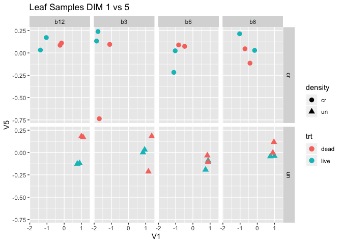

# purpose: Raw count files to DEGs
# History
* For reorganization, create this script from scratch. (092518)
* Adding MDS plot with block info (090619)


```r
knitr::opts_chunk$set(echo = TRUE,error=TRUE)
```

```r
library(edgeR);library(tidyverse);library(readr);library(readxl)
```

```
## Loading required package: limma
```

```
## ── Attaching packages ─────────────────────────────────────────────── tidyverse 1.2.1 ──
```

```
## ✔ ggplot2 3.2.1       ✔ purrr   0.3.2  
## ✔ tibble  2.1.3       ✔ dplyr   0.8.0.1
## ✔ tidyr   0.8.3       ✔ stringr 1.4.0  
## ✔ readr   1.3.1       ✔ forcats 0.4.0
```

```
## Warning: package 'ggplot2' was built under R version 3.5.2
```

```
## Warning: package 'tibble' was built under R version 3.5.2
```

```
## Warning: package 'tidyr' was built under R version 3.5.2
```

```
## Warning: package 'purrr' was built under R version 3.5.2
```

```
## Warning: package 'dplyr' was built under R version 3.5.2
```

```
## Warning: package 'stringr' was built under R version 3.5.2
```

```
## Warning: package 'forcats' was built under R version 3.5.2
```

```
## ── Conflicts ────────────────────────────────────────────────── tidyverse_conflicts() ──
## ✖ dplyr::filter() masks stats::filter()
## ✖ dplyr::lag()    masks stats::lag()
```

```
## Warning: package 'readxl' was built under R version 3.5.2
```
# For Mapping reads with Kalisoga see "Map and normalize.Rmd" in "./v3.0annotation/20170617-samples/scripts" 
# load reads mapped to v3.0 Brassica genome

```r
getwd()
```

```
## [1] "/Volumes/data_work/Data8/NGS_related/Brassica_microbiome/Brapa_microbes_rebuilt1/v3.0annotation/20180202-samples/scripts"
```

```r
counts <- readr::read_csv(file.path("..","input","20180202_V3.0_raw_counts.csv.gz"))
```

```
## Parsed with column specification:
## cols(
##   .default = col_double(),
##   target_id = col_character()
## )
```

```
## See spec(...) for full column specifications.
```

```r
counts # make sure this is v3.0 annotation (look target_id column)
```

```
## # A tibble: 46,250 x 65
##    target_id a1_5e_live_cr_3… a2_5e_dead_cr_3… a3_5e_dead_un_3…
##    <chr>                <dbl>            <dbl>            <dbl>
##  1 BraA01g0…             6                3                5.54
##  2 BraA01g0…           103.              80.5             51.9 
##  3 BraA01g0…             2.06             2.02             1.01
##  4 BraA01g0…           212.             213.             339.  
##  5 BraA01g0…            11               15               27   
##  6 BraA01g0…             0                0                0   
##  7 BraA01g0…            11               26               36   
##  8 BraA01g0…            68               96               97   
##  9 BraA01g0…           119.             100.             205.  
## 10 BraA01g0…             7.57            45.4              7.57
## # … with 46,240 more rows, and 61 more variables:
## #   a4_5e_dead_un_3_a47_S4 <dbl>, a5_5e_dead_cr_3_a54_S5 <dbl>,
## #   a6_5e_live_cr_3_a56_S6 <dbl>, a7_5e_live_un_3_a57_S7 <dbl>,
## #   a8_5e_live_un_3_a60_S8 <dbl>, b1_5e_live_cr_3_a42_S9 <dbl>,
## #   b2_5e_dead_cr_3_a44_S10 <dbl>, b3_5e_dead_un_3_a46_S11 <dbl>,
## #   b4_5e_dead_un_3_a47_S12 <dbl>, b5_5e_dead_cr_3_a54_S13 <dbl>,
## #   b6_5e_live_cr_3_a56_S14 <dbl>, b7_5e_live_un_3_a57_S15 <dbl>,
## #   b8_5e_live_un_3_a60_S16 <dbl>, c1_5e_live_un_6_a103_S17 <dbl>,
## #   c2_5e_dead_cr_6_a104_S18 <dbl>, c3_5e_live_cr_6_a109_S19 <dbl>,
## #   c4_5e_dead_un_6_a112_S20 <dbl>, c5_5e_live_un_6_a114_S21 <dbl>,
## #   c6_5e_dead_un_6_a117_S22 <dbl>, c7_5e_dead_cr_6_a119_S23 <dbl>,
## #   c8_5e_live_cr_6_a120_S24 <dbl>, d1_5e_live_un_6_a103_S25 <dbl>,
## #   d2_5e_dead_cr_6_a104_S26 <dbl>, d3_5e_live_cr_6_a109_S27 <dbl>,
## #   d4_5e_dead_un_6_a112_S28 <dbl>, d5_5e_live_un_6_a114_S29 <dbl>,
## #   d6_5e_dead_un_6_a117_S30 <dbl>, d7_5e_dead_cr_6_a119_S31 <dbl>,
## #   d8_5e_live_cr_6_a120_S32 <dbl>, e1_5e_dead_cr_8_a142_S33 <dbl>,
## #   e2_5e_live_un_8_a146_S34 <dbl>, e3_5e_live_un_8_a150_S35 <dbl>,
## #   e4_5e_live_cr_8_a151_S36 <dbl>, e5_5e_dead_un_8_a152_S37 <dbl>,
## #   e6_5e_dead_cr_8_a153_S38 <dbl>, e7_5e_live_cr_8_a157_S39 <dbl>,
## #   e8_5e_dead_un_8_a159_S40 <dbl>, f1_5e_dead_cr_8_a142_S41 <dbl>,
## #   f2_5e_live_un_8_a146_S42 <dbl>, f3_5e_live_un_8_a150_S43 <dbl>,
## #   f4_5e_live_cr_8_a151_S44 <dbl>, f5_5e_dead_un_8_a152_S45 <dbl>,
## #   f6_5e_dead_cr_8_a153_S46 <dbl>, f7_5e_live_cr_8_a157_S47 <dbl>,
## #   f8_5e_dead_un_8_a159_S48 <dbl>, g1_5e_dead_un_12_a223_S49 <dbl>,
## #   g2_5e_dead_un_12_a226_S50 <dbl>, g3_5e_dead_cr_12_a228_S51 <dbl>,
## #   g4_5e_live_un_12_a229_S52 <dbl>, g5_5e_live_un_12_a230_S53 <dbl>,
## #   g6_5e_dead_cr_12_a235_S54 <dbl>, g7_5e_live_cr_12_a236_S55 <dbl>,
## #   g8_5e_live_cr_12_a240_S56 <dbl>, h1_5e_dead_un_12_a223_S57 <dbl>,
## #   h2_5e_dead_un_12_a226_S58 <dbl>, h3_5e_dead_cr_12_a228_S59 <dbl>,
## #   h4_5e_live_un_12_a229_S60 <dbl>, h5_5e_live_un_12_a230_S61 <dbl>,
## #   h6_5e_dead_cr_12_a235_S62 <dbl>, h7_5e_live_cr_12_a236_S63 <dbl>,
## #   h8_5e_live_cr_12_a240_S64 <dbl>
```
## make sample description data frame (modified from Juiln's script "Map and normalize.Rmd"

```r
# separate() is useful (like split() in Base package. See "R for data science" pg157)
sample.description <- tibble(sample=colnames(counts)[-1]) %>%
  separate(sample,
           c("location","soil","trt","density","block","pot","unknown2"),
           remove=FALSE,
           convert=FALSE) %>% unite(sample2,c("location","soil","trt","density","block","pot"),remove=FALSE)
head(sample.description) 
```

```
## # A tibble: 6 x 9
##   sample       sample2    location soil  trt   density block pot   unknown2
##   <chr>        <chr>      <chr>    <chr> <chr> <chr>   <chr> <chr> <chr>   
## 1 a1_5e_live_… a1_5e_liv… a1       5e    live  cr      3     a42   S1      
## 2 a2_5e_dead_… a2_5e_dea… a2       5e    dead  cr      3     a44   S2      
## 3 a3_5e_dead_… a3_5e_dea… a3       5e    dead  un      3     a46   S3      
## 4 a4_5e_dead_… a4_5e_dea… a4       5e    dead  un      3     a47   S4      
## 5 a5_5e_dead_… a5_5e_dea… a5       5e    dead  cr      3     a54   S5      
## 6 a6_5e_live_… a6_5e_liv… a6       5e    live  cr      3     a56   S6
```

```r
#type_convert(sample.description[,-3]) # to keep "unknown" column as character type.
#sample.description$block<-as.integer(sample.description$block)
# change lowercases into uppercases in soil column and character into integer in block
sample.description<-sample.description %>% mutate(soil=toupper(soil)) %>% mutate(block=str_c("b", as.integer(block))) ## get additional metadata. (Oct 14, 2019) Block effects have to be character, not integer!!!!

sample.info <- read_tsv(file.path("..","input","20180202-data","wy003-metadata.txt"), col_names=c("sample2","tissue","soil","trt","density","block","pot"),skip=1) # do I need to add thi info? Yes for tissue info.
```

```
## Parsed with column specification:
## cols(
##   sample2 = col_character(),
##   tissue = col_character(),
##   soil = col_number(),
##   trt = col_character(),
##   density = col_character(),
##   block = col_double(),
##   pot = col_character()
## )
```

```r
head(sample.info)
```

```
## # A tibble: 6 x 7
##   sample2             tissue  soil trt   density block pot  
##   <chr>               <chr>  <dbl> <chr> <chr>   <dbl> <chr>
## 1 a1_5e_live_cr_3_a42 root       5 live  CR          3 A42  
## 2 a2_5e_dead_cr_3_a44 root       5 dead  CR          3 A44  
## 3 a3_5e_dead_un_3_a46 root       5 dead  UN          3 A46  
## 4 a4_5e_dead_un_3_a47 root       5 dead  UN          3 A47  
## 5 a5_5e_dead_cr_3_a54 root       5 dead  CR          3 A54  
## 6 a6_5e_live_cr_3_a56 root       5 live  CR          3 A56
```

```r
#sample.info %>% mutate(block=as.integer(block))
##combine
sample.description2 <- left_join(sample.description, dplyr::select(sample.info,c(sample2,tissue))) %>% dplyr::select(-sample2) #
```

```
## Joining, by = "sample2"
```

```r
sample.description2 <- sample.description2 %>% 
  mutate(group=paste(trt,density,tissue,sep="_")) 
head(sample.description2)
```

```
## # A tibble: 6 x 10
##   sample    location soil  trt   density block pot   unknown2 tissue group 
##   <chr>     <chr>    <chr> <chr> <chr>   <chr> <chr> <chr>    <chr>  <chr> 
## 1 a1_5e_li… a1       5E    live  cr      b3    a42   S1       root   live_…
## 2 a2_5e_de… a2       5E    dead  cr      b3    a44   S2       root   dead_…
## 3 a3_5e_de… a3       5E    dead  un      b3    a46   S3       root   dead_…
## 4 a4_5e_de… a4       5E    dead  un      b3    a47   S4       root   dead_…
## 5 a5_5e_de… a5       5E    dead  cr      b3    a54   S5       root   dead_…
## 6 a6_5e_li… a6       5E    live  cr      b3    a56   S6       root   live_…
```

```r
sample.description2 %>% summarize(n_distinct(group)) # n_distinct()
```

```
## # A tibble: 1 x 1
##   `n_distinct(group)`
##                 <int>
## 1                   8
```

```r
write_csv(sample.description2,path=file.path("..","output","Br.mbio.e3.sample.description.csv")) # change file name 
# data.frame version
sample.description2.DF<-data.frame(sample.description2)
```


## summarize counts

## load to edgeR, normalize

# 

Looks like we should normalize separately for root and leaf
# do separately for leaf and root values


# Leaf


# Root

# save edgeR objects


# leaf MDS plot bcv

```r
load(file.path("..","output","edgeR_dge_objects.e3.v3.0anno.RData"))
# leaf
mds.leaf <- plotMDS(dge.leaf,method = "bcv",labels=dge.leaf$samples$group,gene.selection = "pairwise",dim.plot = c(1,2),ndim=5)
```

<!-- -->

```r
mds.leaf.pl <- as_tibble(mds.leaf$cmdscale.out) %>% 
  bind_cols(data.frame(sample=row.names(mds.leaf$cmdscale.out)),.) %>%
  inner_join(dge.leaf$samples)
```

```
## Warning: `as_tibble.matrix()` requires a matrix with column names or a `.name_repair` argument. Using compatibility `.name_repair`.
## This warning is displayed once per session.
```

```
## Joining, by = "sample"
```

```
## Warning: Column `sample` joining factor and character vector, coercing into
## character vector
```

```r
# V1 vs V2
p.V1.V2<-mds.leaf.pl %>% ggplot(aes(x=V1,y=V2, shape=density, color=trt,label=density)) + geom_point(size=3) + ggtitle("Leaf Samples DIM 1 vs 2 bcv")+ facet_grid(density~block) + theme_gray()
p.V1.V2
```

<!-- -->

```r
ggsave(filename="../output/e3.leaf.mds.bcv.1and2.png",width=6,height=8)
# V2 vs V3
p.V2.V3<-mds.leaf.pl %>% ggplot(aes(x=V2,y=V3, shape=density, color=trt,label=density)) + geom_point(size=3) + ggtitle("Leaf Samples DIM 2 vs 3 bcv")+ facet_grid(density~block)+ theme_gray()
p.V2.V3
```

<!-- -->

```r
ggsave(filename="../output/e3.leaf.mds.bcv.2and3.png",width=6,height=8)
# V1 vs V3
p.V1.V3<-mds.leaf.pl %>% ggplot(aes(x=V1,y=V3, shape=density, color=trt,label=density)) + geom_point(size=3) + ggtitle("Leaf Samples DIM 1 vs 3 bcv")+ facet_grid(density~block)+ theme_gray()
p.V1.V3
```

<!-- -->

```r
ggsave(filename="../output/e3.leaf.mds.bcv.1and3.png",width=6,height=8)
# V1 vs V4
p.V1.V4<-mds.leaf.pl %>% ggplot(aes(x=V1,y=V4, shape=density, color=trt,label=density)) + geom_point(size=3) + ggtitle("Leaf Samples DIM 1 vs 4 bcv")+ facet_grid(density~block)+ theme_gray()
p.V1.V4
```

<!-- -->

```r
ggsave(filename="../output/e3.leaf.mds.bcv.1and4.png",width=6,height=8)
# V1 vs V5
p.V1.V5<-mds.leaf.pl %>% ggplot(aes(x=V1,y=V5, shape=density, color=trt,label=density)) + geom_point(size=3) + ggtitle("Leaf Samples DIM 1 vs 5")+ facet_grid(density~block)+ theme_gray()
p.V1.V5
```

<!-- -->

```r
ggsave(filename="../output/e3.leaf.mds.bcv.1and5.png",width=6,height=8)
```

# leaf MDS logFC

```r
mds.leaf.logFC <- plotMDS(dge.leaf,method = "logFC",labels=dge.leaf$samples$group,gene.selection = "pairwise",dim.plot = c(1,2),ndim=5) # changed ndim=3 into 5
```

<!-- -->

```r
mds.leaf.pl.logFC <- as_tibble(mds.leaf.logFC$cmdscale.out) %>% 
  bind_cols(data.frame(sample=row.names(mds.leaf.logFC$cmdscale.out)),.) %>%
  inner_join(dge.leaf$samples)
```

```
## Joining, by = "sample"
```

```
## Warning: Column `sample` joining factor and character vector, coercing into
## character vector
```

```r
# adding block info
# V1 vs V2
p.V1.V2.logFC<-mds.leaf.pl.logFC %>% ggplot(aes(x=V1,y=V2, shape=density, color=trt,label=density)) + geom_point(size=3) + ggtitle("Leaf Samples DIM 1 vs 2, logFC") + facet_grid(density~block)+ theme_gray()
p.V1.V2.logFC
```

<!-- -->

```r
ggsave(filename="../output/e3.leaf.mds.logFC.1and2.png",width=6,height=8)
# V1 vs V3
p.V1.V3.logFC<-mds.leaf.pl.logFC %>% ggplot(aes(x=V1,y=V3, shape=density, color=trt,label=density)) + geom_point(size=3) + ggtitle("Leaf Samples DIM 1 vs 3, logFC")+ facet_grid(density~block)+ theme_gray()
p.V1.V3.logFC
```

<!-- -->

```r
ggsave(filename="../output/e3.leaf.mds.logFC.1and3.png",width=6,height=8)
# V1 vs V4
p.V1.V4.logFC<-mds.leaf.pl.logFC %>% ggplot(aes(x=V1,y=V4, shape=density, color=trt,label=density)) + geom_point(size=3) + ggtitle("Leaf Samples DIM 1 vs 4, logFC")+ facet_grid(density~block)+ theme_gray()
p.V1.V4.logFC
```

<!-- -->

```r
ggsave(filename="../output/e3.leaf.mds.logFC.1and4.png",width=6,height=8)
# V1 vs V5
p.V1.V5.logFC<-mds.leaf.pl.logFC %>% ggplot(aes(x=V1,y=V5, shape=density, color=trt,label=density)) + geom_point(size=3) + ggtitle("Leaf Samples DIM 1 vs 5, logFC")+ facet_grid(density~block)+ theme_gray()
p.V1.V5.logFC
```

<!-- -->

```r
ggsave(filename="../output/e3.leaf.mds.logFC.1and5.png",width=6,height=8)
```

# root MDS plot bcv

```r
# root
mds.root <- plotMDS(dge.root,method = "bcv",labels=dge.root$samples$group,gene.selection = "pairwise",dim.plot = c(1,2),ndim=5)
```

<!-- -->

```r
mds.root.pl <- as_tibble(mds.root$cmdscale.out) %>% 
  bind_cols(data.frame(sample=row.names(mds.root$cmdscale.out)),.) %>%
  inner_join(dge.root$samples)
```

```
## Joining, by = "sample"
```

```
## Warning: Column `sample` joining factor and character vector, coercing into
## character vector
```

```r
# V1 vs V2
p.V1.V2<-mds.root.pl %>% ggplot(aes(x=V1,y=V2, shape=density, color=trt,label=density)) + geom_point(size=3) + ggtitle("root Samples DIM 1 vs 2 bcv")+ facet_grid(density~block)+ theme_gray()
p.V1.V2
```

<!-- -->

```r
ggsave(filename="../output/e3.root.mds.bcv.1and2.png",width=6,height=8)
# V2 vs V3
p.V2.V3<-mds.root.pl %>% ggplot(aes(x=V2,y=V3, shape=density, color=trt,label=density)) + geom_point(size=3) + ggtitle("root Samples DIM 2 vs 3 bcv")+ facet_grid(density~block)+ theme_gray()
p.V2.V3
```

<!-- -->

```r
ggsave(filename="../output/e3.root.mds.bcv.2and3.png",width=6,height=8)
# V1 vs V3
p.V1.V3<-mds.root.pl %>% ggplot(aes(x=V1,y=V3, shape=density, color=trt,label=density)) + geom_point(size=3) + ggtitle("root Samples DIM 1 vs 3 bcv")+ facet_grid(density~block)+ theme_gray()
p.V1.V3
```

<!-- -->

```r
ggsave(filename="../output/e3.root.mds.bcv.1and3.png",width=6,height=8)
# V1 vs V4
p.V1.V4<-mds.root.pl %>% ggplot(aes(x=V1,y=V4, shape=density, color=trt,label=density)) + geom_point(size=3) + ggtitle("root Samples DIM 1 vs 4 bcv")+ facet_grid(density~block)+ theme_gray()
p.V1.V4
```

<!-- -->

```r
ggsave(filename="../output/e3.root.mds.bcv.1and4.png",width=6,height=8)
# V1 vs V5
p.V1.V5<-mds.root.pl %>% ggplot(aes(x=V1,y=V5, shape=density, color=trt,label=density)) + geom_point(size=3) + ggtitle("root Samples DIM 1 vs 5")+ facet_grid(density~block)+ theme_gray()
p.V1.V5
```

<!-- -->

```r
ggsave(filename="../output/e3.root.mds.bcv.1and5.png",width=6,height=8)
```

# root MDS logFC

```r
mds.root.logFC <- plotMDS(dge.root,method = "logFC",labels=dge.root$samples$group,gene.selection = "pairwise",dim.plot = c(1,2),ndim=5) # changed ndim=3 into 5
```

<!-- -->

```r
mds.root.pl.logFC <- as_tibble(mds.root.logFC$cmdscale.out) %>% 
  bind_cols(data.frame(sample=row.names(mds.root.logFC$cmdscale.out)),.) %>%
  inner_join(dge.root$samples)
```

```
## Joining, by = "sample"
```

```
## Warning: Column `sample` joining factor and character vector, coercing into
## character vector
```

```r
# adding block info
# V1 vs V2
p.V1.V2.logFC<-mds.root.pl.logFC %>% ggplot(aes(x=V1,y=V2, shape=density, color=trt,label=density)) + geom_point(size=3) + ggtitle("root Samples DIM 1 vs 2, logFC") + facet_grid(density~block)+ theme_gray()
p.V1.V2.logFC
```

<!-- -->

```r
ggsave(filename="../output/e3.root.mds.logFC.1and2.png",width=6,height=8)
# V1 vs V3
p.V1.V3.logFC<-mds.root.pl.logFC %>% ggplot(aes(x=V1,y=V3, shape=density, color=trt,label=density)) + geom_point(size=3) + ggtitle("root Samples DIM 1 vs 3, logFC")+ facet_grid(density~block)+ theme_gray()
p.V1.V3.logFC
```

<!-- -->

```r
ggsave(filename="../output/e3.root.mds.logFC.1and3.png",width=6,height=8)
# V1 vs V4
p.V1.V4.logFC<-mds.root.pl.logFC %>% ggplot(aes(x=V1,y=V4, shape=density, color=trt,label=density)) + geom_point(size=3) + ggtitle("root Samples DIM 1 vs 4, logFC")+ facet_grid(density~block)+ theme_gray()
p.V1.V4.logFC
```

<!-- -->

```r
ggsave(filename="../output/e3.root.mds.logFC.1and4.png",width=6,height=8)
# V1 vs V5
p.V1.V5.logFC<-mds.root.pl.logFC %>% ggplot(aes(x=V1,y=V5, shape=density, color=trt,label=density)) + geom_point(size=3) + ggtitle("root Samples DIM 1 vs 5, logFC")+ facet_grid(density~block)+ theme_gray()
p.V1.V5.logFC
```

<!-- -->

```r
ggsave(filename="../output/e3.root.mds.logFC.1and5.png",width=6,height=8)
```


# DEGs prep

```r
# clean working directory
rm(list=ls())
knitr::opts_chunk$set(echo = TRUE,error=TRUE)
library(edgeR);library(tidyverse)
# annotation file for v3.0annotation
Br.v3.0.At.BLAST <- read_csv(file.path("..","..","..","Annotation","output","v3.0annotation","Brapa_v3.0_annotated.csv")) 
```

```
## Warning: Missing column names filled in: 'X1' [1]
```

```
## Parsed with column specification:
## cols(
##   .default = col_double(),
##   name = col_character(),
##   chrom = col_character(),
##   subject = col_character(),
##   AGI = col_character(),
##   At_symbol = col_character(),
##   At_full_name = col_character(),
##   At_gene_model_type = col_character(),
##   At_short_description = col_character(),
##   At_Curator_summary = col_character(),
##   At_Computational_description = col_character()
## )
```

```
## See spec(...) for full column specifications.
```

```r
# This annotation is redundant with name (Br grene). Eg 
Br.v3.0.At.BLAST %>% filter(name=="BraA01g040570.3C")
```

```
## # A tibble: 2 x 23
##      X1 name  chrom  start    end subject AGI   At_symbol At_full_name
##   <dbl> <chr> <chr>  <dbl>  <dbl> <chr>   <chr> <chr>     <chr>       
## 1  3848 BraA… A01   2.73e7 2.73e7 AT3G09… AT3G… AIRP3     ABA insensi…
## 2  3849 BraA… A01   2.73e7 2.73e7 AT5G03… AT5G… LUL1      LOG2-LIKE U…
## # … with 14 more variables: At_gene_model_type <chr>,
## #   At_short_description <chr>, At_Curator_summary <chr>,
## #   At_Computational_description <chr>, perc_ID <dbl>, aln_length <dbl>,
## #   mismatch <dbl>, gap_open <dbl>, qstart <dbl>, qend <dbl>,
## #   sstart <dbl>, send <dbl>, eval <dbl>, score <dbl>
```

```r
# reduce the redundancy (112418)
Br.v3.0anno.At.BLAST.highscore <- Br.v3.0.At.BLAST %>% group_by(name) %>% arrange(desc(score)) %>% slice(1)

# load exp1 v3.0 annotation dge files and sample info
load(file.path("..","output","edgeR_dge_objects.e3.v3.0anno.RData"))
# for expression pattern graph
source("../../../tools/Expression_pattern_graph.R",chdir=TRUE)
```

```
## Warning: package 'cowplot' was built under R version 3.5.2
```

```
## 
## Attaching package: 'cowplot'
```

```
## The following object is masked from 'package:ggplot2':
## 
##     ggsave
```

```
## Parsed with column specification:
## cols(
##   .default = col_double(),
##   target_id = col_character()
## )
```

```
## See spec(...) for full column specifications.
```

```
## Parsed with column specification:
## cols(
##   .default = col_double(),
##   target_id = col_character()
## )
```

```
## See spec(...) for full column specifications.
```

```
## Parsed with column specification:
## cols(
##   .default = col_double(),
##   transcript_ID = col_character()
## )
```

```
## See spec(...) for full column specifications.
```

```
## Parsed with column specification:
## cols(
##   .default = col_double(),
##   transcript_ID = col_character()
## )
```

```
## See spec(...) for full column specifications.
```

```
## Parsed with column specification:
## cols(
##   .default = col_double(),
##   target_id = col_character()
## )
```

```
## See spec(...) for full column specifications.
```

```
## Parsed with column specification:
## cols(
##   .default = col_double(),
##   transcript_ID = col_character()
## )
```

```
## See spec(...) for full column specifications.
```

```
## Parsed with column specification:
## cols(
##   .default = col_double(),
##   transcript_ID = col_character()
## )
```

```
## See spec(...) for full column specifications.
```

```
## Parsed with column specification:
## cols(
##   sample = col_character(),
##   location = col_character(),
##   tissue = col_character(),
##   genotype = col_character(),
##   block = col_double(),
##   pot = col_double(),
##   bench = col_double(),
##   col = col_double(),
##   row = col_double(),
##   data_type = col_character(),
##   trt = col_character(),
##   time_point = col_character(),
##   group = col_character()
## )
```

```
## Parsed with column specification:
## cols(
##   sample = col_character(),
##   location = col_character(),
##   soil = col_number(),
##   trt = col_character(),
##   density = col_character(),
##   block = col_character(),
##   pot = col_character(),
##   unknown2 = col_character(),
##   tissue = col_character(),
##   group = col_character()
## )
```

```r
# "/Volumes/data_work/Data8/NGS_related/Brassica_microbiome/Brapa_microbes/tools"
```
# Additive model, rD.rUN

```r
# relevel trt and density to "dead" and "uncrowd"
dge.root$samples<-dge.root$samples %>% mutate(trt=fct_relevel(trt,"dead")) # %>% str() 
dge.root$samples<-dge.root$samples %>% mutate(density=fct_relevel(density,"un")) #%>% str() 
dge.leaf$samples<-dge.leaf$samples %>% mutate(trt=fct_relevel(trt,"dead")) #%>% str() 
dge.leaf$samples<-dge.leaf$samples %>% mutate(density=fct_relevel(density,"un")) #%>% str() 
## dge
root.design.add <- with(dge.root$samples, model.matrix(~ density + trt + block))
leaf.design.add <- with(dge.leaf$samples, model.matrix(~ density + trt + block))
# estimateDisp
root.dge.add <- estimateDisp(dge.root,design = root.design.add)
leaf.dge.add <- estimateDisp(dge.leaf,design = leaf.design.add)
## fit linear model
root.fit.add <- glmFit(root.dge.add,root.design.add)
leaf.fit.add <- glmFit(leaf.dge.add,leaf.design.add)
# get DEGs, trt effects (coef=c("trtlive"))
root.trtlive.lrt <- glmLRT(root.fit.add,coef = c("trtlive"))
leaf.trtlive.lrt <- glmLRT(leaf.fit.add,coef = c("trtlive"))
topTags(root.trtlive.lrt);topTags(leaf.trtlive.lrt)
```

```
## Coefficient:  trtlive 
##                  genes      logFC   logCPM       LR       PValue
## 20374 BraA05g014790.3C -2.2106804 1.587361 66.27469 3.922626e-16
## 18062 BraA04g024250.3C  0.5883919 8.540887 60.19340 8.598023e-15
## 17236 BraA04g015990.3C  1.8096834 1.761986 48.65912 3.045486e-12
## 39595 BraA09g040290.3C  0.5058879 7.514521 48.38059 3.510263e-12
## 34734 BraA08g027460.3C  1.6172327 1.606219 47.71166 4.937469e-12
## 37267 BraA09g017010.3C -1.0998524 2.652267 47.69420 4.981629e-12
## 10652 BraA03g015680.3C  0.5788164 6.150705 46.76210 8.014863e-12
## 24286 BraA06g011260.3C  0.5307837 6.883391 46.46718 9.316580e-12
## 6858  BraA02g023600.3C -0.7034380 6.913525 44.82844 2.150764e-11
## 33569 BraA08g015810.3C -0.4802188 6.841925 44.66021 2.343726e-11
##                FDR
## 20374 1.033141e-11
## 18062 1.132274e-10
## 17236 2.186769e-08
## 39595 2.186769e-08
## 34734 2.186769e-08
## 37267 2.186769e-08
## 10652 3.015649e-08
## 24286 3.067251e-08
## 6858  6.172907e-08
## 33569 6.172907e-08
```

```
## Coefficient:  trtlive 
##                  genes      logFC    logCPM       LR       PValue
## 4837  BraA02g003390.3C  0.7150111 4.1271440 25.45377 4.531102e-07
## 43942 BraA10g017280.3C  0.6087774 5.5013863 24.67396 6.789544e-07
## 43993 BraA10g017790.3C  1.8959308 0.4184681 22.22092 2.430117e-06
## 12572 BraA03g034880.3C -1.0365768 1.8901374 18.95252 1.340120e-05
## 5803  BraA02g013050.3C  0.6500869 7.5797145 18.86529 1.402823e-05
## 37902 BraA09g023360.3C  0.5435197 4.9521889 18.84546 1.417482e-05
## 23856 BraA06g006960.3C  1.1156470 6.1042318 18.81315 1.441700e-05
## 15961 BraA04g003240.3C  0.6009518 3.3910788 18.46459 1.730907e-05
## 30539 BraA07g028800.3C -0.5271522 4.1138439 17.44334 2.960002e-05
## 10840 BraA03g017560.3C  0.4066329 6.8965574 17.30076 3.190595e-05
##               FDR
## 4837  0.008109432
## 43942 0.008109432
## 43993 0.019350209
## 12572 0.049199043
## 5803  0.049199043
## 37902 0.049199043
## 23856 0.049199043
## 15961 0.051684879
## 30539 0.063768837
## 10840 0.063768837
```

```r
## all
root.trtlive.DEGs.add.all <- topTags(root.trtlive.lrt,n = Inf,p.value = 1)$table
leaf.trtlive.DEGs.add.all <- topTags(leaf.trtlive.lrt,n = Inf,p.value = 1)$table 
## pvalue < 0.05
root.trtlive.DEGs.add <- topTags(root.trtlive.lrt,n = Inf,p.value = 0.05)$table;nrow(root.trtlive.DEGs.add) 
```

```
## [1] 3402
```

```r
leaf.trtlive.DEGs.add <- topTags(leaf.trtlive.lrt,n = Inf,p.value = 0.05)$table;nrow(leaf.trtlive.DEGs.add) 
```

```
## [1] 7
```

```r
# get DEGs, density effects (coef = c("densitycr"))
root.densitycr.lrt <- glmLRT(root.fit.add,coef = c("densitycr"))
leaf.densitycr.lrt <- glmLRT(leaf.fit.add,coef = c("densitycr"))
topTags(root.densitycr.lrt);topTags(leaf.densitycr.lrt)
```

```
## Coefficient:  densitycr 
##                  genes     logFC   logCPM       LR        PValue
## 31770 BraA07g041110.3C -2.621155 5.324674 640.9370 2.090032e-141
## 34762 BraA08g027740.3C  2.363488 4.415149 468.0470 8.526115e-104
## 31781 BraA07g041220.3C -2.344485 6.279608 440.2821  9.398406e-98
## 15668 BraA04g000310.3C -4.489331 4.228299 425.7760  1.349757e-94
## 9466  BraA03g003820.3C  1.989162 7.329890 425.0332  1.958473e-94
## 8962  BraA02g044640.3C  3.416810 4.354952 402.1616  1.863741e-89
## 2720  BraA01g027200.3C -2.488126 5.280104 368.4571  4.056350e-82
## 30055 BraA07g023960.3C  6.677827 3.059383 353.0559  9.155449e-79
## 313   BraA01g003130.3C  1.757196 5.811378 347.3909  1.567895e-77
## 7483  BraA02g029850.3C -3.364547 4.009907 341.1098  3.657352e-76
##                 FDR
## 31770 5.504725e-137
## 34762  1.122804e-99
## 31781  8.251174e-94
## 15668  8.887474e-91
## 9466   1.031645e-90
## 8962   8.181202e-86
## 2720   1.526231e-78
## 30055  3.014203e-75
## 313    4.588357e-74
## 7483   9.632733e-73
```

```
## Coefficient:  densitycr 
##                  genes     logFC   logCPM       LR        PValue
## 35194 BraA08g032060.3C -7.021751 4.087644 935.7070 1.697090e-205
## 9181  BraA03g000970.3C -2.639437 8.146721 814.0831 4.679219e-179
## 27317 BraA06g041570.3C -2.669930 7.367640 669.2861 1.428396e-147
## 915   BraA01g009150.3C -2.574011 7.526745 614.3057 1.294962e-135
## 27167 BraA06g040070.3C -5.010914 4.525543 574.2342 6.733834e-127
## 31338 BraA07g036790.3C -2.466976 7.322906 569.5162 7.153978e-126
## 34827 BraA08g028390.3C -5.527114 4.396098 551.8173 5.065867e-122
## 4858  BraA02g003600.3C  4.112877 7.238173 543.1026 3.985368e-120
## 40477 BraA09g049110.3C -2.315706 7.946942 532.3137 8.863057e-118
## 33190 BraA08g012020.3C -2.415821 6.382139 529.9557 2.888001e-117
##                 FDR
## 35194 4.054010e-201
## 9181  5.588860e-175
## 27317 1.137384e-143
## 915   7.733512e-132
## 27167 3.217157e-123
## 31338 2.848237e-122
## 34827 1.728763e-118
## 4858  1.190031e-116
## 40477 2.352452e-114
## 33190 6.898857e-114
```

```r
## all
root.densitycr.DEGs.add.all <- topTags(root.densitycr.lrt,n = Inf,p.value = 1)$table
leaf.densitycr.DEGs.add.all <- topTags(leaf.densitycr.lrt,n = Inf,p.value = 1)$table
# add annotiona with full name objects (all)
root.densitycr.DEGs.add.all.rD.rUN.v3.0anno <- left_join(root.densitycr.DEGs.add.all,Br.v3.0anno.At.BLAST.highscore,by=c(genes="name")) %>%  select(1:6, AGI, At_symbol, At_short_description, perc_ID)
leaf.densitycr.DEGs.add.all.rD.rUN.v3.0anno <- left_join(leaf.densitycr.DEGs.add.all,Br.v3.0anno.At.BLAST.highscore,by=c(genes="name")) %>% select(1:6, AGI, At_symbol, At_short_description, perc_ID)
root.trtlive.DEGs.add.all.rD.rUN.v3.0anno <- left_join(root.trtlive.DEGs.add.all,Br.v3.0anno.At.BLAST.highscore,by=c(genes="name")) %>%  select(1:6, AGI, At_symbol, At_short_description, perc_ID)
leaf.trtlive.DEGs.add.all.rD.rUN.v3.0anno <- left_join(leaf.trtlive.DEGs.add.all,Br.v3.0anno.At.BLAST.highscore,by=c(genes="name")) %>% select(1:6, AGI, At_symbol, At_short_description, perc_ID)

# write csv (all)
## density
write.csv(root.densitycr.DEGs.add.all.rD.rUN.v3.0anno,file=file.path("..","output","FULLtoptag","root.densitycr.DEGs.add.rD.rUN.v3.0anno.csv"))
write.csv(leaf.densitycr.DEGs.add.all.rD.rUN.v3.0anno,file=file.path("..","output","FULLtoptag","leaf.densitycr.DEGs.add.rD.rUN.v3.0anno.csv"))
## trt
write.csv(root.trtlive.DEGs.add.all.rD.rUN.v3.0anno,file=file.path("..","output","FULLtoptag","root.trtlive.DEGs.add.rD.rUN.v3.0anno.csv"))
write.csv(leaf.trtlive.DEGs.add.all.rD.rUN.v3.0anno,file=file.path("..","output","FULLtoptag","leaf.trtlive.DEGs.add.rD.rUN.v3.0anno.csv"))
```
# cleanup working directory

```r
rm(list=ls())
knitr::opts_chunk$set(echo = TRUE,error=TRUE)
library(edgeR);library(tidyverse)
# annotation file for v3.0annotation
Br.v3.0.At.BLAST <- read_csv(file.path("..","..","..","Annotation","output","v3.0annotation","Brapa_v3.0_annotated.csv")) 
```

```
## Warning: Missing column names filled in: 'X1' [1]
```

```
## Parsed with column specification:
## cols(
##   .default = col_double(),
##   name = col_character(),
##   chrom = col_character(),
##   subject = col_character(),
##   AGI = col_character(),
##   At_symbol = col_character(),
##   At_full_name = col_character(),
##   At_gene_model_type = col_character(),
##   At_short_description = col_character(),
##   At_Curator_summary = col_character(),
##   At_Computational_description = col_character()
## )
```

```
## See spec(...) for full column specifications.
```

```r
# This annotation is redundant with name (Br grene). Eg 
Br.v3.0.At.BLAST %>% filter(name=="BraA01g040570.3C")
```

```
## # A tibble: 2 x 23
##      X1 name  chrom  start    end subject AGI   At_symbol At_full_name
##   <dbl> <chr> <chr>  <dbl>  <dbl> <chr>   <chr> <chr>     <chr>       
## 1  3848 BraA… A01   2.73e7 2.73e7 AT3G09… AT3G… AIRP3     ABA insensi…
## 2  3849 BraA… A01   2.73e7 2.73e7 AT5G03… AT5G… LUL1      LOG2-LIKE U…
## # … with 14 more variables: At_gene_model_type <chr>,
## #   At_short_description <chr>, At_Curator_summary <chr>,
## #   At_Computational_description <chr>, perc_ID <dbl>, aln_length <dbl>,
## #   mismatch <dbl>, gap_open <dbl>, qstart <dbl>, qend <dbl>,
## #   sstart <dbl>, send <dbl>, eval <dbl>, score <dbl>
```

```r
# reduce the redundancy (112418)
Br.v3.0anno.At.BLAST.highscore <- Br.v3.0.At.BLAST %>% group_by(name) %>% arrange(desc(score)) %>% slice(1)

# load exp1 v3.0 annotation dge files and sample info
load(file.path("..","output","edgeR_dge_objects.e3.v3.0anno.RData"))
# for expression pattern graph
source("../../../tools/Expression_pattern_graph.R",chdir=TRUE)
```

```
## Parsed with column specification:
## cols(
##   .default = col_double(),
##   target_id = col_character()
## )
## See spec(...) for full column specifications.
```

```
## Parsed with column specification:
## cols(
##   .default = col_double(),
##   target_id = col_character()
## )
```

```
## See spec(...) for full column specifications.
```

```
## Parsed with column specification:
## cols(
##   .default = col_double(),
##   transcript_ID = col_character()
## )
```

```
## See spec(...) for full column specifications.
```

```
## Parsed with column specification:
## cols(
##   .default = col_double(),
##   transcript_ID = col_character()
## )
```

```
## See spec(...) for full column specifications.
```

```
## Parsed with column specification:
## cols(
##   .default = col_double(),
##   target_id = col_character()
## )
```

```
## See spec(...) for full column specifications.
```

```
## Parsed with column specification:
## cols(
##   .default = col_double(),
##   transcript_ID = col_character()
## )
```

```
## See spec(...) for full column specifications.
```

```
## Parsed with column specification:
## cols(
##   .default = col_double(),
##   transcript_ID = col_character()
## )
```

```
## See spec(...) for full column specifications.
```

```
## Parsed with column specification:
## cols(
##   sample = col_character(),
##   location = col_character(),
##   tissue = col_character(),
##   genotype = col_character(),
##   block = col_double(),
##   pot = col_double(),
##   bench = col_double(),
##   col = col_double(),
##   row = col_double(),
##   data_type = col_character(),
##   trt = col_character(),
##   time_point = col_character(),
##   group = col_character()
## )
```

```
## Parsed with column specification:
## cols(
##   sample = col_character(),
##   location = col_character(),
##   soil = col_number(),
##   trt = col_character(),
##   density = col_character(),
##   block = col_character(),
##   pot = col_character(),
##   unknown2 = col_character(),
##   tissue = col_character(),
##   group = col_character()
## )
```

```r
# "/Volumes/data_work/Data8/NGS_related/Brassica_microbiome/Brapa_microbes/tools"
```

# Additive model, rD.rCR

```r
# relevel trt and density to "dead" and "CR"
dge.root$samples<-dge.root$samples %>% mutate(trt=fct_relevel(trt,"dead")) #%>% str() 
dge.root$samples<-dge.root$samples %>% mutate(density=fct_relevel(density,"cr")) #%>% str() 
dge.leaf$samples<-dge.leaf$samples %>% mutate(trt=fct_relevel(trt,"dead")) #%>% str() 
dge.leaf$samples<-dge.leaf$samples %>% mutate(density=fct_relevel(density,"cr")) #%>% str() 
## dge
root.design.add <- with(dge.root$samples, model.matrix(~ density + trt + block))
leaf.design.add <- with(dge.leaf$samples, model.matrix(~ density + trt + block))
# estimateDisp
root.dge.add <- estimateDisp(dge.root,design = root.design.add)
leaf.dge.add <- estimateDisp(dge.leaf,design = leaf.design.add)
## fit linear model
root.fit.add <- glmFit(root.dge.add,root.design.add)
leaf.fit.add <- glmFit(leaf.dge.add,leaf.design.add)
# get DEGs, trt effects (coef=c("trtlive"))
root.trtlive.lrt <- glmLRT(root.fit.add,coef = c("trtlive"))
leaf.trtlive.lrt <- glmLRT(leaf.fit.add,coef = c("trtlive"))
topTags(root.trtlive.lrt);topTags(leaf.trtlive.lrt)
```

```
## Coefficient:  trtlive 
##                  genes      logFC   logCPM       LR       PValue
## 20374 BraA05g014790.3C -2.2106804 1.587361 66.27469 3.922626e-16
## 18062 BraA04g024250.3C  0.5883919 8.540887 60.19340 8.598022e-15
## 17236 BraA04g015990.3C  1.8096834 1.761986 48.65912 3.045486e-12
## 39595 BraA09g040290.3C  0.5058879 7.514521 48.38059 3.510263e-12
## 34734 BraA08g027460.3C  1.6172327 1.606219 47.71166 4.937469e-12
## 37267 BraA09g017010.3C -1.0998524 2.652267 47.69420 4.981629e-12
## 10652 BraA03g015680.3C  0.5788164 6.150705 46.76210 8.014863e-12
## 24286 BraA06g011260.3C  0.5307837 6.883391 46.46718 9.316580e-12
## 6858  BraA02g023600.3C -0.7034380 6.913525 44.82844 2.150764e-11
## 33569 BraA08g015810.3C -0.4802188 6.841925 44.66021 2.343726e-11
##                FDR
## 20374 1.033141e-11
## 18062 1.132273e-10
## 17236 2.186769e-08
## 39595 2.186769e-08
## 34734 2.186769e-08
## 37267 2.186769e-08
## 10652 3.015649e-08
## 24286 3.067251e-08
## 6858  6.172907e-08
## 33569 6.172907e-08
```

```
## Coefficient:  trtlive 
##                  genes      logFC   logCPM       LR       PValue
## 4837  BraA02g003390.3C  0.7150111 4.127144 25.45377 4.531102e-07
## 43942 BraA10g017280.3C  0.6087774 5.501386 24.67396 6.789544e-07
## 43993 BraA10g017790.3C  1.8959308 0.418468 22.22092 2.430117e-06
## 12572 BraA03g034880.3C -1.0365768 1.890137 18.95252 1.340120e-05
## 5803  BraA02g013050.3C  0.6500869 7.579714 18.86529 1.402823e-05
## 37902 BraA09g023360.3C  0.5435197 4.952189 18.84546 1.417482e-05
## 23856 BraA06g006960.3C  1.1156470 6.104232 18.81315 1.441700e-05
## 15961 BraA04g003240.3C  0.6009518 3.391079 18.46459 1.730907e-05
## 30539 BraA07g028800.3C -0.5271522 4.113844 17.44334 2.960002e-05
## 10840 BraA03g017560.3C  0.4066329 6.896557 17.30076 3.190595e-05
##               FDR
## 4837  0.008109432
## 43942 0.008109432
## 43993 0.019350209
## 12572 0.049199043
## 5803  0.049199043
## 37902 0.049199043
## 23856 0.049199043
## 15961 0.051684879
## 30539 0.063768837
## 10840 0.063768837
```

```r
## all
root.trtlive.DEGs.add.all <- topTags(root.trtlive.lrt,n = Inf,p.value = 1)$table
leaf.trtlive.DEGs.add.all <- topTags(leaf.trtlive.lrt,n = Inf,p.value = 1)$table 
# get DEGs, density effects (coef = c("densityun"))
root.densityun.lrt <- glmLRT(root.fit.add,coef = c("densityun"))
leaf.densityun.lrt <- glmLRT(leaf.fit.add,coef = c("densityun"))
topTags(root.densityun.lrt);topTags(leaf.densityun.lrt)
```

```
## Coefficient:  densityun 
##                  genes     logFC   logCPM       LR        PValue
## 31770 BraA07g041110.3C  2.621155 5.324674 640.9370 2.090032e-141
## 34762 BraA08g027740.3C -2.363488 4.415149 468.0470 8.526115e-104
## 31781 BraA07g041220.3C  2.344485 6.279608 440.2821  9.398406e-98
## 15668 BraA04g000310.3C  4.489331 4.228299 425.7760  1.349757e-94
## 9466  BraA03g003820.3C -1.989162 7.329890 425.0332  1.958473e-94
## 8962  BraA02g044640.3C -3.416810 4.354952 402.1616  1.863741e-89
## 2720  BraA01g027200.3C  2.488126 5.280104 368.4571  4.056350e-82
## 30055 BraA07g023960.3C -6.677827 3.059383 353.0559  9.155449e-79
## 313   BraA01g003130.3C -1.757196 5.811378 347.3909  1.567895e-77
## 7483  BraA02g029850.3C  3.364547 4.009907 341.1098  3.657352e-76
##                 FDR
## 31770 5.504725e-137
## 34762  1.122804e-99
## 31781  8.251174e-94
## 15668  8.887474e-91
## 9466   1.031645e-90
## 8962   8.181202e-86
## 2720   1.526231e-78
## 30055  3.014203e-75
## 313    4.588357e-74
## 7483   9.632733e-73
```

```
## Coefficient:  densityun 
##                  genes     logFC   logCPM       LR        PValue
## 35194 BraA08g032060.3C  7.021751 4.087644 935.7070 1.697090e-205
## 9181  BraA03g000970.3C  2.639437 8.146721 814.0829 4.679678e-179
## 27317 BraA06g041570.3C  2.669930 7.367640 669.2862 1.428385e-147
## 915   BraA01g009150.3C  2.574011 7.526745 614.3057 1.294943e-135
## 27167 BraA06g040070.3C  5.010914 4.525543 574.2342 6.733834e-127
## 31338 BraA07g036790.3C  2.466976 7.322906 569.5163 7.153921e-126
## 34827 BraA08g028390.3C  5.527114 4.396098 551.8173 5.065867e-122
## 4858  BraA02g003600.3C -4.112877 7.238173 543.1026 3.985379e-120
## 40477 BraA09g049110.3C  2.315706 7.946942 532.3138 8.862945e-118
## 33190 BraA08g012020.3C  2.415821 6.382139 529.9557 2.888000e-117
##                 FDR
## 35194 4.054010e-201
## 9181  5.589407e-175
## 27317 1.137375e-143
## 915   7.733399e-132
## 27167 3.217156e-123
## 31338 2.848215e-122
## 34827 1.728763e-118
## 4858  1.190034e-116
## 40477 2.352423e-114
## 33190 6.898855e-114
```

```r
## all
root.densityun.DEGs.add.all <- topTags(root.densityun.lrt,n = Inf,p.value = 1)$table
leaf.densityun.DEGs.add.all <- topTags(leaf.densityun.lrt,n = Inf,p.value = 1)$table

# add annotiona with full name objects (all)
root.densityun.DEGs.add.all.rD.rCR.v3.0anno <- left_join(root.densityun.DEGs.add.all,Br.v3.0anno.At.BLAST.highscore,by=c(genes="name")) %>%  select(1:6, AGI, At_symbol, At_short_description, perc_ID)
leaf.densityun.DEGs.add.all.rD.rCR.v3.0anno <- left_join(leaf.densityun.DEGs.add.all,Br.v3.0anno.At.BLAST.highscore,by=c(genes="name")) %>% select(1:6, AGI, At_symbol, At_short_description, perc_ID)
root.trtlive.DEGs.add.all.rD.rCR.v3.0anno <- left_join(root.trtlive.DEGs.add.all,Br.v3.0anno.At.BLAST.highscore,by=c(genes="name")) %>%  select(1:6, AGI, At_symbol, At_short_description, perc_ID)
leaf.trtlive.DEGs.add.all.rD.rCR.v3.0anno <- left_join(leaf.trtlive.DEGs.add.all,Br.v3.0anno.At.BLAST.highscore,by=c(genes="name")) %>% select(1:6, AGI, At_symbol, At_short_description, perc_ID)

# write csv (all)
## density
write.csv(root.densityun.DEGs.add.all.rD.rCR.v3.0anno,file=file.path("..","output","FULLtoptag","root.densityun.DEGs.add.rD.rCR.v3.0anno.csv"))
write.csv(leaf.densityun.DEGs.add.all.rD.rCR.v3.0anno,file=file.path("..","output","FULLtoptag","leaf.densityun.DEGs.add.rD.rCR.v3.0anno.csv"))
## trtlive
write.csv(root.trtlive.DEGs.add.all.rD.rCR.v3.0anno,file=file.path("..","output","FULLtoptag","root.trtlive.DEGs.add.rD.rCR.v3.0anno.csv"))
write.csv(leaf.trtlive.DEGs.add.all.rD.rCR.v3.0anno,file=file.path("..","output","FULLtoptag","leaf.trtlive.DEGs.add.rD.rCR.v3.0anno.csv"))
```
# clean working directory

```r
rm(list=ls())
knitr::opts_chunk$set(echo = TRUE,error=TRUE)
library(edgeR);library(tidyverse)
# annotation file for v3.0annotation
Br.v3.0.At.BLAST <- read_csv(file.path("..","..","..","Annotation","output","v3.0annotation","Brapa_v3.0_annotated.csv")) 
```

```
## Warning: Missing column names filled in: 'X1' [1]
```

```
## Parsed with column specification:
## cols(
##   .default = col_double(),
##   name = col_character(),
##   chrom = col_character(),
##   subject = col_character(),
##   AGI = col_character(),
##   At_symbol = col_character(),
##   At_full_name = col_character(),
##   At_gene_model_type = col_character(),
##   At_short_description = col_character(),
##   At_Curator_summary = col_character(),
##   At_Computational_description = col_character()
## )
```

```
## See spec(...) for full column specifications.
```

```r
# This annotation is redundant with name (Br grene). Eg 
Br.v3.0.At.BLAST %>% filter(name=="BraA01g040570.3C")
```

```
## # A tibble: 2 x 23
##      X1 name  chrom  start    end subject AGI   At_symbol At_full_name
##   <dbl> <chr> <chr>  <dbl>  <dbl> <chr>   <chr> <chr>     <chr>       
## 1  3848 BraA… A01   2.73e7 2.73e7 AT3G09… AT3G… AIRP3     ABA insensi…
## 2  3849 BraA… A01   2.73e7 2.73e7 AT5G03… AT5G… LUL1      LOG2-LIKE U…
## # … with 14 more variables: At_gene_model_type <chr>,
## #   At_short_description <chr>, At_Curator_summary <chr>,
## #   At_Computational_description <chr>, perc_ID <dbl>, aln_length <dbl>,
## #   mismatch <dbl>, gap_open <dbl>, qstart <dbl>, qend <dbl>,
## #   sstart <dbl>, send <dbl>, eval <dbl>, score <dbl>
```

```r
# reduce the redundancy (112418)
Br.v3.0anno.At.BLAST.highscore <- Br.v3.0.At.BLAST %>% group_by(name) %>% arrange(desc(score)) %>% slice(1)

# load exp1 v3.0 annotation dge files and sample info
load(file.path("..","output","edgeR_dge_objects.e3.v3.0anno.RData"))
# for expression pattern graph
source("../../../tools/Expression_pattern_graph.R",chdir=TRUE)
```

```
## Parsed with column specification:
## cols(
##   .default = col_double(),
##   target_id = col_character()
## )
## See spec(...) for full column specifications.
```

```
## Parsed with column specification:
## cols(
##   .default = col_double(),
##   target_id = col_character()
## )
```

```
## See spec(...) for full column specifications.
```

```
## Parsed with column specification:
## cols(
##   .default = col_double(),
##   transcript_ID = col_character()
## )
```

```
## See spec(...) for full column specifications.
```

```
## Parsed with column specification:
## cols(
##   .default = col_double(),
##   transcript_ID = col_character()
## )
```

```
## See spec(...) for full column specifications.
```

```
## Parsed with column specification:
## cols(
##   .default = col_double(),
##   target_id = col_character()
## )
```

```
## See spec(...) for full column specifications.
```

```
## Parsed with column specification:
## cols(
##   .default = col_double(),
##   transcript_ID = col_character()
## )
```

```
## See spec(...) for full column specifications.
```

```
## Parsed with column specification:
## cols(
##   .default = col_double(),
##   transcript_ID = col_character()
## )
```

```
## See spec(...) for full column specifications.
```

```
## Parsed with column specification:
## cols(
##   sample = col_character(),
##   location = col_character(),
##   tissue = col_character(),
##   genotype = col_character(),
##   block = col_double(),
##   pot = col_double(),
##   bench = col_double(),
##   col = col_double(),
##   row = col_double(),
##   data_type = col_character(),
##   trt = col_character(),
##   time_point = col_character(),
##   group = col_character()
## )
```

```
## Parsed with column specification:
## cols(
##   sample = col_character(),
##   location = col_character(),
##   soil = col_number(),
##   trt = col_character(),
##   density = col_character(),
##   block = col_character(),
##   pot = col_character(),
##   unknown2 = col_character(),
##   tissue = col_character(),
##   group = col_character()
## )
```

```r
# "/Volumes/data_work/Data8/NGS_related/Brassica_microbiome/Brapa_microbes/tools"
```
# Additive model, rL.rUN

```r
# relevel trt and density to "5E_dead" and "R500"
dge.root$samples<-dge.root$samples %>% mutate(trt=fct_relevel(trt,"live")) #%>% str() 
dge.root$samples<-dge.root$samples %>% mutate(density=fct_relevel(density,"un")) #%>% str() 
dge.leaf$samples<-dge.leaf$samples %>% mutate(trt=fct_relevel(trt,"live")) #%>% str() 
dge.leaf$samples<-dge.leaf$samples %>% mutate(density=fct_relevel(density,"un")) #%>% str() 
## dge
root.design.add <- with(dge.root$samples, model.matrix(~ density + trt + block))
leaf.design.add <- with(dge.leaf$samples, model.matrix(~ density + trt + block))
# estimateDisp
root.dge.add <- estimateDisp(dge.root,design = root.design.add)
leaf.dge.add <- estimateDisp(dge.leaf,design = leaf.design.add)
## fit linear model
root.fit.add <- glmFit(root.dge.add,root.design.add)
leaf.fit.add <- glmFit(leaf.dge.add,leaf.design.add)
# get DEGs, trt effects (coef=c("trtdeaed"))
root.trtdead.lrt <- glmLRT(root.fit.add,coef = c("trtdead"))
leaf.trtdead.lrt <- glmLRT(leaf.fit.add,coef = c("trtdead"))
topTags(root.trtdead.lrt);topTags(leaf.trtdead.lrt)
```

```
## Coefficient:  trtdead 
##                  genes      logFC   logCPM       LR       PValue
## 20374 BraA05g014790.3C  2.2106804 1.587361 66.27469 3.922626e-16
## 18062 BraA04g024250.3C -0.5883919 8.540887 60.19339 8.598024e-15
## 17236 BraA04g015990.3C -1.8096834 1.761986 48.65912 3.045486e-12
## 39595 BraA09g040290.3C -0.5058879 7.514521 48.38059 3.510263e-12
## 34734 BraA08g027460.3C -1.6172327 1.606219 47.71166 4.937469e-12
## 37267 BraA09g017010.3C  1.0998524 2.652267 47.69420 4.981629e-12
## 10652 BraA03g015680.3C -0.5788164 6.150705 46.76210 8.014863e-12
## 24286 BraA06g011260.3C -0.5307837 6.883391 46.46718 9.316580e-12
## 6858  BraA02g023600.3C  0.7034380 6.913525 44.82844 2.150764e-11
## 33569 BraA08g015810.3C  0.4802188 6.841925 44.66021 2.343726e-11
##                FDR
## 20374 1.033141e-11
## 18062 1.132274e-10
## 17236 2.186769e-08
## 39595 2.186769e-08
## 34734 2.186769e-08
## 37267 2.186769e-08
## 10652 3.015649e-08
## 24286 3.067251e-08
## 6858  6.172907e-08
## 33569 6.172907e-08
```

```
## Coefficient:  trtdead 
##                  genes      logFC   logCPM       LR       PValue
## 4837  BraA02g003390.3C -0.7150111 4.127144 25.45377 4.531102e-07
## 43942 BraA10g017280.3C -0.6087774 5.501386 24.67396 6.789544e-07
## 43993 BraA10g017790.3C -1.8959308 0.418468 22.22092 2.430117e-06
## 12572 BraA03g034880.3C  1.0365768 1.890137 18.95252 1.340120e-05
## 5803  BraA02g013050.3C -0.6500869 7.579714 18.86529 1.402823e-05
## 37902 BraA09g023360.3C -0.5435197 4.952189 18.84546 1.417482e-05
## 23856 BraA06g006960.3C -1.1156470 6.104232 18.81315 1.441700e-05
## 15961 BraA04g003240.3C -0.6009518 3.391079 18.46459 1.730907e-05
## 30539 BraA07g028800.3C  0.5271522 4.113844 17.44334 2.960002e-05
## 10840 BraA03g017560.3C -0.4066329 6.896557 17.30076 3.190595e-05
##               FDR
## 4837  0.008109432
## 43942 0.008109432
## 43993 0.019350209
## 12572 0.049199043
## 5803  0.049199043
## 37902 0.049199043
## 23856 0.049199043
## 15961 0.051684879
## 30539 0.063768837
## 10840 0.063768837
```

```r
## all
root.trtdead.DEGs.add.all <- topTags(root.trtdead.lrt,n = Inf,p.value = 1)$table
leaf.trtdead.DEGs.add.all <- topTags(leaf.trtdead.lrt,n = Inf,p.value = 1)$table
# get DEGs, density effects (coef = c("densityFPsc"))
root.densitycr.lrt <- glmLRT(root.fit.add,coef = c("densitycr"))
leaf.densitycr.lrt <- glmLRT(leaf.fit.add,coef = c("densitycr"))
topTags(root.densitycr.lrt);topTags(leaf.densitycr.lrt)
```

```
## Coefficient:  densitycr 
##                  genes     logFC   logCPM       LR        PValue
## 31770 BraA07g041110.3C -2.621155 5.324674 640.9370 2.090032e-141
## 34762 BraA08g027740.3C  2.363488 4.415149 468.0470 8.526115e-104
## 31781 BraA07g041220.3C -2.344485 6.279608 440.2821  9.398406e-98
## 15668 BraA04g000310.3C -4.489331 4.228299 425.7760  1.349757e-94
## 9466  BraA03g003820.3C  1.989162 7.329890 425.0332  1.958473e-94
## 8962  BraA02g044640.3C  3.416810 4.354952 402.1616  1.863741e-89
## 2720  BraA01g027200.3C -2.488126 5.280104 368.4571  4.056350e-82
## 30055 BraA07g023960.3C  6.677827 3.059383 353.0559  9.155450e-79
## 313   BraA01g003130.3C  1.757196 5.811378 347.3909  1.567895e-77
## 7483  BraA02g029850.3C -3.364547 4.009907 341.1098  3.657352e-76
##                 FDR
## 31770 5.504725e-137
## 34762  1.122804e-99
## 31781  8.251174e-94
## 15668  8.887475e-91
## 9466   1.031645e-90
## 8962   8.181203e-86
## 2720   1.526231e-78
## 30055  3.014203e-75
## 313    4.588357e-74
## 7483   9.632734e-73
```

```
## Coefficient:  densitycr 
##                  genes     logFC   logCPM       LR        PValue
## 35194 BraA08g032060.3C -7.021751 4.087644 935.7070 1.697090e-205
## 9181  BraA03g000970.3C -2.639437 8.146721 814.0829 4.679732e-179
## 27317 BraA06g041570.3C -2.669930 7.367640 669.2862 1.428385e-147
## 915   BraA01g009150.3C -2.574011 7.526745 614.3057 1.294942e-135
## 27167 BraA06g040070.3C -5.010914 4.525543 574.2342 6.733834e-127
## 31338 BraA07g036790.3C -2.466976 7.322906 569.5163 7.153921e-126
## 34827 BraA08g028390.3C -5.527114 4.396098 551.8173 5.065867e-122
## 4858  BraA02g003600.3C  4.112877 7.238173 543.1026 3.985379e-120
## 40477 BraA09g049110.3C -2.315706 7.946942 532.3138 8.862941e-118
## 33190 BraA08g012020.3C -2.415821 6.382139 529.9557 2.888001e-117
##                 FDR
## 35194 4.054009e-201
## 9181  5.589471e-175
## 27317 1.137375e-143
## 915   7.733397e-132
## 27167 3.217156e-123
## 31338 2.848214e-122
## 34827 1.728763e-118
## 4858  1.190034e-116
## 40477 2.352422e-114
## 33190 6.898856e-114
```

```r
## all
root.densitycr.DEGs.add.all <- topTags(root.densitycr.lrt,n = Inf,p.value = 1)$table
leaf.densitycr.DEGs.add.all <- topTags(leaf.densitycr.lrt,n = Inf,p.value = 1)$table
# add annotiona with full name objects (all)
root.densitycr.DEGs.add.all.rL.rUN.v3.0anno <- left_join(root.densitycr.DEGs.add.all,Br.v3.0anno.At.BLAST.highscore,by=c(genes="name")) %>%  select(1:6, AGI, At_symbol, At_short_description, perc_ID)
leaf.densitycr.DEGs.add.all.rL.rUN.v3.0anno <- left_join(leaf.densitycr.DEGs.add.all,Br.v3.0anno.At.BLAST.highscore,by=c(genes="name")) %>% select(1:6, AGI, At_symbol, At_short_description, perc_ID)
root.trtdead.DEGs.add.all.rL.rUN.v3.0anno <- left_join(root.trtdead.DEGs.add.all,Br.v3.0anno.At.BLAST.highscore,by=c(genes="name")) %>%  select(1:6, AGI, At_symbol, At_short_description, perc_ID)
leaf.trtdead.DEGs.add.all.rL.rUN.v3.0anno <- left_join(leaf.trtdead.DEGs.add.all,Br.v3.0anno.At.BLAST.highscore,by=c(genes="name")) %>% select(1:6, AGI, At_symbol, At_short_description, perc_ID)

# write csv (all)
## density
write.csv(root.densitycr.DEGs.add.all.rL.rUN.v3.0anno,file=file.path("..","output","FULLtoptag","root.densitycr.DEGs.add.rL.rUN.v3.0anno.csv"))
write.csv(leaf.densitycr.DEGs.add.all.rL.rUN.v3.0anno,file=file.path("..","output","FULLtoptag","leaf.densitycr.DEGs.add.rL.rUN.v3.0anno.csv"))
## trt
write.csv(root.trtdead.DEGs.add.all.rL.rUN.v3.0anno,file=file.path("..","output","FULLtoptag","root.trtdead.DEGs.add.rL.rUN.v3.0anno.csv"))
write.csv(leaf.trtdead.DEGs.add.all.rL.rUN.v3.0anno,file=file.path("..","output","FULLtoptag","leaf.trtdead.DEGs.add.rL.rUN.v3.0anno.csv"))
```
# clean working directory

```r
rm(list=ls())
knitr::opts_chunk$set(echo = TRUE,error=TRUE)
library(edgeR);library(tidyverse)
# annotation file for v3.0annotation
Br.v3.0.At.BLAST <- read_csv(file.path("..","..","..","Annotation","output","v3.0annotation","Brapa_v3.0_annotated.csv")) 
```

```
## Warning: Missing column names filled in: 'X1' [1]
```

```
## Parsed with column specification:
## cols(
##   .default = col_double(),
##   name = col_character(),
##   chrom = col_character(),
##   subject = col_character(),
##   AGI = col_character(),
##   At_symbol = col_character(),
##   At_full_name = col_character(),
##   At_gene_model_type = col_character(),
##   At_short_description = col_character(),
##   At_Curator_summary = col_character(),
##   At_Computational_description = col_character()
## )
```

```
## See spec(...) for full column specifications.
```

```r
# This annotation is redundant with name (Br grene). Eg 
Br.v3.0.At.BLAST %>% filter(name=="BraA01g040570.3C")
```

```
## # A tibble: 2 x 23
##      X1 name  chrom  start    end subject AGI   At_symbol At_full_name
##   <dbl> <chr> <chr>  <dbl>  <dbl> <chr>   <chr> <chr>     <chr>       
## 1  3848 BraA… A01   2.73e7 2.73e7 AT3G09… AT3G… AIRP3     ABA insensi…
## 2  3849 BraA… A01   2.73e7 2.73e7 AT5G03… AT5G… LUL1      LOG2-LIKE U…
## # … with 14 more variables: At_gene_model_type <chr>,
## #   At_short_description <chr>, At_Curator_summary <chr>,
## #   At_Computational_description <chr>, perc_ID <dbl>, aln_length <dbl>,
## #   mismatch <dbl>, gap_open <dbl>, qstart <dbl>, qend <dbl>,
## #   sstart <dbl>, send <dbl>, eval <dbl>, score <dbl>
```

```r
# reduce the redundancy (112418)
Br.v3.0anno.At.BLAST.highscore <- Br.v3.0.At.BLAST %>% group_by(name) %>% arrange(desc(score)) %>% slice(1)
# load exp1 v3.0 annotation dge files and sample info
load(file.path("..","output","edgeR_dge_objects.e3.v3.0anno.RData"))
# for expression pattern graph
source("../../../tools/Expression_pattern_graph.R",chdir=TRUE)
```

```
## Parsed with column specification:
## cols(
##   .default = col_double(),
##   target_id = col_character()
## )
## See spec(...) for full column specifications.
```

```
## Parsed with column specification:
## cols(
##   .default = col_double(),
##   target_id = col_character()
## )
```

```
## See spec(...) for full column specifications.
```

```
## Parsed with column specification:
## cols(
##   .default = col_double(),
##   transcript_ID = col_character()
## )
```

```
## See spec(...) for full column specifications.
```

```
## Parsed with column specification:
## cols(
##   .default = col_double(),
##   transcript_ID = col_character()
## )
```

```
## See spec(...) for full column specifications.
```

```
## Parsed with column specification:
## cols(
##   .default = col_double(),
##   target_id = col_character()
## )
```

```
## See spec(...) for full column specifications.
```

```
## Parsed with column specification:
## cols(
##   .default = col_double(),
##   transcript_ID = col_character()
## )
```

```
## See spec(...) for full column specifications.
```

```
## Parsed with column specification:
## cols(
##   .default = col_double(),
##   transcript_ID = col_character()
## )
```

```
## See spec(...) for full column specifications.
```

```
## Parsed with column specification:
## cols(
##   sample = col_character(),
##   location = col_character(),
##   tissue = col_character(),
##   genotype = col_character(),
##   block = col_double(),
##   pot = col_double(),
##   bench = col_double(),
##   col = col_double(),
##   row = col_double(),
##   data_type = col_character(),
##   trt = col_character(),
##   time_point = col_character(),
##   group = col_character()
## )
```

```
## Parsed with column specification:
## cols(
##   sample = col_character(),
##   location = col_character(),
##   soil = col_number(),
##   trt = col_character(),
##   density = col_character(),
##   block = col_character(),
##   pot = col_character(),
##   unknown2 = col_character(),
##   tissue = col_character(),
##   group = col_character()
## )
```

```r
# "/Volumes/data_work/Data8/NGS_related/Brassica_microbiome/Brapa_microbes/tools"
```
# Additive model, rL.rCR

```r
# relevel trt and density to "live" and "CR"
dge.root$samples<-dge.root$samples %>% mutate(trt=fct_relevel(trt,"live")) #%>% str() 
dge.root$samples<-dge.root$samples %>% mutate(density=fct_relevel(density,"cr")) #%>% str() 
dge.leaf$samples<-dge.leaf$samples %>% mutate(trt=fct_relevel(trt,"live")) #%>% str() 
dge.leaf$samples<-dge.leaf$samples %>% mutate(density=fct_relevel(density,"cr")) #%>% str() 
## dge
root.design.add <- with(dge.root$samples, model.matrix(~ density + trt + block))
leaf.design.add <- with(dge.leaf$samples, model.matrix(~ density + trt + block))
# estimateDisp
root.dge.add <- estimateDisp(dge.root,design = root.design.add)
leaf.dge.add <- estimateDisp(dge.leaf,design = leaf.design.add)
## fit linear model
root.fit.add <- glmFit(root.dge.add,root.design.add)
leaf.fit.add <- glmFit(leaf.dge.add,leaf.design.add)
# get DEGs, trt effects (coef=c("trtdead"))
root.trtdead.lrt <- glmLRT(root.fit.add,coef = c("trtdead"))
leaf.trtdead.lrt <- glmLRT(leaf.fit.add,coef = c("trtdead"))
topTags(root.trtdead.lrt);topTags(leaf.trtdead.lrt)
```

```
## Coefficient:  trtdead 
##                  genes      logFC   logCPM       LR       PValue
## 20374 BraA05g014790.3C  2.2106804 1.587361 66.27469 3.922626e-16
## 18062 BraA04g024250.3C -0.5883919 8.540887 60.19340 8.598024e-15
## 17236 BraA04g015990.3C -1.8096834 1.761986 48.65912 3.045486e-12
## 39595 BraA09g040290.3C -0.5058879 7.514521 48.38059 3.510263e-12
## 34734 BraA08g027460.3C -1.6172327 1.606219 47.71166 4.937469e-12
## 37267 BraA09g017010.3C  1.0998524 2.652267 47.69420 4.981629e-12
## 10652 BraA03g015680.3C -0.5788164 6.150705 46.76210 8.014863e-12
## 24286 BraA06g011260.3C -0.5307837 6.883391 46.46718 9.316580e-12
## 6858  BraA02g023600.3C  0.7034380 6.913525 44.82844 2.150764e-11
## 33569 BraA08g015810.3C  0.4802188 6.841925 44.66021 2.343726e-11
##                FDR
## 20374 1.033141e-11
## 18062 1.132274e-10
## 17236 2.186769e-08
## 39595 2.186769e-08
## 34734 2.186769e-08
## 37267 2.186769e-08
## 10652 3.015649e-08
## 24286 3.067251e-08
## 6858  6.172907e-08
## 33569 6.172907e-08
```

```
## Coefficient:  trtdead 
##                  genes      logFC   logCPM       LR       PValue
## 4837  BraA02g003390.3C -0.7150111 4.127144 25.45377 4.531102e-07
## 43942 BraA10g017280.3C -0.6087774 5.501386 24.67396 6.789544e-07
## 43993 BraA10g017790.3C -1.8959308 0.418468 22.22092 2.430117e-06
## 12572 BraA03g034880.3C  1.0365768 1.890137 18.95252 1.340120e-05
## 5803  BraA02g013050.3C -0.6500869 7.579714 18.86529 1.402824e-05
## 37902 BraA09g023360.3C -0.5435197 4.952189 18.84546 1.417482e-05
## 23856 BraA06g006960.3C -1.1156470 6.104232 18.81315 1.441700e-05
## 15961 BraA04g003240.3C -0.6009518 3.391079 18.46459 1.730907e-05
## 30539 BraA07g028800.3C  0.5271522 4.113844 17.44334 2.960002e-05
## 10840 BraA03g017560.3C -0.4066329 6.896557 17.30076 3.190595e-05
##               FDR
## 4837  0.008109432
## 43942 0.008109432
## 43993 0.019350209
## 12572 0.049199043
## 5803  0.049199043
## 37902 0.049199043
## 23856 0.049199043
## 15961 0.051684879
## 30539 0.063768837
## 10840 0.063768837
```

```r
## all
root.trtdead.DEGs.add.all <- topTags(root.trtdead.lrt,n = Inf,p.value = 1)$table
leaf.trtdead.DEGs.add.all <- topTags(leaf.trtdead.lrt,n = Inf,p.value = 1)$table
# get DEGs, density effects (coef = c("densityun"))
root.densityun.lrt <- glmLRT(root.fit.add,coef = c("densityun"))
leaf.densityun.lrt <- glmLRT(leaf.fit.add,coef = c("densityun"))
topTags(root.densityun.lrt);topTags(leaf.densityun.lrt)
```

```
## Coefficient:  densityun 
##                  genes     logFC   logCPM       LR        PValue
## 31770 BraA07g041110.3C  2.621155 5.324674 640.9370 2.090032e-141
## 34762 BraA08g027740.3C -2.363488 4.415149 468.0470 8.526115e-104
## 31781 BraA07g041220.3C  2.344485 6.279608 440.2821  9.398406e-98
## 15668 BraA04g000310.3C  4.489331 4.228299 425.7760  1.349757e-94
## 9466  BraA03g003820.3C -1.989162 7.329890 425.0332  1.958473e-94
## 8962  BraA02g044640.3C -3.416810 4.354952 402.1616  1.863741e-89
## 2720  BraA01g027200.3C  2.488126 5.280104 368.4571  4.056350e-82
## 30055 BraA07g023960.3C -6.677827 3.059383 353.0559  9.155450e-79
## 313   BraA01g003130.3C -1.757196 5.811378 347.3909  1.567895e-77
## 7483  BraA02g029850.3C  3.364547 4.009907 341.1098  3.657352e-76
##                 FDR
## 31770 5.504725e-137
## 34762  1.122804e-99
## 31781  8.251174e-94
## 15668  8.887474e-91
## 9466   1.031645e-90
## 8962   8.181203e-86
## 2720   1.526231e-78
## 30055  3.014203e-75
## 313    4.588357e-74
## 7483   9.632734e-73
```

```
## Coefficient:  densityun 
##                  genes     logFC   logCPM       LR        PValue
## 35194 BraA08g032060.3C  7.021751 4.087644 935.7070 1.697090e-205
## 9181  BraA03g000970.3C  2.639437 8.146721 814.0827 4.680204e-179
## 27317 BraA06g041570.3C  2.669930 7.367640 669.2862 1.428373e-147
## 915   BraA01g009150.3C  2.574011 7.526745 614.3058 1.294923e-135
## 27167 BraA06g040070.3C  5.010914 4.525543 574.2342 6.733833e-127
## 31338 BraA07g036790.3C  2.466976 7.322906 569.5163 7.153862e-126
## 34827 BraA08g028390.3C  5.527114 4.396098 551.8173 5.065867e-122
## 4858  BraA02g003600.3C -4.112877 7.238173 543.1026 3.985392e-120
## 40477 BraA09g049110.3C  2.315706 7.946942 532.3138 8.862827e-118
## 33190 BraA08g012020.3C  2.415821 6.382139 529.9557 2.888000e-117
##                 FDR
## 35194 4.054009e-201
## 9181  5.590036e-175
## 27317 1.137366e-143
## 915   7.733281e-132
## 27167 3.217156e-123
## 31338 2.848191e-122
## 34827 1.728763e-118
## 4858  1.190038e-116
## 40477 2.352391e-114
## 33190 6.898854e-114
```

```r
## all
root.densityun.DEGs.add.all <- topTags(root.densityun.lrt,n = Inf,p.value = 1)$table 
leaf.densityun.DEGs.add.all <- topTags(leaf.densityun.lrt,n = Inf,p.value = 1)$table

# add annotiona with full name objects (all)
root.densityun.DEGs.add.all.rL.rCR.v3.0anno <- left_join(root.densityun.DEGs.add.all,Br.v3.0anno.At.BLAST.highscore,by=c(genes="name")) %>%  select(1:6, AGI, At_symbol, At_short_description, perc_ID)
leaf.densityun.DEGs.add.all.rL.rCR.v3.0anno <- left_join(leaf.densityun.DEGs.add.all,Br.v3.0anno.At.BLAST.highscore,by=c(genes="name")) %>% select(1:6, AGI, At_symbol, At_short_description, perc_ID)
root.trtdead.DEGs.add.all.rL.rCR.v3.0anno <- left_join(root.trtdead.DEGs.add.all,Br.v3.0anno.At.BLAST.highscore,by=c(genes="name")) %>%  select(1:6, AGI, At_symbol, At_short_description, perc_ID)
leaf.trtdead.DEGs.add.all.rL.rCR.v3.0anno <- left_join(leaf.trtdead.DEGs.add.all,Br.v3.0anno.At.BLAST.highscore,by=c(genes="name")) %>% select(1:6, AGI, At_symbol, At_short_description, perc_ID)

# write csv (all)
## density
write.csv(root.densityun.DEGs.add.all.rL.rCR.v3.0anno,file=file.path("..","output","FULLtoptag","root.densityun.DEGs.add.rL.rCR.v3.0anno.csv"))
write.csv(leaf.densityun.DEGs.add.all.rL.rCR.v3.0anno,file=file.path("..","output","FULLtoptag","leaf.densityun.DEGs.add.rL.rCR.v3.0anno.csv"))
## trt
write.csv(root.trtdead.DEGs.add.all.rL.rCR.v3.0anno,file=file.path("..","output","FULLtoptag","root.trtdead.DEGs.add.rL.rCR.v3.0anno.csv"))
write.csv(leaf.trtdead.DEGs.add.all.rL.rCR.v3.0anno,file=file.path("..","output","FULLtoptag","leaf.trtdead.DEGs.add.rL.rCR.v3.0anno.csv"))
```

# Interaction model
# clean working directory

```r
rm(list=ls())
knitr::opts_chunk$set(echo = TRUE,error=TRUE)
library(edgeR);library(tidyverse)
# annotation file for v3.0annotation
Br.v3.0.At.BLAST <- read_csv(file.path("..","..","..","Annotation","output","v3.0annotation","Brapa_v3.0_annotated.csv")) 
```

```
## Warning: Missing column names filled in: 'X1' [1]
```

```
## Parsed with column specification:
## cols(
##   .default = col_double(),
##   name = col_character(),
##   chrom = col_character(),
##   subject = col_character(),
##   AGI = col_character(),
##   At_symbol = col_character(),
##   At_full_name = col_character(),
##   At_gene_model_type = col_character(),
##   At_short_description = col_character(),
##   At_Curator_summary = col_character(),
##   At_Computational_description = col_character()
## )
```

```
## See spec(...) for full column specifications.
```

```r
# This annotation is redundant with name (Br grene). Eg 
Br.v3.0.At.BLAST %>% filter(name=="BraA01g040570.3C")
```

```
## # A tibble: 2 x 23
##      X1 name  chrom  start    end subject AGI   At_symbol At_full_name
##   <dbl> <chr> <chr>  <dbl>  <dbl> <chr>   <chr> <chr>     <chr>       
## 1  3848 BraA… A01   2.73e7 2.73e7 AT3G09… AT3G… AIRP3     ABA insensi…
## 2  3849 BraA… A01   2.73e7 2.73e7 AT5G03… AT5G… LUL1      LOG2-LIKE U…
## # … with 14 more variables: At_gene_model_type <chr>,
## #   At_short_description <chr>, At_Curator_summary <chr>,
## #   At_Computational_description <chr>, perc_ID <dbl>, aln_length <dbl>,
## #   mismatch <dbl>, gap_open <dbl>, qstart <dbl>, qend <dbl>,
## #   sstart <dbl>, send <dbl>, eval <dbl>, score <dbl>
```

```r
# reduce the redundancy (112418)
Br.v3.0anno.At.BLAST.highscore <- Br.v3.0.At.BLAST %>% group_by(name) %>% arrange(dplyr::desc(score)) %>% dplyr::slice(1)

# load exp1 v3.0 annotation dge files and sample info
load(file.path("..","output","edgeR_dge_objects.e3.v3.0anno.RData"))
# for expression pattern graph
source("../../../tools/Expression_pattern_graph.R",chdir=TRUE)
```

```
## Parsed with column specification:
## cols(
##   .default = col_double(),
##   target_id = col_character()
## )
## See spec(...) for full column specifications.
```

```
## Parsed with column specification:
## cols(
##   .default = col_double(),
##   target_id = col_character()
## )
```

```
## See spec(...) for full column specifications.
```

```
## Parsed with column specification:
## cols(
##   .default = col_double(),
##   transcript_ID = col_character()
## )
```

```
## See spec(...) for full column specifications.
```

```
## Parsed with column specification:
## cols(
##   .default = col_double(),
##   transcript_ID = col_character()
## )
```

```
## See spec(...) for full column specifications.
```

```
## Parsed with column specification:
## cols(
##   .default = col_double(),
##   target_id = col_character()
## )
```

```
## See spec(...) for full column specifications.
```

```
## Parsed with column specification:
## cols(
##   .default = col_double(),
##   transcript_ID = col_character()
## )
```

```
## See spec(...) for full column specifications.
```

```
## Parsed with column specification:
## cols(
##   .default = col_double(),
##   transcript_ID = col_character()
## )
```

```
## See spec(...) for full column specifications.
```

```
## Parsed with column specification:
## cols(
##   sample = col_character(),
##   location = col_character(),
##   tissue = col_character(),
##   genotype = col_character(),
##   block = col_double(),
##   pot = col_double(),
##   bench = col_double(),
##   col = col_double(),
##   row = col_double(),
##   data_type = col_character(),
##   trt = col_character(),
##   time_point = col_character(),
##   group = col_character()
## )
```

```
## Parsed with column specification:
## cols(
##   sample = col_character(),
##   location = col_character(),
##   soil = col_number(),
##   trt = col_character(),
##   density = col_character(),
##   block = col_character(),
##   pot = col_character(),
##   unknown2 = col_character(),
##   tissue = col_character(),
##   group = col_character()
## )
```

```r
# "/Volumes/data_work/Data8/NGS_related/Brassica_microbiome/Brapa_microbes/tools"
```
# Interaction model, rD.rUN

```r
# relevel trt and density to "5E_dead" and "FPsc"
dge.root$samples<-dge.root$samples %>% mutate(trt=fct_relevel(trt,"dead")) #%>% str() 
dge.root$samples<-dge.root$samples %>% mutate(density=fct_relevel(density,"un")) #%>% str() 
dge.leaf$samples<-dge.leaf$samples %>% mutate(trt=fct_relevel(trt,"dead")) #%>% str() 
dge.leaf$samples<-dge.leaf$samples %>% mutate(density=fct_relevel(density,"un")) #%>% str() 
## dge
root.design.int <- with(dge.root$samples, model.matrix(~ density*trt + block))
leaf.design.int <- with(dge.leaf$samples, model.matrix(~ density*trt + block))
# estimateDisp
root.dge.int <- estimateDisp(dge.root,design = root.design.int)
leaf.dge.int <- estimateDisp(dge.leaf,design = leaf.design.int)
## fit linear model
root.fit.int <- glmFit(root.dge.int,root.design.int)
leaf.fit.int <- glmFit(leaf.dge.int,leaf.design.int)
# get DEGs, trt effects (coef=c("trtlive","densitycr:trtlive"))
root.trtlive_densitycr.trtlive.lrt <- glmLRT(root.fit.int,coef = c("trtlive","densitycr:trtlive")) # all coeff containing "trt"
leaf.trtlive_densitycr.trtlive.lrt <- glmLRT(leaf.fit.int,coef = c("trtlive","densitycr:trtlive")) # all coeff containing "trt"
topTags(root.trtlive_densitycr.trtlive.lrt);topTags(leaf.trtlive_densitycr.trtlive.lrt)
```

```
## Coefficient:  trtlive densitycr:trtlive 
##                  genes logFC.trtlive logFC.densitycr.trtlive   logCPM
## 37121 BraA09g015550.3C   -0.37166194             -1.59803189 5.877562
## 16001 BraA04g003640.3C   -0.06118002             -2.06248755 4.026497
## 6858  BraA02g023600.3C   -0.36800645             -0.67151138 6.913502
## 1099  BraA01g010990.3C   -0.18369091             -1.52114637 4.221857
## 17236 BraA04g015990.3C    2.64226890             -1.54408871 1.761759
## 20374 BraA05g014790.3C   -2.23650934              0.05507953 1.587549
## 24457 BraA06g012970.3C   -0.40728432             -0.63331299 6.347008
## 18062 BraA04g024250.3C    0.52227463              0.13112393 8.540896
## 13450 BraA03g043660.3C    0.12482805              0.89341216 5.248219
## 20107 BraA05g012120.3C    0.33220335              0.58988163 7.237975
##              LR       PValue          FDR
## 37121 102.72940 4.927135e-23 1.297709e-18
## 16001  83.90712 6.022829e-19 7.931464e-15
## 6858   77.38570 1.570032e-17 1.378384e-13
## 1099   73.96176 8.697773e-17 5.727049e-13
## 17236  71.66048 2.748680e-16 1.447895e-12
## 20374  65.11788 7.241571e-15 3.178808e-11
## 24457  64.63223 9.231854e-15 3.473551e-11
## 18062  61.47378 4.478549e-14 1.474450e-10
## 13450  59.89280 9.872878e-14 2.889243e-10
## 20107  59.39820 1.264287e-13 3.329878e-10
```

```
## Coefficient:  trtlive densitycr:trtlive 
##                  genes logFC.trtlive logFC.densitycr.trtlive    logCPM
## 43539 BraA10g013250.3C   -0.19445516              -0.8234908 4.8893181
## 23548 BraA06g003880.3C   -0.14118452              -1.2191990 4.4540529
## 5803  BraA02g013050.3C    0.27292062               0.7532627 7.5797237
## 24630 BraA06g014700.3C   -0.88600972               1.9653406 4.5753413
## 609   BraA01g006090.3C    0.08497034              -1.0380164 6.0763244
## 4837  BraA02g003390.3C    0.49790983               0.3829692 4.1272983
## 14699 BraA03g056150.3C   -0.19039319              -0.6980909 4.9424464
## 660   BraA01g006600.3C   -0.76316125              -2.1446771 0.6501598
## 16375 BraA04g007380.3C   -0.37271656              -1.2967761 4.8045600
## 34170 BraA08g021820.3C   -0.16303532              -0.6946881 4.7675639
##             LR       PValue         FDR
## 43539 32.71033 7.889364e-08 0.001884611
## 23548 31.08376 1.779292e-07 0.001887213
## 5803  30.51035 2.370077e-07 0.001887213
## 24630 29.14432 4.692354e-07 0.002651803
## 609   28.80842 5.550493e-07 0.002651803
## 4837  28.02357 8.217880e-07 0.003271812
## 14699 26.16736 2.078887e-06 0.007094352
## 660   24.61265 4.523051e-06 0.012236933
## 16375 24.35850 5.135936e-06 0.012236933
## 34170 24.27923 5.343571e-06 0.012236933
```

```r
## all
root.trtlive_densitycr.trtlive.DEGs.int.all <- topTags(root.trtlive_densitycr.trtlive.lrt,n = Inf,p.value = 1)$table
leaf.trtlive_densitycr.trtlive.DEGs.int.all <- topTags(leaf.trtlive_densitycr.trtlive.lrt,n = Inf,p.value = 1)$table
# get DEGs, density effects (coef = c("densitycr","densitycr:trtlive")) 
root.densitycr_densitycr.trtlive.lrt <- glmLRT(root.fit.int,coef = c("densitycr","densitycr:trtlive"))
leaf.densitycr_densitycr.trtlive.lrt <- glmLRT(leaf.fit.int,coef = c("densitycr","densitycr:trtlive"))
topTags(root.densitycr_densitycr.trtlive.lrt);topTags(leaf.densitycr_densitycr.trtlive.lrt)
```

```
## Coefficient:  densitycr densitycr:trtlive 
##                  genes logFC.densitycr logFC.densitycr.trtlive   logCPM
## 31770 BraA07g041110.3C       -2.381072             -0.49292495 5.324472
## 31781 BraA07g041220.3C       -2.124481             -0.44311546 6.279527
## 7483  BraA02g029850.3C       -2.840964             -1.13817210 4.009528
## 34762 BraA08g027740.3C        2.212318              0.29233078 4.415286
## 41663 BraA09g060970.3C       -2.306678             -1.22487682 6.174377
## 8962  BraA02g044640.3C        3.768312             -0.65193861 4.355068
## 9466  BraA03g003820.3C        1.904653              0.16793275 7.329908
## 15668 BraA04g000310.3C       -4.531732              0.08982214 4.227982
## 34622 BraA08g026340.3C       -2.427802             -0.75484628 5.900436
## 24753 BraA06g015930.3C       -2.168984             -0.72349474 7.080696
##             LR        PValue           FDR
## 31770 764.8597 8.181310e-167 2.154794e-162
## 31781 500.0535 2.598674e-109 3.422194e-105
## 7483  491.6786 1.711394e-107 1.502490e-103
## 34762 484.8729 5.142563e-106 3.386120e-102
## 41663 466.6244 4.718355e-102  2.485441e-98
## 8962  456.2210 8.567981e-100  3.761058e-96
## 9466  430.1033  4.020194e-94  1.512627e-90
## 15668 423.0975  1.335210e-92  4.395846e-89
## 34622 405.9463  7.077607e-89  2.071222e-85
## 24753 399.1012  2.169104e-87  5.712985e-84
```

```
## Coefficient:  densitycr densitycr:trtlive 
##                  genes logFC.densitycr logFC.densitycr.trtlive   logCPM
## 35194 BraA08g032060.3C       -6.637445            -1.101846666 4.087352
## 9181  BraA03g000970.3C       -2.625920            -0.027063053 8.146707
## 27317 BraA06g041570.3C       -2.668040            -0.003878579 7.367615
## 915   BraA01g009150.3C       -2.495208            -0.157942449 7.526724
## 27167 BraA06g040070.3C       -4.965242            -0.100808533 4.525376
## 31338 BraA07g036790.3C       -2.493124             0.052461231 7.322874
## 34827 BraA08g028390.3C       -5.654382             0.276265745 4.395679
## 24630 BraA06g014700.3C       -5.437012             1.965340584 4.575341
## 4858  BraA02g003600.3C        4.253277            -0.276774297 7.238214
## 9721  BraA03g006370.3C       -2.130828             0.209141559 6.053537
##             LR        PValue           FDR
## 35194 980.6402 1.139436e-213 2.721885e-209
## 9181  803.8346 2.815328e-175 3.362627e-171
## 27317 658.0823 1.256753e-143 1.000710e-139
## 915   616.1914 1.569444e-134 9.372718e-131
## 27167 562.1890 8.359918e-123 3.994035e-119
## 31338 561.0540 1.474621e-122 5.870960e-119
## 34827 552.7613 9.319980e-121 3.180510e-117
## 24630 552.0963 1.299628e-120 3.880690e-117
## 4858  545.4422 3.620253e-119 9.608957e-116
## 9721  537.2976 2.124705e-117 5.075496e-114
```

```r
## all
root.densitycr_densitycr.trtlive.DEGs.int.all <- topTags(root.densitycr_densitycr.trtlive.lrt,n = Inf,p.value = 1)$table
leaf.densitycr_densitycr.trtlive.DEGs.int.all <- topTags(leaf.densitycr_densitycr.trtlive.lrt,n = Inf,p.value = 1)$table
# get DEGs, density:trt effects (coef = "densitycr:trtlive") 
root.densitycr.trtlive.lrt <- glmLRT(root.fit.int,coef = "densitycr:trtlive")
leaf.densitycr.trtlive.lrt <- glmLRT(leaf.fit.int,coef = "densitycr:trtlive")
topTags(root.densitycr.trtlive.lrt);topTags(leaf.densitycr.trtlive.lrt)
```

```
## Coefficient:  densitycr:trtlive 
##                  genes     logFC   logCPM       LR       PValue
## 16001 BraA04g003640.3C -2.062488 4.026497 44.43093 2.634912e-11
## 37121 BraA09g015550.3C -1.598032 5.877562 35.87318 2.105880e-09
## 24733 BraA06g015730.3C -1.117515 6.784827 33.97711 5.576416e-09
## 1099  BraA01g010990.3C -1.521146 4.221857 31.50208 1.992272e-08
## 729   BraA01g007290.3C -1.837562 4.045670 29.11906 6.806413e-08
## 730   BraA01g007300.3C -1.175901 5.239981 27.74442 1.384471e-07
## 14470 BraA03g053860.3C -1.728912 5.262615 27.18606 1.847863e-07
## 38202 BraA09g026360.3C -1.185008 6.838359 27.08215 1.949905e-07
## 4224  BraA01g042240.3C -3.302826 5.124669 26.06417 3.302556e-07
## 22231 BraA05g033360.3C -2.134361 5.036767 25.95758 3.490024e-07
##                FDR
## 16001 6.939830e-07
## 37121 2.773233e-05
## 24733 4.895722e-05
## 1099  1.311811e-04
## 729   3.585346e-04
## 730   6.077364e-04
## 14470 6.419576e-04
## 38202 6.419576e-04
## 4224  9.192025e-04
## 22231 9.192025e-04
```

```
## Coefficient:  densitycr:trtlive 
##                  genes      logFC      logCPM       LR       PValue
## 24630 BraA06g014700.3C  1.9653406  4.57534132 27.77142 1.365282e-07
## 34655 BraA08g026670.3C  3.7196663  0.65582479 21.42579 3.677901e-06
## 30896 BraA07g032370.3C  2.9262870  1.39964515 18.06399 2.136032e-05
## 609   BraA01g006090.3C -1.0380164  6.07632438 17.37305 3.071502e-05
## 12268 BraA03g031840.3C -4.0407248 -0.01095735 17.13321 3.484762e-05
## 15668 BraA04g000310.3C -3.7330831  2.94264368 16.78269 4.191398e-05
## 11051 BraA03g019670.3C -0.8831329  7.10853110 16.52589 4.799032e-05
## 16142 BraA04g005050.3C -1.5512165  2.72533189 16.19568 5.712422e-05
## 39559 BraA09g039930.3C  1.9680062  1.62246291 16.10299 5.998940e-05
## 45573 BraA10g033590.3C -2.2277784  1.09522324 15.87399 6.770269e-05
##               FDR
## 24630 0.003261386
## 34655 0.043928853
## 30896 0.138980924
## 609   0.138980924
## 12268 0.138980924
## 15668 0.138980924
## 11051 0.138980924
## 16142 0.138980924
## 39559 0.138980924
## 45573 0.138980924
```

```r
## all
root.densitycr.trtlive.DEGs.int.all <- topTags(root.densitycr.trtlive.lrt,n = Inf,p.value = 1)$table
leaf.densitycr.trtlive.DEGs.int.all <- topTags(leaf.densitycr.trtlive.lrt,n = Inf,p.value = 1)$table
# get DEGs, trt effects on UN? (rUN) (coef = "trtlive") 
root.trtlive.lrt <- glmLRT(root.fit.int,coef = "trtlive")
leaf.trtlive.lrt <- glmLRT(leaf.fit.int,coef = "trtlive")
topTags(root.trtlive.lrt);topTags(leaf.trtlive.lrt)
```

```
## Coefficient:  trtlive 
##                  genes      logFC   logCPM       LR       PValue
## 17236 BraA04g015990.3C  2.6422689 1.761759 59.07888 1.514765e-14
## 31140 BraA07g034810.3C  2.1938353 2.440233 55.51442 9.277576e-14
## 18357 BraA04g027200.3C  2.1133702 3.272992 49.61904 1.866933e-12
## 39562 BraA09g039960.3C  1.4245652 3.534725 46.13409 1.104299e-11
## 29601 BraA07g019420.3C  4.0255029 0.831423 45.16613 1.810088e-11
## 19226 BraA05g003310.3C  1.8641356 2.870330 40.23037 2.257116e-10
## 11334 BraA03g022500.3C  1.3637841 2.348820 36.80633 1.304657e-09
## 20374 BraA05g014790.3C -2.2365093 1.587549 35.48012 2.576673e-09
## 34734 BraA08g027460.3C  1.9483612 1.606206 35.35790 2.743532e-09
## 1328  BraA01g013280.3C  0.9326452 4.262413 33.80626 6.088269e-09
##                FDR
## 17236 3.989589e-10
## 31140 1.221764e-09
## 18357 1.639043e-08
## 39562 7.271257e-08
## 29601 9.534821e-08
## 19226 9.907987e-07
## 11334 4.908865e-06
## 20374 8.028794e-06
## 34734 8.028794e-06
## 1328  1.603528e-05
```

```
## Coefficient:  trtlive 
##                  genes      logFC    logCPM       LR       PValue
## 24668 BraA06g015080.3C -1.6018253 1.3793244 18.67521 1.549844e-05
## 21655 BraA05g027600.3C  3.4974385 1.8459647 18.29579 1.891250e-05
## 5014  BraA02g005160.3C  0.9758303 3.0574217 17.82353 2.423674e-05
## 30896 BraA07g032370.3C -2.3207681 1.3996451 17.56354 2.778645e-05
## 24630 BraA06g014700.3C -0.8860097 4.5753413 16.39751 5.135259e-05
## 43279 BraA10g010650.3C -0.7417842 3.5660277 14.83468 1.173576e-04
## 6020  BraA02g015220.3C  4.0767426 0.9871418 13.79386 2.040021e-04
## 45573 BraA10g033590.3C  1.6493902 1.0952232 13.72746 2.113416e-04
## 23053 BraA05g041580.3C  1.0613371 1.8516821 13.41560 2.495401e-04
## 33769 BraA08g017810.3C  0.4972898 6.5823261 13.30679 2.644474e-04
##             FDR
## 24668 0.1659407
## 21655 0.1659407
## 5014  0.1659407
## 30896 0.1659407
## 24630 0.2453421
## 43279 0.4672398
## 6020  0.6310661
## 45573 0.6310661
## 23053 0.6317119
## 33769 0.6317119
```

```r
## all
root.trtlive.DEGs.int.all <- topTags(root.trtlive.lrt,n = Inf,p.value = 1)$table
leaf.trtlive.DEGs.int.all <- topTags(leaf.trtlive.lrt,n = Inf,p.value = 1)$table
## FDR<0.05
nrow(topTags(root.trtlive.lrt,n = Inf,p.value = 0.05)$table) # 357
```

```
## [1] 386
```

```r
nrow(topTags(leaf.trtlive.lrt,n = Inf,p.value = 0.05)$table) # NULL
```

```
## NULL
```

```r
# get DEGs, density effects (coef = "densitycr"; single) 
root.densitycr.lrt <- glmLRT(root.fit.int,coef = "densitycr")
leaf.densitycr.lrt <- glmLRT(leaf.fit.int,coef = "densitycr")
topTags(root.densitycr.lrt);topTags(leaf.densitycr.lrt)
```

```
## Coefficient:  densitycr 
##                  genes     logFC   logCPM       LR       PValue
## 31770 BraA07g041110.3C -2.381072 5.324472 323.5212 2.476934e-72
## 8962  BraA02g044640.3C  3.768312 4.355068 253.6705 4.114013e-57
## 15668 BraA04g000310.3C -4.531732 4.227982 221.6060 4.037113e-50
## 31781 BraA07g041220.3C -2.124481 6.279527 208.1202 3.531815e-47
## 34762 BraA08g027740.3C  2.212318 4.415286 207.2880 5.364864e-47
## 25961 BraA06g028010.3C  2.680262 7.402880 203.1779 4.230219e-46
## 9466  BraA03g003820.3C  1.904653 7.329908 196.7579 1.065023e-44
## 7483  BraA02g029850.3C -2.840964 4.009528 188.3015 7.465921e-43
## 4827  BraA02g003290.3C -2.157279 3.311062 187.5640 1.081624e-42
## 4340  BraA01g043400.3C  2.634521 7.189535 179.2971 6.900682e-41
##                FDR
## 31770 6.523748e-68
## 8962  5.417744e-53
## 15668 3.544316e-46
## 31781 2.325524e-43
## 34762 2.825996e-43
## 25961 1.856925e-42
## 9466  4.007227e-41
## 7483  2.457968e-39
## 4827  3.165313e-39
## 4340  1.817502e-37
```

```
## Coefficient:  densitycr 
##                  genes     logFC   logCPM       LR        PValue
## 35194 BraA08g032060.3C -6.637445 4.087352 496.4983 5.493787e-110
## 9181  BraA03g000970.3C -2.625920 8.146707 398.6401  1.088860e-88
## 24630 BraA06g014700.3C -5.437012 4.575341 365.5603  1.733296e-81
## 27317 BraA06g041570.3C -2.668040 7.367615 329.6460  1.147837e-73
## 9721  BraA03g006370.3C -2.130828 6.053537 295.6785  2.879373e-66
## 43696 BraA10g014820.3C -2.385690 6.870179 294.7998  4.474518e-66
## 34827 BraA08g028390.3C -5.654382 4.395679 294.3762  5.534189e-66
## 915   BraA01g009150.3C -2.495208 7.526724 290.9951  3.018048e-65
## 31338 BraA07g036790.3C -2.493124 7.322874 286.7858  2.494160e-64
## 4858  BraA02g003600.3C  4.253277 7.238214 285.8634  3.961973e-64
##                 FDR
## 35194 1.312356e-105
## 9181   1.300535e-84
## 24630  1.380166e-77
## 27317  6.854883e-70
## 9721   1.375649e-62
## 43696  1.781455e-62
## 34827  1.888581e-62
## 915    9.011891e-62
## 31338  6.620056e-61
## 4858   9.464360e-61
```

```r
## all
root.densitycr.DEGs.int.all <- topTags(root.densitycr.lrt,n = Inf,p.value = 1)$table
leaf.densitycr.DEGs.int.all <- topTags(leaf.densitycr.lrt,n = Inf,p.value = 1)$table

# expression pattern
expression.pattern.Br.graph.exp3(data=counts.exp3.v3.0,target.genes=head(topTags(root.trtlive.lrt)$table$genes),title="exp3 v3.0") # confirming this DEGs is true for only root UN.
```

<!-- -->

# add annotiona with full name objects (all)

```r
## densitycr_densitycr.trtlive
root.densitycr_densitycr.trtlive.DEGs.int.all.rD.rUN.v3.0anno <- left_join(root.densitycr_densitycr.trtlive.DEGs.int.all,Br.v3.0anno.At.BLAST.highscore,by=c(genes="name")) %>%  select(1:7, AGI, At_symbol, At_short_description, perc_ID)
leaf.densitycr_densitycr.trtlive.DEGs.int.all.rD.rUN.v3.0anno <- left_join(leaf.densitycr_densitycr.trtlive.DEGs.int.all,Br.v3.0anno.At.BLAST.highscore,by=c(genes="name")) %>% select(1:7, AGI, At_symbol, At_short_description, perc_ID)
# trtlive_densitycr.trtlive
root.trtlive_densitycr.trtlive.DEGs.int.all.rD.rUN.v3.0anno <- left_join(root.trtlive_densitycr.trtlive.DEGs.int.all,Br.v3.0anno.At.BLAST.highscore,by=c(genes="name")) %>%  select(1:7, AGI, At_symbol, At_short_description, perc_ID)
leaf.trtlive_densitycr.trtlive.DEGs.int.all.rD.rUN.v3.0anno <- left_join(leaf.trtlive_densitycr.trtlive.DEGs.int.all,Br.v3.0anno.At.BLAST.highscore,by=c(genes="name")) %>% select(1:7, AGI, At_symbol, At_short_description, perc_ID)
# densitycr.trtlive
root.densitycr.trtlive.DEGs.int.all.rD.rUN.v3.0anno <- left_join(root.densitycr.trtlive.DEGs.int.all,Br.v3.0anno.At.BLAST.highscore,by=c(genes="name")) %>%  select(1:6, AGI, At_symbol, At_short_description, perc_ID)
leaf.densitycr.trtlive.DEGs.int.all.rD.rUN.v3.0anno <- left_join(leaf.densitycr.trtlive.DEGs.int.all,Br.v3.0anno.At.BLAST.highscore,by=c(genes="name")) %>% select(1:6, AGI, At_symbol, At_short_description, perc_ID)
# trtlive
root.trtlive.DEGs.int.all.rD.rUN.v3.0anno <- left_join(root.trtlive.DEGs.int.all,Br.v3.0anno.At.BLAST.highscore,by=c(genes="name")) %>%  select(1:6, AGI, At_symbol, At_short_description, perc_ID)
leaf.trtlive.DEGs.int.all.rD.rUN.v3.0anno <- left_join(leaf.trtlive.DEGs.int.all,Br.v3.0anno.At.BLAST.highscore,by=c(genes="name")) %>% select(1:6, AGI, At_symbol, At_short_description, perc_ID)
## densitycr (new)
root.densitycr.DEGs.int.all.rD.rUN.v3.0anno <- left_join(root.densitycr.DEGs.int.all,Br.v3.0anno.At.BLAST.highscore,by=c(genes="name")) %>%  select(1:7, AGI, At_symbol, At_short_description, perc_ID)
leaf.densitycr.DEGs.int.all.rD.rUN.v3.0anno <- left_join(leaf.densitycr.DEGs.int.all,Br.v3.0anno.At.BLAST.highscore,by=c(genes="name")) %>% select(1:7, AGI, At_symbol, At_short_description, perc_ID)
```
# write csv (naming: "tissue"."coef1"_"coef2"_"coef3"."DEGs"."model"."reference for soil (D,dead;L,live)"."reference for density"."annotation version") if there are triple coefs (all)

```r
## density (double coef)
write.csv(root.densitycr_densitycr.trtlive.DEGs.int.all.rD.rUN.v3.0anno,file=file.path("..","output","FULLtoptag","root.densitycr_densitycr.trtlive.DEGs.int.rD.rUN.v3.0anno.csv"))
write.csv(leaf.densitycr_densitycr.trtlive.DEGs.int.all.rD.rUN.v3.0anno,file=file.path("..","output","FULLtoptag","leaf.densitycr_densitycr.trtlive.DEGs.int.rD.rUN.v3.0anno.csv"))
## trtlive (double coef)
write.csv(root.trtlive_densitycr.trtlive.DEGs.int.all.rD.rUN.v3.0anno,file=file.path("..","output","FULLtoptag","root.trtlive_densitycr.trtlive.DEGs.int.rD.rUN.v3.0anno.csv"))
write.csv(leaf.trtlive_densitycr.trtlive.DEGs.int.all.rD.rUN.v3.0anno,file=file.path("..","output","FULLtoptag","leaf.trtlive_densitycr.trtlive.DEGs.int.rD.rUN.v3.0anno.csv"))
## density:trtlive (interaction)
write.csv(root.densitycr.trtlive.DEGs.int.all.rD.rUN.v3.0anno,file=file.path("..","output","FULLtoptag","root.densitycr.trtlive.DEGs.int.rD.rUN.v3.0anno.csv"))
write.csv(leaf.densitycr.trtlive.DEGs.int.all.rD.rUN.v3.0anno,file=file.path("..","output","FULLtoptag","leaf.densitycr.trtlive.DEGs.int.rD.rUN.v3.0anno.csv"))
## trtlive (single)
write.csv(root.trtlive.DEGs.int.all.rD.rUN.v3.0anno,file=file.path("..","output","FULLtoptag","root.trtlive.DEGs.int.rD.rUN.v3.0anno.csv"))
write.csv(leaf.trtlive.DEGs.int.all.rD.rUN.v3.0anno,file=file.path("..","output","FULLtoptag","leaf.trtlive.DEGs.int.rD.rUN.v3.0anno.csv"))
## density (single; new)
write.csv(root.densitycr.DEGs.int.all.rD.rUN.v3.0anno,file=file.path("..","output","FULLtoptag","root.densitycr.DEGs.int.rD.rUN.v3.0anno.csv"))
write.csv(leaf.densitycr.DEGs.int.all.rD.rUN.v3.0anno,file=file.path("..","output","FULLtoptag","leaf.densitycr.DEGs.int.rD.rUN.v3.0anno.csv"))
```

# clean working directory

```r
rm(list=ls())
knitr::opts_chunk$set(echo = TRUE,error=TRUE)
library(edgeR);library(tidyverse)
# annotation file for v3.0annotation
Br.v3.0.At.BLAST <- read_csv(file.path("..","..","..","Annotation","output","v3.0annotation","Brapa_v3.0_annotated.csv")) 
```

```
## Warning: Missing column names filled in: 'X1' [1]
```

```
## Parsed with column specification:
## cols(
##   .default = col_double(),
##   name = col_character(),
##   chrom = col_character(),
##   subject = col_character(),
##   AGI = col_character(),
##   At_symbol = col_character(),
##   At_full_name = col_character(),
##   At_gene_model_type = col_character(),
##   At_short_description = col_character(),
##   At_Curator_summary = col_character(),
##   At_Computational_description = col_character()
## )
```

```
## See spec(...) for full column specifications.
```

```r
# This annotation is redundant with name (Br grene). Eg 
Br.v3.0.At.BLAST %>% filter(name=="BraA01g040570.3C")
```

```
## # A tibble: 2 x 23
##      X1 name  chrom  start    end subject AGI   At_symbol At_full_name
##   <dbl> <chr> <chr>  <dbl>  <dbl> <chr>   <chr> <chr>     <chr>       
## 1  3848 BraA… A01   2.73e7 2.73e7 AT3G09… AT3G… AIRP3     ABA insensi…
## 2  3849 BraA… A01   2.73e7 2.73e7 AT5G03… AT5G… LUL1      LOG2-LIKE U…
## # … with 14 more variables: At_gene_model_type <chr>,
## #   At_short_description <chr>, At_Curator_summary <chr>,
## #   At_Computational_description <chr>, perc_ID <dbl>, aln_length <dbl>,
## #   mismatch <dbl>, gap_open <dbl>, qstart <dbl>, qend <dbl>,
## #   sstart <dbl>, send <dbl>, eval <dbl>, score <dbl>
```

```r
# reduce the redundancy (112418)
Br.v3.0anno.At.BLAST.highscore <- Br.v3.0.At.BLAST %>% group_by(name) %>% arrange(dplyr::desc(score)) %>% dplyr::slice(1)

# load exp1 v3.0 annotation dge files and sample info
load(file.path("..","output","edgeR_dge_objects.e3.v3.0anno.RData"))
# for expression pattern graph
source("../../../tools/Expression_pattern_graph.R",chdir=TRUE)
```

```
## Parsed with column specification:
## cols(
##   .default = col_double(),
##   target_id = col_character()
## )
## See spec(...) for full column specifications.
```

```
## Parsed with column specification:
## cols(
##   .default = col_double(),
##   target_id = col_character()
## )
```

```
## See spec(...) for full column specifications.
```

```
## Parsed with column specification:
## cols(
##   .default = col_double(),
##   transcript_ID = col_character()
## )
```

```
## See spec(...) for full column specifications.
```

```
## Parsed with column specification:
## cols(
##   .default = col_double(),
##   transcript_ID = col_character()
## )
```

```
## See spec(...) for full column specifications.
```

```
## Parsed with column specification:
## cols(
##   .default = col_double(),
##   target_id = col_character()
## )
```

```
## See spec(...) for full column specifications.
```

```
## Parsed with column specification:
## cols(
##   .default = col_double(),
##   transcript_ID = col_character()
## )
```

```
## See spec(...) for full column specifications.
```

```
## Parsed with column specification:
## cols(
##   .default = col_double(),
##   transcript_ID = col_character()
## )
```

```
## See spec(...) for full column specifications.
```

```
## Parsed with column specification:
## cols(
##   sample = col_character(),
##   location = col_character(),
##   tissue = col_character(),
##   genotype = col_character(),
##   block = col_double(),
##   pot = col_double(),
##   bench = col_double(),
##   col = col_double(),
##   row = col_double(),
##   data_type = col_character(),
##   trt = col_character(),
##   time_point = col_character(),
##   group = col_character()
## )
```

```
## Parsed with column specification:
## cols(
##   sample = col_character(),
##   location = col_character(),
##   soil = col_number(),
##   trt = col_character(),
##   density = col_character(),
##   block = col_character(),
##   pot = col_character(),
##   unknown2 = col_character(),
##   tissue = col_character(),
##   group = col_character()
## )
```

```r
# "/Volumes/data_work/Data8/NGS_related/Brassica_microbiome/Brapa_microbes/tools"
```

# Interaction model, rD.rCR

```r
# relevel trt and density to "5E_dead" and "FPsc"
dge.root$samples<-dge.root$samples %>% mutate(trt=fct_relevel(trt,"dead")) #%>% str() 
dge.root$samples<-dge.root$samples %>% mutate(density=fct_relevel(density,"cr")) #%>% str() 
dge.leaf$samples<-dge.leaf$samples %>% mutate(trt=fct_relevel(trt,"dead")) #%>% str() 
dge.leaf$samples<-dge.leaf$samples %>% mutate(density=fct_relevel(density,"cr")) #%>% str() 
## dge
root.design.int <- with(dge.root$samples, model.matrix(~ density*trt + block))
leaf.design.int <- with(dge.leaf$samples, model.matrix(~ density*trt + block))
# estimateDisp
root.dge.int <- estimateDisp(dge.root,design = root.design.int)
leaf.dge.int <- estimateDisp(dge.leaf,design = leaf.design.int)
## fit linear model
root.fit.int <- glmFit(root.dge.int,root.design.int)
leaf.fit.int <- glmFit(leaf.dge.int,leaf.design.int)
# get DEGs, trt effects (coef=c("trtlive"))
root.trtlive_densityun.trtlive.lrt <- glmLRT(root.fit.int,coef = c("trtlive","densityun:trtlive")) # all coeff containing "trt"
leaf.trtlive_densityun.trtlive.lrt <- glmLRT(leaf.fit.int,coef = c("trtlive","densityun:trtlive")) # all coeff containing "trt"
topTags(root.trtlive_densityun.trtlive.lrt);topTags(leaf.trtlive_densityun.trtlive.lrt)
```

```
## Coefficient:  trtlive densityun:trtlive 
##                  genes logFC.trtlive logFC.densityun.trtlive   logCPM
## 37121 BraA09g015550.3C    -1.9696938              1.59803189 5.877562
## 16001 BraA04g003640.3C    -2.1236676              2.06248755 4.026497
## 6858  BraA02g023600.3C    -1.0395178              0.67151138 6.913502
## 1099  BraA01g010990.3C    -1.7048373              1.52114637 4.221857
## 17236 BraA04g015990.3C     1.0981802              1.54408872 1.761759
## 20374 BraA05g014790.3C    -2.1814298             -0.05507954 1.587549
## 24457 BraA06g012970.3C    -1.0405973              0.63331299 6.347008
## 18062 BraA04g024250.3C     0.6533986             -0.13112393 8.540896
## 13450 BraA03g043660.3C     1.0182402             -0.89341216 5.248219
## 20107 BraA05g012120.3C     0.9220850             -0.58988163 7.237975
##              LR       PValue          FDR
## 37121 102.72940 4.927135e-23 1.297709e-18
## 16001  83.90712 6.022829e-19 7.931464e-15
## 6858   77.38570 1.570032e-17 1.378384e-13
## 1099   73.96176 8.697773e-17 5.727049e-13
## 17236  71.66048 2.748680e-16 1.447895e-12
## 20374  65.11788 7.241571e-15 3.178808e-11
## 24457  64.63223 9.231854e-15 3.473551e-11
## 18062  61.47379 4.478546e-14 1.474449e-10
## 13450  59.89280 9.872878e-14 2.889243e-10
## 20107  59.39820 1.264287e-13 3.329878e-10
```

```
## Coefficient:  trtlive densityun:trtlive 
##                  genes logFC.trtlive logFC.densityun.trtlive    logCPM
## 43539 BraA10g013250.3C    -1.0179460               0.8234908 4.8893181
## 23548 BraA06g003880.3C    -1.3603836               1.2191990 4.4540529
## 5803  BraA02g013050.3C     1.0261833              -0.7532627 7.5797237
## 24630 BraA06g014700.3C     1.0793309              -1.9653406 4.5753413
## 609   BraA01g006090.3C    -0.9530461               1.0380164 6.0763244
## 4837  BraA02g003390.3C     0.8808790              -0.3829692 4.1272983
## 14699 BraA03g056150.3C    -0.8884841               0.6980909 4.9424464
## 660   BraA01g006600.3C    -2.9078384               2.1446771 0.6501598
## 16375 BraA04g007380.3C    -1.6694927               1.2967761 4.8045600
## 34170 BraA08g021820.3C    -0.8577234               0.6946881 4.7675639
##             LR       PValue         FDR
## 43539 32.71033 7.889364e-08 0.001884611
## 23548 31.08376 1.779292e-07 0.001887213
## 5803  30.51035 2.370077e-07 0.001887213
## 24630 29.14432 4.692354e-07 0.002651803
## 609   28.80842 5.550493e-07 0.002651803
## 4837  28.02357 8.217880e-07 0.003271812
## 14699 26.16736 2.078887e-06 0.007094352
## 660   24.61265 4.523051e-06 0.012236933
## 16375 24.35850 5.135936e-06 0.012236933
## 34170 24.27923 5.343571e-06 0.012236933
```

```r
## all
root.trtlive_densityun.trtlive.DEGs.int.all <- topTags(root.trtlive_densityun.trtlive.lrt,n = Inf,p.value = 1)$table
leaf.trtlive_densityun.trtlive.DEGs.int.all <- topTags(leaf.trtlive_densityun.trtlive.lrt,n = Inf,p.value = 1)$table
# get DEGs, density:treatment (live) effects
root.densityun.trtlive.lrt <- glmLRT(root.fit.int,coef = "densityun:trtlive")
leaf.densityun.trtlive.lrt <- glmLRT(leaf.fit.int,coef = "densityun:trtlive")
topTags(root.densityun.trtlive.lrt);topTags(leaf.densityun.trtlive.lrt)
```

```
## Coefficient:  densityun:trtlive 
##                  genes    logFC   logCPM       LR       PValue
## 16001 BraA04g003640.3C 2.062488 4.026497 44.43093 2.634912e-11
## 37121 BraA09g015550.3C 1.598032 5.877562 35.87318 2.105880e-09
## 24733 BraA06g015730.3C 1.117515 6.784827 33.97711 5.576416e-09
## 1099  BraA01g010990.3C 1.521146 4.221857 31.50208 1.992272e-08
## 729   BraA01g007290.3C 1.837562 4.045670 29.11906 6.806413e-08
## 730   BraA01g007300.3C 1.175901 5.239981 27.74442 1.384471e-07
## 14470 BraA03g053860.3C 1.728912 5.262615 27.18606 1.847863e-07
## 38202 BraA09g026360.3C 1.185008 6.838359 27.08215 1.949905e-07
## 4224  BraA01g042240.3C 3.302826 5.124669 26.06417 3.302556e-07
## 22231 BraA05g033360.3C 2.134361 5.036767 25.95758 3.490024e-07
##                FDR
## 16001 6.939830e-07
## 37121 2.773233e-05
## 24733 4.895722e-05
## 1099  1.311811e-04
## 729   3.585346e-04
## 730   6.077364e-04
## 14470 6.419576e-04
## 38202 6.419576e-04
## 4224  9.192025e-04
## 22231 9.192025e-04
```

```
## Coefficient:  densityun:trtlive 
##                  genes      logFC      logCPM       LR       PValue
## 24630 BraA06g014700.3C -1.9653406  4.57534132 27.77142 1.365282e-07
## 34655 BraA08g026670.3C -3.7196663  0.65582479 21.42579 3.677901e-06
## 30896 BraA07g032370.3C -2.9262870  1.39964515 18.06399 2.136032e-05
## 609   BraA01g006090.3C  1.0380164  6.07632438 17.37305 3.071502e-05
## 12268 BraA03g031840.3C  4.0407248 -0.01095735 17.13321 3.484762e-05
## 15668 BraA04g000310.3C  3.7330831  2.94264368 16.78269 4.191398e-05
## 11051 BraA03g019670.3C  0.8831329  7.10853110 16.52589 4.799029e-05
## 16142 BraA04g005050.3C  1.5512165  2.72533189 16.19568 5.712422e-05
## 39559 BraA09g039930.3C -1.9680062  1.62246291 16.10299 5.998940e-05
## 45573 BraA10g033590.3C  2.2277784  1.09522324 15.87399 6.770269e-05
##               FDR
## 24630 0.003261386
## 34655 0.043928853
## 30896 0.138980924
## 609   0.138980924
## 12268 0.138980924
## 15668 0.138980924
## 11051 0.138980924
## 16142 0.138980924
## 39559 0.138980924
## 45573 0.138980924
```

```r
## all
root.densityun.trtlive.DEGs.int.all <- topTags(root.densityun.trtlive.lrt,n = Inf,p.value = 1)$table 
leaf.densityun.trtlive.DEGs.int.all <- topTags(leaf.densityun.trtlive.lrt,n = Inf,p.value = 1)$table


# get DEGs, density effects (coef = c("densityun","densityun:trtlive"))
root.densityun_densityun.trtlive.lrt <- glmLRT(root.fit.int,coef = c("densityun","densityun:trtlive"))
leaf.densityun_densityun.trtlive.lrt <- glmLRT(leaf.fit.int,coef = c("densityun","densityun:trtlive"))
topTags(root.densityun_densityun.trtlive.lrt);topTags(leaf.densityun_densityun.trtlive.lrt)
```

```
## Coefficient:  densityun densityun:trtlive 
##                  genes logFC.densityun logFC.densityun.trtlive   logCPM
## 31770 BraA07g041110.3C        2.381072              0.49292495 5.324472
## 31781 BraA07g041220.3C        2.124481              0.44311546 6.279527
## 7483  BraA02g029850.3C        2.840964              1.13817210 4.009528
## 34762 BraA08g027740.3C       -2.212318             -0.29233078 4.415286
## 41663 BraA09g060970.3C        2.306678              1.22487682 6.174377
## 8962  BraA02g044640.3C       -3.768312              0.65193861 4.355068
## 9466  BraA03g003820.3C       -1.904653             -0.16793275 7.329908
## 15668 BraA04g000310.3C        4.531732             -0.08982214 4.227982
## 34622 BraA08g026340.3C        2.427802              0.75484628 5.900436
## 24753 BraA06g015930.3C        2.168984              0.72349474 7.080696
##             LR        PValue           FDR
## 31770 764.8597 8.181311e-167 2.154794e-162
## 31781 500.0535 2.598674e-109 3.422194e-105
## 7483  491.6786 1.711394e-107 1.502490e-103
## 34762 484.8729 5.142563e-106 3.386120e-102
## 41663 466.6244 4.718355e-102  2.485441e-98
## 8962  456.2210 8.567980e-100  3.761058e-96
## 9466  430.1033  4.020194e-94  1.512627e-90
## 15668 423.0975  1.335210e-92  4.395846e-89
## 34622 405.9463  7.077606e-89  2.071222e-85
## 24753 399.1012  2.169104e-87  5.712986e-84
```

```
## Coefficient:  densityun densityun:trtlive 
##                  genes logFC.densityun logFC.densityun.trtlive   logCPM
## 35194 BraA08g032060.3C        6.637445             1.101846666 4.087352
## 9181  BraA03g000970.3C        2.625920             0.027063053 8.146707
## 27317 BraA06g041570.3C        2.668040             0.003878579 7.367615
## 915   BraA01g009150.3C        2.495208             0.157942449 7.526724
## 27167 BraA06g040070.3C        4.965242             0.100808533 4.525376
## 31338 BraA07g036790.3C        2.493124            -0.052461231 7.322874
## 34827 BraA08g028390.3C        5.654382            -0.276265745 4.395679
## 24630 BraA06g014700.3C        5.437012            -1.965340583 4.575341
## 4858  BraA02g003600.3C       -4.253277             0.276774297 7.238214
## 9721  BraA03g006370.3C        2.130828            -0.209141559 6.053537
##             LR        PValue           FDR
## 35194 980.6402 1.139436e-213 2.721885e-209
## 9181  803.8343 2.815749e-175 3.363131e-171
## 27317 658.0823 1.256731e-143 1.000693e-139
## 915   616.1914 1.569405e-134 9.372486e-131
## 27167 562.1890 8.359918e-123 3.994034e-119
## 31338 561.0540 1.474598e-122 5.870866e-119
## 34827 552.7613 9.319979e-121 3.180510e-117
## 24630 552.0963 1.299628e-120 3.880690e-117
## 4858  545.4422 3.620273e-119 9.609009e-116
## 9721  537.2976 2.124707e-117 5.075499e-114
```

```r
## all
root.densityun_densityun.trtlive.DEGs.int.all <- topTags(root.densityun_densityun.trtlive.lrt,n = Inf,p.value = 1)$table
leaf.densityun_densityun.trtlive.DEGs.int.all <- topTags(leaf.densityun_densityun.trtlive.lrt,n = Inf,p.value = 1)$table

# get DEGs, trt effects on CR (rCR) (coef = "trtlive") 
root.trtlive.lrt <- glmLRT(root.fit.int,coef = "trtlive")
leaf.trtlive.lrt <- glmLRT(leaf.fit.int,coef = "trtlive")
topTags(root.trtlive.lrt);topTags(leaf.trtlive.lrt)
```

```
## Coefficient:  trtlive 
##                  genes     logFC   logCPM       LR       PValue
## 37121 BraA09g015550.3C -1.969694 5.877562 98.61418 3.068139e-23
## 16001 BraA04g003640.3C -2.123668 4.026497 83.81432 5.434968e-20
## 1099  BraA01g010990.3C -1.704837 4.221857 72.94616 1.332356e-17
## 6858  BraA02g023600.3C -1.039518 6.913502 68.67061 1.163620e-16
## 13450 BraA03g043660.3C  1.018240 5.248219 59.02889 1.553743e-14
## 24457 BraA06g012970.3C -1.040597 6.347008 55.99517 7.264925e-14
## 254   BraA01g002540.3C  1.192094 3.891522 55.40744 9.796509e-14
## 14470 BraA03g053860.3C -1.794055 5.262615 54.83305 1.312154e-13
## 22231 BraA05g033360.3C -2.270679 5.036767 52.79906 3.694788e-13
## 20107 BraA05g012120.3C  0.922085 7.237975 52.52836 4.240805e-13
##                FDR
## 37121 8.080866e-19
## 16001 7.157309e-16
## 1099  1.169720e-13
## 6858  7.661855e-13
## 13450 8.184497e-11
## 24457 3.189060e-10
## 254   3.686006e-10
## 14470 4.319938e-10
## 22231 1.081259e-09
## 20107 1.116943e-09
```

```
## Coefficient:  trtlive 
##                  genes      logFC   logCPM       LR       PValue
## 43539 BraA10g013250.3C -1.0179460 4.889318 31.36480 2.138221e-08
## 23548 BraA06g003880.3C -1.3603836 4.454053 30.72234 2.977172e-08
## 609   BraA01g006090.3C -0.9530461 6.076324 28.58671 8.959486e-08
## 5803  BraA02g013050.3C  1.0261833 7.579724 28.51884 9.279113e-08
## 14699 BraA03g056150.3C -0.8884841 4.942446 24.58990 7.092245e-07
## 17741 BraA04g021040.3C  1.2639933 5.515962 23.78956 1.074637e-06
## 20234 BraA05g013390.3C -0.6428128 6.414861 23.74236 1.101315e-06
## 34170 BraA08g021820.3C -0.8577234 4.767564 23.44950 1.282358e-06
## 30526 BraA07g028670.3C -0.9485740 7.038367 22.83424 1.765911e-06
## 16375 BraA04g007380.3C -1.6694927 4.804560 22.67138 1.922095e-06
##                FDR
## 43539 0.0003555935
## 23548 0.0003555935
## 609   0.0005541486
## 5803  0.0005541486
## 14699 0.0033883909
## 17741 0.0037583159
## 20234 0.0037583159
## 34170 0.0038291222
## 30526 0.0041148566
## 16375 0.0041148566
```

```r
## all
root.trtlive.DEGs.int.all <- topTags(root.trtlive.lrt,n = Inf,p.value = 1)$table
leaf.trtlive.DEGs.int.all <- topTags(leaf.trtlive.lrt,n = Inf,p.value = 1)$table
## FDR<0.05
nrow(topTags(root.trtlive.lrt,n = Inf,p.value = 0.05)$table) # 3434
```

```
## [1] 3511
```

```r
nrow(topTags(leaf.trtlive.lrt,n = Inf,p.value = 0.05)$table) # 370
```

```
## [1] 1221
```

```r
# expression pattern
expression.pattern.Br.graph.exp3(data=counts.exp3.v3.0,target.genes=head(topTags(root.trtlive.lrt)$table$genes),title="exp3 v3.0") # confirming this DEGs is true for only root CR.
```

<!-- -->

```r
# get DEGs, density effects (coef = "densityun"; single) 
root.densityun.lrt <- glmLRT(root.fit.int,coef = "densityun")
leaf.densityun.lrt <- glmLRT(leaf.fit.int,coef = "densityun")
topTags(root.densityun.lrt);topTags(leaf.densityun.lrt)
```

```
## Coefficient:  densityun 
##                  genes     logFC   logCPM       LR       PValue
## 31770 BraA07g041110.3C  2.381072 5.324472 323.5212 2.476934e-72
## 8962  BraA02g044640.3C -3.768312 4.355068 253.6705 4.114013e-57
## 15668 BraA04g000310.3C  4.531732 4.227982 221.6060 4.037113e-50
## 31781 BraA07g041220.3C  2.124481 6.279527 208.1202 3.531815e-47
## 34762 BraA08g027740.3C -2.212318 4.415286 207.2880 5.364864e-47
## 25961 BraA06g028010.3C -2.680262 7.402880 203.1779 4.230219e-46
## 9466  BraA03g003820.3C -1.904653 7.329908 196.7579 1.065023e-44
## 7483  BraA02g029850.3C  2.840964 4.009528 188.3015 7.465921e-43
## 4827  BraA02g003290.3C  2.157279 3.311062 187.5640 1.081624e-42
## 4340  BraA01g043400.3C -2.634521 7.189535 179.2971 6.900682e-41
##                FDR
## 31770 6.523748e-68
## 8962  5.417744e-53
## 15668 3.544316e-46
## 31781 2.325524e-43
## 34762 2.825996e-43
## 25961 1.856925e-42
## 9466  4.007227e-41
## 7483  2.457968e-39
## 4827  3.165313e-39
## 4340  1.817502e-37
```

```
## Coefficient:  densityun 
##                  genes     logFC   logCPM       LR        PValue
## 35194 BraA08g032060.3C  6.637445 4.087352 496.4983 5.493787e-110
## 9181  BraA03g000970.3C  2.625920 8.146707 398.6399  1.088941e-88
## 24630 BraA06g014700.3C  5.437012 4.575341 365.5603  1.733296e-81
## 27317 BraA06g041570.3C  2.668040 7.367615 329.6461  1.147827e-73
## 9721  BraA03g006370.3C  2.130828 6.053537 295.6785  2.879374e-66
## 43696 BraA10g014820.3C  2.385690 6.870179 294.7998  4.474526e-66
## 34827 BraA08g028390.3C  5.654382 4.395679 294.3762  5.534188e-66
## 915   BraA01g009150.3C  2.495208 7.526724 290.9952  3.018012e-65
## 31338 BraA07g036790.3C  2.493124 7.322874 286.7858  2.494140e-64
## 4858  BraA02g003600.3C -4.253277 7.238214 285.8634  3.961984e-64
##                 FDR
## 35194 1.312356e-105
## 9181   1.300632e-84
## 24630  1.380166e-77
## 27317  6.854824e-70
## 9721   1.375650e-62
## 43696  1.781458e-62
## 34827  1.888581e-62
## 915    9.011785e-62
## 31338  6.620001e-61
## 4858   9.464387e-61
```

```r
## all
root.densityun.DEGs.int.all <- topTags(root.densityun.lrt,n = Inf,p.value = 1)$table
leaf.densityun.DEGs.int.all <- topTags(leaf.densityun.lrt,n = Inf,p.value = 1)$table
```

# add annotiona with full name objects (all)

```r
## density effects (densityun_densityun.trtlive)
root.densityun_densityun.trtlive.DEGs.int.all.rD.rCR.v3.0anno <- left_join(root.densityun_densityun.trtlive.DEGs.int.all,Br.v3.0anno.At.BLAST.highscore,by=c(genes="name")) %>%  select(1:7, AGI, At_symbol, At_short_description, perc_ID)
leaf.densityun_densityun.trtlive.DEGs.int.all.rD.rCR.v3.0anno <- left_join(leaf.densityun_densityun.trtlive.DEGs.int.all,Br.v3.0anno.At.BLAST.highscore,by=c(genes="name")) %>% select(1:7, AGI, At_symbol, At_short_description, perc_ID)
# treatment effects (trtlive_densityun.trtlive)
root.trtlive_densityun.trtlive.DEGs.int.all.rD.rCR.v3.0anno <- left_join(root.trtlive_densityun.trtlive.DEGs.int.all,Br.v3.0anno.At.BLAST.highscore,by=c(genes="name")) %>%  select(1:7, AGI, At_symbol, At_short_description, perc_ID)
leaf.trtlive_densityun.trtlive.DEGs.int.all.rD.rCR.v3.0anno <- left_join(leaf.trtlive_densityun.trtlive.DEGs.int.all,Br.v3.0anno.At.BLAST.highscore,by=c(genes="name")) %>% select(1:7, AGI, At_symbol, At_short_description, perc_ID)
# treatment:density effects (densityun.trtlive)
root.densityun.trtlive.DEGs.int.all.rD.rCR.v3.0anno <- left_join(root.densityun.trtlive.DEGs.int.all,Br.v3.0anno.At.BLAST.highscore,by=c(genes="name")) %>%  select(1:6, AGI, At_symbol, At_short_description, perc_ID)
leaf.densityun.trtlive.DEGs.int.all.rD.rCR.v3.0anno <- left_join(leaf.densityun.trtlive.DEGs.int.all,Br.v3.0anno.At.BLAST.highscore,by=c(genes="name")) %>% select(1:6, AGI, At_symbol, At_short_description, perc_ID)
# treatment effects (trtlive)
root.trtlive.DEGs.int.all.rD.rCR.v3.0anno <- left_join(root.trtlive.DEGs.int.all,Br.v3.0anno.At.BLAST.highscore,by=c(genes="name")) %>%  select(1:6, AGI, At_symbol, At_short_description, perc_ID)
leaf.trtlive.DEGs.int.all.rD.rCR.v3.0anno <- left_join(leaf.trtlive.DEGs.int.all,Br.v3.0anno.At.BLAST.highscore,by=c(genes="name")) %>% select(1:6, AGI, At_symbol, At_short_description, perc_ID)
## densityun (new)
root.densityun.DEGs.int.all.rD.rCR.v3.0anno <- left_join(root.densityun.DEGs.int.all,Br.v3.0anno.At.BLAST.highscore,by=c(genes="name")) %>%  select(1:7, AGI, At_symbol, At_short_description, perc_ID)
leaf.densityun.DEGs.int.all.rD.rCR.v3.0anno <- left_join(leaf.densityun.DEGs.int.all,Br.v3.0anno.At.BLAST.highscore,by=c(genes="name")) %>% select(1:7, AGI, At_symbol, At_short_description, perc_ID)
```

# write csv (naming: "tissue"."coef1"_"coef2"_"coef3"."DEGs"."model"."reference for soil (D,dead;L,live)"."reference for density"."annotation version") if there are triple coefs (all)

```r
## density
write.csv(root.densityun_densityun.trtlive.DEGs.int.all.rD.rCR.v3.0anno,file=file.path("..","output","FULLtoptag","root.densityun_densityun.trtlive.DEGs.int.rD.rCR.v3.0anno.csv"))
write.csv(leaf.densityun_densityun.trtlive.DEGs.int.all.rD.rCR.v3.0anno,file=file.path("..","output","FULLtoptag","leaf.densityun_densityun.trtlive.DEGs.int.rD.rCR.v3.0anno.csv"))
## trtlive
write.csv(root.trtlive_densityun.trtlive.DEGs.int.all.rD.rCR.v3.0anno,file=file.path("..","output","FULLtoptag","root.trtlive_densityun.trtlive.DEGs.int.rD.rCR.v3.0anno.csv"))
write.csv(leaf.trtlive_densityun.trtlive.DEGs.int.all.rD.rCR.v3.0anno,file=file.path("..","output","FULLtoptag","leaf.trtlive_densityun.trtlive.DEGs.int.rD.rCR.v3.0anno.csv"))
## density:trtlive
write.csv(root.densityun.trtlive.DEGs.int.all.rD.rCR.v3.0anno,file=file.path("..","output","FULLtoptag","root.densityun.trtlive.DEGs.int.rD.rCR.v3.0anno.csv"))
write.csv(leaf.densityun.trtlive.DEGs.int.all.rD.rCR.v3.0anno,file=file.path("..","output","FULLtoptag","leaf.densityun.trtlive.DEGs.int.rD.rCR.v3.0anno.csv"))
## trtlive
write.csv(root.trtlive.DEGs.int.all.rD.rCR.v3.0anno,file=file.path("..","output","FULLtoptag","root.trtlive.DEGs.int.rD.rCR.v3.0anno.csv"))
write.csv(leaf.trtlive.DEGs.int.all.rD.rCR.v3.0anno,file=file.path("..","output","FULLtoptag","leaf.trtlive.DEGs.int.rD.rCR.v3.0anno.csv"))
## density (single; new)
write.csv(root.densityun.DEGs.int.all.rD.rCR.v3.0anno,file=file.path("..","output","FULLtoptag","root.densityun.DEGs.int.rD.rCR.v3.0anno.csv"))
write.csv(leaf.densityun.DEGs.int.all.rD.rCR.v3.0anno,file=file.path("..","output","FULLtoptag","leaf.densityun.DEGs.int.rD.rCR.v3.0anno.csv"))
```

# clean working directory

```r
rm(list=ls())
knitr::opts_chunk$set(echo = TRUE,error=TRUE)
library(edgeR);library(tidyverse)
# annotation file for v3.0annotation
Br.v3.0.At.BLAST <- read_csv(file.path("..","..","..","Annotation","output","v3.0annotation","Brapa_v3.0_annotated.csv")) 
```

```
## Warning: Missing column names filled in: 'X1' [1]
```

```
## Parsed with column specification:
## cols(
##   .default = col_double(),
##   name = col_character(),
##   chrom = col_character(),
##   subject = col_character(),
##   AGI = col_character(),
##   At_symbol = col_character(),
##   At_full_name = col_character(),
##   At_gene_model_type = col_character(),
##   At_short_description = col_character(),
##   At_Curator_summary = col_character(),
##   At_Computational_description = col_character()
## )
```

```
## See spec(...) for full column specifications.
```

```r
# This annotation is redundant with name (Br grene). Eg 
Br.v3.0.At.BLAST %>% filter(name=="BraA01g040570.3C")
```

```
## # A tibble: 2 x 23
##      X1 name  chrom  start    end subject AGI   At_symbol At_full_name
##   <dbl> <chr> <chr>  <dbl>  <dbl> <chr>   <chr> <chr>     <chr>       
## 1  3848 BraA… A01   2.73e7 2.73e7 AT3G09… AT3G… AIRP3     ABA insensi…
## 2  3849 BraA… A01   2.73e7 2.73e7 AT5G03… AT5G… LUL1      LOG2-LIKE U…
## # … with 14 more variables: At_gene_model_type <chr>,
## #   At_short_description <chr>, At_Curator_summary <chr>,
## #   At_Computational_description <chr>, perc_ID <dbl>, aln_length <dbl>,
## #   mismatch <dbl>, gap_open <dbl>, qstart <dbl>, qend <dbl>,
## #   sstart <dbl>, send <dbl>, eval <dbl>, score <dbl>
```

```r
# reduce the redundancy (112418)
Br.v3.0anno.At.BLAST.highscore <- Br.v3.0.At.BLAST %>% group_by(name) %>% arrange(dplyr::desc(score)) %>% dplyr::slice(1)

# load exp1 v3.0 annotation dge files and sample info
load(file.path("..","output","edgeR_dge_objects.e3.v3.0anno.RData"))
# for expression pattern graph
source("../../../tools/Expression_pattern_graph.R",chdir=TRUE)
```

```
## Parsed with column specification:
## cols(
##   .default = col_double(),
##   target_id = col_character()
## )
## See spec(...) for full column specifications.
```

```
## Parsed with column specification:
## cols(
##   .default = col_double(),
##   target_id = col_character()
## )
```

```
## See spec(...) for full column specifications.
```

```
## Parsed with column specification:
## cols(
##   .default = col_double(),
##   transcript_ID = col_character()
## )
```

```
## See spec(...) for full column specifications.
```

```
## Parsed with column specification:
## cols(
##   .default = col_double(),
##   transcript_ID = col_character()
## )
```

```
## See spec(...) for full column specifications.
```

```
## Parsed with column specification:
## cols(
##   .default = col_double(),
##   target_id = col_character()
## )
```

```
## See spec(...) for full column specifications.
```

```
## Parsed with column specification:
## cols(
##   .default = col_double(),
##   transcript_ID = col_character()
## )
```

```
## See spec(...) for full column specifications.
```

```
## Parsed with column specification:
## cols(
##   .default = col_double(),
##   transcript_ID = col_character()
## )
```

```
## See spec(...) for full column specifications.
```

```
## Parsed with column specification:
## cols(
##   sample = col_character(),
##   location = col_character(),
##   tissue = col_character(),
##   genotype = col_character(),
##   block = col_double(),
##   pot = col_double(),
##   bench = col_double(),
##   col = col_double(),
##   row = col_double(),
##   data_type = col_character(),
##   trt = col_character(),
##   time_point = col_character(),
##   group = col_character()
## )
```

```
## Parsed with column specification:
## cols(
##   sample = col_character(),
##   location = col_character(),
##   soil = col_number(),
##   trt = col_character(),
##   density = col_character(),
##   block = col_character(),
##   pot = col_character(),
##   unknown2 = col_character(),
##   tissue = col_character(),
##   group = col_character()
## )
```

```r
# "/Volumes/data_work/Data8/NGS_related/Brassica_microbiome/Brapa_microbes/tools"
```

# rL.rUN

```r
# relevel trt and density to "live" and "un"
dge.root$samples<-dge.root$samples %>% mutate(trt=fct_relevel(trt,"live")) #%>% str() 
dge.root$samples<-dge.root$samples %>% mutate(density=fct_relevel(density,"un")) #%>% str() 
dge.leaf$samples<-dge.leaf$samples %>% mutate(trt=fct_relevel(trt,"live")) #%>% str() 
dge.leaf$samples<-dge.leaf$samples %>% mutate(density=fct_relevel(density,"un")) #%>% str() 
## dge
root.design.int <- with(dge.root$samples, model.matrix(~ density*trt + block))
leaf.design.int <- with(dge.leaf$samples, model.matrix(~ density*trt + block))
# estimateDisp
root.dge.int <- estimateDisp(dge.root,design = root.design.int)
leaf.dge.int <- estimateDisp(dge.leaf,design = leaf.design.int)
## fit linear model
root.fit.int <- glmFit(root.dge.int,root.design.int)
leaf.fit.int <- glmFit(leaf.dge.int,leaf.design.int)
# get DEGs, trt effects (coef=c("trtdead","densitycr:trtdead"))
root.trtdead_densitycr.trtdead.lrt <- glmLRT(root.fit.int,coef = c("trtdead","densitycr:trtdead")) # all coeff containing "trt"
leaf.trtdead_densitycr.trtdead.lrt <- glmLRT(leaf.fit.int,coef = c("trtdead","densitycr:trtdead")) # all coeff containing "trt"
topTags(root.trtdead_densitycr.trtdead.lrt);topTags(leaf.trtdead_densitycr.trtdead.lrt)
```

```
## Coefficient:  trtdead densitycr:trtdead 
##                  genes logFC.trtdead logFC.densitycr.trtdead   logCPM
## 37121 BraA09g015550.3C    0.37166194              1.59803189 5.877562
## 16001 BraA04g003640.3C    0.06118002              2.06248755 4.026497
## 6858  BraA02g023600.3C    0.36800645              0.67151138 6.913502
## 1099  BraA01g010990.3C    0.18369091              1.52114637 4.221857
## 17236 BraA04g015990.3C   -2.64226890              1.54408872 1.761759
## 20374 BraA05g014790.3C    2.23650934             -0.05507953 1.587549
## 24457 BraA06g012970.3C    0.40728432              0.63331299 6.347008
## 18062 BraA04g024250.3C   -0.52227463             -0.13112393 8.540896
## 13450 BraA03g043660.3C   -0.12482805             -0.89341216 5.248219
## 20107 BraA05g012120.3C   -0.33220335             -0.58988163 7.237975
##              LR       PValue          FDR
## 37121 102.72940 4.927135e-23 1.297709e-18
## 16001  83.90712 6.022829e-19 7.931464e-15
## 6858   77.38570 1.570032e-17 1.378384e-13
## 1099   73.96176 8.697773e-17 5.727049e-13
## 17236  71.66048 2.748680e-16 1.447895e-12
## 20374  65.11788 7.241571e-15 3.178808e-11
## 24457  64.63223 9.231854e-15 3.473551e-11
## 18062  61.47378 4.478550e-14 1.474451e-10
## 13450  59.89280 9.872878e-14 2.889243e-10
## 20107  59.39820 1.264287e-13 3.329878e-10
```

```
## Coefficient:  trtdead densitycr:trtdead 
##                  genes logFC.trtdead logFC.densitycr.trtdead    logCPM
## 43539 BraA10g013250.3C    0.19445516               0.8234908 4.8893181
## 23548 BraA06g003880.3C    0.14118452               1.2191990 4.4540529
## 5803  BraA02g013050.3C   -0.27292062              -0.7532627 7.5797237
## 24630 BraA06g014700.3C    0.88600973              -1.9653406 4.5753413
## 609   BraA01g006090.3C   -0.08497034               1.0380164 6.0763244
## 4837  BraA02g003390.3C   -0.49790983              -0.3829692 4.1272983
## 14699 BraA03g056150.3C    0.19039319               0.6980909 4.9424464
## 660   BraA01g006600.3C    0.76316125               2.1446771 0.6501598
## 16375 BraA04g007380.3C    0.37271656               1.2967761 4.8045600
## 34170 BraA08g021820.3C    0.16303532               0.6946881 4.7675639
##             LR       PValue         FDR
## 43539 32.71033 7.889364e-08 0.001884611
## 23548 31.08376 1.779292e-07 0.001887213
## 5803  30.51035 2.370077e-07 0.001887213
## 24630 29.14432 4.692354e-07 0.002651803
## 609   28.80842 5.550493e-07 0.002651803
## 4837  28.02357 8.217880e-07 0.003271812
## 14699 26.16736 2.078887e-06 0.007094352
## 660   24.61265 4.523051e-06 0.012236933
## 16375 24.35850 5.135936e-06 0.012236933
## 34170 24.27923 5.343571e-06 0.012236933
```

```r
## all
root.trtdead_densitycr.trtdead.DEGs.int.all <- topTags(root.trtdead_densitycr.trtdead.lrt,n = Inf,p.value = 1)$table
leaf.trtdead_densitycr.trtdead.DEGs.int.all <- topTags(leaf.trtdead_densitycr.trtdead.lrt,n = Inf,p.value = 1)$table
# get DEGs, density effects (coef = c("densitycr","densitycr:trtdead"))
root.densitycr_densitycr.trtdead.lrt <- glmLRT(root.fit.int,coef = c("densitycr","densitycr:trtdead"))
leaf.densitycr_densitycr.trtdead.lrt <- glmLRT(leaf.fit.int,coef = c("densitycr","densitycr:trtdead"))
topTags(root.densitycr_densitycr.trtdead.lrt);topTags(leaf.densitycr_densitycr.trtdead.lrt)
```

```
## Coefficient:  densitycr densitycr:trtdead 
##                  genes logFC.densitycr logFC.densitycr.trtdead   logCPM
## 31770 BraA07g041110.3C       -2.873997              0.49292495 5.324472
## 31781 BraA07g041220.3C       -2.567596              0.44311546 6.279527
## 7483  BraA02g029850.3C       -3.979136              1.13817210 4.009528
## 34762 BraA08g027740.3C        2.504649             -0.29233078 4.415286
## 41663 BraA09g060970.3C       -3.531555              1.22487682 6.174377
## 8962  BraA02g044640.3C        3.116373              0.65193861 4.355068
## 9466  BraA03g003820.3C        2.072586             -0.16793275 7.329908
## 15668 BraA04g000310.3C       -4.441910             -0.08982214 4.227982
## 34622 BraA08g026340.3C       -3.182648              0.75484628 5.900436
## 24753 BraA06g015930.3C       -2.892479              0.72349474 7.080696
##             LR        PValue           FDR
## 31770 764.8597 8.181310e-167 2.154794e-162
## 31781 500.0535 2.598674e-109 3.422194e-105
## 7483  491.6786 1.711394e-107 1.502490e-103
## 34762 484.8729 5.142563e-106 3.386120e-102
## 41663 466.6244 4.718355e-102  2.485441e-98
## 8962  456.2210 8.567981e-100  3.761058e-96
## 9466  430.1033  4.020194e-94  1.512627e-90
## 15668 423.0975  1.335210e-92  4.395846e-89
## 34622 405.9463  7.077607e-89  2.071222e-85
## 24753 399.1012  2.169104e-87  5.712985e-84
```

```
## Coefficient:  densitycr densitycr:trtdead 
##                  genes logFC.densitycr logFC.densitycr.trtdead   logCPM
## 35194 BraA08g032060.3C       -7.739292             1.101846666 4.087352
## 9181  BraA03g000970.3C       -2.652984             0.027063053 8.146707
## 27317 BraA06g041570.3C       -2.671919             0.003878578 7.367615
## 915   BraA01g009150.3C       -2.653150             0.157942448 7.526724
## 27167 BraA06g040070.3C       -5.066051             0.100808533 4.525376
## 31338 BraA07g036790.3C       -2.440663            -0.052461231 7.322874
## 34827 BraA08g028390.3C       -5.378117            -0.276265748 4.395679
## 24630 BraA06g014700.3C       -3.471671            -1.965340584 4.575341
## 4858  BraA02g003600.3C        3.976503             0.276774297 7.238214
## 9721  BraA03g006370.3C       -1.921687            -0.209141559 6.053537
##             LR        PValue           FDR
## 35194 980.6402 1.139436e-213 2.721885e-209
## 9181  803.8343 2.815717e-175 3.363092e-171
## 27317 658.0823 1.256733e-143 1.000694e-139
## 915   616.1914 1.569407e-134 9.372499e-131
## 27167 562.1890 8.359918e-123 3.994034e-119
## 31338 561.0540 1.474599e-122 5.870871e-119
## 34827 552.7613 9.319980e-121 3.180510e-117
## 24630 552.0963 1.299628e-120 3.880690e-117
## 4858  545.4422 3.620272e-119 9.609006e-116
## 9721  537.2976 2.124706e-117 5.075498e-114
```

```r
# all
root.densitycr_densitycr.trtdead.DEGs.int.all <- topTags(root.densitycr_densitycr.trtdead.lrt,n = Inf,p.value = 1)$table
leaf.densitycr_densitycr.trtdead.DEGs.int.all <- topTags(leaf.densitycr_densitycr.trtdead.lrt,n = Inf,p.value = 1)$table
# get DEGs, density:genotype effects (coef = "densitycr:trtdead"))
root.densitycr.trtdead.lrt <- glmLRT(root.fit.int,coef = "densitycr:trtdead")
leaf.densitycr.trtdead.lrt <- glmLRT(leaf.fit.int,coef = "densitycr:trtdead")
topTags(root.densitycr.trtdead.lrt);topTags(leaf.densitycr.trtdead.lrt)
```

```
## Coefficient:  densitycr:trtdead 
##                  genes    logFC   logCPM       LR       PValue
## 16001 BraA04g003640.3C 2.062488 4.026497 44.43093 2.634912e-11
## 37121 BraA09g015550.3C 1.598032 5.877562 35.87318 2.105880e-09
## 24733 BraA06g015730.3C 1.117515 6.784827 33.97711 5.576416e-09
## 1099  BraA01g010990.3C 1.521146 4.221857 31.50208 1.992272e-08
## 729   BraA01g007290.3C 1.837562 4.045670 29.11906 6.806413e-08
## 730   BraA01g007300.3C 1.175901 5.239981 27.74442 1.384471e-07
## 14470 BraA03g053860.3C 1.728912 5.262615 27.18606 1.847863e-07
## 38202 BraA09g026360.3C 1.185008 6.838359 27.08215 1.949905e-07
## 4224  BraA01g042240.3C 3.302826 5.124669 26.06417 3.302556e-07
## 22231 BraA05g033360.3C 2.134361 5.036767 25.95758 3.490024e-07
##                FDR
## 16001 6.939830e-07
## 37121 2.773233e-05
## 24733 4.895722e-05
## 1099  1.311811e-04
## 729   3.585346e-04
## 730   6.077364e-04
## 14470 6.419576e-04
## 38202 6.419576e-04
## 4224  9.192025e-04
## 22231 9.192025e-04
```

```
## Coefficient:  densitycr:trtdead 
##                  genes      logFC      logCPM       LR       PValue
## 24630 BraA06g014700.3C -1.9653406  4.57534132 27.77142 1.365282e-07
## 34655 BraA08g026670.3C -3.7196663  0.65582479 21.42579 3.677901e-06
## 30896 BraA07g032370.3C -2.9262870  1.39964515 18.06399 2.136032e-05
## 609   BraA01g006090.3C  1.0380164  6.07632438 17.37305 3.071502e-05
## 12268 BraA03g031840.3C  4.0407248 -0.01095735 17.13321 3.484762e-05
## 15668 BraA04g000310.3C  3.7330831  2.94264368 16.78269 4.191398e-05
## 11051 BraA03g019670.3C  0.8831329  7.10853110 16.52589 4.799029e-05
## 16142 BraA04g005050.3C  1.5512165  2.72533189 16.19568 5.712422e-05
## 39559 BraA09g039930.3C -1.9680062  1.62246291 16.10299 5.998940e-05
## 45573 BraA10g033590.3C  2.2277784  1.09522324 15.87399 6.770269e-05
##               FDR
## 24630 0.003261386
## 34655 0.043928853
## 30896 0.138980924
## 609   0.138980924
## 12268 0.138980924
## 15668 0.138980924
## 11051 0.138980924
## 16142 0.138980924
## 39559 0.138980924
## 45573 0.138980924
```

```r
# all
root.densitycr.trtdead.DEGs.int.all <- topTags(root.densitycr.trtdead.lrt,n = Inf,p.value = 1)$table
leaf.densitycr.trtdead.DEGs.int.all <- topTags(leaf.densitycr.trtdead.lrt,n = Inf,p.value = 1)$table

# get DEGs, trt effects on UN? (rUN) (coef = "trtdead") 
root.trtdead.lrt <- glmLRT(root.fit.int,coef = "trtdead")
leaf.trtdead.lrt <- glmLRT(leaf.fit.int,coef = "trtdead")
topTags(root.trtdead.lrt);topTags(leaf.trtdead.lrt)
```

```
## Coefficient:  trtdead 
##                  genes      logFC   logCPM       LR       PValue
## 17236 BraA04g015990.3C -2.6422689 1.761759 59.07888 1.514765e-14
## 31140 BraA07g034810.3C -2.1938353 2.440233 55.51442 9.277576e-14
## 18357 BraA04g027200.3C -2.1133702 3.272992 49.61904 1.866933e-12
## 39562 BraA09g039960.3C -1.4245652 3.534725 46.13409 1.104299e-11
## 29601 BraA07g019420.3C -4.0255029 0.831423 45.16613 1.810088e-11
## 19226 BraA05g003310.3C -1.8641356 2.870330 40.23037 2.257116e-10
## 11334 BraA03g022500.3C -1.3637841 2.348820 36.80633 1.304657e-09
## 20374 BraA05g014790.3C  2.2365093 1.587549 35.48012 2.576673e-09
## 34734 BraA08g027460.3C -1.9483612 1.606206 35.35790 2.743532e-09
## 1328  BraA01g013280.3C -0.9326452 4.262413 33.80626 6.088269e-09
##                FDR
## 17236 3.989589e-10
## 31140 1.221764e-09
## 18357 1.639043e-08
## 39562 7.271257e-08
## 29601 9.534821e-08
## 19226 9.907987e-07
## 11334 4.908865e-06
## 20374 8.028794e-06
## 34734 8.028794e-06
## 1328  1.603528e-05
```

```
## Coefficient:  trtdead 
##                  genes      logFC    logCPM       LR       PValue
## 24668 BraA06g015080.3C  1.6018253 1.3793244 18.67521 1.549844e-05
## 21655 BraA05g027600.3C -3.4974385 1.8459647 18.29579 1.891250e-05
## 5014  BraA02g005160.3C -0.9758303 3.0574217 17.82353 2.423674e-05
## 30896 BraA07g032370.3C  2.3207681 1.3996451 17.56354 2.778645e-05
## 24630 BraA06g014700.3C  0.8860097 4.5753413 16.39751 5.135259e-05
## 43279 BraA10g010650.3C  0.7417842 3.5660277 14.83468 1.173576e-04
## 6020  BraA02g015220.3C -4.0767426 0.9871418 13.79386 2.040021e-04
## 45573 BraA10g033590.3C -1.6493902 1.0952232 13.72746 2.113416e-04
## 23053 BraA05g041580.3C -1.0613371 1.8516821 13.41560 2.495401e-04
## 33769 BraA08g017810.3C -0.4972898 6.5823261 13.30679 2.644474e-04
##             FDR
## 24668 0.1659407
## 21655 0.1659407
## 5014  0.1659407
## 30896 0.1659407
## 24630 0.2453421
## 43279 0.4672398
## 6020  0.6310661
## 45573 0.6310661
## 23053 0.6317119
## 33769 0.6317119
```

```r
## all
root.trtdead.DEGs.int.all <- topTags(root.trtdead.lrt,n = Inf,p.value = 1)$table
leaf.trtdead.DEGs.int.all <- topTags(leaf.trtdead.lrt,n = Inf,p.value = 1)$table
## FDR<0.05
nrow(topTags(root.trtdead.lrt,n = Inf,p.value = 0.05)$table) # 3434
```

```
## [1] 386
```

```r
nrow(topTags(leaf.trtdead.lrt,n = Inf,p.value = 0.05)$table) # 370
```

```
## NULL
```

```r
# get DEGs, density effects (coef = "densitycr") (new)
root.densitycr.lrt <- glmLRT(root.fit.int,coef = "densitycr")
leaf.densitycr.lrt <- glmLRT(leaf.fit.int,coef = "densitycr")
topTags(root.densitycr.lrt);topTags(leaf.densitycr.lrt)
```

```
## Coefficient:  densitycr 
##                  genes     logFC   logCPM       LR       PValue
## 31770 BraA07g041110.3C -2.873997 5.324472 441.0155 6.507742e-98
## 41663 BraA09g060970.3C -3.531555 6.174377 315.3566 1.487183e-70
## 7483  BraA02g029850.3C -3.979136 4.009528 303.9679 4.501113e-68
## 31781 BraA07g041220.3C -2.567596 6.279527 291.4653 2.383884e-65
## 34762 BraA08g027740.3C  2.504649 4.415286 278.0124 2.035806e-62
## 24753 BraA06g015930.3C -2.892479 7.080696 250.3335 2.196496e-56
## 34622 BraA08g026340.3C -3.182648 5.900436 250.2275 2.316549e-56
## 36817 BraA09g012510.3C -5.710615 4.070151 241.8286 1.570364e-54
## 28945 BraA07g012860.3C -2.305134 4.983269 239.4525 5.177126e-54
## 9466  BraA03g003820.3C  2.072586 7.329908 233.1608 1.219119e-52
##                FDR
## 31770 1.714009e-93
## 41663 1.958471e-66
## 7483  3.951677e-64
## 31781 1.569668e-61
## 34762 1.072381e-58
## 24753 8.716179e-53
## 34622 8.716179e-53
## 36817 5.170030e-51
## 28945 1.515057e-50
## 9466  3.210915e-49
```

```
## Coefficient:  densitycr 
##                  genes     logFC   logCPM       LR        PValue
## 35194 BraA08g032060.3C -7.739292 4.087352 484.2152 2.585437e-107
## 9181  BraA03g000970.3C -2.652984 8.146707 405.2278  4.007937e-90
## 27317 BraA06g041570.3C -2.671919 7.367615 328.8061  1.749087e-73
## 915   BraA01g009150.3C -2.653150 7.526724 324.4221  1.576531e-72
## 40477 BraA09g049110.3C -2.395928 7.946928 283.8432  1.091752e-63
## 14699 BraA03g056150.3C -2.935405 4.942446 282.0309  2.710440e-63
## 27167 BraA06g040070.3C -5.066051 4.525376 278.5319  1.568638e-62
## 31338 BraA07g036790.3C -2.440663 7.322874 274.5023  1.184895e-61
## 19734 BraA05g008390.3C  2.490645 5.732464 273.4668  1.992241e-61
## 10122 BraA03g010380.3C -4.453886 7.284690 269.1020  1.780856e-60
##                 FDR
## 35194 6.176091e-103
## 9181   4.787080e-86
## 27317  1.392740e-69
## 915    9.415044e-69
## 40477  5.215956e-60
## 14699  1.079117e-59
## 27167  5.353089e-59
## 31338  3.538095e-58
## 19734  5.287852e-58
## 10122  4.254110e-57
```

```r
# all
root.densitycr.DEGs.int.all <- topTags(root.densitycr.lrt,n = Inf,p.value = 1)$table
leaf.densitycr.DEGs.int.all <- topTags(leaf.densitycr.lrt,n = Inf,p.value = 1)$table

# expression pattern
expression.pattern.Br.graph.exp3(data=counts.exp3.v3.0,target.genes=head(topTags(root.trtdead.lrt)$table$genes),title="exp3 v3.0 rL.rUN") # confirming this DEGs is true for only root UN.
```

<!-- -->

# add annotiona with full name objects (all)

```r
## densitycr_densitycr.trtdead
root.densitycr_densitycr.trtdead.DEGs.int.all.rL.rUN.v3.0anno <- left_join(root.densitycr_densitycr.trtdead.DEGs.int.all,Br.v3.0anno.At.BLAST.highscore,by=c(genes="name")) %>%  select(1:7, AGI, At_symbol, At_short_description, perc_ID)
leaf.densitycr_densitycr.trtdead.DEGs.int.all.rL.rUN.v3.0anno <- left_join(leaf.densitycr_densitycr.trtdead.DEGs.int.all,Br.v3.0anno.At.BLAST.highscore,by=c(genes="name")) %>% select(1:7, AGI, At_symbol, At_short_description, perc_ID)
# trtdead_densitycr.trtdead
root.trtdead_densitycr.trtdead.DEGs.int.all.rL.rUN.v3.0anno <- left_join(root.trtdead_densitycr.trtdead.DEGs.int.all,Br.v3.0anno.At.BLAST.highscore,by=c(genes="name")) %>%  select(1:7, AGI, At_symbol, At_short_description, perc_ID)
leaf.trtdead_densitycr.trtdead.DEGs.int.all.rL.rUN.v3.0anno <- left_join(leaf.trtdead_densitycr.trtdead.DEGs.int.all,Br.v3.0anno.At.BLAST.highscore,by=c(genes="name")) %>% select(1:7, AGI, At_symbol, At_short_description, perc_ID)
# densitycr:trtdead
root.densitycr.trtdead.DEGs.int.all.rL.rUN.v3.0anno <- left_join(root.densitycr.trtdead.DEGs.int.all,Br.v3.0anno.At.BLAST.highscore,by=c(genes="name")) %>%  select(1:6, AGI, At_symbol, At_short_description, perc_ID)
leaf.densitycr.trtdead.DEGs.int.all.rL.rUN.v3.0anno <- left_join(leaf.densitycr.trtdead.DEGs.int.all,Br.v3.0anno.At.BLAST.highscore,by=c(genes="name")) %>% select(1:6, AGI, At_symbol, At_short_description, perc_ID)
# trtdead
root.trtdead.DEGs.int.all.rL.rUN.v3.0anno <- left_join(root.trtdead.DEGs.int.all,Br.v3.0anno.At.BLAST.highscore,by=c(genes="name")) %>%  select(1:6, AGI, At_symbol, At_short_description, perc_ID)
leaf.trtdead.DEGs.int.all.rL.rUN.v3.0anno <- left_join(leaf.trtdead.DEGs.int.all,Br.v3.0anno.At.BLAST.highscore,by=c(genes="name")) %>% select(1:6, AGI, At_symbol, At_short_description, perc_ID)
## densitycr (new)
root.densitycr.DEGs.int.all.rL.rUN.v3.0anno <- left_join(root.densitycr.DEGs.int.all,Br.v3.0anno.At.BLAST.highscore,by=c(genes="name")) %>%  select(1:7, AGI, At_symbol, At_short_description, perc_ID)
leaf.densitycr.DEGs.int.all.rL.rUN.v3.0anno <- left_join(leaf.densitycr.DEGs.int.all,Br.v3.0anno.At.BLAST.highscore,by=c(genes="name")) %>% select(1:7, AGI, At_symbol, At_short_description, perc_ID)
```
# write csv (naming: "tissue"."coef1"_"coef2"_"coef3"."DEGs"."model"."reference for soil (D,dead;L,live)"."reference for density"."annotation version") if there are triple coefs (all)

```r
## density (double)
write.csv(root.densitycr_densitycr.trtdead.DEGs.int.all.rL.rUN.v3.0anno,file=file.path("..","output","FULLtoptag","root.densitycr_densitycr.trtdead.DEGs.int.rL.rUN.v3.0anno.csv"))
write.csv(leaf.densitycr_densitycr.trtdead.DEGs.int.all.rL.rUN.v3.0anno,file=file.path("..","output","FULLtoptag","leaf.densitycr_densitycr.trtdead.DEGs.int.rL.rUN.v3.0anno.csv"))
## trtdead_densitycr.trtdead
write.csv(root.trtdead_densitycr.trtdead.DEGs.int.all.rL.rUN.v3.0anno,file=file.path("..","output","FULLtoptag","root.trtdead_densitycr.trtdead.DEGs.int.rL.rUN.v3.0anno.csv"))
write.csv(leaf.trtdead_densitycr.trtdead.DEGs.int.all.rL.rUN.v3.0anno,file=file.path("..","output","FULLtoptag","leaf.trtdead_densitycr.trtdead.DEGs.int.rL.rUN.v3.0anno.csv"))
## density:trtdead
write.csv(root.densitycr.trtdead.DEGs.int.all.rL.rUN.v3.0anno,file=file.path("..","output","FULLtoptag","root.densitycr.trtdead.DEGs.int.rL.rUN.v3.0anno.csv"))
write.csv(leaf.densitycr.trtdead.DEGs.int.all.rL.rUN.v3.0anno,file=file.path("..","output","FULLtoptag","leaf.densitycr.trtdead.DEGs.int.rL.rUN.v3.0anno.csv"))
## trtdead
write.csv(root.trtdead.DEGs.int.all.rL.rUN.v3.0anno,file=file.path("..","output","FULLtoptag","root.trtdead.DEGs.int.rL.rUN.v3.0anno.csv"))
write.csv(leaf.trtdead.DEGs.int.all.rL.rUN.v3.0anno,file=file.path("..","output","FULLtoptag","leaf.trtdead.DEGs.int.rL.rUN.v3.0anno.csv"))
## density (single; new)
write.csv(root.densitycr.DEGs.int.all.rL.rUN.v3.0anno,file=file.path("..","output","FULLtoptag","root.densitycr.DEGs.int.rL.rUN.v3.0anno.csv"))
write.csv(leaf.densitycr.DEGs.int.all.rL.rUN.v3.0anno,file=file.path("..","output","FULLtoptag","leaf.densitycr.DEGs.int.rL.rUN.v3.0anno.csv"))
```

# clean working directory

```r
rm(list=ls())
knitr::opts_chunk$set(echo = TRUE,error=TRUE)
library(edgeR);library(tidyverse)
# annotation file for v3.0annotation
Br.v3.0.At.BLAST <- read_csv(file.path("..","..","..","Annotation","output","v3.0annotation","Brapa_v3.0_annotated.csv")) 
```

```
## Warning: Missing column names filled in: 'X1' [1]
```

```
## Parsed with column specification:
## cols(
##   .default = col_double(),
##   name = col_character(),
##   chrom = col_character(),
##   subject = col_character(),
##   AGI = col_character(),
##   At_symbol = col_character(),
##   At_full_name = col_character(),
##   At_gene_model_type = col_character(),
##   At_short_description = col_character(),
##   At_Curator_summary = col_character(),
##   At_Computational_description = col_character()
## )
```

```
## See spec(...) for full column specifications.
```

```r
# This annotation is redundant with name (Br grene). Eg 
Br.v3.0.At.BLAST %>% filter(name=="BraA01g040570.3C")
```

```
## # A tibble: 2 x 23
##      X1 name  chrom  start    end subject AGI   At_symbol At_full_name
##   <dbl> <chr> <chr>  <dbl>  <dbl> <chr>   <chr> <chr>     <chr>       
## 1  3848 BraA… A01   2.73e7 2.73e7 AT3G09… AT3G… AIRP3     ABA insensi…
## 2  3849 BraA… A01   2.73e7 2.73e7 AT5G03… AT5G… LUL1      LOG2-LIKE U…
## # … with 14 more variables: At_gene_model_type <chr>,
## #   At_short_description <chr>, At_Curator_summary <chr>,
## #   At_Computational_description <chr>, perc_ID <dbl>, aln_length <dbl>,
## #   mismatch <dbl>, gap_open <dbl>, qstart <dbl>, qend <dbl>,
## #   sstart <dbl>, send <dbl>, eval <dbl>, score <dbl>
```

```r
# reduce the redundancy (112418)
Br.v3.0anno.At.BLAST.highscore <- Br.v3.0.At.BLAST %>% group_by(name) %>% arrange(dplyr::desc(score)) %>% dplyr::slice(1)

# load exp1 v3.0 annotation dge files and sample info
load(file.path("..","output","edgeR_dge_objects.e3.v3.0anno.RData"))
# for expression pattern graph
source("../../../tools/Expression_pattern_graph.R",chdir=TRUE)
```

```
## Parsed with column specification:
## cols(
##   .default = col_double(),
##   target_id = col_character()
## )
## See spec(...) for full column specifications.
```

```
## Parsed with column specification:
## cols(
##   .default = col_double(),
##   target_id = col_character()
## )
```

```
## See spec(...) for full column specifications.
```

```
## Parsed with column specification:
## cols(
##   .default = col_double(),
##   transcript_ID = col_character()
## )
```

```
## See spec(...) for full column specifications.
```

```
## Parsed with column specification:
## cols(
##   .default = col_double(),
##   transcript_ID = col_character()
## )
```

```
## See spec(...) for full column specifications.
```

```
## Parsed with column specification:
## cols(
##   .default = col_double(),
##   target_id = col_character()
## )
```

```
## See spec(...) for full column specifications.
```

```
## Parsed with column specification:
## cols(
##   .default = col_double(),
##   transcript_ID = col_character()
## )
```

```
## See spec(...) for full column specifications.
```

```
## Parsed with column specification:
## cols(
##   .default = col_double(),
##   transcript_ID = col_character()
## )
```

```
## See spec(...) for full column specifications.
```

```
## Parsed with column specification:
## cols(
##   sample = col_character(),
##   location = col_character(),
##   tissue = col_character(),
##   genotype = col_character(),
##   block = col_double(),
##   pot = col_double(),
##   bench = col_double(),
##   col = col_double(),
##   row = col_double(),
##   data_type = col_character(),
##   trt = col_character(),
##   time_point = col_character(),
##   group = col_character()
## )
```

```
## Parsed with column specification:
## cols(
##   sample = col_character(),
##   location = col_character(),
##   soil = col_number(),
##   trt = col_character(),
##   density = col_character(),
##   block = col_character(),
##   pot = col_character(),
##   unknown2 = col_character(),
##   tissue = col_character(),
##   group = col_character()
## )
```

```r
# "/Volumes/data_work/Data8/NGS_related/Brassica_microbiome/Brapa_microbes/tools"
```

# rL.rCR

```r
# relevel trt and density to "live" and "un"
dge.root$samples<-dge.root$samples %>% mutate(trt=fct_relevel(trt,"live")) #%>% str() 
dge.root$samples<-dge.root$samples %>% mutate(density=fct_relevel(density,"cr")) #%>% str() 
dge.leaf$samples<-dge.leaf$samples %>% mutate(trt=fct_relevel(trt,"live")) #%>% str() 
dge.leaf$samples<-dge.leaf$samples %>% mutate(density=fct_relevel(density,"cr")) #%>% str() 
## dge
root.design.int <- with(dge.root$samples, model.matrix(~ density*trt + block))
leaf.design.int <- with(dge.leaf$samples, model.matrix(~ density*trt + block))
# estimateDisp
root.dge.int <- estimateDisp(dge.root,design = root.design.int)
leaf.dge.int <- estimateDisp(dge.leaf,design = leaf.design.int)
## fit linear model
root.fit.int <- glmFit(root.dge.int,root.design.int)
leaf.fit.int <- glmFit(leaf.dge.int,leaf.design.int)
# get DEGs, trt effects (coef=c("trtdead","densityun:trtdead"))
root.trtdead_densityun.trtdead.lrt <- glmLRT(root.fit.int,coef = c("trtdead","densityun:trtdead")) # all coeff containing "trt"
leaf.trtdead_densityun.trtdead.lrt <- glmLRT(leaf.fit.int,coef = c("trtdead","densityun:trtdead")) # all coeff containing "trt"
topTags(root.trtdead_densityun.trtdead.lrt);topTags(leaf.trtdead_densityun.trtdead.lrt)
```

```
## Coefficient:  trtdead densityun:trtdead 
##                  genes logFC.trtdead logFC.densityun.trtdead   logCPM
## 37121 BraA09g015550.3C     1.9696938             -1.59803189 5.877562
## 16001 BraA04g003640.3C     2.1236676             -2.06248755 4.026497
## 6858  BraA02g023600.3C     1.0395178             -0.67151138 6.913502
## 1099  BraA01g010990.3C     1.7048373             -1.52114637 4.221857
## 17236 BraA04g015990.3C    -1.0981802             -1.54408872 1.761759
## 20374 BraA05g014790.3C     2.1814298              0.05507954 1.587549
## 24457 BraA06g012970.3C     1.0405973             -0.63331299 6.347008
## 18062 BraA04g024250.3C    -0.6533986              0.13112393 8.540896
## 13450 BraA03g043660.3C    -1.0182402              0.89341216 5.248219
## 20107 BraA05g012120.3C    -0.9220850              0.58988163 7.237975
##              LR       PValue          FDR
## 37121 102.72940 4.927135e-23 1.297709e-18
## 16001  83.90712 6.022829e-19 7.931464e-15
## 6858   77.38570 1.570032e-17 1.378384e-13
## 1099   73.96176 8.697773e-17 5.727049e-13
## 17236  71.66048 2.748680e-16 1.447895e-12
## 20374  65.11788 7.241571e-15 3.178808e-11
## 24457  64.63223 9.231854e-15 3.473551e-11
## 18062  61.47379 4.478547e-14 1.474450e-10
## 13450  59.89280 9.872878e-14 2.889243e-10
## 20107  59.39820 1.264287e-13 3.329878e-10
```

```
## Coefficient:  trtdead densityun:trtdead 
##                  genes logFC.trtdead logFC.densityun.trtdead    logCPM
## 43539 BraA10g013250.3C     1.0179460              -0.8234908 4.8893181
## 23548 BraA06g003880.3C     1.3603836              -1.2191990 4.4540529
## 5803  BraA02g013050.3C    -1.0261833               0.7532627 7.5797237
## 24630 BraA06g014700.3C    -1.0793309               1.9653406 4.5753413
## 609   BraA01g006090.3C     0.9530461              -1.0380164 6.0763244
## 4837  BraA02g003390.3C    -0.8808790               0.3829692 4.1272983
## 14699 BraA03g056150.3C     0.8884841              -0.6980909 4.9424464
## 660   BraA01g006600.3C     2.9078384              -2.1446771 0.6501598
## 16375 BraA04g007380.3C     1.6694927              -1.2967761 4.8045600
## 34170 BraA08g021820.3C     0.8577234              -0.6946881 4.7675639
##             LR       PValue         FDR
## 43539 32.71033 7.889364e-08 0.001884611
## 23548 31.08376 1.779292e-07 0.001887214
## 5803  30.51035 2.370077e-07 0.001887214
## 24630 29.14432 4.692354e-07 0.002651803
## 609   28.80842 5.550493e-07 0.002651803
## 4837  28.02357 8.217880e-07 0.003271812
## 14699 26.16736 2.078887e-06 0.007094352
## 660   24.61265 4.523051e-06 0.012236933
## 16375 24.35850 5.135936e-06 0.012236933
## 34170 24.27923 5.343571e-06 0.012236933
```

```r
## all
root.trtdead_densityun.trtdead.DEGs.int.all <- topTags(root.trtdead_densityun.trtdead.lrt,n = Inf,p.value = 1)$table
leaf.trtdead_densityun.trtdead.DEGs.int.all <- topTags(leaf.trtdead_densityun.trtdead.lrt,n = Inf,p.value = 1)$table

# get DEGs, density effects (coef = c("densityun","densityun:trtdead"))
root.densityun_densityun.trtdead.lrt <- glmLRT(root.fit.int,coef = c("densityun","densityun:trtdead"))
leaf.densityun_densityun.trtdead.lrt <- glmLRT(leaf.fit.int,coef = c("densityun","densityun:trtdead"))
topTags(root.densityun_densityun.trtdead.lrt);topTags(leaf.densityun_densityun.trtdead.lrt)
```

```
## Coefficient:  densityun densityun:trtdead 
##                  genes logFC.densityun logFC.densityun.trtdead   logCPM
## 31770 BraA07g041110.3C        2.873997             -0.49292495 5.324472
## 31781 BraA07g041220.3C        2.567596             -0.44311546 6.279527
## 7483  BraA02g029850.3C        3.979136             -1.13817210 4.009528
## 34762 BraA08g027740.3C       -2.504649              0.29233078 4.415286
## 41663 BraA09g060970.3C        3.531555             -1.22487682 6.174377
## 8962  BraA02g044640.3C       -3.116373             -0.65193861 4.355068
## 9466  BraA03g003820.3C       -2.072586              0.16793275 7.329908
## 15668 BraA04g000310.3C        4.441910              0.08982214 4.227982
## 34622 BraA08g026340.3C        3.182648             -0.75484628 5.900436
## 24753 BraA06g015930.3C        2.892479             -0.72349474 7.080696
##             LR        PValue           FDR
## 31770 764.8597 8.181310e-167 2.154794e-162
## 31781 500.0535 2.598674e-109 3.422194e-105
## 7483  491.6786 1.711394e-107 1.502490e-103
## 34762 484.8729 5.142563e-106 3.386120e-102
## 41663 466.6244 4.718355e-102  2.485441e-98
## 8962  456.2210 8.567981e-100  3.761058e-96
## 9466  430.1033  4.020194e-94  1.512627e-90
## 15668 423.0975  1.335210e-92  4.395846e-89
## 34622 405.9463  7.077607e-89  2.071222e-85
## 24753 399.1012  2.169104e-87  5.712985e-84
```

```
## Coefficient:  densityun densityun:trtdead 
##                  genes logFC.densityun logFC.densityun.trtdead   logCPM
## 35194 BraA08g032060.3C        7.739292            -1.101846666 4.087352
## 9181  BraA03g000970.3C        2.652984            -0.027063053 8.146707
## 27317 BraA06g041570.3C        2.671919            -0.003878578 7.367615
## 915   BraA01g009150.3C        2.653150            -0.157942448 7.526724
## 27167 BraA06g040070.3C        5.066051            -0.100808533 4.525376
## 31338 BraA07g036790.3C        2.440663             0.052461231 7.322874
## 34827 BraA08g028390.3C        5.378117             0.276265748 4.395679
## 24630 BraA06g014700.3C        3.471671             1.965340584 4.575341
## 4858  BraA02g003600.3C       -3.976503            -0.276774297 7.238214
## 9721  BraA03g006370.3C        1.921687             0.209141559 6.053537
##             LR        PValue           FDR
## 35194 980.6402 1.139436e-213 2.721885e-209
## 9181  803.8341 2.816031e-175 3.363468e-171
## 27317 658.0823 1.256717e-143 1.000681e-139
## 915   616.1914 1.569378e-134 9.372327e-131
## 27167 562.1890 8.359918e-123 3.994034e-119
## 31338 561.0540 1.474581e-122 5.870800e-119
## 34827 552.7613 9.319979e-121 3.180509e-117
## 24630 552.0963 1.299628e-120 3.880690e-117
## 4858  545.4421 3.620287e-119 9.609045e-116
## 9721  537.2976 2.124708e-117 5.075502e-114
```

```r
## all
root.densityun_densityun.trtdead.DEGs.int.all <- topTags(root.densityun_densityun.trtdead.lrt,n = Inf,p.value = 1)$table
leaf.densityun_densityun.trtdead.DEGs.int.all <- topTags(leaf.densityun_densityun.trtdead.lrt,n = Inf,p.value = 1)$table

# get DEGs, density:treatment effects (coef = "densityun:trtdead")
root.densityun.trtdead.lrt <- glmLRT(root.fit.int,coef = "densityun:trtdead")
leaf.densityun.trtdead.lrt <- glmLRT(leaf.fit.int,coef = "densityun:trtdead")
topTags(root.densityun.trtdead.lrt);topTags(leaf.densityun.trtdead.lrt)
```

```
## Coefficient:  densityun:trtdead 
##                  genes     logFC   logCPM       LR       PValue
## 16001 BraA04g003640.3C -2.062488 4.026497 44.43093 2.634912e-11
## 37121 BraA09g015550.3C -1.598032 5.877562 35.87318 2.105880e-09
## 24733 BraA06g015730.3C -1.117515 6.784827 33.97711 5.576416e-09
## 1099  BraA01g010990.3C -1.521146 4.221857 31.50208 1.992272e-08
## 729   BraA01g007290.3C -1.837562 4.045670 29.11906 6.806413e-08
## 730   BraA01g007300.3C -1.175901 5.239981 27.74442 1.384471e-07
## 14470 BraA03g053860.3C -1.728912 5.262615 27.18606 1.847863e-07
## 38202 BraA09g026360.3C -1.185008 6.838359 27.08215 1.949905e-07
## 4224  BraA01g042240.3C -3.302826 5.124669 26.06417 3.302556e-07
## 22231 BraA05g033360.3C -2.134361 5.036767 25.95758 3.490024e-07
##                FDR
## 16001 6.939830e-07
## 37121 2.773233e-05
## 24733 4.895722e-05
## 1099  1.311811e-04
## 729   3.585346e-04
## 730   6.077364e-04
## 14470 6.419576e-04
## 38202 6.419576e-04
## 4224  9.192025e-04
## 22231 9.192025e-04
```

```
## Coefficient:  densityun:trtdead 
##                  genes      logFC      logCPM       LR       PValue
## 24630 BraA06g014700.3C  1.9653406  4.57534132 27.77142 1.365282e-07
## 34655 BraA08g026670.3C  3.7196663  0.65582479 21.42579 3.677901e-06
## 30896 BraA07g032370.3C  2.9262870  1.39964515 18.06399 2.136032e-05
## 609   BraA01g006090.3C -1.0380164  6.07632438 17.37305 3.071502e-05
## 12268 BraA03g031840.3C -4.0407248 -0.01095735 17.13321 3.484762e-05
## 15668 BraA04g000310.3C -3.7330831  2.94264368 16.78269 4.191398e-05
## 11051 BraA03g019670.3C -0.8831329  7.10853110 16.52589 4.799028e-05
## 16142 BraA04g005050.3C -1.5512165  2.72533189 16.19568 5.712422e-05
## 39559 BraA09g039930.3C  1.9680062  1.62246291 16.10299 5.998940e-05
## 45573 BraA10g033590.3C -2.2277784  1.09522323 15.87399 6.770269e-05
##               FDR
## 24630 0.003261386
## 34655 0.043928853
## 30896 0.138980924
## 609   0.138980924
## 12268 0.138980924
## 15668 0.138980924
## 11051 0.138980924
## 16142 0.138980924
## 39559 0.138980924
## 45573 0.138980924
```

```r
## all
root.densityun.trtdead.DEGs.int.all <- topTags(root.densityun.trtdead.lrt,n = Inf,p.value = 1)$table
leaf.densityun.trtdead.DEGs.int.all <- topTags(leaf.densityun.trtdead.lrt,n = Inf,p.value = 1)$table

# get DEGs, trt effects on CR? (rCR) (coef = "trtdead") 
root.trtdead.lrt <- glmLRT(root.fit.int,coef = "trtdead")
leaf.trtdead.lrt <- glmLRT(leaf.fit.int,coef = "trtdead")
topTags(root.trtdead.lrt);topTags(leaf.trtdead.lrt)
```

```
## Coefficient:  trtdead 
##                  genes     logFC   logCPM       LR       PValue
## 37121 BraA09g015550.3C  1.969694 5.877562 98.61418 3.068139e-23
## 16001 BraA04g003640.3C  2.123668 4.026497 83.81432 5.434968e-20
## 1099  BraA01g010990.3C  1.704837 4.221857 72.94616 1.332356e-17
## 6858  BraA02g023600.3C  1.039518 6.913502 68.67061 1.163620e-16
## 13450 BraA03g043660.3C -1.018240 5.248219 59.02889 1.553743e-14
## 24457 BraA06g012970.3C  1.040597 6.347008 55.99517 7.264925e-14
## 254   BraA01g002540.3C -1.192094 3.891522 55.40744 9.796509e-14
## 14470 BraA03g053860.3C  1.794055 5.262615 54.83305 1.312154e-13
## 22231 BraA05g033360.3C  2.270679 5.036767 52.79906 3.694788e-13
## 20107 BraA05g012120.3C -0.922085 7.237975 52.52836 4.240805e-13
##                FDR
## 37121 8.080866e-19
## 16001 7.157309e-16
## 1099  1.169720e-13
## 6858  7.661855e-13
## 13450 8.184497e-11
## 24457 3.189060e-10
## 254   3.686006e-10
## 14470 4.319938e-10
## 22231 1.081259e-09
## 20107 1.116943e-09
```

```
## Coefficient:  trtdead 
##                  genes      logFC   logCPM       LR       PValue
## 43539 BraA10g013250.3C  1.0179460 4.889318 31.36480 2.138221e-08
## 23548 BraA06g003880.3C  1.3603836 4.454053 30.72234 2.977172e-08
## 609   BraA01g006090.3C  0.9530461 6.076324 28.58671 8.959486e-08
## 5803  BraA02g013050.3C -1.0261833 7.579724 28.51884 9.279114e-08
## 14699 BraA03g056150.3C  0.8884841 4.942446 24.58990 7.092245e-07
## 17741 BraA04g021040.3C -1.2639933 5.515962 23.78956 1.074637e-06
## 20234 BraA05g013390.3C  0.6428128 6.414861 23.74236 1.101315e-06
## 34170 BraA08g021820.3C  0.8577234 4.767564 23.44950 1.282358e-06
## 30526 BraA07g028670.3C  0.9485740 7.038367 22.83424 1.765911e-06
## 16375 BraA04g007380.3C  1.6694927 4.804560 22.67138 1.922095e-06
##                FDR
## 43539 0.0003555935
## 23548 0.0003555935
## 609   0.0005541487
## 5803  0.0005541487
## 14699 0.0033883909
## 17741 0.0037583160
## 20234 0.0037583160
## 34170 0.0038291222
## 30526 0.0041148563
## 16375 0.0041148563
```

```r
## all
root.trtdead.DEGs.int.all <- topTags(root.trtdead.lrt,n = Inf,p.value = 1)$table
leaf.trtdead.DEGs.int.all <- topTags(leaf.trtdead.lrt,n = Inf,p.value = 1)$table
## FDR<0.05
nrow(topTags(root.trtdead.lrt,n = Inf,p.value = 0.05)$table) # 3434
```

```
## [1] 3511
```

```r
nrow(topTags(leaf.trtdead.lrt,n = Inf,p.value = 0.05)$table) # 370
```

```
## [1] 1221
```

```r
# get DEGs, density effects (coef = "densityun") (single, new)
root.densityun.lrt <- glmLRT(root.fit.int,coef = "densityun")
leaf.densityun.lrt <- glmLRT(leaf.fit.int,coef = "densityun")
topTags(root.densityun.lrt);topTags(leaf.densityun.lrt)
```

```
## Coefficient:  densityun 
##                  genes     logFC   logCPM       LR       PValue
## 31770 BraA07g041110.3C  2.873997 5.324472 441.0155 6.507742e-98
## 41663 BraA09g060970.3C  3.531555 6.174377 315.3566 1.487183e-70
## 7483  BraA02g029850.3C  3.979136 4.009528 303.9679 4.501113e-68
## 31781 BraA07g041220.3C  2.567596 6.279527 291.4653 2.383884e-65
## 34762 BraA08g027740.3C -2.504649 4.415286 278.0124 2.035806e-62
## 24753 BraA06g015930.3C  2.892479 7.080696 250.3335 2.196496e-56
## 34622 BraA08g026340.3C  3.182648 5.900436 250.2275 2.316548e-56
## 36817 BraA09g012510.3C  5.710615 4.070151 241.8286 1.570364e-54
## 28945 BraA07g012860.3C  2.305134 4.983269 239.4525 5.177126e-54
## 9466  BraA03g003820.3C -2.072586 7.329908 233.1608 1.219119e-52
##                FDR
## 31770 1.714009e-93
## 41663 1.958471e-66
## 7483  3.951677e-64
## 31781 1.569668e-61
## 34762 1.072381e-58
## 24753 8.716179e-53
## 34622 8.716179e-53
## 36817 5.170030e-51
## 28945 1.515057e-50
## 9466  3.210915e-49
```

```
## Coefficient:  densityun 
##                  genes     logFC   logCPM       LR        PValue
## 35194 BraA08g032060.3C  7.739292 4.087352 484.2152 2.585437e-107
## 9181  BraA03g000970.3C  2.652984 8.146707 405.2277  4.008163e-90
## 27317 BraA06g041570.3C  2.671919 7.367615 328.8062  1.749076e-73
## 915   BraA01g009150.3C  2.653150 7.526724 324.4221  1.576516e-72
## 40477 BraA09g049110.3C  2.395928 7.946928 283.8432  1.091744e-63
## 14699 BraA03g056150.3C  2.935405 4.942446 282.0309  2.710440e-63
## 27167 BraA06g040070.3C  5.066051 4.525376 278.5319  1.568638e-62
## 31338 BraA07g036790.3C  2.440663 7.322874 274.5023  1.184888e-61
## 19734 BraA05g008390.3C -2.490645 5.732464 273.4668  1.992241e-61
## 10122 BraA03g010380.3C  4.453886 7.284690 269.1020  1.780859e-60
##                 FDR
## 35194 6.176091e-103
## 9181   4.787350e-86
## 27317  1.392731e-69
## 915    9.414953e-69
## 40477  5.215916e-60
## 14699  1.079117e-59
## 27167  5.353089e-59
## 31338  3.538074e-58
## 19734  5.287852e-58
## 10122  4.254117e-57
```

```r
## all
root.densityun.DEGs.int.all <- topTags(root.densityun.lrt,n = Inf,p.value = 1)$table
leaf.densityun.DEGs.int.all <- topTags(leaf.densityun.lrt,n = Inf,p.value = 1)$table

# expression pattern
expression.pattern.Br.graph.exp3(data=counts.exp3.v3.0,target.genes=head(leaf.trtdead_densityun.trtdead.DEGs.int.all$genes,n=10),title="exp3 v3.0 leaf.trtdead_densityun.trtdead.DEGs.int.all") # confirming this DEGs is true for only root UN.
```

<!-- -->
# add annotiona with full name objects (all)

```r
## densityun_densityun.trtdead (double)
root.densityun_densityun.trtdead.DEGs.int.all.rL.rCR.v3.0anno <- left_join(root.densityun_densityun.trtdead.DEGs.int.all,Br.v3.0anno.At.BLAST.highscore,by=c(genes="name")) %>%  select(1:7, AGI, At_symbol, At_short_description, perc_ID)
leaf.densityun_densityun.trtdead.DEGs.int.all.rL.rCR.v3.0anno <- left_join(leaf.densityun_densityun.trtdead.DEGs.int.all,Br.v3.0anno.At.BLAST.highscore,by=c(genes="name")) %>% select(1:7, AGI, At_symbol, At_short_description, perc_ID)
# trtdead_densityun.trtdead
root.trtdead_densityun.trtdead.DEGs.int.all.rL.rCR.v3.0anno <- left_join(root.trtdead_densityun.trtdead.DEGs.int.all,Br.v3.0anno.At.BLAST.highscore,by=c(genes="name")) %>%  select(1:7, AGI, At_symbol, At_short_description, perc_ID)
leaf.trtdead_densityun.trtdead.DEGs.int.all.rL.rCR.v3.0anno <- left_join(leaf.trtdead_densityun.trtdead.DEGs.int.all,Br.v3.0anno.At.BLAST.highscore,by=c(genes="name")) %>% select(1:7, AGI, At_symbol, At_short_description, perc_ID)
# densityun.trtdead
root.densityun.trtdead.DEGs.int.all.rL.rCR.v3.0anno <- left_join(root.densityun.trtdead.DEGs.int.all,Br.v3.0anno.At.BLAST.highscore,by=c(genes="name")) %>%  select(1:7, AGI, At_symbol, At_short_description, perc_ID)
leaf.densityun.trtdead.DEGs.int.all.rL.rCR.v3.0anno <- left_join(leaf.densityun.trtdead.DEGs.int.all,Br.v3.0anno.At.BLAST.highscore,by=c(genes="name")) %>% select(1:7, AGI, At_symbol, At_short_description, perc_ID)

# trtdead
root.trtdead.DEGs.int.all.rL.rCR.v3.0anno <- left_join(root.trtdead.DEGs.int.all,Br.v3.0anno.At.BLAST.highscore,by=c(genes="name")) %>%  select(1:6, AGI, At_symbol, At_short_description, perc_ID)
leaf.trtdead.DEGs.int.all.rL.rCR.v3.0anno <- left_join(leaf.trtdead.DEGs.int.all,Br.v3.0anno.At.BLAST.highscore,by=c(genes="name")) %>% select(1:6, AGI, At_symbol, At_short_description, perc_ID)

## densityun (single; new)
root.densityun.DEGs.int.all.rL.rCR.v3.0anno <- left_join(root.densityun.DEGs.int.all,Br.v3.0anno.At.BLAST.highscore,by=c(genes="name")) %>%  select(1:7, AGI, At_symbol, At_short_description, perc_ID)
leaf.densityun.DEGs.int.all.rL.rCR.v3.0anno <- left_join(leaf.densityun.DEGs.int.all,Br.v3.0anno.At.BLAST.highscore,by=c(genes="name")) %>% select(1:7, AGI, At_symbol, At_short_description, perc_ID)
```
# write csv (naming: "tissue"."coef1"_"coef2"_"coef3"."DEGs"."model"."reference for soil (D,dead;L,live)"."reference for density"."annotation version") if there are triple coefs (all)

```r
## density
write.csv(root.densityun_densityun.trtdead.DEGs.int.all.rL.rCR.v3.0anno,file=file.path("..","output","FULLtoptag","root.densityun_densityun.trtdead.DEGs.int.rL.rCR.v3.0anno.csv"))
write.csv(leaf.densityun_densityun.trtdead.DEGs.int.all.rL.rCR.v3.0anno,file=file.path("..","output","FULLtoptag","leaf.densityun_densityun.trtdead.DEGs.int.rL.rCR.v3.0anno.csv"))
## trtdead_densityun.trtdead
write.csv(root.trtdead_densityun.trtdead.DEGs.int.all.rL.rCR.v3.0anno,file=file.path("..","output","FULLtoptag","root.trtdead_densityun.trtdead.DEGs.int.rL.rCR.v3.0anno.csv"))
write.csv(leaf.trtdead_densityun.trtdead.DEGs.int.all.rL.rCR.v3.0anno,file=file.path("..","output","FULLtoptag","leaf.trtdead_densityun.trtdead.DEGs.int.rL.rCR.v3.0anno.csv"))
## density:trtdead
write.csv(root.densityun.trtdead.DEGs.int.all.rL.rCR.v3.0anno,file=file.path("..","output","FULLtoptag","root.densityun.trtdead.DEGs.int.rL.rCR.v3.0anno.csv"))
write.csv(leaf.densityun.trtdead.DEGs.int.all.rL.rCR.v3.0anno,file=file.path("..","output","FULLtoptag","leaf.densityun.trtdead.DEGs.int.rL.rCR.v3.0anno.csv"))
## trtdead
write.csv(root.trtdead.DEGs.int.all.rL.rCR.v3.0anno,file=file.path("..","output","FULLtoptag","root.trtdead.DEGs.int.rL.rCR.v3.0anno.csv"))
write.csv(leaf.trtdead.DEGs.int.all.rL.rCR.v3.0anno,file=file.path("..","output","FULLtoptag","leaf.trtdead.DEGs.int.rL.rCR.v3.0anno.csv"))
## density (single; new)
write.csv(root.densityun.DEGs.int.all.rL.rCR.v3.0anno,file=file.path("..","output","FULLtoptag","root.densityun.DEGs.int.rL.rCR.v3.0anno.csv"))
write.csv(leaf.densityun.DEGs.int.all.rL.rCR.v3.0anno,file=file.path("..","output","FULLtoptag","leaf.densityun.DEGs.int.rL.rCR.v3.0anno.csv"))
```

